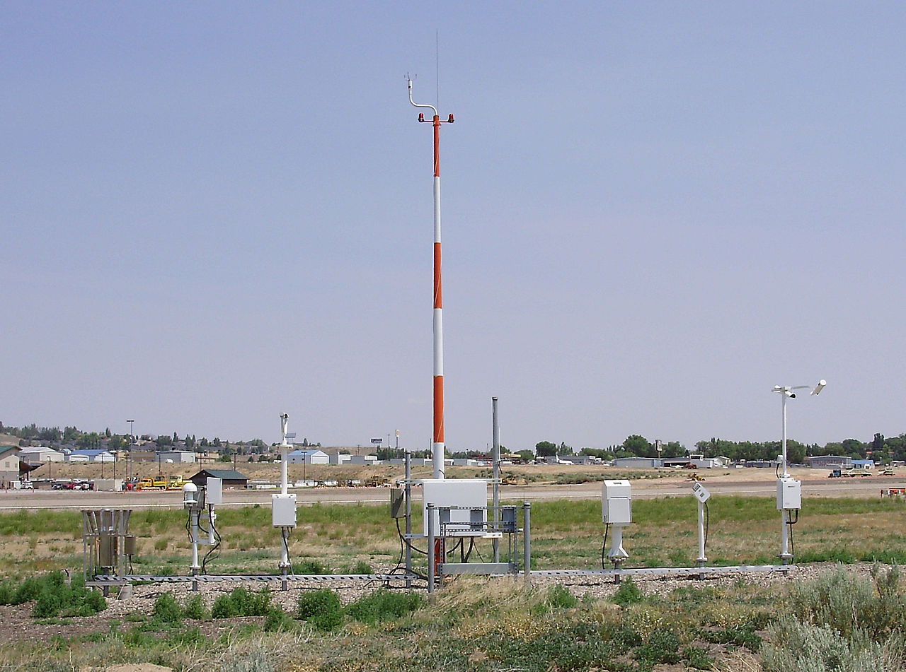
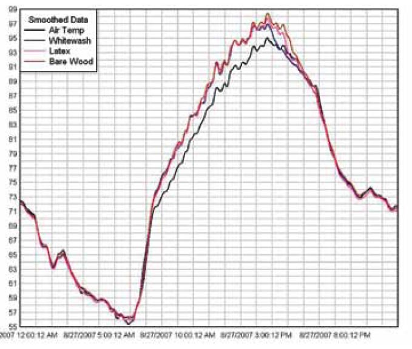
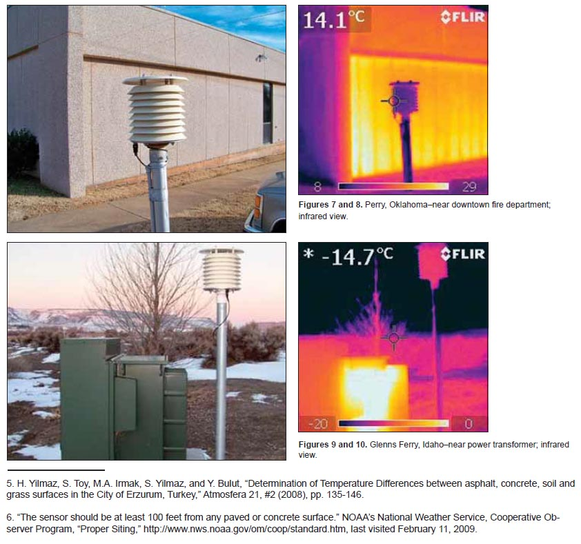

Surface Temperature Observations
========================================================
author: Marc
date: Sept. 13, 2017
autosize: true

How are Surface Temperatures Taken?
========================================================

Change Sensor Technologies

- Mercury Thermometers
- Stevenson Screens
- MMTS (Min Max Temp Sensor)
- OSOS (Automated Surface Observing System)

Automated Surface Observing System
========================================================

MMTS
========================================================

Thermocouple versus Mercury
==============

Specifications for Site Placement (NWS)
========================================================

Temperature sensor siting: 
- The sensor should be mounted 5 feet +/- 1 foot above the ground. 
- The ground over which the shelter [radiation] is located should be typical of the surrounding area. 
- A level, open clearing is desirable so the thermometers are freely ventilated by air flow. 
- Do not install the sensor on a steep slope or in a sheltered hollow unless it is typical of the area or unless data from that type of site are desired. 
- When possible, the shelter should be no closer than four times the height of any obstruction (tree, fence, building, etc.). 
- The sensor should be at least 100 feet from any paved or concrete surface.

Stevenson Screens and Staked Plate Infared Thermometer
========================================================

Stevenson Screens Temperature Differences
========================================================

Two Stations with Design "problems"
========================================================

Problematic Surveyed Sites (Boden 2009)
========================================================

Map of Surveyed Sites
========================================================

Quality of Surveyed Sites
========================================================

Missing Data
========================================================
- Data is often collected during the "work week"

Bias Adjustment
===========================================
Unlike GHCN-Monthly , GHCN-Daily does not contain adjustments for biases resulting from historical changes in instrumentation and observing practices. It should be noted that historically (and in general); the deployed stations providing daily summaries for the dataset were not designed to meet all of the desired standards for climate monitoring. Rather, the deployment of the stations was to meet the demands of agriculture, hydrology, weather forecasting, aviation etc. Because GHCN-Daily has not been homogenized to account for artifacts associated with the various eras in reporting practice at any particular station (i.e., for changes in systematic bias), users should consider whether the potential for changes in systematic bias might be important to their application. In addition, GHCN-Daily and GHCN-Monthly are not internally consistent (i.e., GHCN-Monthly is not necessarily derived from the data in GHCN-Daily) until the release of GHCN-Monthly version 4.

Many Reconstructions with varying Methods (AR4)
==============

New Reconstructions with varying Methods (AR5)
==============

