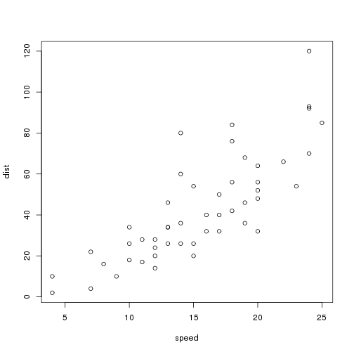

Making Effective Presentations on Climate Change
========================================================
author: Marc Los Huertos
date: Sept. 11, 2017
autosize: true

Things to Think about before Preparing a Presentation
========================================================

- Rhetorical Situation
- Exigence
- Triage
- Time
- Audience
- Being Relaxed


===


This presentation uses and models the use of Rstudio's markdown language to create presentations. 

For more details on authoring R presentations please visit <https://support.rstudio.com/hc/en-us/articles/200486468>.

Slides Structure and Preview
==================

- Each slide is created with some equal signs -- after a few in a row (>5?). 
- Use the 'Preview' button to see the slides, which show up in the upper right window.
- By pressing the magnifying glass with a plus sign, you can make the slide into a full screen viewer.

Slide with Bullets
===================

- Bullet 1
- Bullet 2
- Bullet 3

Slide With Code
========================================================


```r
summary(cars)
```

```
     speed           dist       
 Min.   : 4.0   Min.   :  2.00  
 1st Qu.:12.0   1st Qu.: 26.00  
 Median :15.0   Median : 36.00  
 Mean   :15.4   Mean   : 42.98  
 3rd Qu.:19.0   3rd Qu.: 56.00  
 Max.   :25.0   Max.   :120.00  
```

Slide With Plot
========================================================


Slide With Image Right?
====================================
You can have an image in the slide as well. In this case, the graphic is on the left and the text is on the right.
***


Slide With Image Left
====================================

***
You can have an image in the slide as well. In this case, the graphic is on the left and the text is on the right.
