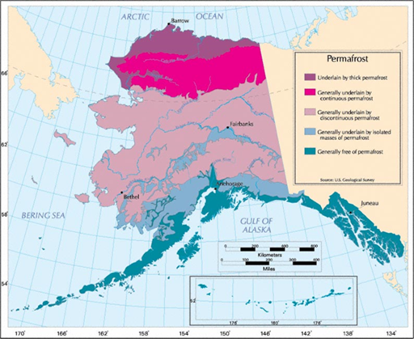

Barrow is located at the northernmost tip of the state of Alaska and is home to 4,384 residents, most of whom are Iñupiaq Alaska Natives. Along with much of Northern Alaska, Barrow sits entirely on top of permafrost, which is frozen ground, most notably defined by its sub-zero temperatures. With warming atmospheric and surface temperatures, however, the permafrost underlying Barrow is thawing from top to bottom, placing residents at severe risk of ground subsidence and infrastructure damage. In addition to warming permafrost, melting sea ice and glaciers, coastal erosion, earlier spring snowmelt, and reduced snow fall have also been consequences of the recent warming trends.


```{r setup, include=FALSE}
knitr::opts_chunk$set(echo = TRUE)
```

```{r importingCSV, include=FALSE}
# Importing Scripts

file = "/home/CAMPUS/kygj2015/Climate_Change_Narratives/Data/KatieGraham - Barrow, Alaska.csv"

import = read.csv(file)
```

```{r checking, include=FALSE} 
#plot(TMAX~DATE, import)
```

```{r missings, include=FALSE}
import$TMAX[import$TMAX==-9999] = NA
import$TMIN[import$TMIN==-9999] = NA

import$SNOW[import$SNOW==-9999] = NA
import$SNWD[import$SNWD==-9999] = NA
import$PRCP[import$SNWD==-9999] = NA
```

```{r, include=FALSE}
#plot(TMAX~DATE, import[import$DATE<19131231,], ty='l')
```

```{r, include=FALSE}
#plot(TMAX~DATE, import[import$DATE<19130102,], ty='l')
```

```{r, include=FALSE}
strDates <- as.character(import$DATE)
head(strDates)
import$NewDate <- as.Date(strDates, "%Y%m%d")
```
```{r, include=FALSE}
plot(TMAX~NewDate, import[import$DATE<19130102,], ty='l')
```

```{r, include=FALSE}
#unique(import$STATION_NAME)
```

```{r, include=FALSE}
BarrowAlaska <- subset(import, STATION_NAME=="BARROW W POST W ROGERS AIRPORT AK US", select=c(STATION, STATION_NAME, DATE, NewDate, TMIN, TMAX, PRCP, SNOW, SNWD))
```

```{r, include=FALSE}
plot(TMAX~NewDate, BarrowAlaska, ty='l')
```

```{r, include=FALSE}
# Linear Model
BarrowAlaska.lm <- lm(TMAX~NewDate, data=BarrowAlaska)
summary(BarrowAlaska.lm)
plot(TMAX~NewDate, BarrowAlaska, ty='l')
abline(coef(BarrowAlaska.lm), col='red')
```

```{r, include=FALSE}
# Get months
BarrowAlaska$Month = months(BarrowAlaska$NewDate) # Creates problems.
BarrowAlaska$Month = format(as.Date(BarrowAlaska$NewDate), format = "%m")
BarrowAlaska$Year = format(BarrowAlaska$NewDate, format="%Y")
```

```{r creatingmonthlymeans, include=FALSE}
MonthlyMeanTMAX = aggregate(TMAX ~ Month + Year, BarrowAlaska, mean)

MonthlyMeanTMAX$YEAR = as.numeric(MonthlyMeanTMAX$Year)
MonthlyMeanTMAX$MONTH = as.numeric(MonthlyMeanTMAX$Month)


# Frank -- change mean to sd and you'll get standard deviation for each month/year.

MonthlySDTMAX = aggregate(TMAX ~ Month + Year, BarrowAlaska, sd)

MonthlySDTMAX$YEAR = as.numeric(MonthlySDTMAX$Year)
MonthlySDTMAX$MONTH = as.numeric(MonthlySDTMAX$Month)
MonthlySDTMAX$NewDate = MonthlySDTMAX$YEAR + (MonthlySDTMAX$MONTH - 1)/12

head(MonthlySDTMAX)
```


```{r plottingMonthyMeans, include=FALSE}
plot(MonthlyMeanTMAX$TMAX, ty='l')

```
```{r plottingMonthySD, include=FALSE}
plot(MonthlySDTMAX$TMAX, ty='l')

plot(TMAX~ NewDate, data=MonthlySDTMAX, ty='l')
SD.lm <- lm(TMAX~NewDate, data=MonthlySDTMAX)
summary(SD.lm)

abline(coef(SD.lm), col="red")

```


### Monthly Maximum Temperatures Trends: December, January, and February

Below is the raw climate data collected from the Barrow, AK station of NOAA/Earth System Laboratory, Global Monitoring Division, and NOAA’s Climate Data Center. The following graphs represent the trends in monthly maximum temperatures for December, January, and February over the course of 115 years from September 1, 1901 to January 21, 2017. These three consecutive months have shown the most significant warming trend out of all twelve months. Temperature trends, however, should be viewed with caution given that an estimated 12% of total data points are missing from the Barrow, AK climate dataset.

### December
```{r December, echo=FALSE, results='hide'}
#plot(MonthlyMeanTMAX$TMAX[MonthlyMeanTMAX$Month=="12"], ty='l')
plot(TMAX~YEAR, data=MonthlyMeanTMAX[MonthlyMeanTMAX$Month=="12",], ty='l') 
December.lm <- lm(TMAX~YEAR, data=MonthlyMeanTMAX[MonthlyMeanTMAX$Month=="12",])
summary(December.lm)

abline(coef(December.lm), col="red")

```

According to the above graph, December maximum temperatures have warmed at a rate of 0.06 degrees per year or 5.60 degrees per 100 years. The p-value of this upward trendline is 0.0022. In statistics, a p-value of less than 0.05 indicates that the trend is statistically significant. Therefore, we can reject the null hypothesis, which states that there is no long-term trend in December maximum temperatures.

### January
```{r January, echo=FALSE, results='hide'}
#plot(MonthlyMeanTMAX$TMAX[MonthlyMeanTMAX$Month=="01"], ty='l')
plot(TMAX~YEAR, data=MonthlyMeanTMAX[MonthlyMeanTMAX$Month=="01",], ty='l') 
January.lm <- lm(TMAX~YEAR, data=MonthlyMeanTMAX[MonthlyMeanTMAX$Month=="01",])

summary(January.lm)

abline(coef(January.lm), col="red")

```

According to the above graph, January maximum temperatures have warmed at a rate of 0.065 degrees per year or 6.52 degrees per 100 years. The p-value of this upward trendline is 0.0035. In statistics, a p-value of less than 0.05 indicates that the trend is statistically significant. Therefore, we can reject the null hypothesis, which states that there is no long-term trend in January maximum temperatures.

### February
```{r February, echo=FALSE, results='hide'}
#plot(MonthlyMeanTMAX$TMAX[MonthlyMeanTMAX$Month=="02"], ty='l')
plot(TMAX~YEAR, data=MonthlyMeanTMAX[MonthlyMeanTMAX$Month=="02",], ty='l') 
February.lm <- lm(TMAX~YEAR, data=MonthlyMeanTMAX[MonthlyMeanTMAX$Month=="02",])
summary(February.lm)

abline(coef(February.lm), col="red")

```

According to the above graph, February maximum temperatures have warmed at a rate of 0.049 degrees per year or 4.85 degrees per 100 years. The p-value of this upward trendline is 0.0467. In statistics, a p-value of less than 0.05 indicates that the trend is statistically significant. Therefore, we can reject the null hypothesis, which states that there is no long-term trend in February maximum temperatures.

### Conclusion on Monthly Maximum Temperatures Trends

Winters in Barrow, Alaska have gotten significantly warmer over the past 115 years.For residents, this warming has been most visible in the form of thawing permafrost, receding sea ice, and melting snow and glaciers. The surface air temperatures observed in late 2016 and early 2017 are some of the highest on record, with 2017 marking the hottest January since the late 1920s. While rising winter temperatures in Barrow have resulted in some benefits such as a longer growing season, repercussions have also been making their presence known. 

One notable implication is the melting of sea ice, which has brought about rising sea levels, coastal erosion, and infrastructure and habitat damage. Furthermore, as permafrost thaws, organic matter decomposes, releasing huge amounts of carbon dioxide and methane into the atmosphere. This has transformed the Arctic tundra from a net sink for carbon into a major source of it. This issue of carbon emissions from thawing permafrost is compounded by the increase in wildfires observed throughout Alaska. More wildfires, in turn, will cause even more permafrost to melt, thus exacerbating the issue by sending more heat-trapping gases into the atmosphere.


```{r, include=FALSE}
MonthlyMeanTMIN = aggregate(TMIN ~ Month + Year, BarrowAlaska, mean)

MonthlyMeanTMIN$YEAR = as.numeric(MonthlyMeanTMIN$Year)
head(MonthlyMeanTMIN)
```

```{r, include=FALSE}
plot(MonthlyMeanTMIN$TMIN, ty='l')

plot(MonthlyMeanTMIN$TMIN[MonthlyMeanTMIN$Month=="12"], ty='l')

plot(TMIN~YEAR, data=MonthlyMeanTMIN[MonthlyMeanTMIN$Month=="12",], ty='l') 
Dec.lm <- lm(TMIN~YEAR, data=MonthlyMeanTMIN[MonthlyMeanTMIN$Month=="12",])
summary(Dec.lm)

abline(coef(Dec.lm), col="red")

```

```{r, include=FALSE}
MonthlyMeanTMAX = aggregate(TMAX ~ Month + Year, BarrowAlaska, mean)

MonthlyMeanTMAX$YEAR = as.numeric(MonthlyMeanTMAX$Year)
head(MonthlyMeanTMAX)
```

```{r, include=FALSE}
plot(MonthlyMeanTMAX$TMAX, ty='l')

plot(MonthlyMeanTMAX$TMAX[MonthlyMeanTMAX$Month=="12"], ty='l')

plot(TMAX~YEAR, data=MonthlyMeanTMAX[MonthlyMeanTMAX$Month=="12",], ty='l') 
Dec.lm <- lm(TMAX~YEAR, data=MonthlyMeanTMAX[MonthlyMeanTMAX$Month=="12",])
summary(Dec.lm)

abline(coef(Dec.lm), col="red")

```

```{r, include=FALSE}
PRCP_mean = mean(BarrowAlaska$PRCP, na.rm=T)

plot(PRCP~NewDate, data=BarrowAlaska)
abline(h=PRCP_mean, col="blue")

```

```{r, include=FALSE}
BarrowAlaska$PRCP[BarrowAlaska$PRCP==-9999] <- NA
YearlySum = aggregate(PRCP ~ Year, BarrowAlaska, sum)
YearlySum$YEAR = as.numeric(YearlySum$Year) 
YearlyMean = mean(YearlySum$PRCP)
```

```{r, include=FALSE}
plot(PRCP~YEAR, data=YearlySum, las=1, ty="p")
abline(h=YearlyMean, col="blue")
YearlySum.lm = lm(PRCP~YEAR, data=YearlySum)
abline(coef(YearlySum.lm), col="green")

n <- 5
k <- rep(1/n, n)
k

y_lag <- stats::filter(YearlySum$PRCP, k, sides=1)
lines(YearlySum$YEAR, y_lag, col="red")
```

```{r, include=FALSE}
summary(YearlySum.lm)
```

```{r, include=FALSE}
YearlySum2 = subset(YearlySum, select=c(PRCP))
YearlyMean = mean(YearlySum2$PRCP)

#filter(YearlySum2)


#Doesn't work...
# ma <- function(x,n=5){filter(x,rep(1/n,n), sides=2)}
# ma(YearlySum$PRCP)  


yearlyts =ts(YearlySum2) 
str(yearlyts)


```

```{r, include=FALSE} 
plot(SNWD~DATE, import)
```
```{r, include=FALSE}
plot(SNWD~DATE, import[import$DATE<19131231,], ty='l')
```
```{r, include=FALSE}
strDates <- as.character(import$DATE)
head(strDates)
import$NewDate <- as.Date(strDates, "%Y%m%d")
```
```{r, include=FALSE}
plot(SNWD~NewDate, import[import$DATE<19130102,], ty='l')
```

```{r, include=FALSE}
BarrowAlaska.lm <- lm(SNWD~NewDate, data=BarrowAlaska)
summary(BarrowAlaska.lm)
plot(SNWD~NewDate, BarrowAlaska, ty='l')
abline(coef(BarrowAlaska.lm), col='red')
```

```{r, include=FALSE}
MonthlyMeanSNWD = aggregate(SNWD ~ Month + Year, BarrowAlaska, mean)

MonthlyMeanSNWD$YEAR = as.numeric(MonthlyMeanSNWD$Year)
head(MonthlyMeanSNWD)
```

```{r, include=FALSE}
MonthlyMeanSNWD = aggregate(SNWD ~ Month + Year, BarrowAlaska, mean)

MonthlyMeanSNWD$YEAR = as.numeric(MonthlyMeanSNWD$Year)
MonthlyMeanSNWD$MONTH = as.numeric(MonthlyMeanSNWD$Month)

MonthlySDSNWD = aggregate(SNWD ~ Month + Year, BarrowAlaska, sd)

MonthlySDSNWD$YEAR = as.numeric(MonthlySDSNWD$Year)
MonthlySDSNWD$MONTH = as.numeric(MonthlySDSNWD$Month)
MonthlySDSNWD$NewDate = MonthlySDSNWD$YEAR + (MonthlySDSNWD$MONTH - 1)/12

head(MonthlySDSNWD)
```


```{r, include=FALSE} 
plot(SNOW~DATE, import)
```
```{r, include=FALSE}
plot(SNOW~DATE, import[import$DATE<19131231,], ty='l')
```
```{r, include=FALSE}
strDates <- as.character(import$DATE)
head(strDates)
import$NewDate <- as.Date(strDates, "%Y%m%d")
```
```{r, include=FALSE}
plot(SNOW~NewDate, import[import$DATE<19130102,], ty='l')
```

```{r, include=FALSE}
BarrowAlaska.lm <- lm(SNOW~NewDate, data=BarrowAlaska)
summary(BarrowAlaska.lm)
plot(SNOW~NewDate, BarrowAlaska, ty='l')
abline(coef(BarrowAlaska.lm), col='red')
```

```{r, include=FALSE}
MonthlyMeanSNOW = aggregate(SNOW ~ Month + Year, BarrowAlaska, mean)

MonthlyMeanSNOW$YEAR = as.numeric(MonthlyMeanSNOW$Year)
head(MonthlyMeanSNWD)
```

```{r, include=FALSE}
MonthlyMeanSNOW = aggregate(SNOW ~ Month + Year, BarrowAlaska, mean)

MonthlyMeanSNOW$YEAR = as.numeric(MonthlyMeanSNOW$Year)
MonthlyMeanSNOW$MONTH = as.numeric(MonthlyMeanSNOW$Month)

MonthlySDSNOW = aggregate(SNOW ~ Month + Year, BarrowAlaska, sd)

MonthlySDSNOW$YEAR = as.numeric(MonthlySDSNOW$Year)
MonthlySDSNOW$MONTH = as.numeric(MonthlySDSNOW$Month)
MonthlySDSNOW$NewDate = MonthlySDSNOW$YEAR + (MonthlySDSNOW$MONTH - 1)/12

head(MonthlySDSNOW)
```

```{r, include=FALSE}
# Get months
BarrowAlaska$Month = months(BarrowAlaska$NewDate) # Creates problems.
BarrowAlaska$Month = format(as.Date(BarrowAlaska$NewDate), format = "%m")
BarrowAlaska$Year = format(BarrowAlaska$NewDate, format="%Y")
```

### Snowfall Trend in February

```{r, include=FALSE}
MonthlyMeanSNOW = aggregate(SNOW ~ Month + Year, BarrowAlaska, mean)

MonthlyMeanSNOW$YEAR = as.numeric(MonthlyMeanSNOW$Year)
head(MonthlyMeanSNOW)
```

```{r February2, echo=FALSE, results='hide'}
temp=MonthlyMeanSNOW[-82,]
  
  
#plot(MonthlyMeanSNOW$SNOW[MonthlyMeanSNOW$Month=="02"], ty='l')
plot(SNOW~YEAR, data=MonthlyMeanSNOW[MonthlyMeanSNOW$Month=="02",], ty='l') 
February.lm <- lm(SNOW~YEAR, data=MonthlyMeanSNOW[MonthlyMeanSNOW$Month=="02",])
summary(February.lm)

abline(coef(February.lm), col="red")


#plot(temp$SNOW[temp$Month=="02"], ty='l')
plot(SNOW~YEAR, data=temp[temp$Month=="02",], ty='l') 
February.lm <- lm(SNOW~YEAR, data=temp[temp$Month=="02",])
summary(February.lm)

abline(coef(February.lm), col="red")

```

We can reject the null hypothesis that there is no relationship, since the p value is less than 0.05. In other words, the decreasing snowfall trend is statistically significant for the month of February. This decreasing snowfall trend in conjunction with the warming trend in observed in winter contributes to the melting of sea ice and the thinning and thawing of permafrost.

### Projected Trends


Alaska has already warmed more than twice as fast as the rest of the nation. According the U.S. National Climate Assessment, however, “if global emissions continue to increase during this century, temperatures can be expected to rise 10°F to 12°F in the north.” Even if emissions are substantially reduced, temperatures in northern Alaska are still projected to increase by 6F to 8F.

With northern Alaska being entirely underlain by permafrost, the projected warming trends pose significant risks to northern communities such as the Iñupiaq of Barrow, Alaska. Melting sea ice and thawing of permafrost are likely to create food and water security challenges and increase the vulnerability of coastal infrastructure and wildlife habitat. Many coastal communities, including Barrow, are considering moving miles inland to protect themselves from coastal dangers. However, relocation is a costly procedure and the state and federal government are reluctant to supply the funds. Additionally, moving inland would only be a temporary solution and would not solve the issues of food and water insecurity and melting permafrost as a threat to infrastructure. 

As a result of global greenhouse gas emissions, Barrow and other northern Alaska communities face numerous climactic challenges that are projected to intensify within the 21st century. Researchers and residents worry about the implications of a warming climate and the seemingly inevitable fate of their native land. Every year, conditions are worsening and coastal land is being lost. It is time for the state and federal government to take notice of these communities, to ensure their safety, and to protect their environment.
