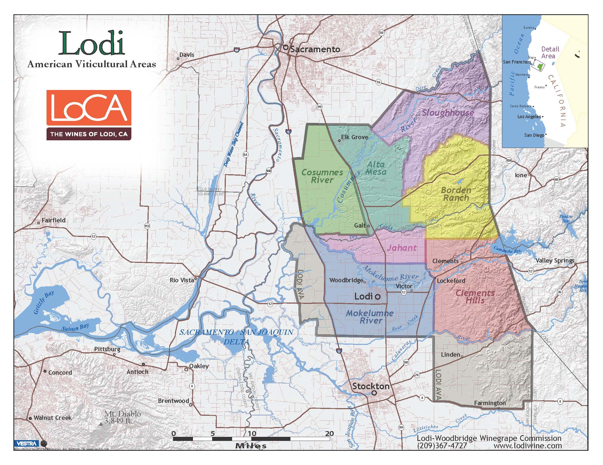

```{r, echo=FALSE, results='hide'}
knitr::opts_chunk$set(echo = TRUE)
```

```{r importingCSV, echo=FALSE, results='hide'}

file = "/home/CAMPUS/mawd2015/github/Climate_Change_Narratives/Data/87804MAW3.csv"

import = read.csv(file)
```

```{r checking, include=FALSE}
plot(TMAX~DATE, import)
```


```{r missings, include=FALSE}
import$TMAX[import$TMAX==-9999] = NA
import$TMIN[import$TMIN==-9999] = NA
```

```{r setup4, include=FALSE}
plot(TMAX~DATE, import[import$DATE<19131231,], ty='p', pch=20)
```


```{r, include=FALSE}
plot(TMAX~DATE, import[import$DATE<19130102,], ty='p', pch=20)
```

```{r, include=FALSE}
strDates <- as.character(import$DATE)
head(strDates)
import$NewDate <- as.Date(strDates, "%Y%m%d")
```

```{r, include=FALSE}
plot(TMAX~NewDate, import[import$DATE<19130102,], ty='p', pch=20)
```


```{r, include=FALSE}
unique(import$STATION_NAME)
```


```{r, include=FALSE}
LosAngeles <- subset(import, STATION_NAME=="LODI CA US", select=c(STATION, STATION_NAME, DATE, NewDate, TMIN, TMAX, PRCP))
```

```{r, include=FALSE}
plot(TMAX~NewDate, LosAngeles, ty='p', pch=20)
```

```{r, include=FALSE}
LosAngeles=subset(LosAngeles, subset=DATE>19300101)
```

```{r, include=FALSE}
# Linear Model
LosAngeles.lm <- lm(TMAX~NewDate, data=LosAngeles)
summary(LosAngeles.lm)
plot(TMAX~NewDate, LosAngeles, ty='p', pch=20)
abline(coef(LosAngeles.lm), col='red')
```

```{r, include=FALSE}
# Get months
LosAngeles$Month = months(LosAngeles$NewDate) # Creates problems.
LosAngeles$Month = format(as.Date(LosAngeles$NewDate), format = "%m")
LosAngeles$Year = format(LosAngeles$NewDate, format="%Y")
```

```{r creatingmonthlymeans, include=FALSE}
MonthlyMean = aggregate(TMAX ~ Month + Year, LosAngeles, mean)

MonthlyMean$YEAR = as.numeric(MonthlyMean$Year)
MonthlyMean$MONTH = as.numeric(MonthlyMean$Month)


# Frank -- change mean to sd and you'll get standard deviation for each month/year.

MonthlySD = aggregate(TMAX ~ Month + Year, LosAngeles, sd)

MonthlySD$YEAR = as.numeric(MonthlySD$Year)
MonthlySD$MONTH = as.numeric(MonthlySD$Month)
MonthlySD$NewDate = MonthlySD$YEAR + (MonthlySD$MONTH - 1)/12

head(MonthlySD)
```


```{r plottingMonthyMeans, include=FALSE}
plot(MonthlyMean$TMAX, ty='p', pch=20)

```

```{r plottingMonthySD, include=FALSE}
plot(MonthlySD$TMAX, ty='p')

plot(TMAX~ NewDate, data=MonthlySD, ty='p', pch=20)
SD.lm <- lm(TMAX~NewDate, data=MonthlySD)
summary(SD.lm)

abline(coef(SD.lm), col="red")

```


```{r, echo=FALSE, results='hide'}
MonthlyMeanTMIN = aggregate(TMIN ~ Month + Year, LosAngeles, mean)

MonthlyMeanTMIN$YEAR = as.numeric(MonthlyMeanTMIN$Year)
head(MonthlyMeanTMIN)
```

```{r, echo=FALSE, results='hide'}
MonthlyMeanTMIN = aggregate(TMIN ~ Month + Year, LosAngeles, mean)

MonthlyMeanTMIN$YEAR = as.numeric(MonthlyMeanTMIN$Year)
head(MonthlyMeanTMIN)
```

```{r, include=FALSE}
##plot(MonthlyMeanTMIN$TMIN, ty='p', pch=20)

##plot(MonthlyMeanTMIN$TMIN[MonthlyMeanTMIN$Month=="02"], ty='p', pch=20)

##plot(TMIN~YEAR, data=MonthlyMeanTMIN[MonthlyMeanTMIN$Month=="02",], ty='p', pch=20) 
##Feb.lm <- lm(TMIN~YEAR, data=MonthlyMeanTMIN[MonthlyMeanTMIN$Month=="02",])
##summary(Feb.lm)

##abline(coef(Feb.lm), col="red")

##Minimum Temperatures in August

```
## Introduction

The city of Lodi is located in the Central Valley of California, our nation’s agricultural hub. The Central Valley acts as one large watershed divided into two valleys: the Sacramento Valley in the North and San Joaquin Valley in the South, with alluvial fans emanating from the Cascade Range and the Northern Sierra Nevada. Lodi resides in the San Joaquin Valley, just North of Modesto. The San Joaquin Valley’s San Joaquin River flows roughly northwest while picking up tributaries such as the most prominent river flowing through Lodi, the Mokelumne River. The many rivers of the Central Valley converge in the Sacramento-San Joaquin Delta, a complex network of marshy channels, distributaries and sloughs that wind around islands mainly used for agriculture. It is the Central Valley’s water network, fertile soil, and extended growing season that make agriculture the primary industry within the Central Valley and one of the major agricultural regions in the entire nation (AMNH). Lodi, in particular, is best known for being a center of winegrape production (the “Zinfandel Capital of the World”). Unfortunately, Lodi’s trend of rising minimum temperatures for October and September from 1930 to 1970, illustrated below, signify increasing threats to Lodi’s economic reliance on wine production and its providence of cultural pride. Warmer minimum temperatures reduces water supply, reduces the transportation of foliar nitrogen to the riparian agriculture that often grows wine grapes, and damages the balance of winegrape’s flavors.



## Methodology
The National Oceanic and Atmospheric Administration provides free and accessible data for Lodi, California (at Station USC00045032), holding records of minimum and maximum temperatures year-round from January 1st, 1893 to January 31st, 1970. This data has been cut to represent January 1st of 1930 to January 31st, 1970 due to a large gap in data. I focus only on minimum temperature to illustrate a particular aspect of climate change’s impact on viticulture. A statistical hypothesis test evaluates the validity of a claim made about a population. This claim that is on trial, in essence, is called the null hypothesis. This creates a p-value that helps to determine the significance of the results. All hypothesis tests ultimately use a p-value to weigh the strength of the evidence (what the data are telling you about the population). A small p-value (typically ≤ 0.05) indicates strong evidence against the null hypothesis, so you reject the null hypothesis and a large p-value (> 0.05) indicates weak evidence against the null hypothesis, so you fail to reject the null hypothesis. Both September and October have strong evidence rejecting the null hypothesis and therefore illustrate significance minimum temperature changes.

## Data

### Minimum Temperature Increase in October
```{r, echo=FALSE, results='hide'}
#plot(MonthlyMeanTMIN$TMIN, ty='p', pch=20)

#plot(MonthlyMeanTMIN$TMIN[MonthlyMeanTMIN$Month=="10"], xlab="Year", ylab="Degrees (F)", ty='p', pch=20)

plot(TMIN~YEAR, data=MonthlyMeanTMIN[MonthlyMeanTMIN$Month=="10",], xlab="Year", ylab="Degrees (F)", ty='p', pch=20) 
Oct.lm <- lm(TMIN~YEAR, data=MonthlyMeanTMIN[MonthlyMeanTMIN$Month=="10",])
summary(Oct.lm)

abline(coef(Oct.lm), col="purple")

```

The minimum temperatures within the month of October increase at a slope of 0.13 degress Fahrenheit per year, with a very statistically significant probability  of <.001. This indicates strong evidence against the null hypothesis.

### Minimum Temperature Increase in September
```{r, echo=FALSE, results='hide'}
#plot(MonthlyMeanTMIN$TMIN, ty='p', pch=20)

#plot(MonthlyMeanTMIN$TMIN[MonthlyMeanTMIN$Month=="09"], xlab="Year", ylab="Degrees (F)", ty='p', pch=20)

plot(TMIN~YEAR, data=MonthlyMeanTMIN[MonthlyMeanTMIN$Month=="09",], xlab="Year", ylab="Degrees (F)", ty='p', pch=20) 
Sep.lm <- lm(TMIN~YEAR, data=MonthlyMeanTMIN[MonthlyMeanTMIN$Month=="09",])
summary(Sep.lm)

abline(coef(Sep.lm), col="purple")

```

The minimum temperatures within the month of September increase at a slope of 0.18 degrees Fahrenheit per year, with a high statistically significant probability of <.001. This indicates strong evidence against the null hypothesis.

## Minimum Temperatures Diminish Water Supply

Lodi and the city’s surroundings use groundwater as their main source of water, which is used for residential and irrigational purposes. The anthropogenic warming illustrated above in the September and October months dries up groundwater reserve. With significant cuts in managed water allocations in response to the California drought, farmers particularly in the San Joaquin Valley are forced to tap heavily into the already heavily depended on groundwater reserves to meet irrigation demands. This furthers the Central Valley’s excession of the groundwater natural recharge rate. Given the already naturally low rates of groundwater recharge in the San Joaquin Valley and population growth, a continuance of groundwater depletion is expected (Famiglietti, 2011). Unfortunately for Lodi’s drying groundwater, the city’s surrounding San Joaquin Valley relies more heavily on groundwater than its Sacramento counterpart because the drier climate results in more limited natural surface water availability. Increased temperature and evapotranspiration results in increased domestic water use within the city, as well. This thereby limits water sources even further.

### How this Affects Lodi’s Viticulture

As farmers’ irrigation systems are threatened due to a lack of groundwater, soil moisture suffers. The first impact of water deficit is reduced winegrape yield, because of a smaller berry size and reduced bud fertility (Leeuwen, 2016). In Mediterranean or other very dry climates, such as the Central Valley and Lodi in particular, quality may also suffer from excessive water stress (Leeuwen, 2016). In addition, soil moisture is an important control for heat and water transfer between the land and atmosphere, which in turn affects the development of extreme heat events (Lobell, 2008). This therefore may worsen climate change.

## Impact on Riparian Ecosystems

Anthropogenic warming endangers riparian ecosystems because this affects the salmon population vital to Lodi's riverside vineyards. Water temperatures provide an important constraint on ecological function, such as fish spawning, swimming performance, metabolism, effects of aquatic invertebrates, and mortality (Wagner, 2011). Within the Sacramento-San Joaquin Delta, Chinook salmon are threatened by increased temperatures and drought years (Yates, 2008). These salmon, once in the Mokelumne River, transport biomass and nitrogen; this is key to stream and riparian ecosystem function (Merz, 2006). In fact, the studied native riparian vegetation, including vineyards, in the Mokelumne River that resided close to spawning sites received 18-25% of foliar nitrogen from marine sources (Merz, 2006). With animals feeding on salmon carcasses in the Mokelumne and salmon jawbones scattered in riparian vineyards alongside the river, researchers pointed to salmon as the source for the grape leaves’ total nitrogen. These data suggest that robust salmon runs continue to provide important ecological services with high economic value, even in impaired watersheds. Loss of Pacific salmon can not only negatively affect stream and riparian ecosystem function, but can also affect local economies where agriculture and salmon streams coexist, thereby affecting grape production in particular (Merz, 2006). In addition, even beyond this highly altered river that flow through agricultural areas, salmon also fertilize vineyards in other areas through irrigation water being pumped from spawning rivers (Merz, 2006).

### Diminished Cooling Period

A decline in particularly minimum temperatures puts wine quantity and quality at jeopardy. A rise in minimum temperatures illustrates a rise in temperatures during the night. Unfortunately, wide diurnal temperature swings are key to wine production and quality. The metabolism in grapes run quickly only under the optimal environmental conditions that are now at risk, which require warm dry days and cool nights. Heat of day promotes ripeness and sugar development in the grapes and the cooler nights help the grapes to retain acidity and freshness, resulting in beautifully balanced flavors. To offset the sweetness given off by the warm sun, wines need the acidity metabolized when the cool night slows grape metabolism. This supplies the tangy bite that helps cut the fatty taste when you eat steak. In addition, the brisk weather also promotes anthocyanins, which give wine both its red hue and astringency. Farmers likely exacerbate diminishing groundwater supply in their efforts to maintain wine grape productivity and quality in the face of temperature increases through an increase water use for irrigation and the misting of water to cool down grapes. 

## Conclusion
Even though the data draws from a short thirty-year span, the sharp increase in degrees Fahrenheit for both September and October signify a steep climb in anthropogenic warming. This warming holds significance beyond surface value; it holds further implications than just the warming of the climate from 1930 to 1960 in Lodi. This increase in temperature creates both direct and indirect impacts on viticulture. By diminishing groundwater supply, damaging riparian ecosystems, and reducing the vital cooling period, climate change threatens Lodi’s cultural and economic ties to viticulture.

## Work Cited

"California Central Valley." AMNH. N.p., n.d. Web. 27 Feb. 2017. <http://www.amnh.org/explore/curriculum-collections/grace/grace-tracking-water-from-space/california-central-valley>.

"Agenda Item G-1." (2012): n. pag. Public Documents for the City of Lodi. 2012. Web. 27 Feb. 2017.

Cayan, Daniel, Katharine Hayhoe, Christopher Field, and Peter Frumhoff. "Emissions Pathways, Climate Change, and Impacts on California." Proceedings of the National Academy of Sciences. N.p., June 2004. Web. 10 Feb. 2017.

Pyke, Christopher R. "Interactions between Habitat Loss and Climate Change: Implications for Fairy Shrimp in the Central Valley Ecoregion of California, Usa." Climatic Change 68.1-2 (2005): 199-218. Web. 12 Feb. 2017.

"3.5.1 How Will Climate Change Affect the Balance of Water Demand and Water Availability?" 3.5.1 How Will Climate Change Affect the Balance of Water Demand and Water Availability? - AR4 WGII Chapter 3: Freshwater Resources and Their Management. N.p., n.d. Web. 13 Feb. 2017.

Scanlon, B. R., C. C. Faunt, L. Longue-vergne, R. C. Reedy, W. M. Alley, V. L. Mcguire, and P. B. Mcmahon. "Groundwater Depletion and Sustainability of Irrigation in the US High Plains and Central Valley." Proceedings of the National Academy of Sciences 109.24 (2012): 9320-325. Web. 12 Feb. 2017.

Wagner, R. Wayne, Mark Stacey, Larry R. Brown, and Michael Dettinger. "Statistical Models of Temperature in the Sacramento San Joaquin Delta Under Climate-Change Scenarios and Ecological Implications." Estuaries and Coasts 34.3 (2011): 544-56. Web.

Pyke, Christopher R. “Habitat Loss Confounds Climate Change Impacts.” Frontiers in Ecology and the Environment, vol. 2, no. 4, 2004, pp. 178–182. www.jstor.org/stable/3868312.

Vanderwarker, Amy. “Central Valley Water Woes.” Race, Poverty & the Environment, vol. 16, no. 2, 2009, pp. 72–74. www.jstor.org/stable/41555183.

White, M. A., N. S. Diffenbaugh, G. V. Jones, J. S. Pal, and F. Giorgi. "Extreme Heat Reduces and Shifts United States Premium Wine Production in the 21st Century." Proceedings of the National Academy of Sciences 103.30 (2006): 11217-1222. Web. 10 Feb. 2017.

Wagner, R. Wayne, Mark Stacey, Larry R. Brown, and Michael Dettinger. "Statistical Models of Temperature in the Sacramento San Joaquin Delta Under Climate-Change Scenarios and Ecological Implications." Estuaries and Coasts 34.3 (2011): 544-56. Web. 25 Feb. 2017.

Famiglietti, J. S., M. Lo, S. L. Ho, J. Bethune, K. J. Anderson, T. H. Syed, S. C. Swenson, C. R. de Linage, and M. Rodell (2011), Satellites measure recent rates of groundwater depletion in California's Central Valley, Geophys. Res. Lett., 38, L03403, doi:10.1029/2010GL046442.

Cayan, D., E. P. Maurer, M. D. Dettinger, M. Tyree, and K. Hayhoe (2006), Climate scenarios for California, Rep. CEC-500-2005-203-SF, 52 pp., Calif. Clim. Change Cent., Sacramento.

Scanlon, B. R., C. C. Faunt, L. Longuevergne, R. C. Reedy, W. M. Alley, V. L. Mcguire, and P. B. Mcmahon. "Groundwater Depletion and Sustainability of Irrigation in the US High Plains and Central Valley." Proceedings of the National Academy of Sciences 109.24 (2012): 9320-325. Web. 10 Feb. 2017.

"Home." Vine to Wine Circle. N.p., n.d. Web. 27 Feb. 2017. <http://www.vinetowinecircle.com/en/>.
