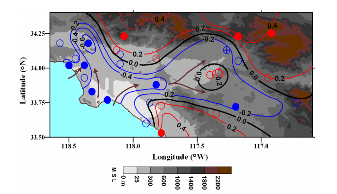

The Golden State of California, already known for its sunny skies and year-round palm trees, is warming. Southern California specifically has experienced a temperature increase of about 3 degrees Fahrenheit in the past century (EPA). If this is the case, then why have the maximum temperatures (TMax) for more than half the year in Ojai, California decreased since 1920? 

Ojai is a small town of about 7500 people situated in Ventura County, just northwest of Los Angeles and east of Santa Barbara. Its location approximately 15 miles inland from the coast of the Pacific Ocean designates it a coastal city within the California Central Coast region. As this quaint town gains recognition, it is becoming an increasingly popular tourist destination for scenic hikes and spiritual retreats. 

Ojai is and has historically been, however, a primarily agricultural community. From the original Oak Grove and Chumash peoples to Spanish missionaries and early citrus farmers, Ojai has been home to a variety of crops and growers. Conservation efforts and relatively limited human traffic have sustained a healthy ecosystem that allows vegetation and animals to thrive. Ojai is home to many independently-owned organic farms, many of which have close relationships with their consumers. The produce of these farms, along with other artisan goods, is sold at the weekly Sunday Ojai Valley Farmers' Market. The market attracts both locals and visitors alike, and is a staple of the community. Ojai's most common crops include olives, oranges, and avocados. Ojai Pixies are small tangerines grown in the Ojai Valley exclusively by family-owned farms. Their small size, varied yield, and late season discouraged the production of hybrid Pixie Tangerines as a commercial crop, but a group of farmers in Ojai found that they grow extremely well in Ojai. Ojai Pixies are now sold at Southern California farmers' markets, across the country at grocery outlets, and directly from farmers. Olive oil is also a pride of Ojai, thanks to the Mediterranean climate which is ideal for growing olives. In fact, the Ojai Olive Oil Company was ranked the #1 attraction in Ojai on Trip Advisor. Ojai's abundance of agriculture helps support Ojai's commitment to supporting local businesses and promoting a healthy lifestyle. 

Amidst the concern about rising temperatures, especially with California's recent drought, it may seem as though a trend of cooling would be what Ojai's main agricultural crops need. However, adaption to changing climate is a gradual process, and these plants (citrus in particular) can be very sensitive to different microclimates. Therefore, these temperature changes could have a destructive effect on the agriculture Ojai is founded upon. 

##Methods

The National Oceanic and Atmospheric Association (NOAA) provides a free online archive of historical weather and climate data from stations around the globe. I downloaded the climate data collected from January 1, 1917 to January 1, 2017 of a station in Ojai, California (USC00046399). I then used RStudio software to analyze and graph the maximum and minimum temperatures of the entire 100-year span, as well as individual months. I evaluated the data to determine whether or not it rejects the null hypothesis. The null hypothesis states that there is no relationship between temperature change and time. If the probability value (p-value) is found to be less than 0.05, then the data is statistically significant and rejects the null hypothesis.


```{r setup, include=FALSE}
knitr::opts_chunk$set(echo = FALSE)
```

```{r importingCSV}
# Importing Scripts

file = "/home/CAMPUS/mwl04747/github/Climate_Change_Narratives/Olivia/Ojai Temperatures - EA30.csv"

import = read.csv(file)
```

```{r missings}
import$TMAX[import$TMAX==-9999] = NA
import$TMIN[import$TMIN==-9999] = NA
```

```{r, echo=FALSE}
strDates <- as.character(import$DATE)
#head(strDates)
import$NewDate <- as.Date(strDates, "%Y%m%d")
```

```{r}
#unique(import$STATION_NAME)
```


```{r}
LosAngeles <- subset(import, STATION_NAME=="OJAI CA US", select=c(STATION, STATION_NAME, DATE, NewDate, TMIN, TMAX, PRCP))
```


```{r}
# Linear Model
LosAngeles.lm <- lm(TMAX~NewDate, data=LosAngeles)
#summary(LosAngeles.lm)
#plot(TMAX~NewDate, LosAngeles, ty='l')
#abline(coef(LosAngeles.lm), col='red')
```


```{r}
# Get months
LosAngeles$Month = months(LosAngeles$NewDate) # Creates problems.
LosAngeles$Month = format(as.Date(LosAngeles$NewDate), format = "%m")
LosAngeles$Year = format(LosAngeles$NewDate, format="%Y")
```


```{r creatingmonthlymeans}
MonthlyMean = aggregate(TMAX ~ Month + Year, LosAngeles, mean)

MonthlyMean$YEAR = as.numeric(MonthlyMean$Year)
MonthlyMean$MONTH = as.numeric(MonthlyMean$Month)


# Frank -- change mean to sd and you'll get standard deviation for each month/year.

MonthlySD = aggregate(TMAX ~ Month + Year, LosAngeles, sd)

MonthlySD$YEAR = as.numeric(MonthlySD$Year)
MonthlySD$MONTH = as.numeric(MonthlySD$Month)
MonthlySD$NewDate = MonthlySD$YEAR + (MonthlySD$MONTH - 1)/12

#head(MonthlySD)
```
##What is happening to maximum temperatures?

According to NOAA climate data, the maximum temperatures in Ojai have decreased for seven out of twelve months of the year since 1917. Five of these seven months are statistically significant, with p-values less than 0.05. The temperatures of four of the five statistically significant months are decreasing.

###April
```{r April}
#plot(MonthlyMean$TMAX[MonthlyMean$Month=="04"], ty='p')
plot(TMAX~YEAR, data=MonthlyMean[MonthlyMean$Month=="04",], ty='p',pch=20, xlab = "Year", ylab = "Maximum Temperature (Fahrenheit)") 

April.lm <- lm(TMAX~YEAR, data=MonthlyMean[MonthlyMean$Month=="04",])
#summary(April.lm)

abline(coef(April.lm), col="red")

```


p-value: 0.05, statistically significant

The maximum temperatures in April increase at a slope of 0.03 degrees Fahrenehit per year from 1917 to 2017. It is the only statistically significant month with increasing temperatures.

###July
```{r July}
#plot(MonthlyMean$TMAX[MonthlyMean$Month=="07"], ty='p')
plot(TMAX~YEAR, data=MonthlyMean[MonthlyMean$Month=="07",], ty='p',pch=20, xlab = "Year", ylab = "Maximum Temperature (Fahrenheit)") 
July.lm <- lm(TMAX~YEAR, data=MonthlyMean[MonthlyMean$Month=="07",])
#summary(July.lm)

abline(coef(July.lm), col="red")

```

p-value: < 0.01, statistically significant

The maximum temperatures in July decrease at a slope of -0.05 degrees Fahrenehit per year from 1917 to 2017. 

###August
```{r August}
#plot(MonthlyMean$TMAX[MonthlyMean$Month=="08"], ty='p')
plot(TMAX~YEAR, data=MonthlyMean[MonthlyMean$Month=="08",], ty='p',pch=20, xlab = "Year", ylab = "Maximum Temperature (Fahrenheit)") 
August.lm <- lm(TMAX~YEAR, data=MonthlyMean[MonthlyMean$Month=="08",])
#summary(August.lm)

abline(coef(August.lm), col="red")


```

p-value: 0.04, statistically significant

The maximum temperatures in August decrease at a slope of -0.02 degrees Fahrenehit per year from 1917 to 2017. 

###November
```{r November}
#plot(MonthlyMean$TMAX[MonthlyMean$Month=="11"], ty='p')
plot(TMAX~YEAR, data=MonthlyMean[MonthlyMean$Month=="11",], ty='p',pch=20, xlab = "Year", ylab = "Maximum Temperature (Fahrenheit)") 
November.lm <- lm(TMAX~YEAR, data=MonthlyMean[MonthlyMean$Month=="11",])
#summary(November.lm)

abline(coef(November.lm), col="red")

```

p-value: < 0.01, statistically significant

The maximum temperatures in November decrease at a slope of -0.05 degrees Fahrenehit per year from 1917 to 2017. 

###December
```{r December}
#plot(MonthlyMean$TMAX[MonthlyMean$Month=="12"], ty='p')
plot(TMAX~YEAR, data=MonthlyMean[MonthlyMean$Month=="12",], ty='p',pch=20, xlab = "Year", ylab = "Maximum Temperature (Fahrenheit)") 
Dec.lm <- lm(TMAX~YEAR, data=MonthlyMean[MonthlyMean$Month=="12",])
#summary(Dec.lm)

abline(coef(Dec.lm), col="red")

```

p-value: 0.01, statistically significant

The maximum temperatures in December decrease at a slope of -0.04 degrees Fahrenehit per year from 1917 to 2017. 

```{r}
MonthlyMeanTMAX = aggregate(TMAX ~ Month + Year, LosAngeles, mean)

MonthlyMeanTMAX$YEAR = as.numeric(MonthlyMeanTMAX$Year)
#head(MonthlyMeanTMAX)
```

##What is happening to minimum temperatures?

Interestingly, while Ojai is experiencing a cooling trend in maximum temperatures for a majority of months of the year, there is an opposite phenomenon occurring with minimum temperatures (TMin). For eleven out of twelve months, Ojai's minimum temperatures have increased since 1917. Eight out of these eleven months are statistically significant, with p-values less than 0.05. The one month with decreasing minimum temperatures, December, is not statistically significant. 

```{r}
MonthlyMeanTMIN = aggregate(TMIN ~ Month + Year, LosAngeles, mean)

MonthlyMeanTMIN$YEAR = as.numeric(MonthlyMeanTMIN$Year)
#head(MonthlyMeanTMIN)
```

###January
```{r}
#plot(MonthlyMeanTMIN$TMIN, ty='p')
#plot(MonthlyMeanTMIN$TMIN[MonthlyMeanTMIN$Month=="01"], ty='p')

plot(TMIN~YEAR, data=MonthlyMeanTMIN[MonthlyMeanTMIN$Month=="01",], ty='p',pch=20, xlab = "Year", ylab = "Minimum Temperature (Fahrenheit)") 
Jan.lm <- lm(TMIN~YEAR, data=MonthlyMeanTMIN[MonthlyMeanTMIN$Month=="01",])
#summary(Jan.lm)

abline(coef(Jan.lm), col="red")

```

p-value: < 0.01

The minimum temperatures in January increase at a slope of 0.03 degrees Fahrenehit per year from 1917 to 2017. It is the only statistically significant month with increasing temperatures.

###March
```{r}
#plot(MonthlyMeanTMIN$TMIN, ty='p')

#plot(MonthlyMeanTMIN$TMIN[MonthlyMeanTMIN$Month=="03"], ty='p')

plot(TMIN~YEAR, data=MonthlyMeanTMIN[MonthlyMeanTMIN$Month=="03",], ty='p',pch=20, xlab = "Year", ylab = "Minimum Temperature (Fahrenheit)") 
March.lm <- lm(TMIN~YEAR, data=MonthlyMeanTMIN[MonthlyMeanTMIN$Month=="03",])
#summary(March.lm)

abline(coef(March.lm), col="red")

```

p-value: < 0.01

The minimum temperatures in March increase at a slope of 0.03 degrees Fahrenehit per year from 1917 to 2017. 

###June
```{r}
#plot(MonthlyMeanTMIN$TMIN, ty='p')

#plot(MonthlyMeanTMIN$TMIN[MonthlyMeanTMIN$Month=="06"], ty='p')

plot(TMIN~YEAR, data=MonthlyMeanTMIN[MonthlyMeanTMIN$Month=="06",], ty='p',pch=20, xlab = "Year", ylab = "Minimum Temperature (Fahrenheit)") 
June.lm <- lm(TMIN~YEAR, data=MonthlyMeanTMIN[MonthlyMeanTMIN$Month=="06",])
#summary(June.lm)

abline(coef(June.lm), col="red")

```

p-value: < 0.01

The minimum temperatures in June decrease at a slope of 0.04 degrees Fahrenehit per year from 1917 to 2017.

###August
```{r}
#plot(MonthlyMeanTMIN$TMIN, ty='p')

#plot(MonthlyMeanTMIN$TMIN[MonthlyMeanTMIN$Month=="08"], ty='p')

plot(TMIN~YEAR, data=MonthlyMeanTMIN[MonthlyMeanTMIN$Month=="08",], ty='p',pch=20, xlab = "Year", ylab = "Minimum Temperature (Fahrenheit)") 
August.lm <- lm(TMIN~YEAR, data=MonthlyMeanTMIN[MonthlyMeanTMIN$Month=="08",])
#summary(August.lm)

abline(coef(August.lm), col="red")

```

p-value: < 0.01

The minimum temperatures in August increase at a slope of 0.03 degrees Fahrenehit per year from 1917 to 2017. 

###October
```{r}
#plot(MonthlyMeanTMIN$TMIN, ty='p')

#plot(MonthlyMeanTMIN$TMIN[MonthlyMeanTMIN$Month=="10"], ty='p')

plot(TMIN~YEAR, data=MonthlyMeanTMIN[MonthlyMeanTMIN$Month=="10",], ty='p',pch=20, xlab = "Year", ylab = "Minimum Temperature (Fahrenheit)") 
Oct.lm <- lm(TMIN~YEAR, data=MonthlyMeanTMIN[MonthlyMeanTMIN$Month=="10",])
#summary(Oct.lm)

abline(coef(Oct.lm), col="red")

```

p-value: < 0.01

The minimum temperatures in October increase at a slope of 0.03 degrees Fahrenehit per year from 1917 to 2017. 

##How can we explain these contradictory trends?

As global temperatures rise, some scientists have observed a phenomenon called "coastal cooling" that occurs along the entire state of California. Inland and sea surface temperature increases affect temperature and pressure gradients that result in increased sea breeze intensity, thereby cooling coastal regions. Curtis Ebbesmeyer found significant warming of the Pacific sea surface temperature over the last few decades, which would increase the cooling effect (Ebbesmeyer *et al.* 1990). 

Professor Robert Bornstein of San Jose State University, who specializes in coastal cooling in California, has conducted research that reflects the temperature changes Ojai is experiencing. The rate of asymmetric warming has accelerated since the mid-1970s on both a regional and global scale (Bornstein *et al.* 2008). Asymmetric warming occurs when minimum temperatures increase at a faster rate than maximum temperatures, such as what is occurring in Ojai. Ojai is a more extreme example because maximum temperatures are actually decreasing while minimum temperatures are increasing. Studies done by Moustafa Chahine and Aiguo Dai *et al.* show that asymmetric warming may be due to a "vigorous hydrologic cycle" (Nemani *et al.*) that includes high amounts of evaporation, atmospheric water vapor, and precipitation. 

##Why does average temperature appear to be unchanging? 

Bornstein's data collection for the South Coast Air Basin area and San Francisco Bay Area show that both minimum and maximum temperatures have increased for inland sites, while coastal sites in those regions have simultaneously had rising minimum temperatures and falling maximum temperatures. This discrepancy leads to what appears to be an unchanging average temperature. 

However, the low average temperature change obscures the descreasing maximum temperatures caused by coastal cooling. Focusing on the average temperature neglects the disruption of natural climate processes and the potentially harmful impacts. Bornstein's study concluded that from 1970 to 2005, the overall trend per decade for the South Coast Air Basin was: 
Minimum temperature +0.16 C (+32.29 F) for inland areas, +0.28 C (+32.50 F) for coastal areas
Maximum temperature +0.32 C (+32.58 F) for inland areas, -0.30 C (-32.54 F) for coastal areas





##What does this mean for Ojai's agriculture? 

Although scientific discussion has predominantly been focused around the negative effects of increased temperatures on crops, these effects reflect the significant impacts cooling temperatures can potentially have on food supply as well. Climate is a significant influence in almost every step of crop production, from temperature variability and humidity levels to frost intensity and duration (Nemani *et al.* 2001). The USDA Climate Change Science Program 2008 report found that warming temperatures in the western United States have led to "increased summer drought stress, vulnerability to insect pests, and fire hazard" (USDA 2008). Increased minimum temperatures and warmer springs extend the range and lifetime of many pests that can damage crops. 

Although more research needs to be done on the effects of cooling temperatures on agricultural production, the unnatural altering of the seasons due to asymmetric warming could influence the growth of Ojai's crops. Plants are biologically adapted to certain climate conditions, so the ability of plants to adapt to changes is gradual and can be hindered when changes are so swift. Crops need a certain number of chilling hours to break dormancies and start producing fruit, which may not occur is minimum temperatures are rising. John Adams of Adams Acres in Rialto, California, has already experience decreased yield of stone fruits and nuts due to sensitivity to heat. 

However, cooling temperatures can also have negative effects on agriculture. Just as warmer temperatures cause longer growing seasons, cooler temperatures can shorten growing seasons, thereby reducing yield. Lower temperatures can also directly damage a plant's development. Cold temperatures can kill vulnerable young plants, which is what John Adams experienced with his avocado trees. 

Oranges, particularly Ojai Pixies, are especially sensitive to microclimates. Pixie tangerines ripen in the spring and are on the trees during California's coldest months, making them very susceptible to frost (Ojai Pixie Tangerines). Olive oil is also one of Ojai's most popular products, with the Ojai Olive Oil Company ranked the #1 attraction in Ojai on Trip Advisor (Ojai Olive Oil). Leandro Ravetti, technical director of Australia's largest olive oil producer conducted a study that found frost is one of the most important hazards to the olive industry and caused significant economic losses for Australia. Damage to olive fruits in turn colors olive oil with an unpleasant taste. Though temperatures in California may not fall low enough to produce frost, the trend of decreasing maximum temperatures could cause chilling injuries that would similarly affect the quality of olive oil.

Ultimately, more research must be done to evaluate the effects of decreasing maximum temperatures and increasing minimum temperatures in Ojai. Effects not immediately apparent may harm agricultural production in the future if the trend of asymmetric warming continues. These changes in climate could have significant effects on the agriculture of Ojai, particularly the primary crops of avocados, citruses, and olives. With a community so centered around organic produce and local farms, thoughtful actions must be taken to mitigate the effects of decreasing maximum temperatures and increasing minimum temperatures, or at the very least, help agriculture adapt to the changes in climate. 

##Sources
"Global Climate Change: Effects." NASA. NASA, 16 June 2016. Web. 27 Feb. 2017. 

"What Climate Change Means for California." Climate Change. United States Environmental Protection Agency, Aug. 2016. Web. 27 Feb. 2017.

Cayan, Daniel, Amy Lynd Luers, Guido Franco, Michael Hanemann, and Bart Croes. "Scenarios of Climate Change in California: An Overview." Climatic Change 87.S1 (2008): 1-6. California Energy Commission. California Climate Change Center, Feb. 2006. Web. 27 Feb. 2017.

Vance, Erik. "Scientists Get Wind of Why Coasts Cool as the Globe Warms." Scientific American. N.p., 23 Sept. 2008. Web. 27 Feb. 2017.

Backlund, Peter, Anthony Janetos, and David Schimel. The Effects of Climate Change on Agriculture, Land Resources, Water Resources, and Biodiversity in the United States. Washington, DC: U.S. Climate Change Science Program, 2008. USDA. May 2008. Web. 27 Feb. 2017.

Bornstein, Robert, Jorge Gonzalez, Bereket Lebassi, Haider Taha, Paul Switzer, and Robert Van Buskirk. "Cooling Summer Daytime Temperatures Cooling Summer Daytime Temperatures in Coastal California During 1948 in Coastal California During 1948 -2005: Observations, Modeling, and Implications." (n.d.): n. pag. Chair ’s Air Pollution Seminar, CARB, 19 Aug. 2008. Web. 27 Feb. 2017.http://aggie-horticulture.tamu.edu/newsletters/hortupdate/2011/mar/citrus_freeze.html
Ojai Olive Oil Company. N.p., 2017. Web. 27 Feb. 2017.

Sergeeva, Vera. "Frost and Chilling Injuries in Olives." (n.d.): n. pag. Pest, Disease and Frost Management. Australian & New Zealand Olivegrower & Processor, July 2010. Web. 27 Feb. 2017.

Nemani, Ramakrishna R., Michael A. White, Daniel R. Cayan, Gregory V. Jones, Steven W. Running, Joseph C. Coughlan, and David L. Peterson. "Asymmetric Warming over Coastal California and Its Impact on the Premium Wine Industry." Climate Research 19 (2001): 25-34. Inter-Research. 22 Nov. 2001. Web. 27 Feb. 2017.

Ebbesmeyer CC, Cayan DR, McLain DR, Nichols FH, Peterson DH, Redmond KT (1990) 1976 step in the Pacific climate: forty environmental changes between 1968–1975 and 1977–1984. In: Betancourt JL, Tharp VL (eds) Proc 7th Annu Pac Clim (PACLIM) Workshop. Interagency Ecol Stud Prog Tech Rep 26, California Department of Water Resources, Sacramento, CA, p 115–126

"Ojai Pixie Tangerines." Ojai Pixie Tangerines. N.p., 2016. Web. 01 Apr. 2017.