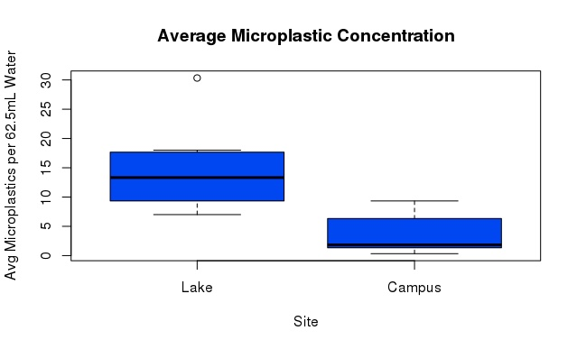

```{r setup, include=FALSE}
knitr::opts_chunk$set(echo = TRUE)
```
Abstract
---
Increased use of single use plastics and other plastic products has led to the emergence of plastics in the environment as a dangerous new type of pollution. Plastics in ecosystems can have negative impacts on human health, ecosystem health, and biodiversity. Little is currently known about the concentrations of microplastics (plastics < 5mm) in freshwater systems compared to estuarine and marine systems, but there are already concerns about the effects they may have on the health of marine and aquatic ecosystems. We sought to fill in knowledge gaps about microplastics in freshwater systems. We found that a fresh water lake in an urban environment had significantly higher concentrations (114.9 microplastics/.0005m^3^) of microplastics than tap water(30.91 microplastics/.0005m^3^). Elevated microplastic levels have implications for other urban freshwater reservoirs- such as polluted drinking water and food-  used by humans as well as other freshwater systems important for biodiversity and ecosystem function across the world.

Introduction 
---
Significance

Microplastics come from almost all plastic products used by humans and can be found in water, soil, and even in the air. They can also have impacts on human health, as well as on numerous ecosystems, even being as poisoning and killing marine life (Karbalaei et al. 2018). When not properly disposed of, plastics can break down into toxic chemicals that bioaccumulate and enter the food chain, poisoning and possibly killing many organisms ranging from plants all the way up to humans (Huerta et al. 2017). In urban areas, the contamination can be high, with levels of microplastics in waste water being seen at 260-320 x 103 particle m^3^ in cities such as Paris (Dris et al. 2015).
As utilization of single-use plastics increase, concern about microplastics in food and water sources is rising (Koelmans et al. 2019). This added to the significance of the study of microplastics in urban environments. To improve mitigation strategies for microplastics in human-consumed products, research must be done to determine concentrations in treated tap water and untreated fresh water. While seeking to fill in knowledge gaps about microplastics in freshwater systems, we hypothesized that microplastic levels would be higher in the local body of fresh water than in tap water, which may in turn lead to bioaccumulation of microplastics throughout the surrounding habitat and region.

Current Literature and Known Techniques

The analysis of microplastics in water is a process that can be complex due to their ubiquitous presence (Liu et al. 2019). As such, techniques are different depending on the sizes of the microplastics that researchers seek to identify. To preliminarily obtain the plastics there were three main methods, selective, bulk, and volume reducing sampling (Wang and Wang 2018). For the purposes of our project we used bulk sampling of water as it waas the most appropriate method for comparing plastics in these water sources (Wang and Wang 2018).

Larger microplastics can be visually identified with a microscope or other visual aid, though only after going through a wet sieve process to separate the water from the solid matter (Masura et al. 2015). For many studies, visual identification is not enough because plastics may not be visible to the naked eye. The main method found in much of the literature today is outlined in Masura’s guide for analysis of microplastics in water. This involves a wet sieve, followed by determining the mass of total solids, wet peroxide oxidation (WPO), with subsequent density separation and microscope identification (Masura et al 2015). This method was used in a study that found microplastic concentrations in Canada’s Lake Winnipeg to be equal to or greater than those in the Great Lakes basin (Anderson et al. 2017).Another technique widely used is infrared spectroscopy. This technique entails filtering a water sample using a vacuum set up through a filter paper and subsequently staining and drying the paper. After this, the paper is put under an infrared microscope and particles are identified.
The limitation with this technique is its inability to identify particles less than 20 µm, for which a different type of spectroscopy is needed (Schymanski et al. 2018). If these technologies are not available, optical techniques using microscopes and dyes are common for identification (Wang and Wang 2018). For this project, we decided to use this optical technique using red dye, and infrared light, and a microscope. This method was the most plausible given the resources available to us, as well as the budgetary and time constraints placed upon this project.


Knowledge Gaps

Though microplastics have been studied in aquatic environments, most of the current literature is focused on marine environments, with much less being known about freshwater biomes (Su et al. 2016). Additionally, not much is known about the mechanisms by which microplastics bioaccumulate and the extent of their impact aquatic life in freshwater systems, their greater ecosystems, and human health (Eerkes-Medrano et al. 2015) (Koelmans et al. 2019). By researching a freshwater lake, we hope to contribute more knowledge to these areas.
Since there is not a lot of research on urban freshwater lakes and microplastics, there is a lack of literature about microplastics in freshwater in areas surrounded by urbanization. Even more comprehensive reviews of lakes and their water quality (which would include microplastics) do not really talk about manmade lakes and how they compare to the surrounding ecosystem (Bhateria and Jain 2016). This knowledge gap surrounding man-made lakes is something we aimed to address, as artificial lakes do impact the local ecosystem, and perhaps human life in the area. By looking at artificial lakes, we can see how human development is contributing to plastic pollution and possibly to endangered native ecosystems and the organisms that inhabit them. This research is important to contribute to our understanding of how urbanization can have impacts on plastic prevalence in both native ecosystems and human society. 

Research Question and Hypothesis

The question we aimed to answer in this study was whether there were differences in treated vs untreated freshwater microplastic concentrations. Based on studies in the existing literature, we hypothesized that the untreated freshwater from pHake lake (located in the Bernard Field Station in Claremont, CA) would have a higher number of microplastics than the treated water from the Claremont Colleges (Dris et al. 2015, Anderson et al. 2017). 

Methods
---
Research Approach

There were multiple steps needed to ensure an accurate representation of plastic contents in both pHake lake and the water system in Claremont. We  employed a bulk sampling method, taking one sample from pHake Lake and one from an on-campus water fountain, with each location having 10 replicate samples.(Wang and Wang 2018). Samples from the lake were taken in approximately the middle of pHake lake at a depth of 2 meters below surface using a depth sampler. Two meters represents the relative middle in terms of depth in pHake Lake. Samples were collected in 1L glass vials to avoid any cross-plastic contamination. The water was then mixed with 1 mg/mL Nile Red dye and incubated for 30 minutes. Water was filtered using a vacuum filter and filter paper. Blanks were made for quality control purposes. After filtration, samples were analyzed using an Echo Revolve RVL-100-B microscope and red LED infrared light.

Plastic Quantification

To quantify the plastics, we used the microscope and infrared light to enumerate microplastics on random sections of the filter paper. To avoid biases, the filter paper was be split into sections and numbered before identification. The section to be observed was determined by using the random number generator on the open source statistical analysis program R. This was repeated three times per sample. The number of microplastics seen in samples from pHake Lake, treated water from campus, and our blanks was then averaged.
Because of daily fluctuations in foot and motor traffic, variation in results was expected. Current literature, unfortunately, is not comprehensive enough to give any indication of a range of values to expect, but we expected more plastics to be in the lake water than tap water.

Statistical Analysis

As the data collected was discrete, we used a one-tailed t-test to examine any difference between the means of the treatments. The t-tests were carried out between the pHake Lake
samples and treated water samples. Results have been compiled and presented in tables and figures below so that they may be easily understood by all, regardless of scientific background.

Results
---
To quantify the microplastics in each of our samples, we divided each filter paper in 8
sections and chose three at random to count the number of plastics. All objects larger than 400 micrometers were disregarded during observation. The water from pHake Lake, had a higher average microplastic concentration per sector than both the campus water and the blank (Table 1). Each Sector is about 1/8 of the filter paper. This means that sector averages need to be multiplied by 8 to get the average number of micro plastics per 500mL of water. For Lake water, this number is 114.9 microplastics and for campus water this number is 30.91 microplastics per 500mL (.0005m^3^) water with 2.64 microplastics for the blank. A t-test was used to determine if there was any significance between our two treatment groups. This test showed our results to be highly significant (p <.01), meaning that there is almost no way the difference in microplastic concentrations between our two sites is random or natural. Figure 1 shows a boxplot of average number of microplastics per sector of filter paper for both treatment groups. As such, we can conclude that there were factors (most likely anthropogenic) that are leading to increased levels of microplastics in pHake Lake and possibly the Bernard Field Station as a whole.


Average Microplastics Per 62.5 mL

Lake Water: 14.36       

Campus Water: 3.864     

Blank: 0.333
                        
![_**Table 1.** Average Number of Microplastics Per 62.5mL_]


```{r pic, echo=FALSE, fig.width = 2}

```
![_**Figure 1.** Average Microplastic Concentration by Site_]

Discussion 
---
Though much of the literature focused on aquatic pollution surrounds estuarine and marine environments, urbanization also has a negative impact on the health of urban freshwater systems (Walsh et al. 2005).  More microplastics occurred in the local freshwater lake than in the tap water on Pomona College’s campus possibly due to atmospheric deposition or the proximity of
the lake to urban development as found in Liu et al. (2019). Dris et al. (2015) found high levels of microplastics were found both in waste water and in the River Seine in Paris, supporting our findings of high levels of particles in urban water supplies.

As previously mentioned, there is a lack of high quality data on microplastic distributions in urban freshwater systems due to variability of sample collection and a non-standard method of identifying plastics. (Koelmans et al. 2019). Additionally, it has been found that differences in microplastic concentrations across urban environments may be partially due to differences in land use (Liu et al. 2019). The results showed that commercial and industrial areas emitted more microplastics than residential and highway areas, with commercial areas having as many as 22,894 plastics m^3^. This same article mentions how differences in plastic concentrations can be partly attributed to errors in data collection and instrumentation, showing how difficulty quality control and assurance are in this field. We doubt that we conducted our study without error and thus feel as though we must mention that some of our observed difference may have been procedural error on our part. However, the blanks had fewer microplastics than the water from campus, leading us to believe that our method was reliable.

This study is important because it contributes to the emerging area of studying microplastics in small freshwater areas. New research has found that urban rivers contain significantly elevated levels of microplastics and that microplastic pollution in small water bodies is more serious than in estuaries and coastal waters, where much of the existing literature is based (Luo et al. 2019). This supports our findings regarding urbanization surrounding a small body of freshwater as it relates to microplastic presence and concentrations. 

pHake Lake is home to many organisms, from isopods to ducks to bass. If these organisms ingest the plastics present in the lake, they may bioaccumulate through the food chain, or remain in the lake for years in the sediment after organisms die and decompose (Worm et al. 2017). Furthermore, there is evidence in the existing literature that urbanization is a major factor influencing the ingestion of microplastics in river basins (Peters and Bratton 2016). This has implications concerning human health also, as some urban lakes are also drinking water
reservoirs for communities and sources of food. Our study highlights some areas where more investigation is necessary and could lead to more significant discoveries in this area.

Conclusion and Future Directions
---
The results address our preliminary question of whether microplastic levels are significantly elevated between water sources in the Claremont area. Now that we have gained more insight into this question, there are some further questions that may be very significant and merit investigation. Expanding the geographic scale to other lakes in Southern California or Mediterranean climates would allow us to establish more meaningful trends in microplastic distributions. Looking at beetle populations at the BFS and seeing if they have been ingesting any plastics could tell us more about the bioaccumulation of microplastics. Additionally, analyzing the correlation between proximity of Southern California lakes to foothills and microplastic concentrations would allow us to draw more conclusions about urbanization in the region and its impacts on isolated freshwater bodies. Studying these relationships could prove very valuable in determining future development actions and mitigation strategies to keep this pollution problem from becoming unfixable.


Literature Cited
---
Bhateria R, Jain D. 2016 Water quality assessment of lake water: a review. Sustain Water Resour Manag 2. 161–173


Dris R, Gasperi J, Rocher V, Saad M, Renault N, Tassin B. 2015. Microplastic contamination in an urban area: a case study in Greater Paris. Environ Chem. 12:592–599.


Eerkes-Medrano D, Thompson RC, Aldridge DC. 2015. Microplastics in freshwater systems: a review of the emerging threats, identification of knowledge gaps and prioritisation of research needs. Water Res. 75:63-82


Karbalaei S, Hanachi P, Walker TR, Cole M. 2018. Occurrence, sources, human health impacts and mitigation of microplastic pollution. Environ Sci Pollut. 25:36046–36063


Koelmans AA, Nor NHM, Hermsen E, Kooi M, Mintenig SM, De France J. 2019. Microplastics in Freshwaters and Drinking Water: Critical Review and Assessment of Data Quality. Water res. 155:410-422.


Liu F, Olesen K, Borregaard A, Vollertsen J. 2019. Microplastics in urban and highway stormwater retention ponds. Sci Total Environ. 671:992-1000


Luo W, Su L, Craig NJ, Du F, Wu C, Shi H. 2019. Comparison of microplastic pollution in different water bodies from urban creeks to coastal waters. Environ Pollut. 246:174-182


Masura J, Baker JE, Foster GD, Arthur C, Herring C. 2015. Laboratory methods for the analysis of microplastics in the marine environment: recommendations for quantifying synthetic particles in waters and sediments.


Peters CA, Bratton S. 2016. Urbanization is a major influence on microplastic ingestion by sunfish in the Brazos River Basin, Central Texas, USA. Environ Pollut. 210:380-387


Schymanski D, Goldbeck C, Humpf HU, Fürst P. 2018. Analysis of microplastics in water by micro-Raman spectroscopy: release of plastic particles from different packaging into mineral water, Water Res. 129:154-162


Su L, Xue Y, Li L, Yang D, Kolandhasamy P, Li D, Shi H. 2016. Microplastics in taihu lake, China. Environ Pollut. 216:711-719


Walsh CJ, Roy AH, Feminella JW, Cottingham PD, Groffman PM, Morgan RP. 2005 The urban stream syndrome: current knowledge and the search for a cure. J N Amer Benthol Soc. 24:706–723.


Wang W, Wang J. 2018. Investigation of micropalstics in aquatic environemnts: an overview of the method used, from field sampling to laboratory analysis. Trends Anal Chem. 108:195-202


Worm B, Lotze HK, Jubinville I, Wilcox C, Jambeck J. 2017. Plastic as a persistent marine pollutant. Annu Rev Environ Resour. 42:1-26.


Appendix I: Timeline
Due to the busy schedules of the research team, we cannot collect all samples together on one certain day, but all samples will be collected no later than Friday, April 12th. Results will be delivered by the 15th, with analyses to be completed by the 22nd with a final draft submitted no later than May 14th.


Appendix II: Materials needed
We will need a depth sampler, 20 500mL glass containers, acetone, Nile red dye, filter paper, glass-fiber vacuum filter, watch glass, Echo Revolve RVL-100-B microscope and blue LED infrared light.
