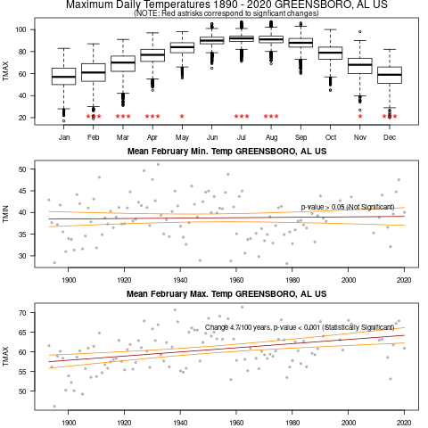

```{r setup, include=FALSE}
knitr::opts_chunk$set(echo = FALSE)
# https://marclos.github.io/Climate_Change_Narratives/Social_Media/

# Select State 1

MAP <- '../png/MAP-Alabama.png'
```

```{r, child=c('Intro.Rmd')}
```


## Weather Station Selected

```{r, echo=FALSE, out.width='70%'}
   knitr::include_graphics(MAP)
```

## Results

```{r, echo=FALSE, out.width='60%'}
   
```

## Impacts

- Contrary to this station's results, part's of the state overall has not become warmer during the last
50 years. 
- Alabama will become warmer in the coming decades.
- Probably experience more severe floods and drought, where More rain arrives in heavy downpours 
- Soils have become drier, while annual rainfall has increased
in most of the state
- Sea level is rising about one inch every eight years. 
- Changing the climate is likely to increase damages from tropical storms, reduce crop yields, harm livestock, increase the number of unpleasantly hot days, increase the risk of heat stroke and other heat-related illnesses.
    
(https://19january2017snapshot.epa.gov/sites/production/files/2016-09/documents/climate-change-al.pdf)

## State Adaptation / Mitigation Plans
 
- Alabama has not developed a statewide adaptation plan.
- Impacts of Climate Change and Variability on Transportation Systems and Infrastructure: The Gulf Coast Study, Phase 2 (Mobile, Alabama)

(Source: Georgetown Climate Center) !(https://www.georgetownclimate.org/adaptation/state-information/alabama/overview.html)

```{r, child=c('NextSteps.Rmd')}
```


