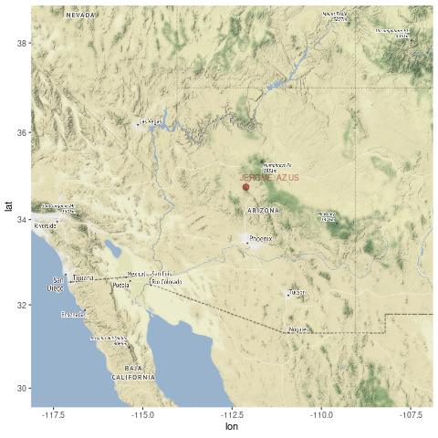
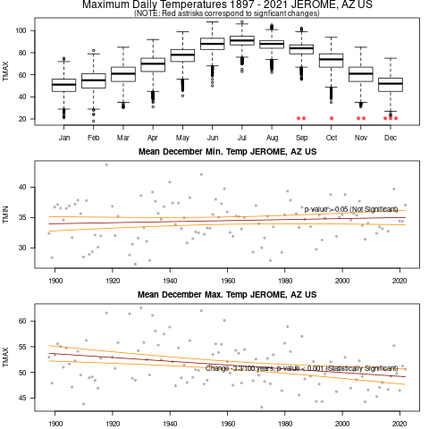

```{r setup, include=FALSE}
knitr::opts_chunk$set(echo = FALSE)
# https://marclos.github.io/Climate_Change_Narratives/Social_Media/
```

```{r, child=c('Intro.Rmd')}
```

## Results

```{r, echo=FALSE, out.width='70%'}
   
```

## Results

```{r, echo=FALSE, out.width='60%'}
   
```

 <font size="2">[Link to Gif](https://marclos.github.io/Climate_Change_Narratives/Social_Media/gif/Arizona_GSOM.gif)</font>
 
## Impacts
 
```{r, child=c('Arizona_X_Impacts.Rmd')}
```


