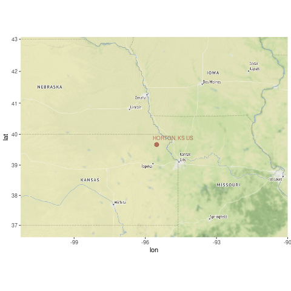

```{r setup, include=FALSE}
knitr::opts_chunk$set(echo = FALSE)
# https://marclos.github.io/Climate_Change_Narratives/Social_Media/
```

## Data Source and Procedures

Open Source Software & Publicly Available Data

- GSOM (Monthly Average Data -- not corrected for biases)
- Analysis and Graphics R/Rstudio
- Selected Station with longest and fewest missing data
- Determined which month had strongest signal
- Evaluate Temp Trend for record

## Results

```{r, echo=FALSE, out.width='80%'}
   
```

## Results

```{r, echo=FALSE, out.width='70%'}
   knitr::include_graphics('../png/GSOM-Kansas.png')
```

## Conclusion

### Impacts
- Significant warming in March and June
- ~3 degrees/100 years
- If trend continues...
    - Increase Heat-related public health impacts
    - Increase in A/C costs
    - Earlier planting of crops (increase yields?)
    - Hotter summer Temps (lower yields?)

### State Adaptation / Mitigation Plans

Kansas has not developed a statewide adaptation plan (Source: Georgetown Climate Center)


