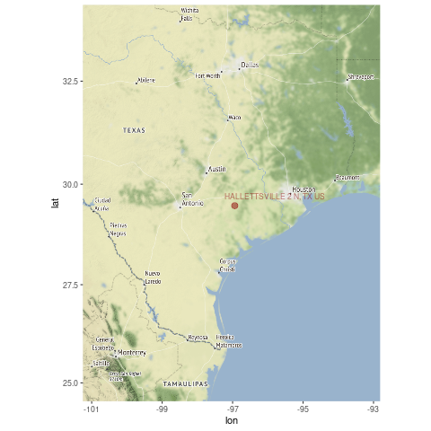
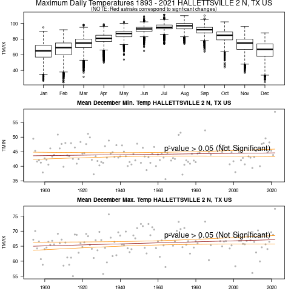

```{r setup, include=FALSE}
knitr::opts_chunk$set(echo = FALSE)

# https://marclos.github.io/Climate_Change_Narratives/Social_Media/
```

```{r, child=c('Intro.Rmd')}

```


## Selected Station

```{r, echo=FALSE, out.width='70%'}
   
```

## Temperature Trends

```{r, echo=FALSE, out.width='60%'}
   
```
 <font size="2"> (https://marclos.github.io/Climate_Change_Narratives/Social_Media/Climate_gifs/Texas_GSOM.gif)</font>
 
## Impacts
```{r, child=c('Texas_X_Impacts.Rmd')}
```


