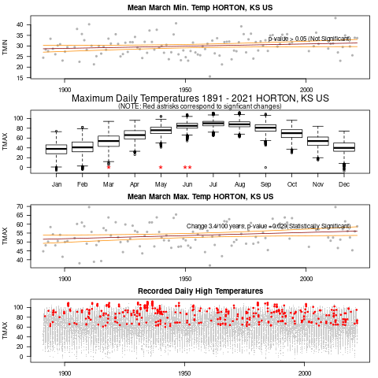

Updated: `r Sys.time()`

```{r setup, include=FALSE}
library(tufte)
library(ggplot2)
library(gganimate)
theme_set(theme_bw())
# invalidate cache when the tufte version changes
knitr::opts_chunk$set(tidy = FALSE, cache.extra = packageVersion('tufte'))
options(htmltools.dir.version = FALSE)
```
# Introduction

## Weather Records and Climate Trends

Human activities are driving climate change. And the impacts are being felt throughout the world --- and in spite of or because of climate activists are organizing around the issue. 

```{r maunaloa, echo=FALSE}
address <- "ftp://aftp.cmdl.noaa.gov/products/trends/co2/co2_mm_mlo.txt"
download.file(address, "maunaloa", quiet = F, mode = "w", cacheOK = T)
maunaloa <- read.table("maunaloa", skip=70)
names(maunaloa) <- c("year", "month", "decimal.date", "average", "interpolated", "trend", "days")
maunaloa$average[maunaloa$average==-99.99] <- NA
maunaloa <- data.frame(year=maunaloa$year, month=maunaloa$month, decimal.date=maunaloa$decimal.date, average=maunaloa$average)
```

```{r fig-margin, fig.margin = TRUE, fig.cap = "Observed CO~2~ concentrations (black) have been steadily increasing since we have begun measuring them in the 1950s, with a best fit line (red). Note that the slope or the rate of change is also increasing.", fig.width=3.5, fig.height=3.5, cache=TRUE, echo=FALSE}
par(las=1)
plot(maunaloa$decimal.date, maunaloa$average, type="l", ylab=expression(CO[2]*~ "(ppm)"), xlab="Year", 
main="Carbon Dioxide Concentration \n Mauna Loa, HI" )
#abline(coef(lm(average~year, data=maunaloa)), col="red", lwd=2)
muanaloa.loess = loess(average~year, data=maunaloa, span = 0.75, degree = 2, parametric = FALSE, 
  drop.square = FALSE, normalize = TRUE)
maunaloa$loess <- predict(muanaloa.loess)
lines(loess~decimal.date, data=maunaloa, lwd=1.4, col="red")
```


These activists include a diverse set of players --- many of whom be obscure. Others are well known and use media to draw attention to their views. 

But our question this year, is how do activitists use weather records and climate science as a whole to support their arguments?  Some may emphasize the uncertainty, others may rely on well trusted sources. Each use various sources of information to push for specific policy goals. As a class we summarized climate change patterns for various regions around the world while describing how various activists engage in policy or politics. 

These activists include a diverse set of players --- many of whom be obscure. Others are well known and use media to draw attention to their views. 

But our question this year, is how do activitists use weather records and climate science as a whole to support their arguments?  Some may emphasize the uncertainty, others may rely on well trusted sources. Each use various sources of information to push for specific policy goals. As a class we summarized climate change patterns for various regions around the world while describing how various activists engage in policy or politics. 

## Basics of Climate Science

Climate change science is complex -- but some relatively simple conclusions can be made: 1) humans are adding more CO~2~ to the atmosphere than the Earth can assimilate; 2) CO~2~ acts as a greenhouse gas and can regulate the Earth's temperature; 3) the anthropogenic sources of greenhouse gases trap heat in the Earth's atmosphere; 4) the trapped heat is warming the Earth and having documented impacts on the Earth's surface. 

What are these regional impacts? How are regional stakeholders dealing with these impacts?

As we document below every region in the US and beyond respond differently to the planet's warming. As as such, actvitists will  the issues of climate change from different perspectives--- and play an important role in defining climate change narratives.

# Graphics and Animations

## CO2 Records

Sometimes it's a bit easier to see how these patterns develop over time and relative to what we think of as "pre-industrial" concentrations, which forms a base-line. 

```{r, co2animation, fig.margin = FALSE, fig.cap = "Observed CO~2~ concentrations (black) have been steadily increasing since we have begun measuring them in late 1950s, with a loess line (red). Note that the slope or the rate of change is also increasing.", fig.width=8, fig.height=5, cache=TRUE, echo=FALSE}
library(magick)
#setwd("/home/CAMPUS/mwl04747/github/Climate_Change_Narratives/docs/Social_Media")


img <- image_graph(600, 340, res = 96)
for(i in min(maunaloa$decimal.date):max(maunaloa$decimal.date)){
#png(paste0("png//Rplot_", i, ".png"), width = 480, height = 480, units = "px", pointsize = 12, bg = "white")
par(las=1)
plot(average~decimal.date, data=maunaloa[maunaloa$decimal.date<=i,], type="l", ylab=expression(CO[2]*~ "(ppm)"), xlab="Year", ylim=c(280, max(maunaloa[maunaloa$decimal.date<=i,4])), 
main="Carbon Dioxide Concentration \n Mauna Loa, HI" )
#abline(coef(lm(average~year, data=maunaloa)), col="red", lwd=2)
abline(h=280, col="gray50", lty=2); text(1970, 285,  "Pre-Industrial Estimate", col="gray20")
muanaloa.loess = loess(average~decimal.date, data=maunaloa, span = 0.75, degree = 2, parametric = FALSE, drop.square = FALSE, normalize = TRUE)
maunaloa$loess <- predict(muanaloa.loess)
lines(loess~decimal.date, data=maunaloa, lwd=1.4, col="red")
# plot(average~decimal.date, data=maunaloa[maunaloa$decimal.date<=i,])
}
dev.off()

CO2_animation <- image_animate(img, fps = 1, optimize = TRUE)
print(CO2_animation)

#image_write(CO2_animation, "CO2.gif")
```


## Fire and Air Quality 


## Old Attempts
```{r animation, fig.margin = FALSE, fig.cap = "Observed CO~2~ concentrations (black) have been steadily increasing since we have begun measuring them in the 1950s, with a best fit line (red). Note that the slope or the rate of change is also increasing.", fig.width=8, fig.height=5, cache=TRUE, echo=FALSE, eval=FALSE}
par(las=1)
p <- ggplot(
  maunaloa, 
  aes(x = decimal.date, y=average)
  ) +
  geom_point(show.legend = FALSE, alpha = 0.2, color="blue", pch=20) +
  scale_color_viridis_d() +
  #geom_smooth(color="red") +
  #scale_size(range = c(2, 12)) +
  #scale_x_log10() +
  labs(x = "Date", y = "Mauna Loa CO2 (ppm)")
#p
```


```{r}
#p + transition_time(decimal.date) + labs(title = "Year: {frame_time}")
```

## States

### Alabama


### Kansas

([Kansas 2022](States/Kansas.html))



## Inter-Mountain Region


## Economic Impacts on Agriculture


## Hydrology and Farming Impacts


## The South


## New England


## Urban Heat, Health, Environmental Justice


## Tropical Areas in the USA


## Parallel issues in Europe and Asia


