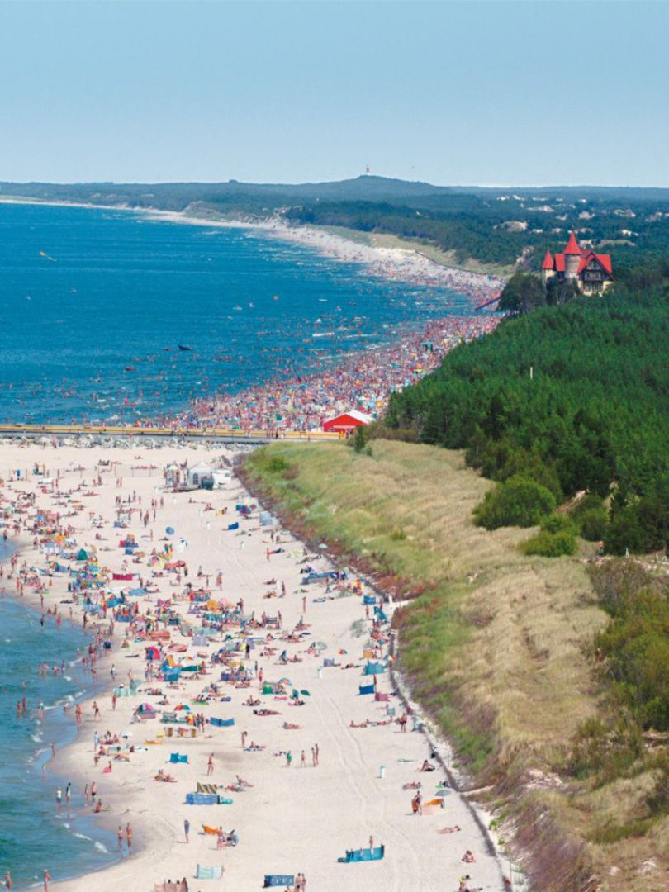
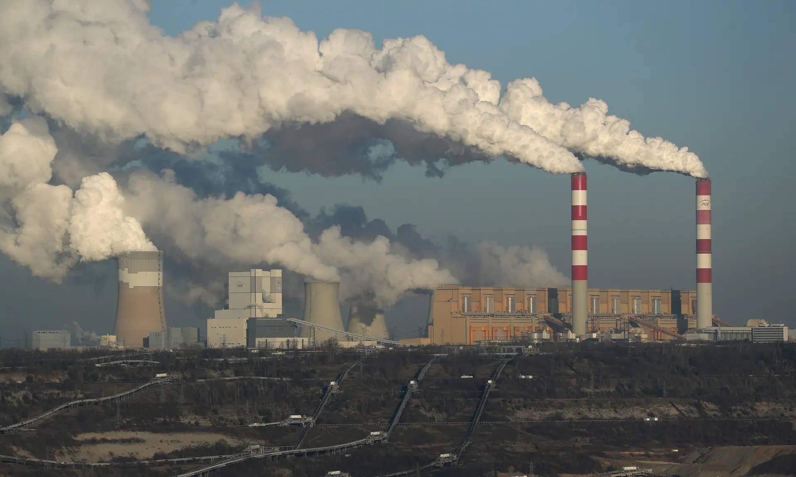
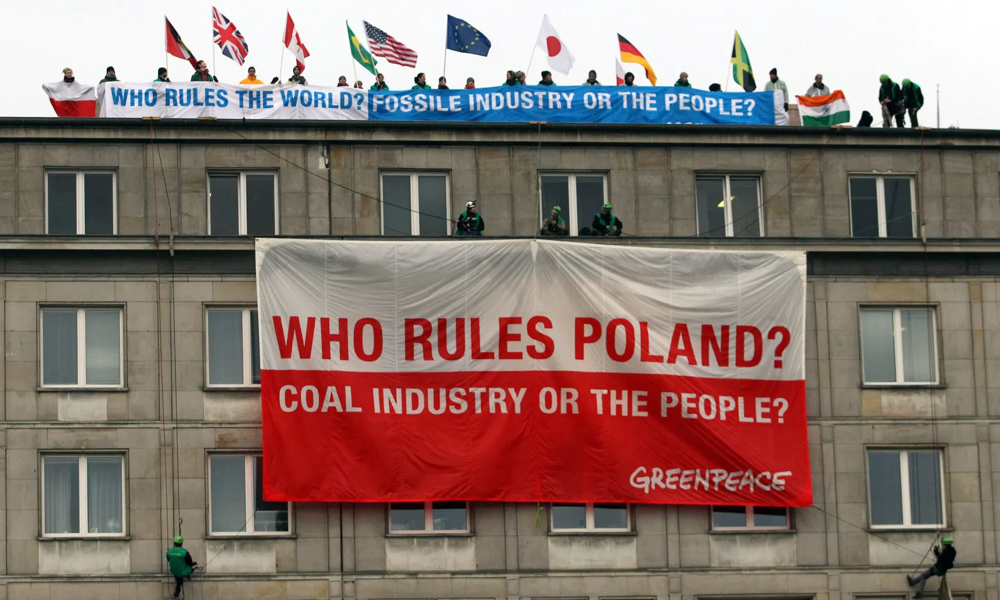

In this blog, I will be looking at climate data from the northern seaside city of Łeba in Poland. Łeba has a population of approximately 3,500, in Pomorskie, northern Poland. It is located at the mouth of the river Łeba on the Baltic Sea coast. Due to its mild sea climate, frequent sunny days, and strong winds from the sea, the main source of income for Łeba is tourism, where mainly domestic visitors come to enjoy the Baltic Sea and quiet town. However, Łeba has a history of experiencing extreme weather events, both large storms and dangerous waves. Huge floods were historically recorded as occurring through the 14th and 15th centuries, whereas since the 19th century the river has become somewhat regulated. 





```{r, echo=FALSE}
file.path = "/home/CAMPUS/jnba2020/Climate_Change_Narratives/Data/FA20/leba, poland data.csv"
#file.path = "/home/CAMPUS/mwl04747/github/Climate_Change_Narratives/Data/FA20/leba, poland data.csv"
climate_data <- read.csv(file.path)
str(climate_data)
```

```{r, echo=FALSE}

strDates = as.character(climate_data$DATE) 
climate_data$NewDate = NA
climate_data$NewDate[1:12417] = format(as.Date(strDates[1:12417], "%m/%d/%y"), "19%y-%m-%d") 
climate_data$NewDate[12418:19949] = format(as.Date(strDates[12418:19949], "%m/%d/%y"),"20%y-%m-%d")

str(climate_data)
```

```{r, echo=FALSE}
#climate_data$Month = format(as.Date(climate_data$NewDate), format = "%m")
#climate_data$Year = format(climate_data$NewDate, format="%Y")

#MonthlyTMAXMean = aggregate(TMAX ~ Month + Year, climate_data, mean)
#str(MonthlyTMAXMean)
#MonthlyTMAXMean$Year=as.numeric(MonthlyTMAXMean$Year)

#TMAX.lm = lm(TMAX ~ NewDate, data= climate_data)
```

```{r, echo=FALSE}
str(climate_data)
climate_data$NewDate
```


Polish climate is characterized by a range of variability of weather and climate, creating fluctuations in the course and length of seasons over consecutive years. The coldest region of Poland is the north-eastern part of the country, as well as mountainous regions. The distribution of temperature in the summer across the country is parallel, with the south having higher temperatures, aside from the mountainous areas which experience colder winters. However, this parallel distribution of temperature has still been increasing, with warmer months getting warmer, and the summer growing in length. After analyzing the temperature data collected from Łeba’s weather station

After gathering the data from Łeba’s weather station through the NOAA’s climate database, and analyzing both precipitation and maximum temperature levels from 1966 to 2020, there are some notable climate trends occurring in the area. One of my most interesting findings is that even in an area historically known for experiencing heavy rainfall and great floods, the monthly precipitation data since 1966 showed trends of precipitation rates remaining steady or decreasing. The most statistically significant month I found was April, with an adjusted R-squared value of 0.06944, indicating a statistically significant decline in precipitation since 1966 during that month. 

```{r, echo=FALSE, results='hide'}
#april precipitation 
PRCPresult=NA 

climate_data$Year = format(as.Date(climate_data$NewDate), format="%Y")
climate_data$Month = format(as.Date(climate_data$NewDate), format = "%m")


MonthlyPRCPSum = aggregate(PRCP ~ Month + Year, climate_data, sum)
MonthlyPRCPSum$Year=as.numeric(MonthlyPRCPSum$Year)
MonthlyPRCPSum$MONTH=as.numeric(MonthlyPRCPSum$Month)


for (i in 4) {
plot(PRCP ~ Year, data = MonthlyPRCPSum[MonthlyPRCPSum$MONTH == i, ], ty = "l", las = 1, xlim = c(1966, 2020), main = "April")
Month.PRCPlm <- lm(PRCP ~ Year, data = MonthlyPRCPSum[MonthlyPRCPSum$MONTH == i, ])

abline(coef(Month.PRCPlm), col = "red")
#PRCPresult <- rbind(PRCPresult, cbind(Month[i],
#round(coef(Month.PRCPlm)[2], 4), round(summary(Month.PRCPlm)$coefficients[2, 4], 4), round(summary(Month.PRCPlm)$r.squared,3)))
}
summary(Month.PRCPlm)

```

```{r, echo=FALSE, results='hide'}
# all temp months

#for (i in 1:12) {
# plot(MonthlyTMINMean£TMAX[MonthlyTMINMean£Month==i],
# ty='l')
#plot(TMIN ~ YEAR, data = MonthlyTMINMean[MonthlyTMINMean$MONTH == i, ], ty = "l", las = 1, xlim = c(1966, 2020), main = Months[i])
#Month.lm <- lm(TMIN ~ YEAR, data = MonthlyTMINMean[MonthlyTMINMean$MONTH == i, ])
#summary(Month.lm)
#abline(coef(Month.lm), col = "red")
#TMINresult <- rbind(TMINresult, cbind(Months[i],
#round(coef(Month.lm)[2], 4), round(summary(Month.lm)$coefficients[2, 4], 4), round(summary(Month.lm)$r.squared,3)))
#}
```

Another observed climate trend occurring is this parallel distribution of temperature between the northern and southern regions has been increasing, with warmer months getting warmer, and the summer growing in length. After analyzing the temperature data collected from Łeba’s weather station for monthly data since 1966, I found that each month is showing either relatively stable temperature trends, especially in the fall, or increased temperature trends, most significantly in August and April. 

```{r, echo=FALSE, results='hide'}
#april temp

MonthlyTMINMean = aggregate(TMIN ~ Month + Year, climate_data, mean)
MonthlyTMINMean$Year=as.numeric(MonthlyTMINMean$Year)
MonthlyTMINMean$MONTH=as.numeric(MonthlyTMINMean$Month)

for (i in 4) {
# plot(MonthlyTMINMean£TMAX[MonthlyTMINMean£Month==i],
# ty='l')
plot(TMIN ~ Year, data = MonthlyTMINMean[MonthlyTMINMean$MONTH == i, ], ty = "l", las = 1, xlim = c(1966, 2020), main = 'April')
Month.lm <- lm(TMIN ~ Year, data = MonthlyTMINMean[MonthlyTMINMean$MONTH == i, ])
summary(Month.lm)
abline(coef(Month.lm), col = "red")
#TMINresult <- rbind(TMINresult, cbind(Month[i],
#round(coef(Month.lm)[2], 4), round(summary(Month.lm)$coefficients[2, 4], 4), round(summary(Month.lm)$r.squared,3)))
}

summary(Month.lm)
##statiscally significant
```

```{r, echo=FALSE, results='hide'}
#august temp

for (i in 8) {
# plot(MonthlyTMINMean£TMAX[MonthlyTMINMean£Month==i],
# ty='l')
plot(TMIN ~ Year, data = MonthlyTMINMean[MonthlyTMINMean$MONTH == i, ], ty = "l", las = 1, xlim = c(1966, 2020), main = 'August')
Month.lm <- lm(TMIN ~ Year, data = MonthlyTMINMean[MonthlyTMINMean$MONTH == i, ])
summary(Month.lm)
abline(coef(Month.lm), col = "red")
#TMINresult <- rbind(TMINresult, cbind(Months[i],
#round(coef(Month.lm)[2], 4), round(summary(Month.lm)$coefficients[2, 4], 4), round(summary(Month.lm)$r.squared,3)))
}

summary(Month.lm)

```


```{r, echo=FALSE, results='hide'}
# all precipitation
#PRCPresult=NA 
#for (i in 1:12) {
#plot(PRCP ~ YEAR, data = MonthlyPRCPSum[MonthlyPRCPSum$MONTH == i, ], ty = "l", las = 1, xlim = c(1966, 2020), main = Months[i])
#Month.PRCPlm <- lm(PRCP ~ YEAR, data = MonthlyPRCPSum[MonthlyPRCPSum$MONTH == i, ])
#summary(Month.PRCPlm)
#abline(coef(Month.PRCPlm), col = "red")
#PRCPresult <- rbind(PRCPresult, cbind(Months[i],
#round(coef(Month.PRCPlm)[2], 4), round(summary(Month.PRCPlm)$coefficients[2, 4], 4), round(summary(Month.PRCPlm)$r.squared,3)))

#summary(Month.PRCPlm)

```

However, these findings indicate changes in overall climate trends, which often doesn’t factor in extreme weather events. The biggest changes in climatic conditions in Poland have been this observed increase in intense weather phenomena such as droughts, hurricane-force winds, tornadoes and hail. As we saw with the decreased precipitation occurring in Łeba, it is fair to say these changes are also occurring within the seaside town. 

There is hardly any information on the weather station in Łeba, so I was unable to find what technologies are used to gather temperature and precipitation data, how long it’s been in operation, who funds it, and what organizations it is affiliated with. However, I did find that Łeba also has an air quality and pollution station that has been taking NO2, O3 and SO2 measurements daily since 2000. The station is owned and operated by the Instytut Meteorologii i Gospodarki Wodnej, the Institute of Meteorology and Water Management. I assume that the temperature and precipitations measurements are also run by the IMGW, but I could not find any information regarding that Łeba station, so I cannot say for sure. 


Climate activism in Poland has been increasingly more popular over the past ten years, with the younger generation taking a stronger stance and pushing back against the far-right, anti-EU government. Though the changing climate in Łeba has not been the focus of much of these conversations, the recognition of changes in climate in Poland is becoming more widespread, with notable changes in precipitation, warm/cold seasons, and extreme weather events being reported by national and international climate organizations. 
The main issue being tackled by Poland’s climate activists is Poland’s heavy reliance on coal, Poland has the highest domestic coal production in Europe, and also is home to Europe’s biggest coal plant. The Bełchatów power station in Rogowiec produces annual CO2 emissions roughly equivalent to those of the whole of New Zealand. Most recently in 2018, this power station in central Poland has been classed into question after ClientEarth, a global environmental charity, announced a challenge designed to eliminate the coal plant’s carbon footprint by 2035. This is no way an easy demand to make from this plant, as it burns approximately 45 million tonnes of coal each year, and has emitted approximately 1 billion tonnes of CO2 over the course of its lifetime. The plant burns lignite, or brown coal, which is notorious for its extremely pollutant emissions when burned. However, as challenging as this request seems, ClientEarth has already taken successful legal action in Poland before, when the country’s supreme administrative court blocked the construction of a new coal plant in the northern region of Pomerania, where Łeba is located. 



This victory, as well as the growing number of climate activists and passionate youths, is emblematic of the growing and changing climate activism in Poland. Grassroots local activists are connecting and working together with larger NGOs, including the ClientEarth charity, to put pressure on the extreme far-right government, as well as private energy companies, to continue to step away from Poland’s immense dependence on Coal and to strive to prevent climate catastrophe. 



References: 
http://klimada.mos.gov.pl/en/climate-change-in-poland/ 
https://www.staypoland.com/about_leba.htm/ 
https://www.theguardian.com/environment/2019/sep/26/fight-power-climate-activists-europe-biggest-coal-poland-bechatow 
https://imgw.pl/ 

