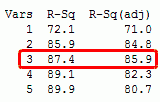

```{r setup, include=FALSE}
knitr::opts_chunk$set(echo = FALSE)

### I like to define any general-purpose variables or functions up here too
POMblue <- "#0057B7" # "Pomona Blue" is Pantone 2935; the "hex" color code for Pantone 2935 is #0057B7
                     # You can use color hex codes to specify colors for plotting in R as well as the name of colors that R recognizes (e.g. "forestgreen")

POMblue <- "#0057B7"

### If we were using any external packages that aren't "base R", I'd load them into the workspace here with the library(package name) command.
```

## Description of this document

All of the code can also be found at [Project Guide 2](https://raw.githubusercontent.com/marclos/Climate_Change_Narratives/master/Analysis_Resources/2_Using_NOAA_Climate_Records.pdf) and [Project Guide 3](https://raw.githubusercontent.com/marclos/Climate_Change_Narratives/master/Analysis_Resources/3_Evaluating_Monthly_Trends_CHCNDaily.pdf) and the instructions for this weekend's assignments are at the [Climate Narratives Project Guide](https://raw.githubusercontent.com/marclos/Climate_Change_Narratives/master/Admin/Project_Guide/Climate_Narratives_F20.pdf). The [blog template assignment](https://sakai.claremont.edu/portal/directtool/b68fbfea-ce8b-4ac2-9006-9fd3bf97b5b2/) can be seen in the [Climate Narratives Project Guide](https://raw.githubusercontent.com/marclos/Climate_Change_Narratives/master/Admin/Project_Guide/Climate_Narratives_F20.pdf) in **section 6**. My other "skeleton outline" document (`~/Climate_Change_Narratives/Student_Folders/Chang/Regional_Trend_Skeleton.Rmd`) shows an example if you would like to work through that and modify it to fit your own data; that assignment is described in **section 8.1** (*not 8.2*!) for the [draft regional analysis](https://sakai.claremont.edu/portal/directtool/b68fbfea-ce8b-4ac2-9006-9fd3bf97b5b2/).  

Below I show how to include a graphic from a URL link or from a local file in a `RMarkdown` document.


Below is an example pulling in an image file on my (and your) instance of RStudio Server. I don't have to specify the path to the file because it's in the same folder as this `Rmarkdown` document.

 

## Example overview

This blog will examine climate change through the perspective of temperature trends in the summertime and precipitation trends in the winter in Claremont, California.

Variables examined will include:

* Temperature (degrees Celsius)
    + I will personally convert the temperatures to Fahrenheit which is a far worse system but oh well.
* Precipitation (mm/day) - (just joking! didn't work through that in this example; see [Project Guide 3](https://raw.githubusercontent.com/marclos/Climate_Change_Narratives/master/Analysis_Resources/3_Evaluating_Monthly_Trends_CHCNDaily.pdf) from page 17 onwards for guidance)


```{r importing_data, echo=FALSE}
### 1: Importing data
claremontDF <- read.csv("~/Climate_Change_Narratives/Data/FA20/Chang_ClaremontCA_data.csv") # This code should work for all of you without needing to change the path (~ expands to /home/CAMPUS/yourusername)

# str(claremontDF) # uncomment and run if you want to see the structure of this CSV (comma-separated value spreadsheet)

### 1.1: Cleaning date-string objects
claremontDF$DateStr <- as.Date( as.character(claremontDF$DATE), "%Y-%m-%d" ) # convert object to character and turn it into a new date with the format of YEARS-months-days; your site may have a different format (e.g. %d/%m/%Y; days/months/Years)
```

#### Temperature exploration 

Below is a plot of all daily `TMAX` values over the full set of observations for Claremont, CA.

```{r plotTMAXvstime,echo=F}
### 2: Plotting Temp vs. Date
  # From the end of Marc's Project Guide #2
  # https://raw.githubusercontent.com/marclos/Climate_Change_Narratives/master/Admin/Project_Guide/Climate_Narratives_F20.pdf
plot(TMAX~DateStr, claremontDF, type = "l", bty="C") # bty: box type around plot; type: plot points (default), lines, or other representations of data (?plot for more info)
OLS_lm <- lm(TMAX~DateStr, data=claremontDF) # create an ordinary least squares regression model ("best-fit line") relating maximum daily temperatures to this cleaned Date String column in the claremontDF data frame
abline(coef(OLS_lm), col = POMblue) # add the regression line

# summary(OLS_lm) # view the summary of the OLS linear model (lm); uncomment to run
```

Yikes! That plot looks pretty horrible. Let's take a look at monthly averages of daily `TMAX`.

```{r creating_months, echo=FALSE}
### 3: Project guide 3, creating months to aggregate data
claremontDF$Month = format(as.Date(claremontDF$DateStr), format = "%m")
claremontDF$Year = format(claremontDF$DateStr, format="%Y")

### 3.1: Aggregating TMAX into monthly means
MonthlyTMAXMean = aggregate(TMAX ~ Month + Year, claremontDF, mean)
MonthlyTMAXMean$YEAR = as.numeric(MonthlyTMAXMean$Year)
MonthlyTMAXMean$MONTH = as.numeric(MonthlyTMAXMean$Month)
# str(MonthlyTMAXMean) # uncomment to see structure

### 3.2: Visualize new monthly averages
plot(TMAX~YEAR, data=MonthlyTMAXMean, ylab="Monthly average maximum daily temp (*C)", type="p",col=POMblue,las=1) # use xlab="..." and ylab="..." to modify the x- or y-axis labels; FMI on las see ?par
```

#### September is hot! 

*Are September daily max temps getting warmer in Claremont on average?*

In the Southwest of the continental US, it appears that our summer and late-summer months have experienced warming. As such, I am going to drill down on the month of September. I've plotted September data below and have created a best-fit line (linear model/ordinary least squares model) for monthly September averages of daily `TMAX` against year to see if there is some type of discernible trend.

```{r MonthlyAvg_Plot, echo=F}
plot(TMAX~YEAR, data=MonthlyTMAXMean[MonthlyTMAXMean$Month=="09",],type='p', xlim=c(1950, 2020),col=POMblue,pch=19)
Month_lm <- lm(TMAX~YEAR, data=MonthlyTMAXMean[MonthlyTMAXMean$Month=="09",])
abline(coef(Month_lm),col="red",lty=2) # lty: line type; see ?plot or ?par FMI
```

How would you improve this rough, initial plot? Perhaps we would want to modify `xlab`, `ylab`, and `las`. What else would we perhaps like to modify? See `?par` in the console for more details or the [Overview of R document](https://sakai.claremont.edu/portal/directtool/b68fbfea-ce8b-4ac2-9006-9fd3bf97b5b2/).