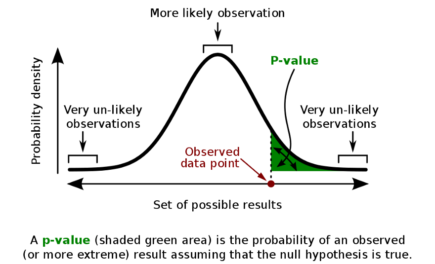

```{r setup, include=FALSE}
knitr::opts_chunk$set(echo = TRUE)

### Note: I like to use this first chunk to call in any and all packages I'll need in the analysis in a given document

library(htmlTable) # tell R to load the package "htmlTable" into the current RMarkdown workspace (knitting the file generates the RMarkdown workspace) or console workspace if you run the code interactively in the console below. This is one of many packages developed by ordinary R users (useRs).

### I also like to define any general-purpose variables or functions up here too
POMblue <- "#0057B7" # "Pomona Blue" is Pantone 2935; the "hex" color code for Pantone 2935 is #0057B7
                     # You can use color hex codes to specify colors for plotting in R as well as the name of colors that R recognizes (e.g. "forestgreen")

Months <- c("January", "February", "March", "April",
"May", "June", "July", "August", "September", "October",
"November", "December")
```

## Overview

This is an outline with extensively commented code documenting an example regional drill-down trend analysis for my dataset located in Claremont, California. All of the code can also be found here [Project Guide 3](https://raw.githubusercontent.com/marclos/Climate_Change_Narratives/master/Analysis_Resources/3_Evaluating_Monthly_Trends_CHCNDaily.pdf) and the instructions for this weekend's assignments are at the [Climate Narratives Project Guide](https://raw.githubusercontent.com/marclos/Climate_Change_Narratives/master/Admin/Project_Guide/Climate_Narratives_F20.pdf) in **section 8.1** (*not 8.2*!) for the [draft regional analysis](https://sakai.claremont.edu/portal/directtool/b68fbfea-ce8b-4ac2-9006-9fd3bf97b5b2/). The [blog template assignment](https://sakai.claremont.edu/portal/directtool/b68fbfea-ce8b-4ac2-9006-9fd3bf97b5b2/) can be seen in the [Climate Narratives Project Guide](https://raw.githubusercontent.com/marclos/Climate_Change_Narratives/master/Admin/Project_Guide/Climate_Narratives_F20.pdf) in **section 6**. My other "skeleton outline" document (`~/Climate_Change_Narratives/Student_Folders/Chang/Chang_Claremont_ClimateBlog.Rmd`) shows an example if you would like to work through that and modify it to fit your own data.

Below I show how to include a graphic from a URL link or from a local file in a `RMarkdown` document.

 An example pulling in a JPEG from the internet by using the link to the file ending in `.jpg`, `.gif`, or `.png`. (Maybe `.tiff` works as well, but I'm not sure.)

Below is an example pulling in an image file on my (and your) instance of RStudio Server. I don't have to specify the path to the file because it's in the same folder as this `Rmarkdown` document.

 

#### Processing data

In this code chunk, I read in my daily temperature data and convert it to a monthly format. Note that to modify this code to your needs, you may want to change the variable `claremontDF` to `climate_data` or whatever you have chosen to name your climatic `data.frame` (for instance,`MySiteDF`).

```{r data_processing_code_chunk}
### 1: Importing data
claremontDF <- read.csv("~/Climate_Change_Narratives/Data/FA20/Chang_ClaremontCA_data.csv") # This code should work for all of you without needing to change the path (~ expands to /home/CAMPUS/yourusername)

# str(claremontDF) # uncomment and run if you want to see the structure of this CSV (comma-separated value spreadsheet)

### 1.1: Cleaning date-string objects
claremontDF$DateStr <- as.Date( as.character(claremontDF$DATE), "%Y-%m-%d" ) # convert object to character and turn it into a new date with the format of YEARS-months-days; your site may have a different format (e.g. %d/%m/%Y; days/months/Years)
```

Subsequently, I create a monthly-level average aggregate for the temperature data.

```{r creating_months}
### 2: Project guide 3, creating months to aggregate data
claremontDF$Month = format(as.Date(claremontDF$DateStr), format = "%m") # creating a new column entitled Month with the atomic vector operator ($) and telling it that it is a month date format
    # You can see what this command does by uncommenting the below command and running it:
# head(format(as.Date(claremontDF$DateStr), format = "%m") ) # show me the first 6 entries of this format object output
# format(as.Date(claremontDF$DateStr), format = "%m")[1:10] # alternatively, show me the first 1 to 10th entries of this function's output
# ?format # give me help on what format does

claremontDF$Year = format(claremontDF$DateStr, format="%Y") # repeating the step above but creating a new Year column with the Year date format

### 2.1: Aggregating TMAX into monthly means
  # TMAX: daily maximum temperature in degrees Celsius
MonthlyTMAXMean = aggregate(TMAX ~ Month + Year, claremontDF, mean) # use the aggregate function to take the mean of TMAX for each combination of Month (e.g. Jan-Dec) and year (e.g. 1950-2020) within the claremontDF data.frame which had daily-level observations
MonthlyTMAXMean$YEAR = as.numeric(MonthlyTMAXMean$Year) # create a new column in my monthly average data.frame with the name YEAR and have it store a numeric representation of the years (currently otherwise in string format in MonthlyTMAXMean$Year)
MonthlyTMAXMean$MONTH = as.numeric(MonthlyTMAXMean$Month) # ditto but for Month

# str(MonthlyTMAXMean) # see the structure of this new Monthly TMAX aggregated data frame

### 2.2: Visualize new monthly averages
# plot(TMAX~YEAR, data=MonthlyTMAXMean, ylab="Monthly averages of daily TMAX", type="p",col=POMblue,las=1) # las: labels are parallel (=0) or perpendicular to axis

### 2.2: Aggregating TMIN into monthly means
  # TMIN: minimum daily temperatures (degrees Celsius)
MonthlyTMINMean = aggregate(TMIN ~ Month + Year, claremontDF, mean) # use the aggregate function to take the mean of TMIN for each combination of Month (e.g. Jan-Dec) and year (e.g. 1950-2020) within the claremontDF data.frame which had daily-level observations
MonthlyTMINMean$YEAR = as.numeric(MonthlyTMINMean$Year) # create a new column in my monthly average data.frame with the name YEAR and have it store a numeric representation of the years (currently otherwise in string format in MonthlyTMINMean$Year)
MonthlyTMINMean$MONTH = as.numeric(MonthlyTMINMean$Month) # ditto but for Month
```

### Monthly analyses of temperature

#### Minimum temperature

Below, I show how to perform an analysis of monthly minimum average temperatures for the weather station in Claremont, CA, using the aggregated `MonthlyTMINMean` object created in the preceding code chunk.

```{r TMIN_plots_and_outputs}
### 3.1: Specifying plotting window parameters
par(mfrow = c(4, 3), mar = c(5, 4, 1, 1) + 0.1) # ?par for more details in the console
  # create a matrix of subplots that has 4 rows and 3 columns
  # specify margins for each subplot (?mar for more details in the console)

### 3.2: Storing monthly-level summaries following Marc's Project Guide 3

TMINresult <- NULL # instantiate an empty placeholder to store analysis outputs for the for-loop below where we will iterate over every month and store regression model outputs
  # The for-loop below will iterate from 1 to 12 (1:12 syntax) and assign the values of 1..12 to the variable i and run all code within the braces
for (i in 1:12) { # everything between the curly braces is what the for loop will iterate through
  
  Month_sub_DF <- MonthlyTMINMean[MonthlyTMINMean$MONTH==i, ] # create a "subset" of the monthly minimum temperature data frame corresponding to all rows where the MONTH == i (in which case, we start by selecting all January entries, or month 1, or i=1; why do we use MONTH instead of Month? (hint: data type of Month vs MONTH and data type of i))
      # How would you create a subset of a data frame based on only its columns? (hint: df[ , c("ColumnName1","ColumnName2")] )
  
  MonthMin_lm <- lm(TMIN ~ YEAR, data=Month_sub_DF) # create an ordinary least squares regression (OLS, one type of "best-fit line") relating TMIN (dependent/response var) to Year (predictor var) within the subset data frame that we created above
  
  TMINresult <- rbind(TMINresult, # populate the min temperature month-by-month summary table by row-binding outputs (rbind; ?rbind in the console FMI)
                      cbind(Months[i], # column-bind the i^th entry of the Months vector (e.g. Months[9] is "September")
                            round(coef(MonthMin_lm)[2], 3), # go in to the coef(MonthMin_lm) object and take the 2nd element and round the number to 4 digits
                            round(summary(MonthMin_lm)$coefficients[2,4], 3), # What does this column correspond to? Try copying just round(summary(MonthMin_lm)$coefficients[2,4], 4) after running an example MonthMin_lm <- lm(...) command in the console and see what it spits out
                            round(summary(MonthMin_lm)$r.squared, 2))) # create a column for the Rsquared value
  plot(TMIN~YEAR,data=Month_sub_DF, type='l', ylab='Min T (*C)', xlab='Years',main=Months[i], bty="L", las=1) #bty is box-type; I specify labels for the x-axis and y-axis using xlab=... and ylab=... respectively
  abline(coef(MonthMin_lm),col=POMblue) # add the OLS regression line with the Pomona Blue color
}

```

Subsequently, I repeat this for the `TMAX` measurements (daily maximum temperature).

```{r TMAX_plots_and_outputs}
### 4.1: Specifying plotting window parameters
par(mfrow = c(4, 3), mar = c(5, 4, 1, 1) + 0.1) # ?par for more details in the console
  # create a matrix of subplots that has 4 rows and 3 columns
  # specify margins for each subplot (?mar for more details in the console)

### 4.2: Storing monthly-level summaries following Marc's Project Guide 3

TMAXresult <- NULL # instantiate an empty placeholder to store analysis outputs for the for-loop below where we will iterate over every month and store regression model outputs
  # The for-loop below will iterate from 1 to 12 (1:12 syntax) and assign the values of 1..12 to the variable i and run all code within the braces
for (i in 1:12) { # everything between the curly braces is what the for loop will iterate through
  
  Month_sub_DF <- MonthlyTMAXMean[MonthlyTMAXMean$MONTH==i, ] # create a "subset" of the monthly minimum temperature data frame corresponding to all rows where the MONTH == i (in which case, we start by selecting all January entries, or month 1, or i=1)
      # How would you create a subset of a data frame based on only its columns? (hint: df[ , c("ColumnName1","ColumnName2")] )
  
  MonthMax_lm <- lm(TMAX ~ YEAR, data=Month_sub_DF) # create an ordinary least squares regression (OLS, one type of "best-fit line") relating TMAX (dependent/response var) to Year (predictor var) within the subset data frame that we created above
  
  TMAXresult <- rbind(TMAXresult, # populate the max temperature month-by-month summary table by row-binding outputs (rbind; ?rbind in the console FMI)
                      cbind(Months[i], # column-bind the i^th entry of the Months vector (e.g. Months[9] is "September")
                            round(coef(MonthMax_lm)[2], 3), # go in to the coef(MonthMax_lm) object and take the 2nd element and round the number to 3 digits
                            round(summary(MonthMax_lm)$coefficients[2,4], 3), # What does this column correspond to? Try copying just round(summary(MonthMin_lm)$coefficients[2,4], 3) after running an example MonthMin_lm <- lm(...) command in the console and see what it spits out
                            round(summary(MonthMax_lm)$r.squared, 2))) # create a column for the Rsquared value
  plot(TMAX~YEAR,data=Month_sub_DF, type='l', ylab='Max T (*C)', xlab='Years',main=Months[i], bty="L") #bty is box-type; I specify labels for the x-axis and y-axis using xlab=... and ylab=... respectively; type="l" specifies a line plot rather than plotting points (type="p", which is the default)
  abline(coef(MonthMax_lm),col=POMblue) # add the OLS regression line with the Pomona Blue color
}

```

Finally, we extract the model coefficients and display them nicely using the `htmlTable` package which we loaded into the workspace above with the `library(...)` command.

```{r output_table}

### 5.1: Creating a function to help us use asterisks to denote p-values
significance_star <- function(input_vector) { # create a function to auto"magically" assign asterisk values corresponding to the significance level observed in the month-by-month TMAX or TMIN outputs; it takes input_vector as its only argument
  out_star_vec <- dplyr::case_when( # create an output object (out_star_vec) using the case_when function from the dplyr package
    input_vector <= 0.001 ~ "***", # assign 3 asterisks to lowest arbitrary threshold of significance
    input_vector <= 0.01 & input_vector > 0.001 ~ "**",
    input_vector <= 0.05 & input_vector > 0.01 ~ "*",
    TRUE ~ "NS" # give the non-significant marker of NS for all other values greater than 0.05
  )
  
  return(out_star_vec) # ?return for more details
}

# You can test what this function does by running an example!
# significance_star(c(0.00005, 0.001, 0.05, 0.7, 0.9, 0.04)) # does it behave how you expect it to behave? uncomment (remove pound/hashtag sign) to run
 
### 5.2: Creating a data.frame named Results to more cleanly output the month-by-month analyses
Results <- data.frame(Month = TMINresult[,1], # create a new data.frame called "Results" and pull in all rows and column 1 from TMINresult (see what happens yourself in the console if you run the code to create TMINresult in the console then try some other subsetting formula, such as TMINresult[c(1:3),2])
TMINSlope = TMINresult[,2], # Similarly, create a column named TMINSlope and pull in column 2 from TMINresult (what does this do? We can try the individual pieces of code in the console below like TMINresult[,2] and see what it does compared to TMINresult)
TMIN_P = as.numeric(TMINresult[,3]), # pull in p-value
TMINRsq = TMINresult[,4], # pull in R-squared
TMAXSlope = TMAXresult[,2], # go to TMAXresult and extract the beta coefficients for monthly TMAX across years
TMAX_P = as.numeric(TMAXresult[,3]), # TMAX p-values
TMAXRsq = TMAXresult[,4]) # TMAX R-squared values and this concludes the Results data frame

### 5.3: Adding another two columns that represent p-values with asterisks
Results$starTMIN <- significance_star(Results$TMIN_P) # run the significance_star function on the TMIN_P column and create a new column in Results entitled starTMIN
Results$starTMAX <- significance_star(Results$TMAX_P) # ditto for temp max
Results <- Results[,c(1,2,4,8,5,7,9)] # re-organize and subset columns into the order that makes sense (what happens if we manipulate the entries in the c(...) field?)

### 5.4: Preparing the "Results" data frame for display
colnames(Results) <- c("Month", "Min T Slope", "Min T R^2", "Min T P-val",
                       "Max T Slope","Max T R^2","Max T P-val") # assign column names that are informative
htmlTable(Results) # use htmlTable to display the Results output nicely in the knitted document
```

#### Interpretation of the monthly average minimum temperature and maximum temperature data

Please consult my [VidGrid explainer](https://use.vg/misQ1vWZYGQx) for additional guidance on interpreting whether or not your data indicate that you can reject the null hypothesis that there is no relationship between minimum or maximum temperature at your site across years ($H_0: \beta_{\text{TMIN~Years}} = 0$). Keep in mind the mapping between the asterisks in the table above and the p-values that they represent (e.g. is `***` indicative of a large or small p-value? does a small p-value indicate strong empirical support for the null hypothesis $H_0$ above?).

### Precipitation?

You can replicate the analysis for precipitation data (`PRCP` column in your daily climate `data.frame`) following the instructions in [Project Guide 3](https://raw.githubusercontent.com/marclos/Climate_Change_Narratives/master/Analysis_Resources/3_Evaluating_Monthly_Trends_CHCNDaily.pdf) from page 17 onwards. You can modify my `TMIN` and `TMAX` `for` loop code above (code chunks: `Chunk 4: TMIN_plots_and_outputs` or `Chunk 5: TMAX_plots_and_outputs`) to accomodate the precipitation data.
