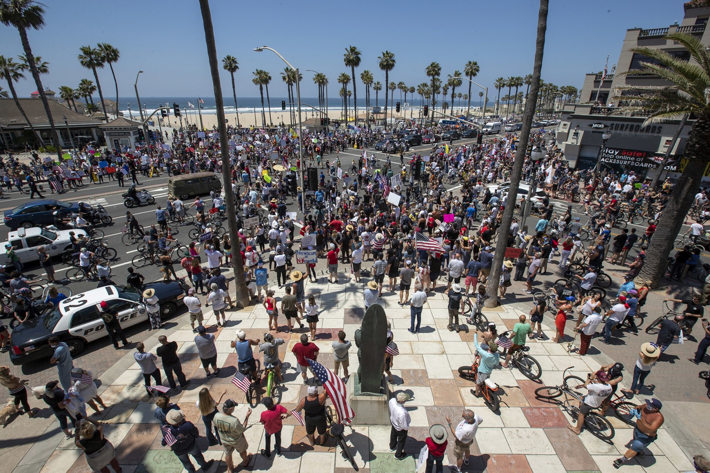

For my Climate Narratives Project, I am interested in examining not just how climate change has manifested in my chosen location, Orange County, California, but how these patterns are (or are not) perceived by the people who live there. How does tension between observed climate trends and the relative perception of their gravity by residents create a reinforcing feedback loop, to use Bennett’s term? 

## Drawing Back the Orange Curtain

Today, California is often considered a Democratic bastion: not a single Republican leader has been elected in any statewide elected position since 2006, both houses of the California Congress currently host Democratic supermajorities, Hillary Clinton defeated Donald Trump in 2016 in California by winning an overwhelming 62% of the vote (McGhee 2020). Despite a perceived Democratic consensus in California, Orange County, longtime home of former Republican President Richard Nixon, has long refused this portrait. Only a year ago, in August 2019, the number of registered Democratic voters in Orange County surpassed the number of registered Republicans for the first time since 1978 (Mehta 2019). This significant change occurred shortly after another political transition in 2018, in which all Orange County Congressional Districts elected Democratic Representatives for the first time since the 1930s (Barabak 2019). Similarly, Franklin D. Roosevelt was the last Democratic Presidential Candidate to win Orange County before 2016, when Democratic Candidate Hillary Clinton received the majority of the county's vote (Mehta 2019).

As a historically politically and socially contentious region, Orange County has long served as a battleground for political discourse revolving around several extreme (usually far-right) ideologies:

•	Orange County was identified as a case study for the rise of the new right in the 1960s, including by Harvard Professor Lisa McGirr in her 2001 book Suburban Warriors. Serving as a prominent cite of backlash against the decade's prominent social movements, Orange County was a stronghold for the radical far-right John Birch Society.  

•	Congresspeople from Orange County in the U.S. House of Representatives have served as both national and local symbols of extreme ideology. This can be typified by former U.S. Congressman Dana Rohrabacher, who represented CA-45th, CA-46th and CA-48th in Orange County (as well as CA-42nd in Riverside County) during his thirty year tenure in Congress from 1989 to 2013 and who was an adamant denier of climate change. 

•	From 2014 to 2015, there were 58 reported cases of measles in Orange County (Orange County Public Health Services 2019). This comprised nearly half of the observed cases, 125, during an outbreak in California which lasted from December 28, 2014 to February 8, 2015 (Zipprich 2015). Strong opposition to vaccines by some residents of Orange County combined with the high volume of crowds in Disneyland, located in the Orange County city Anaheim, were considered primary factors in the causality and spread of the outbreak.  

•	Orange County repeatedly made national news throughout the ongoing COVID-19 pandemic as protesters converged to demonstrate against the California shut-down procedures mandated as part of public health guidelines. In Huntington Beach, a city in south Orange County, the number of demonstrators projected as 2,500 during a protest on May 1 (Sclafani 2020) and 1,500 at a similar event on May 9 (Turner 2020).




Likely as a result of its colorful political history, the county’s picturesque beaches frequented by tourists and locals, and the extravagant lifestyles of some wealthy residents featured in reality shows like “The Real Housewives of Orange County,” the sociopolitical identities of Orange County has long been the subject of study and scrutiny. I hope to contribute to this careful evaluation by examining the way observed data on climate science interplays with the social and political structures of a specific area correspond to policy. 

Sources (NOTE: FINISH ENTERING FULL CITATIONS)
https://www.latimes.com/socal/daily-pilot/news/story/2020-05-01/protesters-gather-at-huntington-pier-doubling-down-on-push-to-reopen-california
https://www.latimes.com/socal/daily-pilot/news/story/2020-05-09/protesters-in-huntington-beach-call-for-full-reopen-of-state-nation
https://www.cdc.gov/mmwr/preview/mmwrhtml/mm6406a5.htm
https://www.ochealthinfo.com/phs/about/epidasmt/epi/dip/prevention/measles
https://www.ppic.org/publication/californias-political-geography/


## Regional Data Analysis 

For both maximum temperature and minimum temperature, we can reject the null hypothesis, since the p-value for the slope of the maximum temperature best fit line
is 3.137e-06 and the p-value for the minimum temperature best fit line is < 2.2e-16. This means the likelihood of these data occurring by chance is miniscule.

Examining the slope of the best fit line for the maximum temperature graph reveals that maximum temperature is, on average, changing by -8.057 x 10^-6 ◦ C each year in the coastal region of Orange County represented by the Newport Beach Harbor Station.
This means that maximum temperatures have actually decreased by 0.008057 ◦ C over the last hundred years.


While the decrease in maximum temperatures is slight, data that suggests a decrease in maximum temperatures at all can have disproportionate political implications in Orange County, having the potential to shape the way residents of Orange County perceive the threat, or even reality, of human-caused global climate change. 

This is further complicated by a, still slight, increase in the minimum temperature, which increased by 9.404 x 10^-5 ◦ C per year or 0.009404 ◦ C over the last hundred years. 

Decreasing maximum temperatures and increasing minimum temperatures, however subtle the changes are, presents a portrait of a climate that is becoming more moderate over time. This, too, appears to contradict average projections of climate change impacts, in which the frequency of extreme temperatures and extreme weather events has increased. 

Notably, Orange County's moderate climate, relative to most other places in the world, represents a key feature that draws residents and tourists alike. Since the economy of Orange County centralizes around its tourism indusry, on vacationers escaping the more extreme temperatures of even remarkably temperate areas just an hour's drive from the coast of the Pacific Ocean (such as Los Angeles), increasingly moderate temperatures in Orange County may seem even advantageous. 


```{r cars}
 # file.choose()
# read.csv("/home/CAMPUS/ikea2019/Climate_Change_Narratives/Student_Folders/Evans/IsabelEvans_OrangeCounty_data.csv")
climate_data <- read.csv("/home/CAMPUS/ikea2019/Climate_Change_Narratives/Student_Folders/Evans/IsabelEvans_OrangeCounty_data.csv")
# head(climate_data)
# str(climate_data)
# names(climate_data)
# climate_data$TMAX
# plot(TMAX~DATE, climate_data)
# min(climate_data$TMAX)
strDates <- as.character(climate_data$DATE)
climate_data$NewDate <- as.Date(strDates, "%Y-%m-%d")
plot(TMAX~NewDate, climate_data, ty='l')
bestfitline.lm=lm(TMAX~NewDate, climate_data)
summary(bestfitline.lm)
plot(TMAX~NewDate, climate_data)
abline(coef(bestfitline.lm), col="chartreuse")
plot(TMIN~NewDate, climate_data)
abline(coef(bestfitline.lm), col="chartreuse")


# xlim = c(1921-1-1, 2020-9-2)
#ylim = c(-10, 50)
# plot(TMAX~DATE, climate_data)

# (TMAX.lm.sum = summary(lm(TMAX ~ NewDate, data=climate_data)))


# (TMIN.lm.sum = summary(lm(TMIN~NewDate,data=climate_data)))


```


