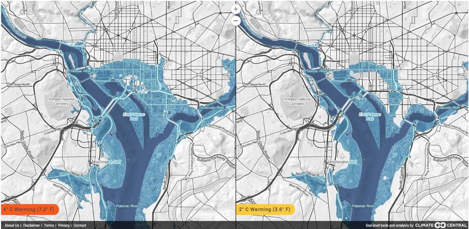

```{r setup, include=FALSE}
knitr::opts_chunk$set(echo = TRUE)
```


Washington DC, the nation’s capital, is situated geographically on the eastern fall line. Although it is often called a swamp for its hot, humid summers (and slow-moving politics), the city is actually in a humid subtropical climate, with pleasant springs and autumns and cold winters. However, since 1948 the climate of DC has changed, and it will likely continue to change in the future.

This blog’s analysis draws on daily temperature maximum (TMAX) and daily temperature minimum (TMIN). The National Arboretum gathered these records between 1948 and 2020 and I obtained the data through the NOAA National Climate Datacenter. For the TMAX and TMIN analyses, I had to change date formats, and, when plotting trends across different months, I had to aggregate months and years. Among these analyses, significant correlations were not found for TMAX, but strong correlations were found for TMIN changes, particularly during DC summers. These increases will worsen human health, harm ecosystem health, and destroy DC property due to rising tides. But first, I will discuss how TMIN and potential TMAX correlations were assessed.

#### TMIN Increases 1948-2020

```{r TMIN plot, echo=FALSE}
file.path = "/home/CAMPUS/jagc2019/Climate_Change_Narratives/Data/FA20/JacobGreene_WashingtonDC_Data.csv"
climate_data <- read.csv(file.path)
strDates <- as.character(climate_data$DATE)
climate_data$NewDate <- as.Date(strDates, "%Y-%m-%d")
plot(TMIN~NewDate, climate_data,type='l', main= "Washington D.C. Daily TMIN vs Time", xlab= "Time ", ylab= "Daily Temperature Minimums (C°)", pch=19, cex=0.5)
TMINbestlinefit.lm=lm(TMIN~NewDate, data = climate_data)
abline(coef(TMINbestlinefit.lm), col= "red",lwd=2)
```
  
The graph above illustrates how July TMINs have significantly (p-value= 3.94e-06) increased from 1948 to 2020. According to the slope of .033, over a 100-year span, average TMINs in July would increase by 3.3 degrees Celsius. This trend follows similarly for all other summer months: months May to August had p values less than .0005, and Months September and April had p values less than .05. Furthermore, the average TMIN warming over 100 years between April and September was 3.1 degrees Celsius. A 2015 report by Katherine Hayhoe and Anne Stoner for the DC Department of Energy and Environment corroborates this summer TMIN increase (Hayhoe et al., 2015). To produce their results, the authors reviewed. In addition to the National Arboretum data I used, the authors three DC weather stations (including the National Arboretum data I used). They used this historical data and predicted emission trends to simulate climate change projection models for the region. In terms of TMIN, the authors projected that by 2100, TMINs likely will increase between 4.4 and 5.5 degrees Celsius (Hayhoe et al., 2015).No Significant TMAX changes 1948-2020.

```{r TMIN July, echo=FALSE}
climate_data$Month = format(as.Date(climate_data$NewDate),format="%m")
climate_data$Year = format(as.Date(climate_data$NewDate),format= "%Y")
MonthlyTMINMean = aggregate(TMIN~Month+Year,climate_data,mean)
MonthlyTMINMean$YEAR= as.numeric(MonthlyTMINMean$Year)
MonthlyTMINMean$MONTH= as.numeric(MonthlyTMINMean$Month)
plot(TMIN~YEAR, data = MonthlyTMINMean[MonthlyTMINMean$Month=="07",],main= "Average Mininimum Temperatures in Select Months vs Time", xlab= "Time", ylab= " Average Temperature Minimums (C°)", pch=19, cex=0.5, col= "red", ylim=c(8,26))
JulTMIN.lm <- lm(TMIN~YEAR, data = MonthlyTMINMean[MonthlyTMINMean$Month=="07",])
abline(coef(JulTMIN.lm),col= "red",lwd=2)

points(TMIN~YEAR, data = MonthlyTMINMean[MonthlyTMINMean$Month=="09",], pch=19, cex=0.5, col="orange")
SepTMIN.lm <- lm(TMIN~YEAR, data = MonthlyTMINMean[MonthlyTMINMean$Month=="09",])
abline(coef(SepTMIN.lm),col= "orange",lwd=2)

points(TMIN~YEAR, data = MonthlyTMINMean[MonthlyTMINMean$Month=="05",], pch=19, cex=0.5, col="green")
MayTMIN.lm <- lm(TMIN~YEAR, data = MonthlyTMINMean[MonthlyTMINMean$Month=="05",])
abline(coef(MayTMIN.lm),col= "green",lwd=2)

legend("topleft", legend=c("July","September","May"),
       col=c("red","orange","green"), lty=1, cex=0.7)
summary(MayTMIN.lm)
summary(JulTMIN.lm)
summary(SepTMIN.lm)
```
[May: pvalue<.001,adjusted r2=.15, July: pvalue<.001, adjusted r2=.26, September: pvalue<.01, adjusted r2=.01]
```{r}
Months = c("January", "February", "March", "April", "May", "June", "July", "August", "September", "October", "November", "December")
par(mfrow=c(4,3), mar=c(5, 4, 3, 2) + 0.1)
TMINresult <- NA
for (i in 1:12){
  plot(TMIN~YEAR, data=MonthlyTMINMean[MonthlyTMINMean$MONTH==i,], ty='l', las=1, xlim=c(1948, 2020), main=Months[i])
  TMINMonth.lm <- lm(TMIN~YEAR, data=MonthlyTMINMean[MonthlyTMINMean$MONTH==i,])
  summary(TMINMonth.lm)
  abline(coef(TMINMonth.lm), col="red")
  TMINresult <- rbind(TMINresult, cbind(Months[i], round(coef(TMINMonth.lm)[2], 4),round(summary(TMINMonth.lm)$coefficients[2,4],4),round(summary(TMINMonth.lm)$r.squared, 3)))
}
```


```{r,results="asis"}

Results<-data.frame(Month=TMINresult[c(2:13),1],TMINSlope=TMINresult[c(2:13),2], TMIN_P=as.numeric(TMINresult[c(2:13),3]),
TMINRsq=TMINresult[c(2:13),4],TMAXSlope=TMAXresult[c(2:13),2],TMAX_P=as.numeric(TMAXresult[c(2:13),3]),
TMAXRsq=TMAXresult[c(2:13),4])

Results$starTMIN="NS"
Results$starTMIN[Results$TMIN_P<=.05]="*"
Results$starTMIN[Results$TMIN_P<0.01]="**"
Results$starTMIN[Results$TMIN_P<0.001]="***"
Results$starTMAX="NS"
Results$starTMAX[Results$TMAX_P<0.05]="*"
Results$starTMAX[Results$TMAX_P<0.01]="**"
Results$starTMAX[Results$TMAX_P<0.001]="***"
Results$TMINslope=paste(Results$TMINSlope,Results$starTMIN)
Results$TMAXslope=paste(Results$TMAXSlope,Results$starTMAX)
colnames(Results)<-c("Month","2","3","R^2","5","6","R^2","8","9", "SlopeTMIN","SlopeTMAX")

library(xtable)
print(xtable(Results[,c(1,10, 4,11,7)]), type = "html")

```
points(TMIN~YEAR, data = MonthlyTMINMean[MonthlyTMINMean$Month=="06",], pch=19, cex=0.5, col="orange")
JunTMIN.lm <- lm(TMIN~YEAR, data = MonthlyTMINMean[MonthlyTMINMean$Month=="06",])
abline(coef(MayTMIN.lm),col= "orange",lwd=2)

The graph above illustrates how July TMINs have significantly (p-value= 3.94e-06) increased from 1948 to 2020. According to the slope of .033, over a 100-year span, average TMINs in July would increase by 3.3 degrees Celsius. This trend follows similarly for all other summer months: months May to August had p values less than .0005, and Months September and April had p values less than .05. Furthermore, the average TMIN warming over 100 years between April and September was 3.1 degrees Celsius. A 2015 report by Katherine Hayhoe and Anne Stoner for the DC Department of Energy and Environment corroborates this summer TMIN increase(Hayhoe et al., 2015). From synthesizing several climate change projections and two other DC weather stations in addition to the National Arboretum data I used, the authors projected that by 2100, TMINs likely will increase between 4.4 and 5.5 degrees Celsius(Hayhoe et al., 2015).
  
  
#### No Significant TMAX changes 1948-2020


```{r, TMAX plot, echo=FALSE}
plot(TMAX~NewDate, climate_data,type='l', main= "D.C. Daily Temperature Maximums vs Time", xlab= "Time", ylab= "Daily Temperature Maximums (C°)")
bestfitline.lm = lm(TMAX~NewDate, data = climate_data)
abline(coef(bestfitline.lm), col="red", lwd=2)
```

This graph illustrates daily TMAX values from 1948 until 2020 but was not significant (p value= .789). Although my analysis did not produce convincing results, Hayhoe and Stoner’s projections indicate that summer temperature maximums, days with the extreme heat index, and heatwaves will all increase. Like their prediction for TMINs, the authors predict that summer TMAXs will increase between 4.4° and 5.5° Celsius. In their analysis, heatwaves are expected to occur more frequently, last longer, and be more severe (Hayhoe et. al, 2015).

#### Possible Misinterpretations of the Analysis

To avoid possible misinterpretations, it is important to note that historical warming is not necessarily a result of climate change. There are other variables at play. For example, since 1950, Washington DC forest canopy has gone from covering more than 50% of the city to now only covering 39% (Harden, 2020) The decrease in trees likely has led to increased heat because trees are good regulators of hot air. Even though the city has committed to increasing forest cover, efforts have proved more difficult than expected, especially because most DC property is private. While climate change cannot be singled out as the single historical reason for DC warming trends, climate change models, like the ones presented by Hayhoe and Stoner, suggest that carbon emissions going forward will increase DC’s temperature.

The data is also not perfect. For example, the equipment used between 1948 and 1989 is unknown to NOAA. Therefore, we do not know the accuracy of the instruments for 41 years of our data. Within the known equipment used, there have been eight equipment changes since 1989. Temperature measurements can vary marginally because of different equipment. Therefore, we cannot be sure that the data is 100% accurate. Lastly, from 1989 to 2001, the station recorded data at one hour earlier than other dates (at 7 am as opposed to 8 am). Earlier measurement times could impact the temperature that is calculated. Because of these uncertainties, the data should be taken with a grain of salt. That being said, our overall correlations are supported by regional models as well as by two other DC weather stations (Hayhoe et al., 2015). Because of this evidence, DC needs to assess warming ramifications.

#### Implications

Increasing temperature minimums and potentially increasing temperature maximums will have profound public health implications. Perhaps most significantly, higher minimum and maximum temperatures contribute to higher heat-related hospitalizations and mortalities (Choudhary et al., 2014; Gregory, 2018). Wealthy white communities are often covered by trees, have access to AC, and benefit from lower rates of heart problems. Homeless people and less privileged communities do not (Gregory, 2018). One study finds that from analyzing tree cover alone, black residents were 50% more susceptible to the health implications of hot summer days and nights (Jesdale, 2013). Without proper environmental justice policy action, the consequences of warming will likely perpetuate existing inequalities in the district.

Like for humans, increasing heat can lead to worsened ecosystem health. A recent study looked at 581 species at 532 sites around the world and correlated local extinctions with heat. They found that the 44% local extinction rate of these species was correlated strongly with an increase in temperature on the hottest days of the year (Román-Palacios et.al, 2019). An increase in tree mortality could serve as positive feedbacks to worsen heat effects because of the loss of their heat regulation mechanisms. Shifting flowering dates could also hurt DC’s ecosystems. In the capital, cherry blossoms, which are good indicators for other spring blossoms, are flowering earlier (Chung et al., 2011). In a study of two Washington DC native perennial wildflowers, flowering earlier than historic times decreased both the average effectiveness of pollinators and the expected rates of pollinator success (Rafferty, 2012). Therefore, changing flowering times (perhaps due to temperature changes) in the district could impact plant the region’s species (Rafferty, 2012). There may be a few silver linings. For example, ragweed seasons, which contribute to hay fever and seasonal allergies and are common in DC, are expected to shorten in the area (Case, 2018). However, for the most part, increasing temperatures will hurt DC flora and fauna as well as all of the ecosystem benefits they provide for residents.

Although global sea-level rise due to thermal expansion and melting sea ice is not directly part of this analysis, sea-level rise is important to note in this blog because of its implications for flooding and property damage in Washington DC. The following map, produced by researchers for the non-profit Climate Central, shows potential high tide lines for Washington DC depending on different warming scenarios.




In the district, 5,000 people live in nearly 2,000 homes that are ten feet or less above the current high tideline. This area has property worth a total of $9 billion and 26 EPA listed sites (including hazardous waste dumps and sewage sites). These areas would be severely harmed due to the effects of global sea-level rise.

#### Activists in DC

Global warming activism in DC has mostly been directed towards the federal government. Justifiably so. Washington DC is not the place that will be most hurt (although hopefully, this analysis is convincing enough that the environmental harms are great), and, in general, pressuring the federal government has given the US some of the biggest environmental wins in US history. For example, the Clean Air Act and Clean Water Act in the 1970s. Perhaps because of these wins, DC protests have revolved around federal action such as the Green New Deal

Like local activists, the DC government has pursued climate activism even if historically they have often failed to do so. For example, the Department of Energy and Environment has pledged to reduce emissions by 50% by 2032 and reach carbon neutrality by 2050 (DOEE, 2020). That being said, historically, the DC government has failed to act on environmental issues. For example, the government failed to regulate tree loss in the district that has likely led to greater heat and runoff problems (Harden, 2020).

At the end of the day, residents will have to face rising minimum summer temperatures, summer maximum temperatures, and tides that are exacerbated by climate change. Activists need to continue to pressure the DC and the federal government to enact concrete policy action to decrease the dangers of climate change. We should demand measures that will protect the health of residents and ecosystems. ronmental education efforts to curb illegal tree removal (Harden, 2020). Perhaps most importantly, we need to demand that environmental justice frameworks are implemented. Minority and low-income communities should not have to face the heaviest impacts of climate change. Although the realities of climate change are often bleak, with engaged residents at a local level, there is hope that these issues will be addressed.

#### Citations

1. Case, M. J., & Stinson, K. A. (2018). Climate change impacts on the distribution of the allergenic plant, common ragweed (Ambrosia artemisiifolia) in the eastern United States. Plos One, 13(10). doi:10.1371/journal.pone.0205677
2. Chung, U., Mack, L., Yun, J. I., & Kim, S. (2011). Predicting the Timing of Cherry Blossoms in Washington, DC and Mid-Atlantic States in Response to 3. Climate Change. PLoS ONE, 6(11). doi:10.1371/journal.pone.0027439
3. Department of Energy & Environment: Environmental Services. (n.d.). Retrieved September 27, 2020, from https://doee.dc.gov/service/environmental-services
4. Gregory, N. (2018, September 05). How Hotter Nights Hurt Your Health. Retrieved September 27, 2020, from https://www2.calstate.edu/csu-system/news/Pages/Rise-in-nighttime-temperatures-and-health.aspx
5. Harden, J. (2020, March 27). D.C. planted nearly 80 trees a day to reach a canopy target. It's running out of space. Retrieved September 27, 2020, from https://www.washingtonpost.com/dc-md-va/2020/03/27/tough-place-tree-live-dc-planted-nearly-80-trees-day-reach-canopy-target-its-running-out-space/?arc404=true
6. Hayhoe, K., & Stoner, A. (2015, April). Climate Change Projections for the District of Columbia (Rep.). Retrieved https://doee.dc.gov/sites/default/files/dc/sites/ddoe/publication/attachments/Attachment%201%20.ARC_.Report_07-10-2015.pdf
7. Jesdale, B. M., Morello-Frosch, R., & Cushing, L. (2013). The Racial/Ethnic Distribution of Heat Risk–Related Land Cover in Relation to Residential Segregation. Environmental Health Perspectives, 121(7), 811-817. doi:10.1289/ehp.1205919
8. Rafferty, N. E., & Ives, A. R. (2012). Pollinator effectiveness varies with experimental shifts in flowering time. Ecology, 93(4), 803-814. doi:10.1890/11-0967.1
9. Strauss, B., C. Tebaldi, S. Kulp, S. Cutter, C. Emrich, D. Rizza, and D. Yawitz (2014). Washington, D.C. and the Surging Sea: A vulnerability assessment with projections for sea level rise and coastal flood risk. Climate Central Research Report. pp 1-28. 
10. Washington DC Climate. (n.d.). Retrieved September 27, 2020, from http://www.city-data.com/us-cities/The-South/Washington-D-C-Geography-and-Climate.html

