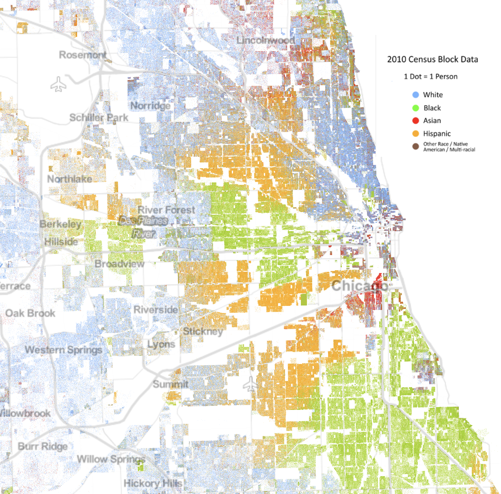

``` {r setup, include=FALSE}
knitr::opts_chunk$set(echo = FALSE)
library(htmlTable)
library(tidyverse)
library(bootstraplib)
library(ggplot2)
data(diamonds) 
significance_star <- function(input_vector) { # create a function to auto"magically" assign asterisk values corresponding to the significance level observed in the month-by-month TMAX or TMIN outputs; it takes input_vector as its only argument
  out_star_vec <- dplyr::case_when( # create an output object (out_star_vec) using the case_when function from the dplyr package
    input_vector <= 0.001 ~ "***", # assign 3 asterisks to lowest arbitrary threshold of significance
    input_vector <= 0.01 & input_vector > 0.001 ~ "**",
    input_vector <= 0.05 & input_vector > 0.01 ~ "*",
    TRUE ~ "NS" # give the non-significant marker of NS for all other values greater than 0.05
  )
  return(out_star_vec) # ?return for more details
}
```


### Overview:
How is Chicago’s climate changing? How will this interact with the fact that it is an Urban Heat Island? This blog is intended to analyze temperature trends in Chicago and investigate how these trends work towards proving a pattern of warming resulting from anthropogenic effects on the planet. In addition, it will examine how the Urban Heat Island effect is distributed across Chicago, how it can worsen effects of climate change, and how activists can address both environmental inequality and mitigation of warming.


### Chicago:
The third most populous US city, Chicago is home to a population of around 2.7 million people. It is a hub of finance and transportation and boasts some of the country’s tallest skyscrapers. The climate is continental, with cold winters and warm summers. 
Chicago is an “Urban Heat Island” or UHI. This term refers to the fact that more densely populated areas experience higher temperatures than rural areas. This is a result of the sun’s rays being absorbed by the concentration of buildings and other infrastructure, the greater emission of gases from industry and cars, and the lack of green spaces that absorb these emissions. This means that Chicago is already hotter than surrounding rural areas, and rising temperatures present a possibility of worsening the effect.


<center>
 </center>


### What Effects will Rising Temperature Have on Chicago?
Upon conducting a literature review, I found reports of projected effects of global warming and climate change on the city. These effects have ecological, economic, and social impacts on the city of Chicago. As a result of rising temperature, weather events including heatwaves, more heavy precipitation and long-term decreases in snowfall are projected (Hayhoe et. al, 2010). Many Chicagoans remember the 1995 heat wave. Around 700 people were killed as a result of the record temperatures. Health problems such as heat stress, exposure to insect-borne illness, and respiratory afflictions resulting from poor air quality are also possible (Patz et. al, 2014). In addition to humans, plants and animals can be affected by changing temperatures, with crop yields fluctuating. Warming can even have economic implications on the city, from property damaged by weather events to healthcare costs. 


### Methodology:
First, to look for warming trends I used R to analyze data from the NOAA National Centers for Environmental Information datasets (https://www.ncdc.noaa.gov/cdo-web/datasets). I chose to use the Midway Airport station as it has data reaching back to the 1920s, and out of the stations monitoring Chicago temperature and weather it has the greatest coverage, based on the range and extensiveness of the data.
I also conducted a literature review to learn more about the UHI in Chicago, how heat is distributed across the city, and how rising temperatures will pose threats to those in the areas with the most heat exposure.


```{r readdata, echo=FALSE}
# Olivia, you'll want to use choose.file() to find your path and paste it below, then uncomment it so it over-writes mine...
#file.choose()
filepath = "/home/CAMPUS/ocma2018/Climate_Change_Narratives/Data/FA20/olivia_chicagomidway_data.csv"
climate_data = read.csv(filepath) 
strDates <- as.character(climate_data$DATE)
climate_data$NewDate <- as.Date(strDates, "%Y-%m-%d")
```

```{r plotdailydata, echo=FALSE, include=FALSE}
plot(TMAX~NewDate, data=climate_data, ty='l', xlab='Year', ylab='Max Temp (C˚)')
TMAX.lm = lm(TMAX ~ NewDate, data=climate_data) 
slopeintercept = coef(TMAX.lm)
abline(coef(TMAX.lm), col = 'pink') 
lm(TMAX ~ NewDate, data=climate_data)
lm(TMAX ~ NewDate, data=climate_data)
TMAX.lm = lm(TMAX ~ NewDate, data= climate_data)
slopeintercept = coef(TMAX.lm)
```
``` {r dailybyyear, include=FALSE}
plot(TMAX ~ NewDate, data= climate_data, type='l', las=1, xlab="Year", ylab = "Temperature (°C)")
abline(slopeintercept, col="pink", lwd=3)
#(TMAX.lm.sum = summary(lm(TMAX ~ NewDate, data=climate_data)))
climate_data$Month = format(as.Date(climate_data$NewDate), format = "%m")
climate_data$Year = format(climate_data$NewDate, format="%Y")
MonthlyTMAXMean = aggregate(TMAX ~ Month + Year, climate_data, mean)
MonthlyTMAXMean$YEAR = as.numeric(MonthlyTMAXMean$Year)
MonthlyTMAXMean$MONTH = as.numeric(MonthlyTMAXMean$Month)
#str(MonthlyTMAXMean)
#summary(TMAX.lm)
```

```{r plotmonthbymonth, echo=FALSE}
#plot(TMAX~YEAR, data=MonthlyTMAXMean[MonthlyTMAXMean$Month=="05",],
#ty='l', xlab="Year", ylab="Max Temp (C˚)", xlim=c(1950, 2020))
#May.lm <- lm(TMAX~YEAR, data=MonthlyTMAXMean[MonthlyTMAXMean$Month=="05",])
#summary(May.lm)
#abline(coef(May.lm), col="red")
#Months = c("January", "February", "March", "April",
#"May", "June", "July", "August", "September", "October",
#"November", "December")
par(mfrow = c(4, 3), mar = c(2, 2, 2, 2) + 0.1) 
TMAXresult <- NA 
for (i in 1:12) {
plot(TMAX ~ YEAR, data = MonthlyTMAXMean[MonthlyTMAXMean$MONTH ==
i, ], ty = "l", las = 1, xlab="Year", ylab = "Temperature (°C)", xlim = c(1940, 2020),
main = Months[i])
Month.lm <- lm(TMAX ~ YEAR, data = MonthlyTMAXMean[MonthlyTMAXMean$MONTH ==
i, ])
#summary(Month.lm)
abline(coef(Month.lm), col = "red")
TMAXresult <- rbind(TMAXresult, cbind(Months[i], round(coef(Month.lm)[2], 4), round(summary(Month.lm)$coefficients[2,4], 4), round(summary(Month.lm)$r.squared,3)))
}
```
```


```{r max temp, echo=FALSE, fig.width=15, fig.height=6, fig.cap="Figure 1. Maximum Temperatures for March and July.", fig.align="center"}
par(mfrow=c(1,2))
i <- 3
MonthlyTMAXMean = aggregate(TMAX ~ Month + Year, climate_data, mean)
MonthlyTMAXMean$Month <- as.numeric(MonthlyTMAXMean$Month)
MonthlyTMAXMean$Year <- as.numeric(MonthlyTMAXMean$Year)
plot(TMAX ~ Year, data = MonthlyTMAXMean[MonthlyTMAXMean$Month == i, ], pch=8, cex=0.5, las=1, xlab="Year", ylab = "Temperature (°C)", xlim = c(1940, 2020), main = Months[i])
  TMAXMonth.lm <- lm(TMAX ~ Year, data = MonthlyTMAXMean[MonthlyTMAXMean$Month == i, ])
  #summary(TMAXMonth.lm)
  abline(coef(TMAXMonth.lm), col = "red")
 TMAXresult <- NULL
TMAXresult <- rbind(TMAXresult, cbind(Months[i], round(coef(TMAXMonth.lm)[2], 4), round(summary(TMAXMonth.lm)$coefficients[2, 4], 4), round(summary(TMAXMonth.lm)$r.squared,3)))
#TMAXresult
i <- 7
MonthlyTMAXMean = aggregate(TMAX ~ Month + Year, climate_data, mean)
MonthlyTMAXMean$Month <- as.numeric(MonthlyTMAXMean$Month)
MonthlyTMAXMean$Year <- as.numeric(MonthlyTMAXMean$Year)
plot(TMAX ~ Year, data = MonthlyTMAXMean[MonthlyTMAXMean$Month == i, ], pch=8, cex=0.5, las=1, xlab="Year", ylab = "Temperature (°C)", xlim = c(1940, 2020), main = Months[i])
  TMAXMonth.lm <- lm(TMAX ~ Year, data = MonthlyTMAXMean[MonthlyTMAXMean$Month == i, ])
  #summary(TMAXMonth.lm)
  abline(coef(TMAXMonth.lm), col = "red")
TMAXresult <- NULL
TMAXresult <- rbind(TMAXresult, cbind(Months[i],round(coef(TMAXMonth.lm)[2], 4), round(summary(TMAXMonth.lm)$coefficients[2, 4], 4), round(summary(TMAXMonth.lm)$r.squared,3)))
#TMAXresult
```


```{r plottmin, echo=FALSE, include=FALSE}
MonthlyTMINMean = aggregate(TMIN ~ Month + Year, climate_data, mean)
MonthlyTMINMean$YEAR = as.numeric(MonthlyTMINMean$Year)
# Fixing the Format of Month and Year as numeric
MonthlyTMINMean$YEAR = as.numeric(MonthlyTMINMean$Year)
MonthlyTMINMean$MONTH = as.numeric(MonthlyTMINMean$Month)
head(MonthlyTMINMean)
#library(xtable)
### 3.1: Specifying plotting window parameters
#par(mfrow = c(4, 3), mar = c(5, 4, 1, 1) + 0.1) 
 # TMINresult <- NULL 
#for (i in 1:12) { 
#Month_sub_DF <- MonthlyTMINMean[MonthlyTMINMean$MONTH==i, ] 
#MonthMin_lm <- lm(TMIN ~ YEAR, data=Month_sub_DF)
#TMINresult <- rbind(TMINresult, cbind(Months[i], round(coef(MonthMin_lm)[2], 3), round(summary(MonthMin_lm)$coefficients[2,4], 3), round(summary(MonthMin_lm)$r.squared, 2)))
  #plot(TMIN~YEAR,data=Month_sub_DF, type='l', ylab='Min T (*C)', xlab='Years',main=Months[i], bty="L", las=1) 
# abline(coef(MonthMin_lm),col="pink") 
#}
```


```{r min temp, echo=FALSE, fig.width=15, fig.height=6, fig.cap="Figure 2. Minimum Temperatures for August and November", fig.align="center"}
par(mfrow=c(1,2))
i <- 8
MonthlyTMINMean = aggregate(TMIN ~ Month + Year, climate_data, mean)
MonthlyTMINMean$Month <- as.numeric(MonthlyTMINMean$Month)
MonthlyTMINMean$Year <- as.numeric(MonthlyTMINMean$Year)
plot(TMIN ~ Year, data = MonthlyTMINMean[MonthlyTMINMean$Month == i, ], pch=8, cex=0.5, las=1, xlab="Year", ylab = "Temperature (°C)", xlim = c(1940, 2020), main = Months[i])
  TMINMonth.lm <- lm(TMIN ~ Year, data = MonthlyTMINMean[MonthlyTMINMean$Month == i, ])
  #summary(TMINMonth.lm)
  abline(coef(TMINMonth.lm), col = "red")
 TMINresult <- NULL
  TMINresult <- rbind(TMINresult, cbind(Months[i], round(coef(TMINMonth.lm)[2], 4), round(summary(TMINMonth.lm)$coefficients[2, 4], 4), round(summary(TMINMonth.lm)$r.squared,3)))
#TMINresult
  i <- 11
MonthlyTMINMean = aggregate(TMIN ~ Month + Year, climate_data, mean)
MonthlyTMINMean$Month <- as.numeric(MonthlyTMINMean$Month)
MonthlyTMINMean$Year <- as.numeric(MonthlyTMINMean$Year)
plot(TMIN ~ Year, data = MonthlyTMINMean[MonthlyTMINMean$Month == i, ], pch=8, cex=0.5, las=1, xlab="Year", ylab = "Temperature (°C)", xlim = c(1940, 2020), main = Months[i])
  TMINMonth.lm <- lm(TMIN ~ Year, data = MonthlyTMINMean[MonthlyTMINMean$Month == i, ])
  #summary(TMINMonth.lm)
  abline(coef(TMINMonth.lm), col = "red")
#TMINresult <- NULL
# TMINresult <- rbind(TMINresult, cbind(Months[i], round(coef(TMINMonth.lm)[2], 4), round(summary(TMINMonth.lm)$coefficients[2, 4], 4), round(summary(TMINMonth.lm)$r.squared,3)))
#TMINresult
```


### Data Results:


### How are Different Areas of the City Affected by Increased Temperatures?


<center>
{ width=200, height=350 } {width=200, height=350} </center>


### Where Does Climate Activism Come into Play?


### Takeaways:


### In Conclusion...


<center>
{width=400} </center>


## References:

* Bennett, J. O. (2016). A global warming primer: Answering your questions about the science, the consequences, and the solutions. Boulder, CO: Big Kid Science.
CMAP. (2013, June). Appendix A: Primary Impacts of Climate Change in the Chicago Region. Retrieved September 23, 2020, from https://www.cmap.illinois.gov/documents/10180/14193/Appendix+A+-+Primary+Impacts+of+Climate+Change+in+the+Chicago+Region.pdf/2a85b021-f3bd-4b98-81d1-f64890adc5a7

* Carbon Dioxide Concentration. (2020, September 17). Retrieved September 26, 2020, from https://climate.nasa.gov/vital-signs/carbon-dioxide/

* Hayhoe, K., Vandorn, J., Croley, T., Schlegal, N., & Wuebbles, D. (2010). Regional climate change projections for Chicago and the US Great Lakes. Journal of Great Lakes Research, 36, 7-21. doi:10.1016/j.jglr.2010.03.012

* National Centers for Environmental Information (NCEI). (n.d.). Daily Summaries Location Details. Retrieved September 2, 2020, from https://www.ncdc.noaa.gov/cdo-web/datasets/GHCND/locations/CITY:US170006/detail

* Patz, J. A., Frumkin, H., Holloway, T., Vimont, D. J., & Haines, A. (2014). Climate change: challenges and opportunities for global health. JAMA, 312(15), 1565–1580. https://doi.org/10.1001/jama.2014.13186

* R. Alfraihat, G. Mulugeta, and T. S. Gala, “Ecological Evaluation of Urban Heat Island in Chicago City, USA.” Journal of Atmospheric Pollution, vol. 4, no. 1 (2016): 23-29. doi: 10.12691/jap-4-1-3

* US EPA. (n.d.). Retrieved September 27, 2020, from https://climatechange.chicago.gov/climate-impacts/climate-impacts-midwest
Vegetation Limits City Warming Effects. (2015). Retrieved September 27, 2020, from https://earthobservatory.nasa.gov/images/86440/vegetation-limits-city-warming-effects


