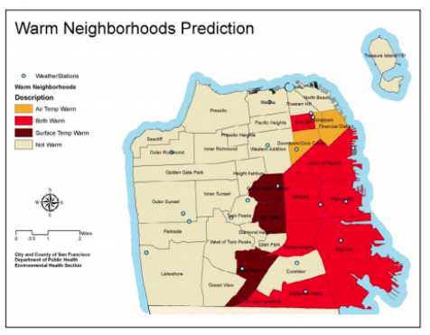
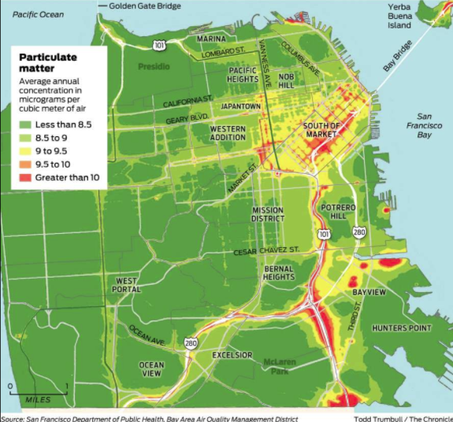

The city of San Francisco is home to 870,000 residents, and is the fourth most populous city in California. Besides being the cultural, commercial and financial center of the larger San Francisco Bay Area, it attracts abundant tourists annually with its temperate climate and mix of landmarks. However, with an increasing trend of record-high temperatures and slowly rising maximum temperatures, climate change has potential threats to many residents of San Francisco. Some of these include heat vulnerability-related illnesses, sea level and coastal change, more extreme weather events, and air pollution. 


#Methodology
So how can we evaluate if San Francisco is warming? 


Using the Climate Data Online (CDO) system, which provides web access to the National Oceanic and Atmospheric Association (NOAA) archived data, I was able to browse through global stations that included weather and climate daily, monthly, and yearly data for temperature, precipitation, wind among others. Daily Data for San Francisco Maximum Temperatures was available from January 1921 to the present, and will be used for this analysis. 

The data will be evaluated through R studio, which will first graph daily and monthly data. Using Linear regression, the best fit line can be estimated. 

In statistics, the null hypothesis is a default position stating that there is no relationship between what is being measured. In this case, there is no relationship between time and temperature. If a relationship is determined, then the null hypothesis would be rejected and the alternate hypothesis would be supported. The alternate hypothesis states there is a relationship between the measured variables. The null hypothesis can be rejected if two things are present in the graphs: if either the slope or the y-intercept are zero. 

The p-value of the data, or the calculated probablity, can indicate the significance of results. A small p-value (≤ 0.05) indicates strong evidence against the null hypothesis, and leads to rejecting the null hypothesis. A large p-value (> 0.05) indicates weak evidence against the null hypothesis, so it leads to failing to reject the null hypothesis.Finally, a p-value of 0 accepts the null hypothesis and means no relationship between the measured variables.  


```{r, echo=FALSE, }
climate_data<-read.csv("/home/CAMPUS/mwew2015/Climate_Change_Narratives/Data/SFclimate_data.csv")

climate_data$TMAX[climate_data$TMAX==-9999]=NA
climate_data$TMIN[climate_data$TMIN==-9999]=NA

strDates<-as.character(climate_data$DATE)

climate_data$NewDate<-as.Date(strDates, "%Y-%m-%d")
#str(climate_data)
#head(climate_data)
``` 


##Daily Data

```{r, echo=FALSE}
plot(TMAX~NewDate, climate_data,ty='l', main = "San Francisco Daily Maximum Temperatures")
lm(TMAX~NewDate, data=climate_data)                             
summary(lm(TMAX~NewDate,data=climate_data)) 

#par(mfrow=c(2,2))
#plot(lm(TMAX~NewDate,data=climate_data))
#plot(TMAX~NewDate,data=climate_data)

abline(coef(lm(TMAX~NewDate,data=climate_data)), col='red')
linearmodel<-lm(TMAX~NewDate,data=climate_data)
```

This graph above is a plot of the daily maximum temperature data in San Francisco, CA. It shows an increasing trend in the temperature data. This is comfirmed by the regression results, which display a positive slope of 5.902e-05 or 0.000059. A p-value of <2e-16, which is below the 0.05 cutoff point and means that the null hypothesis can be rejected. This confirms a positive, or warming, trend in the data. 


##Monthly Data


To assess monthly data, the same process as above will be used. After outputting the p-values of each month, the p-values of interest will determine if any months accept or reject the null hypothesis. 


#Maximum temperatures

The regression results for individual months showed p-values of <0.05 for 7 months, confirming that a trend exists between time and temperature for those months. These months are January, February, ,July, August, September, October and December. The rest of the months showed a p-value of >0.05, so that data could not be used. No monthly data showed a p-value of 0. The months with significant p-values all showed positive slopes, confirming a warming trend in those months.

The slopes and p-values for the months that reject the null hypothesis are as listed:

**January**     slope 0.043  p-value=1.5e^-06

**February**    slope 0.025  p-value=.009

**July**        slope 0.027  p-value=0.0054

**August**      slope 0.038  p-value=9.82e^-5

**September**   slope 0.032  p-value=0.014

**October**     slope 0.0192 p-value=0.03

**December**    slope 0.020  p-value=0.02


As an example of one of these months, December was chosen. It has an increasing slope and a p-value of 0.02. A compressed version of all the months is listed below, which depict a slight upward slopes. 


```{r MAX, echo=FALSE}

climate_data$Month = format(as.Date(climate_data$NewDate), format="%m")
climate_data$Year = format(climate_data$NewDate, format = "%Y")
MonthlyTMAXMean=aggregate(TMAX~Month+Year,climate_data,mean)
MonthlyTMAXMean$YEAR=as.numeric(MonthlyTMAXMean$Year)
MonthlyTMAXMean$MONTH=as.numeric(MonthlyTMAXMean$Month)

str(MonthlyTMAXMean)


plot(TMAX~YEAR, data=MonthlyTMAXMean[MonthlyTMAXMean$Month=="12",],ty='l', xlim=c(1920,2017), main = "December monthly data")
December.lm<-lm(TMAX~YEAR, data=MonthlyTMAXMean[MonthlyTMAXMean$Month=="12",])
summary(December.lm)
abline(coef(December.lm), col="red")


Months=c("January", "February", "March", "April", "May", "June", "July", "October", "November", "December")


par(mfrow=c(4,3), mar=c(5,4,3,2)+0.1)
TMAXresult <- NA
for (i in 1:12){
  
plot(TMAX~YEAR, data=MonthlyTMAXMean[MonthlyTMAXMean$MONTH==i,], ty="l", las=1, xlim=c(1920,2017))
Month.lm <- lm(TMAX~YEAR, data=MonthlyTMAXMean[MonthlyTMAXMean$MONTH==i,])
summary(Month.lm)
abline(coef(Month.lm), col="red")}


```

###Conclusion
The yearly and monthly data results show significance warming temperature trends for the maximum temperatures of San Francisco. The yearly data shows an increasing slope. The monthly data has some months with data that cannot be used to evaluate trends, but 7/12 months confirm an increasing warming trend. These increases can contribute to extreme heat events and can lead to adverse health-related illnesses. 


=====

## Discussion 

San Francisco residents are vulnerable to the effects of climate change. Some of these effects include heat vulnerability-related illnesses, sea level and coastal change, more extreme weather events, and air pollution. This blog tries to address which areas of the city are more affected due to their natural and built environments, and the communities that are most vulnerable who live in these areas. 


The San Francisco Department of Public Health, funded by the Center for Disease Control and Prevention (CDC) assesses San Francisco’s vulnerability to extreme heat events. The brink of what is considered an “extreme heat day” varies based on the historical average temperatures of the place being analysed. According to a synthesis of climate change impacts in the San Francisco Bay Area done for the California Energy Commission, the temperatures in the high 70s in coastal areas, including San Francisco, are considered extreme heat days, which are lower compared to the extreme heat day thresholds for more inland areas. However, this means that the number of days above these thresholds can be much greater for these coastal areas. For San Francisco, these days are expected to increase dramatically (Ekstrom). 


Figure 1. Graph of the number of extreme heat days comparing coastal city of San Francisco and inland city of Livermore 

Extreme heat events can have a negative impacts on human health, including general vulnerability to mortality, vulnerability to heat-based mortality, and respiratory and cardiovascular damages. Despite San Francisco’s temperate degree of average extreme weather limits, the increase in frequency of the extreme weather events can have a damaging effect on the population due to the lack of physiologic and technological foundations. For example, the housing infrastructure is less likely to have air conditioning due to its cooler climate. These illnesses also happen due to the lower tolerance levels of populations accustomed to these cooler climates: the damaging consequences can happen during the average two weeks that human biology takes to adapt to temperature extremes and thermoregulate (CDC). 

Low income, elderly, and disabled people are more vulnerable to heat-related mortality. Surface and air temperature data was collected through remote sensing data, which found that the most heat-affected areas are in the more inland areas and areas away from the coast. The coolest areas were found to be the ones near sources of water and vegetation. The neighborhoods that were most vulnerable to extreme heat events were most correlated with residents subject to socioeconomic vulnerability. This suggests that low socioeconomic status have the greatest adverse effect on being able to respond to heat events. Site factors that correlated with the areas that are most exposed to heat include areas that have no vegetation or green spaces, are downtown or have diverse land use, heavy traffic, and low air quality. 



Figure 2 Map that depicts the neighborhoods most susceptible to extreme heat


A secondary effect of temperature rise and heat waves is the worsening of air pollution problems. Air pollution can have adverse respiratory and cardiovascular effects. Higher temperatures lead to increases in pollutants such as particulate matter and nitrogen dioxide, as well as boost smog. San Francisco’s safety threshold for particulate matter is 10 micrograms per cubic meter of air. This threshold is surpassed along the highway that feeds out from the San Francisco Oakland Bay Bridge, including Interstate 80 and the 101 (Swan). Neighborhoods like SoMa, South Beach and South Park are affected as they lie next to these highways. Although historically air pollution most adversely affected low-income communities in the south of the city, air pollution is recently also affecting higher-income communities through new housing being built along the highways (Swan). 




Figure 3. Map diagram of annual concentrations of micrograms per cubic meter of air of particulate matter in they city of San Francisco. 

As a coastal city and peninsula, San Francisco (SF) is vulnerable to the effects of flooding as an effect of sea level rise, precipitation and storm surges. The places most numerous and vulnerable to coastal flooding are placed along San Francisco’s Bay waterfront, which comprises the east side of the peninsula. Some areas in the Ocean waterfront by the southeast side of SF, and in the northern coast of SF are also vulnerable to flooding. Until the gold rush, land such as North beach, the Financial District and Embarcadero along the eastern waterfront was 'reclaimed land', or land created from oceans and other waterbeds (Chamings). This land was filled in with  in order to create additional housing and infrastructure. Because these land-filled areas are at low elevations and natural drainage channels are located along these areas, they are most vulnerable to flooding. Several waterways, including Mission Creek and Yosemite Creek, exist into the Bayfront land and have been diverted through underground pipes. During heavy storm events, runoff will collect along the channels and flood the surrounding areas (CDC). 
	From an assessment of the degree of flood vulnerability exposures in various areas of SF, the areas most vulnerable were condensed in the eastern part of the city, including neighborhoods such as Bayview Hunters Point, Mission Bay, SOMA, Chinatown and North Beach (CDC). An index of areas that could be the most affected by the flooding was created citing different factors including exposure to flood, socioeconomic status, health, and housing. The figure below represents how much area within these different factors are most vulnerable to flooding, or least able to manage flooding situations. The areas most affected by health, and housing vulnerabilities lie along the eastern part of the city. And the areas most affected by flood exposure and socioeconomic vulnerabilities lie along the western coast and also the eastern waterfront. 


Figure 3. Flood vulnerability indexes collected from various factors including socioeconomic status, health, flood exposure, and housing. 

San Francisco, despite its temperate climate and history for less-extreme weather temperatures due to its coastal location, is in danger of adverse effects of climate change. Some of these effects include heat vulnerability and sea level and coastal change caused by extreme weather events, and air pollution caused by the warming temperatures. These factors have a multitude of health effects and are concentrated in specific areas of SF. Resident San Franciscans who are most adversely affected include low-income communities, elderly, people who live alone, people who have previous mental or physical health problems, among others. 


Works Cited

Chamings, Andrew Wallace. "How Climate Change will Change the Shape of San Francisco". The bold italic. 30 November 2016. Web. 

Ekstrom, Julia A. CLIMATE CHANGE IMPACTS, VULNERABILITIES, AND ADAPTATION IN THE SAN FRANCISCO BAY AREA   A Synthesis of PIER Program Reports and Other Relevant Research. California Energy Commission. Web. 

Jerrett, Michael et al. “MAPPING CLIMATE CHANGE EXPOSURES, VULNERABILITIES, AND ADAPTATION TO PUBLIC HEALTH RISKS IN THE SAN FRANCISCO BAY AND FRESNO REGIONS.” California Energy Commission. July 2012. 

“San Francisco”. Wikipedia, the free encyclopedia. Web. 

Swan, Rachel. Map shows which SF neighborhoods are hit hardest by air pollution. Sfchronicle. 4 September 2017. Web. 
Understanding the Risk: An Assessment of San Francisco’s Vulnerability to Extreme Heat Events. San Francisco Department of Public Health. 2012. Web. 

Understanding the Risk: An Assessment of San Francisco’s Vulnerability to Flooding & Extreme Storms. San Francisco Department of Public Health. Winter 2016. Web. 

