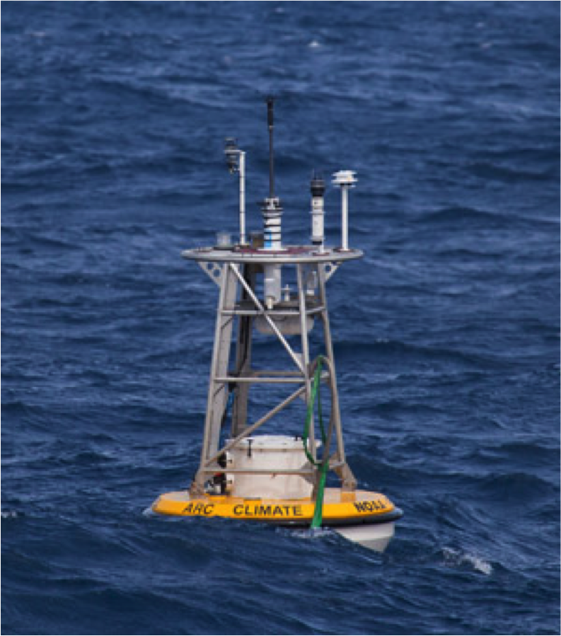
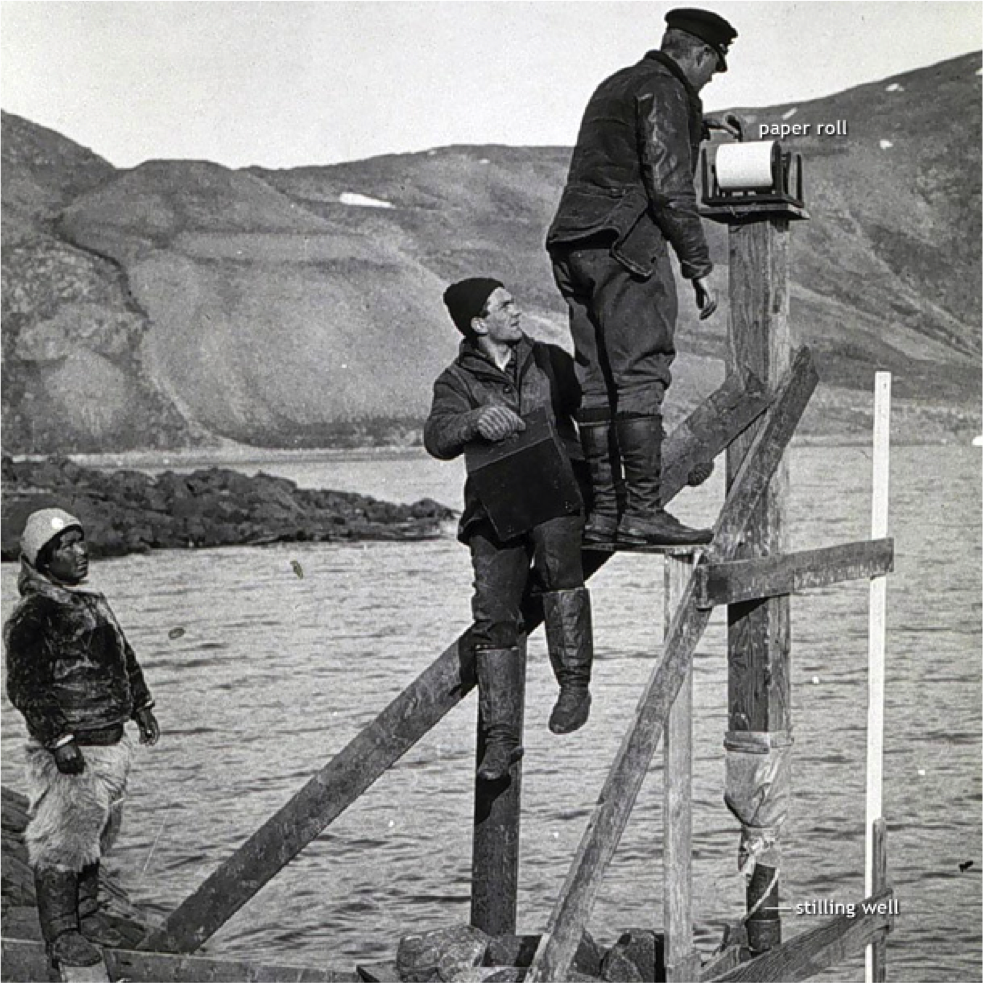
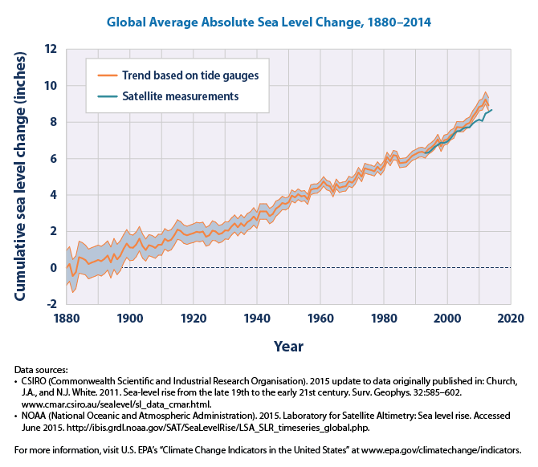
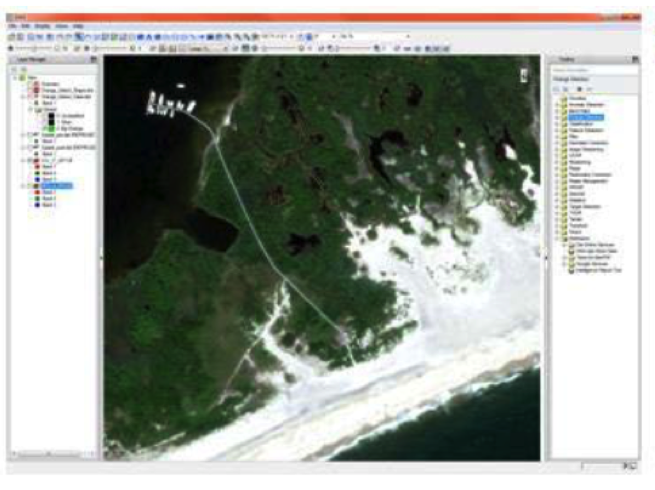
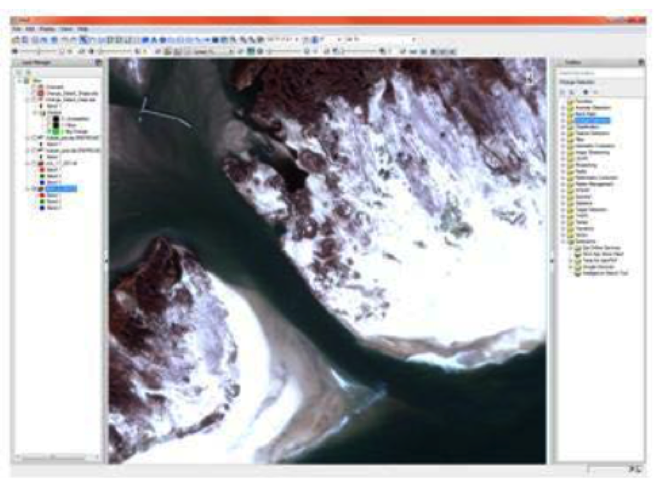

========================================================
author: Sea Surface Temperatures and Sea Level Measurements
date: Meily Wu Fung
autosize: true

Sea Surface Temperatures
========================================================

- Sea surface temperature (SST) is the water temperature near the air-sea interface of the ocean. 

- Measurement methods include weather buoys, satellites, shoreline measurements, and aboard-ship measurements

- Voluntary observing ships when they report temperature data to the World Meteorological Organization 

Bucket measurements
========================================================

***

- data was compromised due to the cooling of the water within the wooden and canvas buckets after retrieval and before the reading was made

- discrepancies between wooden bucket and canvas bucket measurements due to the differences in the insulation of material between the two.

Engine Intake Measurements 
========================================================

***
measurements were taken at the water’s intake, before the water is pumped in to cool the engine

began in the 1920s and became more and more common in the early 1940s before World War II 

Satellite data
====================================
Infrared radiation is measured from the top 10 microns of the sea surface and while microwave radiation is measured from the top 1millimeter

Buoys 
============

- Moorings are anchored in place 

- Drifters move through the water

- Have a smaller RMSE than EITs

***

==========

-average 0.13 degrees F per decade

==========

1801

***

1850s

Sensor sytems
=====

=====

Jason 2 satellite
======

=======

=======

***

====

 High Resolution modeling

=======

***

====

