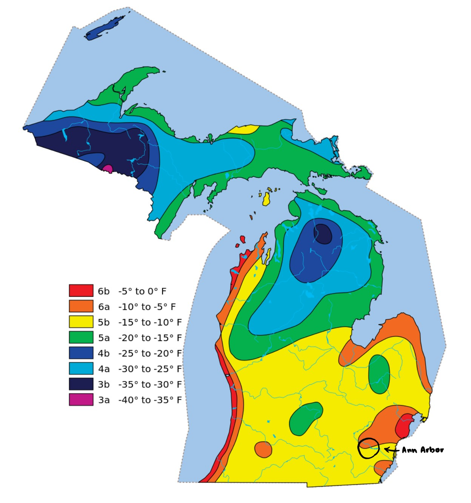
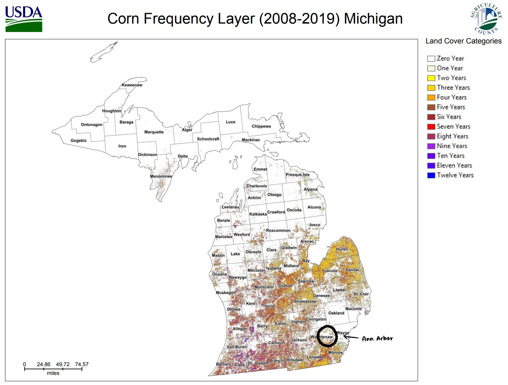
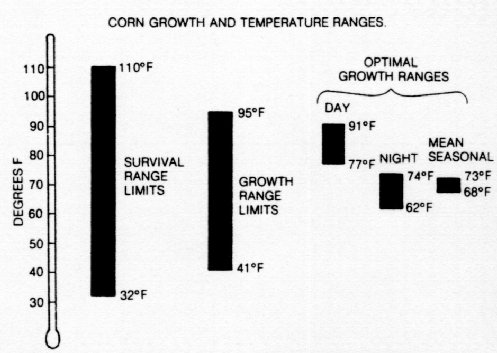

*The state of Michigan sits on land of multiple Indigenous communities: the Ojibwa, the Potawatomi, and the Odawa. Known as the Council of the Three Fires, the three nations were primarily farming communities, raising corn, beans, squash, and more. As we discuss modern agriculture, those of us who are settlers remember that this land is not ours to sow.*

```{r setup, echo=FALSE}
knitr::opts_chunk$set(echo = FALSE)
```


<center></center>

## Introduction [change to flashier title]

Coasts are ravaged by hurricanes, flooding, and wildfires. The central United States is plagued by drought, the South by heat waves (U.S. Global Change Research Program 2014). It is almost unanimously agreed in the scientific community that these drastic and deadly changes in climate are due to human-caused global warming (Cook, John, et al 2016). In the agricultural cradle of the U.S. known as the Midwest, however, citizens are seeing the effects of climate change in their backyard from a more subtle perspective. The production of staple crops like corn, wheat, beans, and squash, can actually benefit from the world’s rising temperature, as the warmer climate extends Michigan’s growing season (American Security Project). However, warmer temperatures are not the only symptom of climate change – increases in extreme weather events, for example, are common. This means that should climate change continue on its projected path, bumper crops one year may give way to empty siloes in the next, may lead to bumper crops in the third year, and so on and so forth. This blog examines and analyzes the impact of climate statistics and projections on the Michigan agriculture. While the rise in temperature may be beneficial to farmers in the Mitten at surface level, the dangers of unpredictable seasons lurk just below the rising water line. Climate change mitigation is essential to ensuring consistent, plentiful harvests for Michiganders and the rest of the world.


#### Data Retrieval and Analysis

In order to analyze the impacts of climate change on the state of Michigan, this blog will center around the analysis of climate data including minimum and maximum daily temperatures and precipitation levels in Ann Arbor, Michigan, from the October 1st of 1891 to September 2nd of 2020, in tandem with data on total corn yield and conditions in the entire state from 1866 to 2020. This statistical support is based on data curated by the National Oceanic and Atmospheric Administration (NOAA), which was collected at the University of Michigan (at weather station GHCND:USC00200230) in Ann Arbor. Agricultural data is curated by the National Agricultural Statistics Service (NASS). These freely available datasets can be analyzed for various trends using R (National Oceanic and Atmospheric Administration 2020; National Agricultural Statistics Service 2020). Close analysis of trends and patterns in this information, along with the review of other research done in the region, informed the conclusions which will be presented in this blog. It should be noted that we will focus on Ann Arbor data to paint a general picture of weather anomalies in the whole state of Michigan, but total state data for agricultural trends. We have chosen the University of Michigan's weather station to represent state weather because of its extensive and consistent daily summaries of temperature and precipitation. In addition, Ann Arbor lies in the same plant hardiness zone of the major corn counties of Michigan. The term "plant hardiness zone" was created by the United States Department of Agriculture to identify similar ranges of climate conditions based on an area's geographic location in order to better inform farmers on what crops could thrive in their area. The two images below show the correlation between Michigan's plant hardiness zones and the frequency of corn crops from 2008 to 2019. We see that Ann Arbor is in Zones 5b and 6a similar to the rest of Michigan excluding the Upper Peninsula northern Lower Peninsula. We also see that these two zones correlate with the major corn producing areas of Michigan, which extend across the southern half of the mitten. Such information from the USDA shows us that Ann Arbor's climate can act as an indication of climatic conditions across the state's corn-growing regions.

{height=350px}{height=350px}

## Ecology and Economy

Moderate temperatures and humid conditions have long defined Michigan weather. The Great Lakes have a chilling effect on certain parts of the Upper Peninsula and western Lower Peninsula, making them more prone to snowfall. These temperature differences lead to a more diverse agricultural industry; growing season in the Upper Peninsula stretches for about 2 months, while the Lower Peninsula has a longer growing season, reaching almost six months in some places. Longer crop seasons are ideal for field crops like corn and soybeans which puts Michigan at the top of the production chart of both commodities (Council, Michigan Ag [date unknown]). Agriculture is the state’s main export: according to the National Agricultural Statistics Service, Michigan produced around 4.1 billion dollars' worth of crops in 2019 alone. Of that 4.1 billion, around 9.8 million comes from corn sales (23.8% of total crop sales), and 7.7 million from soybean sales (around 18.7%) (NASS Economic Statistical Bulletin 2020).

These numbers are certainly impressive, and as mentioned before, the warming climate may take partial credit for such high yields. As increased heat may wither crops in states south of Michigan, a solely warming climate actually benefits the formerly chilly Michigan. However, as trends in temperature maximums and minimums rise, so too do the frequency and intensity of extreme weather events. Increased risks of extreme heat and cold events, droughts and floods, and precipitation patterns threaten to disturb growing seasons and wreak havoc on field crop production (Winkler, Andresen, et al. 2014).

```{r Temperatures}
climate_data <-read.csv("/home/CAMPUS/lraa2020/Climate_Change_Narratives/Data/FA20/lila_annarbor_temp_and_precip.csv")
strDates <- as.character(climate_data$DATE)
climate_data$NewDate <- as.Date(strDates, "%m/%d/%Y")
climate_data$Month = format(as.Date(climate_data$NewDate), format = "%m")
climate_data$Year = format(climate_data$NewDate, format="%Y")
MonthlyTMAXMean = aggregate(TMAX ~ Month + Year, climate_data, mean)
MonthlyTMAXMean$YEAR = as.numeric(MonthlyTMAXMean$Year)
MonthlyTMAXMean$MONTH = as.numeric(MonthlyTMAXMean$Month)
 
# changing date formatting
climate_data <-read.csv("/home/CAMPUS/lraa2020/Climate_Change_Narratives/Data/FA20/lila_annarbor_temp_and_precip.csv")
strDates <- as.character(climate_data$DATE)
climate_data$NewDate <- as.Date(strDates, "%m/%d/%Y")
climate_data$Month = format(as.Date(climate_data$NewDate), format = "%m")
climate_data$Year = format(climate_data$NewDate, format="%Y")

# temp business
MonthlyTMINMean = aggregate(TMIN ~ Month + Year, climate_data, mean)
MonthlyTMINMean$YEAR = as.numeric(MonthlyTMINMean$Year)
MonthlyTMINMean$MONTH = as.numeric(MonthlyTMINMean$Month)

attach(climate_data)
par(mfrow=c(2,2))
layout(matrix(c(1, 2), byrow = TRUE))

plot(TMIN~YEAR, data = MonthlyTMINMean[MonthlyTMINMean$Month=="08",], ty="l", xlim=c(1891, 2020), ylim=c(13, 33), main="Average Temperature (August)", ylab="Temperature (C)", xlab="Year", las=1)
lines(TMAX~YEAR, data=MonthlyTMAXMean[MonthlyTMAXMean$Month=="08",],
ty='l', col="red")
August.lm <- lm(TMAX~YEAR, data=MonthlyTMAXMean[MonthlyTMAXMean$Month=="08",])
AugustTMIN.lm <- lm(TMIN~YEAR, data = MonthlyTMINMean[MonthlyTMINMean$Month=="08",])

plot(TMIN~YEAR, data = MonthlyTMINMean[MonthlyTMINMean$Month=="05",], ty="l", xlim=c(1891, 2020), ylim=c(4, 26), main="Average Temperature (May)", ylab="Temperature (C)", xlab="Year", las=1)
lines(TMAX~YEAR, data=MonthlyTMAXMean[MonthlyTMAXMean$Month=="05",],
ty='l', col="purple")
May.lm <- lm(TMAX~YEAR, data=MonthlyTMAXMean[MonthlyTMAXMean$Month=="05",])
MayTMIN.lm <- lm(TMIN~YEAR, data = MonthlyTMINMean[MonthlyTMINMean$Month=="05",])
abline(coef(MayTMIN.lm))
abline(coef(May.lm), col="purple")
```

In order to analyze patterns in temperatures over the span of more than a century, I graphed the daily maximum and minimum temperatures of each month from 1891 to 2020. I chose to display the May and August results in this blog as May is generally the beginning of the growing season and August is nearing the end. Each month displays minimum and maximum temperature graphs with increasing slopes - however, there is always the possibility that data is statistically insignificant. To avoid misconstruing data or jumping to conclusions, we ran the graphs through a series of statistical analysis tests. 10 out of 12 months of average minimum temperatures (excluding January and October) proved to be highly statistically significant (p-values ranged from 0.022 to 0.0002), disproving the null hypothesis and showing that there is a strong correlation between increasing minimum temperatures and time. Interestingly, only half of the increasing slopes in maximum temperatures were statistically significant. Average maximum temperatures from February to June disprove the null hypothesis (p-values range from 0.010 to 0.00001), as do maximum temperatures in December. These significant trends from February to June indicate that Michigan springs and early summers are increasing in both minimum and maximum temperatures, and that the coldest month (December) is becoming more temperate. July to November, however, do not show statistically significant trends, nor does January. From this information we can conclude that late summer to late fall, along with the month of January, are relatively stagnant in terms of changes in temperature from between 1891 to 2020.

This data fits scientists' predictions of longer and perhaps potentially more prosperous Michigan growing seasons. As temperatures increase in early spring, farmers are able to plant crops sooner, and crops like corn, which requires a longer growing season, still flourish in the steady temperatures of late summer and fall.


## Growing Temperatures, Sowing Corn



Michigan corn is generally planted in late April or early May, and, as is the case with all crops, requires a particular set of conditions in order to flourish. As shown by the graphic above, the crop can survive temperatures of up to 110°F (43.3°C) and down to 32°F (0°C). However, corn only grows between 95°F (35°C) and 41°F (5°C). Optimal corn conditions fall in the range of 91°F (32.8°C) to 62°F (16.7°C). Referring back to May temperatures, 2020 has seen a large drop in temperatures, but the average minimum in the 2010s can be estimated to around 9°C and the maximum to around 22°C. In the next 100 years, these averages can be expected to rise by 1.5 to 2 degrees, drawing temperatures closer to optimal growing conditions. Graphs for July and June show temperatures hitting peak optimal conditions for corn production with highs around 27-32°C and lows at 15-17°C.

```{r summer_temperatures}
# June TMIN
plot(TMIN~YEAR, data=MonthlyTMINMean[MonthlyTMINMean$Month=="06",],
ty='l', xlim=c(1900, 2020), ylim=c(11, 31), main="June Max. and Min. Temperatures", ylab="Temperature (C)", xlab="Year")
lines(TMAX~YEAR, data=MonthlyTMAXMean[MonthlyTMAXMean$Month=="06",],
ty='l', col="Red")
JuneTMIN.lm <- lm(TMIN~YEAR, data = MonthlyTMINMean[MonthlyTMINMean$Month=="06",])
 abline(coef(JuneTMIN.lm))
June.lm <- lm(TMAX~YEAR, data=MonthlyTMAXMean[MonthlyTMAXMean$Month=="06",])
abline(coef(June.lm), col="red")
 
 # July TMIN
 plot(TMIN~YEAR, data = MonthlyTMINMean[MonthlyTMINMean$Month=="07",], ty="l", xlim=c(1891, 2020), ylim=c(14, 33), main="July Max. and Min. Temperatures", ylab="Min Temperature (C)", xlab="Year")
lines(TMAX~YEAR, data=MonthlyTMAXMean[MonthlyTMAXMean$Month=="07",],
ty='l', col="Red")
JulyTMIN.lm <- lm(TMIN~YEAR, data = MonthlyTMINMean[MonthlyTMINMean$Month=="07",])
abline(coef(JulyTMIN.lm))
July.lm <- lm(TMAX~YEAR, data=MonthlyTMAXMean[MonthlyTMAXMean$Month=="07",])
abline(coef(July.lm), col="red")
```

Increasing temperature alone can provide benefits to farmers - at least, for now. Based on the trends in our data, if no climate change mitigations are enacted, average temperatures in Michigan will increase by around 2 degrees within 100 years. Climate change is predicted to accelerate, however, should drastic measures not be taken to prevent the release of more greenhouse gases into the atmosphere (IPCC [Core Writing Team] 2014). This means that instead of temperatures growing at a linear pace, they will grow exponentially. In other words, it is likely that 2 degrees in the next 100 years is an under-estimate.

In addition, increasing temperature is determinedly not the only result of climate change. The frequency of extreme and unpredictable weather events like heavy rain and flooding, flash freezes, and droughts, among others, has risen with the warming of the globe as well (Union of Concerned Scientists 2018).


A 2019 study done by researchers at the University of Illinois showed that "excessive rainfall" could decrease corn crop yields by up to 34%, just as drought and heat waves can cause a decrease of up to 37% (Yoksoulian 2019). 

## Testing for Corn

```{r corn_production, eval=FALSE}
corn_production <-read.csv("/home/CAMPUS/lraa2020/Climate_Change_Narratives/Data/FA20/lila_michigan_cornproduction.csv")
str(corn_production)
corn_production$Value
corn_production$Value = as.numeric(gsub(",", "", corn_production$Value))/1000000
str(corn_production)

plot(corn_production$Value~corn_production$Year, corn_production, main="Corn Production Income over Time", ylab= "Annual value", xlab="Year")

corn_production_value.lm <- lm(corn_production$Value~corn_production$Year)
abline(coef(corn_production_value.lm))
```

```{r corn_bushels_per_acre}
corn_bushels_per_acre <-read.csv("/home/CAMPUS/lraa2020/Climate_Change_Narratives/Data/FA20/lila_michigan_cornbuperacre.csv")
str(corn_bushels_per_acre)
corn_bushels_per_acre$Value = as.numeric(gsub(",", "", corn_bushels_per_acre$Value))

plot(corn_bushels_per_acre$Value~corn_bushels_per_acre$Year, corn_bushels_per_acre, ty = "l", main="Corn Production in Bushels per Acre over Time", ylab= "Bushels per Acre", xlab="Year", las=1)

cornproductionbushels.lm <- lm(corn_bushels_per_acre$Value~corn_bushels_per_acre$Year, corn_bushels_per_acre)
abline(coef(cornproductionbushels.lm))

#1866-1920
plot(corn_bushels_per_acre$Value[100:155]~corn_bushels_per_acre$Year[100:155], xlim=c(1866, 1920), ylim=c(0, 80), ty = "l", main="Corn Production in Bushels per Acre over Time", ylab="Bushels per Acre", xlab="Year", las=1)

cornproductionbushel1866to1920.lm <- lm(corn_bushels_per_acre$Value[100:155]~corn_bushels_per_acre$Year[100:155], corn_bushels_per_acre)
abline(coef(cornproductionbushel1866to1920.lm))
summary(cornproductionbushel1866to1920.lm)


#1920-1970
plot(corn_bushels_per_acre$Value[50:100]~corn_bushels_per_acre$Year[50:100], xlim=c(1920,1970), ylim=c(0,200), ty = "l", main="Corn Production in Bushels per Acre over Time", ylab= "Bushels per Acre", xlab="Year", col="red")

cornproductionbushel1920to1970.lm <- lm(corn_bushels_per_acre$Value[50:100]~corn_bushels_per_acre$Year[50:100], corn_bushels_per_acre)
abline(coef(cornproductionbushel1920to1970.lm))
summary(cornproductionbushel1920to1970.lm)

# 1970-2020
plot(head(corn_bushels_per_acre$Value, n=50)~head(corn_bushels_per_acre$Year, n=50), corn_bushels_per_acre, ty = "l", main="Corn Production in Bushels per Acre over Time, 1970-2020", ylab= "Bushels per Acre", xlab="Year")

cornproductionbushel1970to2020.lm <- lm(head(corn_bushels_per_acre$Value, n=50)~head(corn_bushels_per_acre$Year, n=50), corn_bushels_per_acre)
abline(coef(cornproductionbushel1970to2020.lm))
summary(cornproductionbushel1970to2020.lm)
```

1866-1920 
Residual standard error: 3.824 on 54 degrees of freedom
Multiple R-squared:  0.01452,	Adjusted R-squared:  -0.003726 
F-statistic: 0.7958 on 1 and 54 DF,  p-value: 0.3763

1920-1970
Residual standard error: 7.52 on 49 degrees of freedom
Multiple R-squared:  0.7646,	Adjusted R-squared:  0.7598 
F-statistic: 159.2 on 1 and 49 DF,  p-value: < 2.2e-16

1970-2020
Residual standard error: 10.18 on 48 degrees of freedom
Multiple R-squared:  0.8767,	Adjusted R-squared:  0.8741 
F-statistic: 341.3 on 1 and 48 DF,  p-value: < 2.2e-16

## Conclusions

Agricultural loss as described above will devastate the Michigan economy. Repairs to landscape damaged by climate-change-related incidents, including dredging and filling in shoreline damage and erosion, diverting water, and pollution from transportation will not only exacerbate climate change, it will cost a fortune – estimated by researcher Jean-Philippe Jenny and his team to cost “an excess of $400 million annually” (Jenny, Jean-Philippe, et-al). With a primarily agriculture-based economic model, it will be difficult to adjust to a world in which conventional agriculture is simply not possible due to extreme and unpredictable weather patterns (Kling, George W., et al). However, the looming potential of an economic disaster is not only a result of the downfall of the agricultural industry; as the second biggest industry in Michigan, tourism will also have a large impact on the future of the state’s wealth. Unfortunately, with dredging and filling, water diversion and pollution, the destruction of ecosystems, and a dying “Pick-Your-Own Fruit” industry, tourists may not be eager to flock to Michigan’s formerly pristine shores and corn mazes.

It is not difficult to conclude that Michigan is and will continue to feel both the long- and short-term effects of the warming of the Earth by human activity. In many ways, Michigan can be seen as a warning to those who don’t believe climate change will affect them. Although the signs are more subtle than fire or flood, Michigan’s climate crisis is just as grave and must be addressed with the utmost seriousness.


## References

1. U.S. Global Change Research Program. Climate change impacts in the United States. 2014. https://www.globalchange.gov/sites/globalchange/files/NCA3-climate-trends-regional-impacts-brochure.pdf
2. Cook J, Oreskes N, Doran PT, Anderegg WRL, Verheggen B, Maibach EW, Carlton JS, Lewandowsky S, Skuce AG, Green SA, et al. Consensus on consensus: a synthesis of consensus estimates on human-caused global warming. Environmental research letters. 2016;11(4):048002.
3. Epa US, REG. Facts and figures about the great lakes. 2015 [accessed 2020 Oct 11]. http://www.epa.gov/greatlakes/facts-and-figures-about-great-lakes
4. Jenny J-P, Anneville O, Arnaud F, Baulaz Y, Bouffard D, Domaizon I, Bocaniov SA, Chèvre N, Dittrich M, Dorioz J-M, et al. Scientists’ Warning to Humanity: Rapid degradation of the world’s large lakes. Journal of Great Lakes research. 2020;46(4):686–702.
5. Kling, George W., Katharine Hayhoe, Lucinda B. Johnson, John J. Magnuson, Stephen Polasky, Scott K. Robinson, Brian J. Shuter, Michelle M. Wander, Donald J. Wuebbles, Donald R. Zak, Richard L. Lindroth, Susanne C. Moser, Mark L. Wilson. Confronting Climate Change in the Great Lakes Region: Impacts on Our Communities and Ecosystems. Cambridge, MA: Union of Concerned Scientists; 2003. www.jstor.org/stable/resrep00033.10
6. American Security Project. Climate Change and the Threats to the American Midwest. American Security Project; 2014. www.jstor.org/stable/resrep05970
7. Julie A. Winkler, Jeffrey A. Andresen, Jerry L. Hatfield, David Bidwell, Daniel Brown. Climate Change in the Midwest: A Synthesis Report for the National Climate Assessment. Washington, D.C., DC: Island Press; 2014. https://www.researchgate.net/publication/278038317
8. Michigan Ag Council. Michigangrown.org. [accessed 2020 Oct 11]. https://michigangrown.org/
9. National Agricultural Statistics Service. Annual Statistical Bulletin: Economics. 2020. https://www.nass.usda.gov/Statistics_by_State/Michigan/Publications/Annual_Statistical_Bulletin/stats20/Economics.pdf
10. Yoksoulian L. Excessive rainfall as damaging to corn yield as extreme heat, drought. Phys.org. 2019 Apr 30 [accessed 2020 Oct 11]. https://phys.org/news/2019-04-excessive-rainfall-corn-yield-extreme.html
11. National Oceanic and Atmospheric Administration. ANN ARBOR U OF MICH, MI US: Daily Summaries. National Centers for Environmental Information. 2020.
12. National Agricultural Statistics Service. CORN, GRAIN - PRODUCTION, MEASURED IN BU. Quick Stats. 2020. https://quickstats.nass.usda.gov/results/B239FD85-E069-3E6E-AEC4-33D45EF8D084
13. National Agricultural Statistics Service. Cropland Data Layer. 2019. https://nassgeodata.gmu.edu/CropScape/
14. IPCC [Core Writing Team]. Climate Change 2014: Synthesis Report. In: R.K. Pachauri and L.A. Meyer, editor. Contribution of Working Groups I, II and III to the Fifth Assessment Report of the Intergovernmental Panel on Climate Change. Geneva, Switzerland: IPPC; 2014. p. 167.


```{r climate_data, echo=FALSE, eval=FALSE}
climate_data <-read.csv("/home/CAMPUS/lraa2020/Climate_Change_Narratives/Data/FA20/lila_annarbor_temp_and_precip.csv")
strDates <- as.character(climate_data$DATE)
climate_data$NewDate <- as.Date(strDates, "%m/%d/%Y")
plot(TMAX~NewDate, climate_data, ty='l', main="Daily Temperatures", ylab= "Max Temperature (C)", xlab="Year")
bestfitline.lm <- lm(TMAX~NewDate, climate_data)
abline(coef(bestfitline.lm), col="red")
```
```{r SNOW, eval=FALSE}
# changing date formatting
climate_data <-read.csv("/home/CAMPUS/lraa2020/Climate_Change_Narratives/Data/FA20/lila_annarbor_temp_and_precip.csv")
strDates <- as.character(climate_data$DATE)
climate_data$NewDate <- as.Date(strDates, "%m/%d/%Y")
climate_data$Month = format(as.Date(climate_data$NewDate), format = "%m")
climate_data$Year = format(climate_data$NewDate, format="%Y")

# SNOW business
MonthlySNOWSum = aggregate(SNOW ~ Month + Year, climate_data, sum)
MonthlySNOWSum$YEAR = as.numeric(MonthlySNOWSum$Year)
MonthlySNOWSum$MONTH = as.numeric(MonthlySNOWSum$Month)

# January
plot(SNOW~YEAR, data = MonthlySNOWSum[MonthlySNOWSum$Month=="01",], ty="l", xlim=c(1891, 2020), main="January", ylab="Total Monthly Snowfall", xlab="Year")

JanuarySNOW.lm <- lm(SNOW~YEAR, data = MonthlySNOWSum[MonthlySNOWSum$Month=="01",])
abline(coef(JanuarySNOW.lm))
summary(JanuarySNOW.lm)

# February
plot(SNOW~YEAR, data = MonthlySNOWSum[MonthlySNOWSum$Month=="02",], ty="l", xlim=c(1891, 2020), main="February", ylab="Total Monthly Snowfall", xlab="Year")

FebSNOW.lm <- lm(SNOW~YEAR, data = MonthlySNOWSum[MonthlySNOWSum$Month=="02",])
abline(coef(FebSNOW.lm))
summary(FebSNOW.lm)

# March
plot(SNOW~YEAR, data = MonthlySNOWSum[MonthlySNOWSum$Month=="03",], ty="l", xlim=c(1891, 2020), main="March", ylab="Total Monthly Snowfall", xlab="Year")

MarSNOW.lm <- lm(SNOW~YEAR, data = MonthlySNOWSum[MonthlySNOWSum$Month=="03",])
abline(coef(MarSNOW.lm))
summary(MarSNOW.lm)

# April
plot(SNOW~YEAR, data = MonthlySNOWSum[MonthlySNOWSum$Month=="04",], ty="l", xlim=c(1891, 2020), main="April", ylab="Total Monthly Snowfall", xlab="Year")

AprSnw.lm <- lm(SNOW~YEAR, data = MonthlySNOWSum[MonthlySNOWSum$Month=="04",])
abline(coef(AprSnw.lm))
summary(AprSnw.lm)

# May
plot(SNOW~YEAR, data = MonthlySNOWSum[MonthlySNOWSum$Month=="05",], ty="l", xlim=c(1891, 2020), main="May", ylab="Total Monthly Snowfall", xlab="Year")

MaySNOW.lm <- lm(SNOW~YEAR, data = MonthlySNOWSum[MonthlySNOWSum$Month=="05",])
abline(coef(MaySNOW.lm))
summary(MaySNOW.lm)

# June
plot(SNOW~YEAR, data = MonthlySNOWSum[MonthlySNOWSum$Month=="06",], ty="l", xlim=c(1891, 2020), main="June", ylab="Total Monthly Snowfall", xlab="Year")

JuneSNOW.lm <- lm(SNOW~YEAR, data = MonthlySNOWSum[MonthlySNOWSum$Month=="06",])
abline(coef(JuneSNOW.lm))
summary(JuneSNOW.lm)

# July
plot(SNOW~YEAR, data = MonthlySNOWSum[MonthlySNOWSum$Month=="07",], ty="l", xlim=c(1891, 2020), main="July", ylab="Total Monthly Snowfall", xlab="Year")

JulSNOW.lm <- lm(SNOW~YEAR, data = MonthlySNOWSum[MonthlySNOWSum$Month=="07",])
abline(coef(JulSNOW.lm))
summary(JulSNOW.lm)

# August
plot(SNOW~YEAR, data = MonthlySNOWSum[MonthlySNOWSum$Month=="08",], ty="l", xlim=c(1891, 2020), main="August", ylab="Total Monthly Snowfall", xlab="Year")

AugSNOW.lm <- lm(SNOW~YEAR, data = MonthlySNOWSum[MonthlySNOWSum$Month=="08",])
abline(coef(AugSNOW.lm))
summary(AugSNOW.lm)

# September
plot(SNOW~YEAR, data = MonthlySNOWSum[MonthlySNOWSum$Month=="09",], ty="l", xlim=c(1891, 2020), main="September", ylab="Total Monthly Snowfall", xlab="Year")

SeptSNOW.lm <- lm(SNOW~YEAR, data = MonthlySNOWSum[MonthlySNOWSum$Month=="09",])
abline(coef(SeptSNOW.lm))
summary(SeptSNOW.lm)

# October
plot(SNOW~YEAR, data = MonthlySNOWSum[MonthlySNOWSum$Month=="10",], ty="l", xlim=c(1891, 2020), main="October", ylab="Total Monthly Snowfall", xlab="Year")

OctSNOW.lm <- lm(SNOW~YEAR, data = MonthlySNOWSum[MonthlySNOWSum$Month=="10",])
abline(coef(OctSNOW.lm))
summary(OctSNOW.lm)

# November
plot(SNOW~YEAR, data = MonthlySNOWSum[MonthlySNOWSum$Month=="11",], ty="l", xlim=c(1891, 2020), main="November", ylab="Total Monthly Snowfall", xlab="Year")

NovSNOW.lm <- lm(SNOW~YEAR, data = MonthlySNOWSum[MonthlySNOWSum$Month=="11",])
abline(coef(NovSNOW.lm))
summary(NovSNOW.lm)

# December
plot(SNOW~YEAR, data = MonthlySNOWSum[MonthlySNOWSum$Month=="12",], ty="l", xlim=c(1891, 2020), main="December", ylab="Total Monthly Snowfall", xlab="Year")

DecSNOW.lm <- lm(SNOW~YEAR, data = MonthlySNOWSum[MonthlySNOWSum$Month=="12",])
abline(coef(DecSNOW.lm))
```
```{r PRCP_total, eval=FALSE}
# changing date formatting
climate_data <-read.csv("/home/CAMPUS/lraa2020/Climate_Change_Narratives/Data/FA20/lila_annarbor_temp_and_precip.csv")
strDates <- as.character(climate_data$DATE)
climate_data$NewDate <- as.Date(strDates, "%m/%d/%Y")
climate_data$Month = format(as.Date(climate_data$NewDate), format = "%m")
climate_data$Year = format(climate_data$NewDate, format="%Y")

# PRCP business
MonthlyPRCPSum = aggregate(PRCP ~ Month + Year, climate_data, sum)
MonthlyPRCPSum$YEAR = as.numeric(MonthlyPRCPSum$Year)
MonthlyPRCPSum$MONTH = as.numeric(MonthlyPRCPSum$Month)

# January
plot(PRCP~YEAR, data = MonthlyPRCPSum[MonthlyPRCPSum$Month=="01",], ty="l", xlim=c(1891, 2020), main="January", ylab="Total Monthly Precipitation", xlab="Year")

JanuaryPRCP.lm <- lm(PRCP~YEAR, data = MonthlyPRCPSum[MonthlyPRCPSum$Month=="01",])
abline(coef(JanuaryPRCP.lm))
summary(JanuaryPRCP.lm)

# February
plot(PRCP~YEAR, data = MonthlyPRCPSum[MonthlyPRCPSum$Month=="02",], ty="l", xlim=c(1891, 2020), main="February", ylab="Total Monthly Precipitation", xlab="Year")

FebPRCP.lm <- lm(PRCP~YEAR, data = MonthlyPRCPSum[MonthlyPRCPSum$Month=="02",])
abline(coef(FebPRCP.lm))
summary(FebPRCP.lm)

# March
plot(PRCP~YEAR, data = MonthlyPRCPSum[MonthlyPRCPSum$Month=="03",], ty="l", xlim=c(1891, 2020), main="March", ylab="Total Monthly Precipitation", xlab="Year")

MarPRCP.lm <- lm(PRCP~YEAR, data = MonthlyPRCPSum[MonthlyPRCPSum$Month=="03",])
abline(coef(MarPRCP.lm))
summary(MarPRCP.lm)
# April
plot(PRCP~YEAR, data = MonthlyPRCPSum[MonthlyPRCPSum$Month=="04",], ty="l", xlim=c(1891, 2020), main="April", ylab="Total Monthly Precipitation", xlab="Year")

AprPRCP.lm <- lm(PRCP~YEAR, data = MonthlyPRCPSum[MonthlyPRCPSum$Month=="04",])
abline(coef(AprPRCP.lm))
summary(AprPRCP.lm)

# May
plot(PRCP~YEAR, data = MonthlyPRCPSum[MonthlyPRCPSum$Month=="05",], ty="l", xlim=c(1891, 2020), main="May", ylab="Total Monthly Precipitation", xlab="Year")
MayPRCP.lm <- lm(PRCP~YEAR, data = MonthlyPRCPSum[MonthlyPRCPSum$Month=="05",])
abline(coef(MayPRCP.lm))
summary(MayPRCP.lm)

# June
plot(PRCP~YEAR, data = MonthlyPRCPSum[MonthlyPRCPSum$Month=="06",], ty="l", xlim=c(1891, 2020), main="June", ylab="Total Monthly Precipitation", xlab="Year")

JunePRCP.lm <- lm(PRCP~YEAR, data = MonthlyPRCPSum[MonthlyPRCPSum$Month=="06",])
abline(coef(JunePRCP.lm))
summary(JunePRCP.lm)
# July
plot(PRCP~YEAR, data = MonthlyPRCPSum[MonthlyPRCPSum$Month=="07",], ty="l", xlim=c(1891, 2020), main="July", ylab="Total Monthly Precipitation", xlab="Year")

JulyPRCP.lm <- lm(PRCP~YEAR, data = MonthlyPRCPSum[MonthlyPRCPSum$Month=="07",])
abline(coef(JulyPRCP.lm))
summary(JulyPRCP.lm)
# August
plot(PRCP~YEAR, data = MonthlyPRCPSum[MonthlyPRCPSum$Month=="08",], ty="l", xlim=c(1891, 2020), main="August", ylab="Total Monthly Precipitation", xlab="Year")

AugustPRCP.lm <- lm(PRCP~YEAR, data = MonthlyPRCPSum[MonthlyPRCPSum$Month=="08",])
abline(coef(AugustPRCP.lm))
summary(AugustPRCP.lm)
# September
plot(PRCP~YEAR, data = MonthlyPRCPSum[MonthlyPRCPSum$Month=="09",], ty="l", xlim=c(1891, 2020), main="September", ylab="Total Monthly Precipitation", xlab="Year")

SeptPRCP.lm <- lm(PRCP~YEAR, data = MonthlyPRCPSum[MonthlyPRCPSum$Month=="09",])
abline(coef(SeptPRCP.lm))
summary(SeptPRCP.lm)
# October
plot(PRCP~YEAR, data = MonthlyPRCPSum[MonthlyPRCPSum$Month=="10",], ty="l", xlim=c(1891, 2020), main="October", ylab="Total Monthly Precipitation", xlab="Year")

OctPRCP.lm <- lm(PRCP~YEAR, data = MonthlyPRCPSum[MonthlyPRCPSum$Month=="10",])
abline(coef(OctPRCP.lm))
summary(OctPRCP.lm)
# November
plot(PRCP~YEAR, data = MonthlyPRCPSum[MonthlyPRCPSum$Month=="11",], ty="l", xlim=c(1891, 2020), main="November", ylab="Total Monthly Precipitation", xlab="Year")

NovPRCP.lm <- lm(PRCP~YEAR, data = MonthlyPRCPSum[MonthlyPRCPSum$Month=="11",])
abline(coef(NovPRCP.lm))
summary(NovPRCP.lm)
# December
plot(PRCP~YEAR, data = MonthlyPRCPSum[MonthlyPRCPSum$Month=="12",], ty="l", xlim=c(1891, 2020), main="December", ylab="Total Monthly Precipitation", xlab="Year")

DecPRCP.lm <- lm(PRCP~YEAR, data = MonthlyPRCPSum[MonthlyPRCPSum$Month=="12",])
abline(coef(DecPRCP.lm))
summary(DecPRCP.lm)
```
```{r, TMIN_excess, eval=FALSE}
# 
 # January and 
 plot(TMIN~YEAR, data = MonthlyTMINMean[MonthlyTMINMean$Month=="01",], ty="l", xlim=c(1891, 2020), main="January", ylab="Min Temperature (C)", xlab="Year")

 JanuaryTMIN.lm <- lm(TMIN~YEAR, data = MonthlyTMINMean[MonthlyTMINMean$Month=="01",])
 abline(coef(JanuaryTMIN.lm))
summary(JanuaryTMIN.lm)
 # February
 plot(TMIN~YEAR, data = MonthlyTMINMean[MonthlyTMINMean$Month=="02",], ty="l", xlim=c(1891, 2020), main="February", ylab="Min Temperature (C)", xlab="Year")

 FebruaryTMIN.lm <- lm(TMIN~YEAR, data = MonthlyTMINMean[MonthlyTMINMean$Month=="02",])
 abline(coef(FebruaryTMIN.lm))
summary(FebruaryTMIN.lm)
 # March
 plot(TMIN~YEAR, data = MonthlyTMINMean[MonthlyTMINMean$Month=="03",], ty="l", xlim=c(1891, 2020), main="March", ylab="Min Temperature (C)", xlab="Year")

 MarchTMIN.lm <- lm(TMIN~YEAR, data = MonthlyTMINMean[MonthlyTMINMean$Month=="03",])
 abline(coef(MarchTMIN.lm))
summary(MarchTMIN.lm)
 # April
 plot(TMIN~YEAR, data = MonthlyTMINMean[MonthlyTMINMean$Month=="04",], ty="l", xlim=c(1891, 2020), main="April", ylab="Min Temperature (C)", xlab="Year")

 AprilTMIN.lm <- lm(TMIN~YEAR, data = MonthlyTMINMean[MonthlyTMINMean$Month=="04",])
 abline(coef(AprilTMIN.lm))
 summary(AprilTMIN.lm)
# May
min_may_plot <- plot(TMIN~YEAR, data = MonthlyTMINMean[MonthlyTMINMean$Month=="05",], ty="l", xlim=c(1891, 2020), main="Average Minimum Temperature in May", ylab="Min Temperature (C)", xlab="Year")

MayTMIN.lm <- lm(TMIN~YEAR, data = MonthlyTMINMean[MonthlyTMINMean$Month=="05",])
abline(coef(MayTMIN.lm), col="red")
summary(MayTMIN.lm)
 # June
 plot(TMIN~YEAR, data = MonthlyTMINMean[MonthlyTMINMean$Month=="06",], ty="l", xlim=c(1891, 2020), main="June", ylab="Min Temperature (C)", xlab="Year")

 JuneTMIN.lm <- lm(TMIN~YEAR, data = MonthlyTMINMean[MonthlyTMINMean$Month=="06",])
 abline(coef(JuneTMIN.lm))
summary(JuneTMIN.lm)
 # July
 plot(TMIN~YEAR, data = MonthlyTMINMean[MonthlyTMINMean$Month=="07",], ty="l", xlim=c(1891, 2020), main="July", ylab="Min Temperature (C)", xlab="Year")

 JulyTMIN.lm <- lm(TMIN~YEAR, data = MonthlyTMINMean[MonthlyTMINMean$Month=="07",])
 abline(coef(JulyTMIN.lm))
summary(JulyTMIN.lm)
# August
min_august_plot <- plot(TMIN~YEAR, data = MonthlyTMINMean[MonthlyTMINMean$Month=="08",], ty="l", xlim=c(1891, 2020), main="Average Minimum Temperature in August", ylab="Min Temperature (C)", xlab="Year")

AugustTMIN.lm <- lm(TMIN~YEAR, data = MonthlyTMINMean[MonthlyTMINMean$Month=="08",])
abline(coef(AugustTMIN.lm))
summary(AugustTMIN.lm)

# September
plot(TMIN~YEAR, data = MonthlyTMINMean[MonthlyTMINMean$Month=="09",], ty="l", xlim=c(1891, 2020), main="September", ylab="Min Temperature (C)", xlab="Year")

SeptemberTMIN.lm <- lm(TMIN~YEAR, data = MonthlyTMINMean[MonthlyTMINMean$Month=="09",])
abline(coef(SeptemberTMIN.lm))
summary(SeptemberTMIN.lm)

# October
plot(TMIN~YEAR, data = MonthlyTMINMean[MonthlyTMINMean$Month=="10",], ty="l", xlim=c(1891, 2020), main="October", ylab="Min Temperature (C)", xlab="Year")

OctoberTMIN.lm <- lm(TMIN~YEAR, data = MonthlyTMINMean[MonthlyTMINMean$Month=="10",])
abline(coef(OctoberTMIN.lm))
summary(OctoberTMIN.lm)
#
# November
plot(TMIN~YEAR, data = MonthlyTMINMean[MonthlyTMINMean$Month=="11",], ty="l", xlim=c(1891, 2020), main="November", ylab="Min Temperature (C)", xlab="Year")

NovemberTMIN.lm <- lm(TMIN~YEAR, data = MonthlyTMINMean[MonthlyTMINMean$Month=="11",])
abline(coef(NovemberTMIN.lm))
summary(NovemberTMIN.lm)
#
# December
plot(TMIN~YEAR, data = MonthlyTMINMean[MonthlyTMINMean$Month=="12",], ty="l", xlim=c(1891, 2020), main="December", ylab="Min Temperature (C)", xlab="Year")

DecemberTMIN.lm <- lm(TMIN~YEAR, data = MonthlyTMINMean[MonthlyTMINMean$Month=="12",])
abline(coef(DecemberTMIN.lm))
summary(DecemberTMIN.lm)
```
```{r, TMAX_excess, eval=FALSE}
# January
plot(TMAX~YEAR, data=MonthlyTMAXMean[MonthlyTMAXMean$Month=="01",],
ty='l', xlim=c(1900, 2020), main="January", ylab="Max Temperature (C)", xlab="Year")

January.lm <- lm(TMAX~YEAR, data=MonthlyTMAXMean[MonthlyTMAXMean$Month=="01",])
abline(coef(January.lm), col="red")
summary(January.lm)
# February
plot(TMAX~YEAR, data=MonthlyTMAXMean[MonthlyTMAXMean$Month=="02",],
ty='l', xlim=c(1900, 2020), main="February", ylab="Max Temperature (C)", xlab="Year")

February.lm <- lm(TMAX~YEAR, data=MonthlyTMAXMean[MonthlyTMAXMean$Month=="02",])
abline(coef(February.lm), col="red")
summary(February.lm)
# March
plot(TMAX~YEAR, data=MonthlyTMAXMean[MonthlyTMAXMean$Month=="03",],
ty='l', xlim=c(1900, 2020), main="March", ylab="Max Temperature (C)", xlab="Year")

March.lm <- lm(TMAX~YEAR, data=MonthlyTMAXMean[MonthlyTMAXMean$Month=="03",])
abline(coef(March.lm), col="red")
summary(March.lm)
# April
plot(TMAX~YEAR, data=MonthlyTMAXMean[MonthlyTMAXMean$Month=="04",],
ty='l', xlim=c(1900, 2020), main="April", ylab="Max Temperature (C)", xlab="Year")

April.lm <- lm(TMAX~YEAR, data=MonthlyTMAXMean[MonthlyTMAXMean$Month=="04",])
abline(coef(April.lm), col="red")
summary(April.lm)
# May
max_may_plot <- plot(TMAX~YEAR, data=MonthlyTMAXMean[MonthlyTMAXMean$Month=="05",],
ty='l', xlim=c(1900, 2020), main="Average Maximum Temperatures in May", ylab="Temperature (C)", xlab="Year")

May.lm <- lm(TMAX~YEAR, data=MonthlyTMAXMean[MonthlyTMAXMean$Month=="05",])
abline(coef(May.lm), col="red")
summary(May.lm)
# June
plot(TMAX~YEAR, data=MonthlyTMAXMean[MonthlyTMAXMean$Month=="06",],
ty='l', xlim=c(1900, 2020), main="June", ylab="Max Temperature (C)", xlab="Year")

June.lm <- lm(TMAX~YEAR, data=MonthlyTMAXMean[MonthlyTMAXMean$Month=="06",])
abline(coef(June.lm), col="red")
summary(June.lm)
# July
plot(TMAX~YEAR, data=MonthlyTMAXMean[MonthlyTMAXMean$Month=="07",],
ty='l', xlim=c(1900, 2020), main="July", ylab="Max Temperature (C)", xlab="Year")

July.lm <- lm(TMAX~YEAR, data=MonthlyTMAXMean[MonthlyTMAXMean$Month=="07",])
abline(coef(July.lm), col="red")
summary(July.lm)
# August
max_august_plot <- plot(TMAX~YEAR, data=MonthlyTMAXMean[MonthlyTMAXMean$Month=="08",],
ty='l', xlim=c(1900, 2020), main="Average Maximum Temperature in August", ylab="Max Temperature (C)", xlab="Year")

August.lm <- lm(TMAX~YEAR, data=MonthlyTMAXMean[MonthlyTMAXMean$Month=="08",])
abline(coef(August.lm), col="red")
summary(August.lm)
# September
plot(TMAX~YEAR, data=MonthlyTMAXMean[MonthlyTMAXMean$Month=="09",],
ty='l', xlim=c(1900, 2020), main="September", ylab="Max Temperature (C)", xlab="Year")

September.lm <- lm(TMAX~YEAR, data=MonthlyTMAXMean[MonthlyTMAXMean$Month=="09",])
abline(coef(September.lm), col="red")
summary(September.lm)
# October
plot(TMAX~YEAR, data=MonthlyTMAXMean[MonthlyTMAXMean$Month=="10",],
ty='l', xlim=c(1900, 2020), main="October", ylab="Max Temperature (C)", xlab="Year")

October.lm <- lm(TMAX~YEAR, data=MonthlyTMAXMean[MonthlyTMAXMean$Month=="10",])
abline(coef(October.lm), col="red")
summary(October.lm)

# November
plot(TMAX~YEAR, data=MonthlyTMAXMean[MonthlyTMAXMean$Month=="11",],
ty='l', xlim=c(1900, 2020), main="November", ylab="Max Temperature (C)", xlab="Year")

November.lm <- lm(TMAX~YEAR, data=MonthlyTMAXMean[MonthlyTMAXMean$Month=="11",])
abline(coef(November.lm), col="red")
summary(November.lm)
# December
plot(TMAX~YEAR, data=MonthlyTMAXMean[MonthlyTMAXMean$Month=="12",],
ty='l', xlim=c(1900, 2020), main="December", ylab="Max Temperature (C)", xlab="Year")

December.lm <- lm(TMAX~YEAR, data=MonthlyTMAXMean[MonthlyTMAXMean$Month=="12",])
abline(coef(December.lm), col="red")
summary(December.lm)
```
```{r total_corn_planted, eval=FALSE}
total_planted <-read.csv("/home/CAMPUS/lraa2020/Climate_Change_Narratives/Data/FA20/lila_michigan_total_planted.csv")
total_planted$Value = as.numeric(gsub(",", "", total_planted$Value))/1000000

plot(total_planted$Value~total_planted$Year, ty = "l", total_planted, main="Total Acres Planted over Time", ylab= "Bushels per Acre (per million)", xlab="Year")

totalplanted.lm <- lm(total_planted$Value~total_planted$Year, total_planted)
abline(coef(totalplanted.lm), col="red")
summary(totalplanted.lm)
```
```{r total_corn_harvested, eval=FALSE}
total_harvested <-read.csv("/home/CAMPUS/lraa2020/Climate_Change_Narratives/Data/FA20/lila_michigan_total_harvested.csv")
total_harvested$Value = as.numeric(gsub(",", "", total_harvested$Value))/1000000

plot(total_harvested$Value~total_harvested$Year, ty = "l", total_harvested, main="Total Acres Harvested over Time", ylab= "Bushels per Acre (per million)", xlab="Year")

totalharvested.lm <- lm(total_harvested$Value~total_harvested$Year, total_harvested)
abline(coef(totalharvested.lm), col="red")
summary(totalharvested.lm)
```
```{r corn_condition_excellent, eval=FALSE}
corn_condition_exc <-read.csv("/home/CAMPUS/lraa2020/Climate_Change_Narratives/Data/FA20/lila_michigan_corncondition_excellent.csv")

strDates_corn <- as.character(corn_condition_exc$Week.Ending)
corn_condition_exc$Week.Ending <- as.Date(strDates_corn, "%m/%d/%Y")

newValue_exc <- c(sum(corn_condition_exc$Value[which(corn_condition_exc$Year == "2020")]), sum(corn_condition_exc$Value[which(corn_condition_exc$Year == "2019")]), sum(corn_condition_exc$Value[which(corn_condition_exc$Year == "2018")]), sum(corn_condition_exc$Value[which(corn_condition_exc$Year == "2017")]), sum(corn_condition_exc$Value[which(corn_condition_exc$Year == "2016")]), sum(corn_condition_exc$Value[which(corn_condition_exc$Year == "2015")]), sum(corn_condition_exc$Value[which(corn_condition_exc$Year == "2014")]), sum(corn_condition_exc$Value[which(corn_condition_exc$Year == "2013")]), sum(corn_condition_exc$Value[which(corn_condition_exc$Year == "2012")]), sum(corn_condition_exc$Value[which(corn_condition_exc$Year == "2011")]), sum(corn_condition_exc$Value[which(corn_condition_exc$Year == "2010")]), sum(corn_condition_exc$Value[which(corn_condition_exc$Year == "2009")]), sum(corn_condition_exc$Value[which(corn_condition_exc$Year == "2008")]), sum(corn_condition_exc$Value[which(corn_condition_exc$Year == "2007")]), sum(corn_condition_exc$Value[which(corn_condition_exc$Year == "2006")]), sum(corn_condition_exc$Value[which(corn_condition_exc$Year == "2005")]), sum(corn_condition_exc$Value[which(corn_condition_exc$Year == "2004")]), sum(corn_condition_exc$Value[which(corn_condition_exc$Year == "2003")]), sum(corn_condition_exc$Value[which(corn_condition_exc$Year == "2002")]), sum(corn_condition_exc$Value[which(corn_condition_exc$Year == "2001")]), sum(corn_condition_exc$Value[which(corn_condition_exc$Year == "2000")]), sum(corn_condition_exc$Value[which(corn_condition_exc$Year == "1999")]), sum(corn_condition_exc$Value[which(corn_condition_exc$Year == "1998")]), sum(corn_condition_exc$Value[which(corn_condition_exc$Year == "1997")]), sum(corn_condition_exc$Value[which(corn_condition_exc$Year == "1996")]), sum(corn_condition_exc$Value[which(corn_condition_exc$Year == "1995")]), sum(corn_condition_exc$Value[which(corn_condition_exc$Year == "1994")]), sum(corn_condition_exc$Value[which(corn_condition_exc$Year == "1993")]), sum(corn_condition_exc$Value[which(corn_condition_exc$Year == "1992")]), sum(corn_condition_exc$Value[which(corn_condition_exc$Year == "1991")]), sum(corn_condition_exc$Value[which(corn_condition_exc$Year == "1990")]), sum(corn_condition_exc$Value[which(corn_condition_exc$Year == "1989")]), sum(corn_condition_exc$Value[which(corn_condition_exc$Year == "1988")]), sum(corn_condition_exc$Value[which(corn_condition_exc$Year == "1987")]), sum(corn_condition_exc$Value[which(corn_condition_exc$Year == "1986")]))

newYear_exc <- c((mean(corn_condition_exc$Year[which(corn_condition_exc$Year == "2020")])), (mean(corn_condition_exc$Year[which(corn_condition_exc$Year == "2019")])), (mean(corn_condition_exc$Year[which(corn_condition_exc$Year == "2018")])), (mean(corn_condition_exc$Year[which(corn_condition_exc$Year == "2017")])), (mean(corn_condition_exc$Year[which(corn_condition_exc$Year == "2016")])), (mean(corn_condition_exc$Year[which(corn_condition_exc$Year == "2015")])), (mean(corn_condition_exc$Year[which(corn_condition_exc$Year == "2014")])), (mean(corn_condition_exc$Year[which(corn_condition_exc$Year == "2013")])), (mean(corn_condition_exc$Year[which(corn_condition_exc$Year == "2012")])), (mean(corn_condition_exc$Year[which(corn_condition_exc$Year == "2011")])), (mean(corn_condition_exc$Year[which(corn_condition_exc$Year == "2010")])), (mean(corn_condition_exc$Year[which(corn_condition_exc$Year == "2009")])), (mean(corn_condition_exc$Year[which(corn_condition_exc$Year == "2008")])), (mean(corn_condition_exc$Year[which(corn_condition_exc$Year == "2007")])), (mean(corn_condition_exc$Year[which(corn_condition_exc$Year == "2006")])), (mean(corn_condition_exc$Year[which(corn_condition_exc$Year == "2005")])), (mean(corn_condition_exc$Year[which(corn_condition_exc$Year == "2004")])), (mean(corn_condition_exc$Year[which(corn_condition_exc$Year == "2003")])), (mean(corn_condition_exc$Year[which(corn_condition_exc$Year == "2002")])), (mean(corn_condition_exc$Year[which(corn_condition_exc$Year == "2001")])), (mean(corn_condition_exc$Year[which(corn_condition_exc$Year == "2000")])), (mean(corn_condition_exc$Year[which(corn_condition_exc$Year == "1999")])), (mean(corn_condition_exc$Year[which(corn_condition_exc$Year == "1998")])), (mean(corn_condition_exc$Year[which(corn_condition_exc$Year == "1997")])), (mean(corn_condition_exc$Year[which(corn_condition_exc$Year == "1996")])), (mean(corn_condition_exc$Year[which(corn_condition_exc$Year == "1995")])), (mean(corn_condition_exc$Year[which(corn_condition_exc$Year == "1994")])), (mean(corn_condition_exc$Year[which(corn_condition_exc$Year == "1993")])), (mean(corn_condition_exc$Year[which(corn_condition_exc$Year == "1992")])), (mean(corn_condition_exc$Year[which(corn_condition_exc$Year == "1991")])), (mean(corn_condition_exc$Year[which(corn_condition_exc$Year == "1990")])), (mean(corn_condition_exc$Year[which(corn_condition_exc$Year == "1989")])), (mean(corn_condition_exc$Year[which(corn_condition_exc$Year == "1988")])), (mean(corn_condition_exc$Year[which(corn_condition_exc$Year == "1987")])), (mean(corn_condition_exc$Year[which(corn_condition_exc$Year == "1986")])))

plot(newValue_exc~newYear_exc, main="Corn Condition (excellent) over Time", ty = "l", ylab= "Bushels per Acre", xlab="Year")

cornconditionexc.lm <- lm(newValue_exc~newYear_exc)
abline(coef(cornconditionexc.lm), col="red")
summary(cornconditionexc.lm)
```
```{r corn_condition_poor, eval=FALSE}
corn_condition_poor <-read.csv("/home/CAMPUS/lraa2020/Climate_Change_Narratives/Data/FA20/lila_michigan_corn_condition_poor.csv")

strDates_corn <- as.character(corn_condition_poor$Week.Ending)
corn_condition_poor$Week.Ending <- as.Date(strDates_corn, "%m/%d/%Y")

newValue_poor <- c(mean(corn_condition_poor$Value[which(corn_condition_poor$Year == "2020")]), mean(corn_condition_poor$Value[which(corn_condition_poor$Year == "2019")]), mean(corn_condition_poor$Value[which(corn_condition_poor$Year == "2018")]), mean(corn_condition_poor$Value[which(corn_condition_poor$Year == "2017")]), mean(corn_condition_poor$Value[which(corn_condition_poor$Year == "2016")]), mean(corn_condition_poor$Value[which(corn_condition_poor$Year == "2015")]), mean(corn_condition_poor$Value[which(corn_condition_poor$Year == "2014")]), mean(corn_condition_poor$Value[which(corn_condition_poor$Year == "2013")]), mean(corn_condition_poor$Value[which(corn_condition_poor$Year == "2012")]), mean(corn_condition_poor$Value[which(corn_condition_poor$Year == "2011")]), mean(corn_condition_poor$Value[which(corn_condition_poor$Year == "2010")]), mean(corn_condition_poor$Value[which(corn_condition_poor$Year == "2009")]), mean(corn_condition_poor$Value[which(corn_condition_poor$Year == "2008")]), mean(corn_condition_poor$Value[which(corn_condition_poor$Year == "2007")]), mean(corn_condition_poor$Value[which(corn_condition_poor$Year == "2006")]), mean(corn_condition_poor$Value[which(corn_condition_poor$Year == "2005")]), mean(corn_condition_poor$Value[which(corn_condition_poor$Year == "2004")]), mean(corn_condition_poor$Value[which(corn_condition_poor$Year == "2003")]), mean(corn_condition_poor$Value[which(corn_condition_poor$Year == "2002")]), mean(corn_condition_poor$Value[which(corn_condition_poor$Year == "2001")]), mean(corn_condition_poor$Value[which(corn_condition_poor$Year == "2000")]), mean(corn_condition_poor$Value[which(corn_condition_poor$Year == "1999")]), mean(corn_condition_poor$Value[which(corn_condition_poor$Year == "1998")]), mean(corn_condition_poor$Value[which(corn_condition_poor$Year == "1997")]), mean(corn_condition_poor$Value[which(corn_condition_poor$Year == "1996")]), mean(corn_condition_poor$Value[which(corn_condition_poor$Year == "1995")]), mean(corn_condition_poor$Value[which(corn_condition_poor$Year == "1994")]), mean(corn_condition_poor$Value[which(corn_condition_poor$Year == "1993")]), mean(corn_condition_poor$Value[which(corn_condition_poor$Year == "1992")]), mean(corn_condition_poor$Value[which(corn_condition_poor$Year == "1991")]), mean(corn_condition_poor$Value[which(corn_condition_poor$Year == "1990")]), mean(corn_condition_poor$Value[which(corn_condition_poor$Year == "1989")]), mean(corn_condition_poor$Value[which(corn_condition_poor$Year == "1988")]), mean(corn_condition_poor$Value[which(corn_condition_poor$Year == "1987")]), mean(corn_condition_poor$Value[which(corn_condition_poor$Year == "1986")]))

newYear_poor <- c((mean(corn_condition_poor$Year[which(corn_condition_poor$Year == "2020")])), (mean(corn_condition_poor$Year[which(corn_condition_poor$Year == "2019")])), (mean(corn_condition_poor$Year[which(corn_condition_poor$Year == "2018")])), (mean(corn_condition_poor$Year[which(corn_condition_poor$Year == "2017")])), (mean(corn_condition_poor$Year[which(corn_condition_poor$Year == "2016")])), (mean(corn_condition_poor$Year[which(corn_condition_poor$Year == "2015")])), (mean(corn_condition_poor$Year[which(corn_condition_poor$Year == "2014")])), (mean(corn_condition_poor$Year[which(corn_condition_poor$Year == "2013")])), (mean(corn_condition_poor$Year[which(corn_condition_poor$Year == "2012")])), (mean(corn_condition_poor$Year[which(corn_condition_poor$Year == "2011")])), (mean(corn_condition_poor$Year[which(corn_condition_poor$Year == "2010")])), (mean(corn_condition_poor$Year[which(corn_condition_poor$Year == "2009")])), (mean(corn_condition_poor$Year[which(corn_condition_poor$Year == "2008")])), (mean(corn_condition_poor$Year[which(corn_condition_poor$Year == "2007")])), (mean(corn_condition_poor$Year[which(corn_condition_poor$Year == "2006")])), (mean(corn_condition_poor$Year[which(corn_condition_poor$Year == "2005")])), (mean(corn_condition_poor$Year[which(corn_condition_poor$Year == "2004")])), (mean(corn_condition_poor$Year[which(corn_condition_poor$Year == "2003")])), (mean(corn_condition_poor$Year[which(corn_condition_poor$Year == "2002")])), (mean(corn_condition_poor$Year[which(corn_condition_poor$Year == "2001")])), (mean(corn_condition_poor$Year[which(corn_condition_poor$Year == "2000")])), (mean(corn_condition_poor$Year[which(corn_condition_poor$Year == "1999")])), (mean(corn_condition_poor$Year[which(corn_condition_poor$Year == "1998")])), (mean(corn_condition_poor$Year[which(corn_condition_poor$Year == "1997")])), (mean(corn_condition_poor$Year[which(corn_condition_poor$Year == "1996")])), (mean(corn_condition_poor$Year[which(corn_condition_poor$Year == "1995")])), (mean(corn_condition_poor$Year[which(corn_condition_poor$Year == "1994")])), (mean(corn_condition_poor$Year[which(corn_condition_poor$Year == "1993")])), (mean(corn_condition_poor$Year[which(corn_condition_poor$Year == "1992")])), (mean(corn_condition_poor$Year[which(corn_condition_poor$Year == "1991")])), (mean(corn_condition_poor$Year[which(corn_condition_poor$Year == "1990")])), (mean(corn_condition_poor$Year[which(corn_condition_poor$Year == "1989")])), (mean(corn_condition_poor$Year[which(corn_condition_poor$Year == "1988")])), (mean(corn_condition_poor$Year[which(corn_condition_poor$Year == "1987")])), (mean(corn_condition_poor$Year[which(corn_condition_poor$Year == "1986")])))

plot(newValue_poor~newYear_poor, ty = "l", main="Corn Condition (Poor) over Time", ylab= "Bushels per Acre", xlab="Year")

cornconditionpoor.lm <- lm(newValue_poor~newYear_poor)
abline(coef(cornconditionpoor.lm), col="red")
summary(cornconditionexc.lm)

# ALL DATA
# plot(corn_condition_poor$Value~corn_condition_poor$Week.Ending)
# cornconditionpoortwo.lm <- lm(corn_condition_poor$Value~corn_condition_poor$Week.Ending)
# abline(coef(cornconditionpoortwo.lm))
# summary(cornconditionpoortwo.lm)
```
