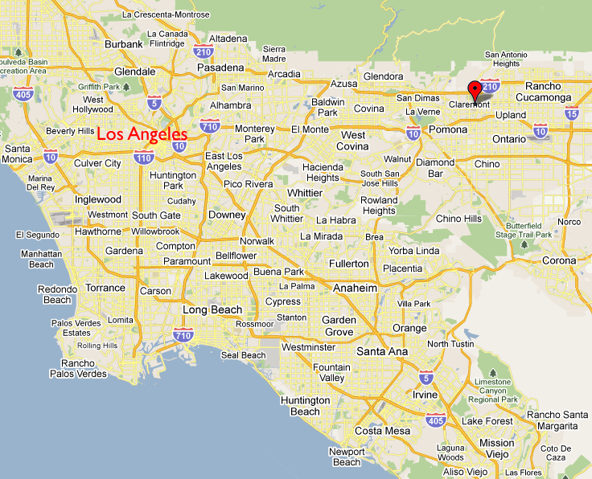
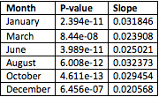

```{r, echo=FALSE}
#climate_data <- read.csv("Student_Folders/Valentina/valentina_cmont_data.csv")

climate_data <- read.csv("/home/CAMPUS/veja2016/Climate_Change_Narratives/Student_Folders/Valentina/valentina_cmont_data.csv")
#str(climate_data)
climate_data$TMAX[climate_data$TMAX==-9999] = NA
climate_data$TMIN[climate_data$TMIN==-9999] = NA
climate_data$NewDate <- as.Date(NA, "%Y-%m-%d")
strDates <- as.character(climate_data$DATE)
climate_data$NewDate[1:2484] <- as.Date(strDates[1:2484], "%Y-%m-%d")
climate_data$NewDate[2485:38063] <- as.Date(strDates[2485:38063], "%m/%d/%Y")
```


## Temperature Data in Claremont, CA
Heat waves in the summer, but really cold days in the winter... Does this mean Claremont is actually heating, cooling or both? 

Located 30.3 miles East of Downtown Los Angeles, the city of Claremont is a very interesting place in terms of weather. While it is close to the coast, it is far enough to keep the coastal climate from interfering with its own, and its desert-like characteristics make it different from other Los Angeles area locations. 

***

Source: Google Maps

Although it is different from many of the other LA County cities, Claremont is still affected by the most significant of the climate change effects: heating. Data collected near Claremont since 1880 has been modeled and shows the increasing heating trend that this area has been experiencing since the late Industrial Revolution. Thus, the effects of these trends are seen in many ways, particulary in water and health. 

##Context: Climate Change in the Greater Los Angeles Area
***

Source: UCLA Climate Report

Like in many of the other areas of Southern California, Los Angeles is being affected by climate change in multiple ways. 
According to the UCLA's "Climate Change in the Los Angeles Region" study, these are some of the trends shown:

- Warming is not uniform across the LA region. Valleys and inland areas warm more than areas near the coast.
- The number of days hotter than 95°F increases across the region, but to a greater extent in the interior compared with coastal areas.

These particularly address Claremont, which is located amongst the "inland areas."

According to NASA: "Average temperatures in California rose nearly two degrees Fahrenheit during the second half of the 20th century, with urban areas blazing the way to warmer conditions." Los Angeles is one of the urban areas with the highest increase. Their records measuring temperatures from 1878 until 2005 indicate a 2.3 degree rise in average temperature. This is primarily due to a rapid increase in greenhouse gas concentrations within the city.

Claremont, although not as urban as Los Angeles, is experiencing similar trends. In addition to the effects of the LA pollution, which definitely reach the Claremont area, is heating in itself.


##Method
In order to account for the heating trend Claremont has been experiencing, temperature records from the National Oceanic and Atmospheric Administration (NOAA) over the last two decades were processed and analyzed. 

I will look at temperature records gathered between 1880 and 2017 in two stations near Claremont. They provide temperature data within a fairly long time frame which makes it reliable when it comes to illustrating an increase in temperature over time in the area. 


```{r, echo=FALSE}
#climate_data$Month = format(as.Date(climate_data$NewDate), format = "%m") 
#climate_data$Year = format(climate_data$NewDate, format="%Y")

#MonthlyTMAXMean = aggregate(TMAX ~ Month + Year, climate_data, mean)

#MonthlyTMAXMean$YEAR = as.numeric(MonthlyTMAXMean$Year) 
#MonthlyTMAXMean$MONTH = as.numeric(MonthlyTMAXMean$Month) 

#str(MonthlyTMAXMean)


#plot(TMAX~YEAR, data=MonthlyTMAXMean[MonthlyTMAXMean$Month=="01",], ty='p',pch=20, xlim=c(1880, #2020)) 
#Jan.lm <- lm(TMAX~YEAR, data=MonthlyTMAXMean[MonthlyTMAXMean$Month=="01",])

#abline(coef(Jan.lm), col='red')

#summary(Jan.lm)

```

## Creating Monthly "TMIN" Means
When analyzing data, the information that resulted in the best models to show the relationship between temperature (in degrees Celsius) and time in Claremont, CA (according to the scientific method framework) was the monthly average minimum temperatures TMIN. These monthly mean temperatures account for temperature measurements starting in 1880 and ending in 2017. I created a linear model that presents the best fitting line for the data and shows the model for the heating trend. 

Below are the figures for the months that show the most significant relationship between the two variables. Temperature (TMIN), is plotted in the vertical axis and time is plotted in the horizontal axis (years). I chose six out of twelve months to have an account for every season and see which months are heating faster. 

We will finally look at the slope, which illustrates the increase in the minimum temperatures for that specific month over the years.


#January
p-value: 2.394e-11
slope: 0.031846

```{r, echo=FALSE}
climate_data$Month = format(as.Date(climate_data$NewDate), format = "%m") 
climate_data$Year = format(climate_data$NewDate, format="%Y")

MonthlyTMINMean = aggregate(TMIN ~ Month + Year, climate_data, mean)
MonthlyTMINMean$YEAR = as.numeric(MonthlyTMINMean$Year)

#fixing data
MonthlyTMINMean$YEAR = as.numeric(MonthlyTMINMean$Year) 
MonthlyTMINMean$MONTH = as.numeric(MonthlyTMINMean$Month) 
#head(MonthlyTMINMean)

#plot(MonthlyTMINMean$TMIN, ty='p')

plot(TMIN~YEAR, data=MonthlyTMINMean[MonthlyTMINMean$Month=="01",], ty='p',pch=20, xlim=c(1880, 2020)) 
Jan.lm <- lm(TMIN~YEAR, data=MonthlyTMINMean[MonthlyTMINMean$Month=="01",])

abline(coef(Jan.lm), col='red')

#summary(Jan.lm)


```


#March
p-value: 8.44e-08
slope: 0.023908

```{r, echo=FALSE}
climate_data$Month = format(as.Date(climate_data$NewDate), format = "%m") 
climate_data$Year = format(climate_data$NewDate, format="%Y")

MonthlyTMINMean = aggregate(TMIN ~ Month + Year, climate_data, mean)
MonthlyTMINMean$YEAR = as.numeric(MonthlyTMINMean$Year)

#fixing data
MonthlyTMINMean$YEAR = as.numeric(MonthlyTMINMean$Year) 
MonthlyTMINMean$MONTH = as.numeric(MonthlyTMINMean$Month) 
#head(MonthlyTMINMean)

#plot(MonthlyTMINMean$TMIN, ty='p')

plot(TMIN~YEAR, data=MonthlyTMINMean[MonthlyTMINMean$Month=="03",], ty='p',pch=20, xlim=c(1880, 2020)) 
Mar.lm <- lm(TMIN~YEAR, data=MonthlyTMINMean[MonthlyTMINMean$Month=="03",])

abline(coef(Mar.lm), col='red')

#summary(Mar.lm)


```

#June
p-value: 3.989e-11
slope: 0.025021

```{r, echo=FALSE}
climate_data$Month = format(as.Date(climate_data$NewDate), format = "%m") 
climate_data$Year = format(climate_data$NewDate, format="%Y")

MonthlyTMINMean = aggregate(TMIN ~ Month + Year, climate_data, mean)
MonthlyTMINMean$YEAR = as.numeric(MonthlyTMINMean$Year)

#fixing data
MonthlyTMINMean$YEAR = as.numeric(MonthlyTMINMean$Year) 
MonthlyTMINMean$MONTH = as.numeric(MonthlyTMINMean$Month) 
#head(MonthlyTMINMean)

#plot(MonthlyTMINMean$TMIN, ty='p')

plot(TMIN~YEAR, data=MonthlyTMINMean[MonthlyTMINMean$Month=="06",], ty='p',pch=20, xlim=c(1880, 2020)) 
Jun.lm <- lm(TMIN~YEAR, data=MonthlyTMINMean[MonthlyTMINMean$Month=="06",])

abline(coef(Jun.lm), col='red')

#summary(Jun.lm)


```


#August
p-value: 6.008e-12
slope: 0.032373

```{r, echo=FALSE}
climate_data$Month = format(as.Date(climate_data$NewDate), format = "%m") 
climate_data$Year = format(climate_data$NewDate, format="%Y")

MonthlyTMINMean = aggregate(TMIN ~ Month + Year, climate_data, mean)
MonthlyTMINMean$YEAR = as.numeric(MonthlyTMINMean$Year)

#fixing data
MonthlyTMINMean$YEAR = as.numeric(MonthlyTMINMean$Year) 
MonthlyTMINMean$MONTH = as.numeric(MonthlyTMINMean$Month) 
#head(MonthlyTMINMean)

#plot(MonthlyTMINMean$TMIN, ty='p')

plot(TMIN~YEAR, data=MonthlyTMINMean[MonthlyTMINMean$Month=="08",], ty='p',pch=20, xlim=c(1880, 2020)) 
Aug.lm <- lm(TMIN~YEAR, data=MonthlyTMINMean[MonthlyTMINMean$Month=="08",])

abline(coef(Aug.lm), col='red')

#summary(Aug.lm)


```


#October
p-value: 4.611e-13
slope: 0.029454

```{r, echo=FALSE}
climate_data$Month = format(as.Date(climate_data$NewDate), format = "%m") 
climate_data$Year = format(climate_data$NewDate, format="%Y")

MonthlyTMINMean = aggregate(TMIN ~ Month + Year, climate_data, mean)
MonthlyTMINMean$YEAR = as.numeric(MonthlyTMINMean$Year)

#fixing data
MonthlyTMINMean$YEAR = as.numeric(MonthlyTMINMean$Year) 
MonthlyTMINMean$MONTH = as.numeric(MonthlyTMINMean$Month) 
#head(MonthlyTMINMean)

#plot(MonthlyTMINMean$TMIN, ty='p')

plot(TMIN~YEAR, data=MonthlyTMINMean[MonthlyTMINMean$Month=="10",], ty='p',pch=20, xlim=c(1880, 2020)) 
Oct.lm <- lm(TMIN~YEAR, data=MonthlyTMINMean[MonthlyTMINMean$Month=="10",])

abline(coef(Oct.lm), col='red')

#summary(Oct.lm)


```

#December
p-value: 6.456e-07
slope: 0.020568

```{r, echo=FALSE}
climate_data$Month = format(as.Date(climate_data$NewDate), format = "%m") 
climate_data$Year = format(climate_data$NewDate, format="%Y")

MonthlyTMINMean = aggregate(TMIN ~ Month + Year, climate_data, mean)
MonthlyTMINMean$YEAR = as.numeric(MonthlyTMINMean$Year)

#fixing data
MonthlyTMINMean$YEAR = as.numeric(MonthlyTMINMean$Year) 
MonthlyTMINMean$MONTH = as.numeric(MonthlyTMINMean$Month) 
#head(MonthlyTMINMean)

#plot(MonthlyTMINMean$TMIN, ty='p')

plot(TMIN~YEAR, data=MonthlyTMINMean[MonthlyTMINMean$Month=="12",], ty='p',pch=20, xlim=c(1880, 2020)) 
Dec.lm <- lm(TMIN~YEAR, data=MonthlyTMINMean[MonthlyTMINMean$Month=="12",])

abline(coef(Dec.lm), col='red')

#summary(Dec.lm)


```

***


Figure#1 shows the months' p-values and slopes. We can determine that the relationship between time and temperature in these cases is valid because every p-value is lower than the null hypothesis 0.05, which allows us to disregard it.

Furthermore, we can see an evident heating trend in the slopes of the minimum monthly mean temperature models. The fact that the slopes are greater than zero shows that there is an increase in the temperatures recorded in Claremont since 1880 until today. Nevertheless, we can also notice there are months that have a bigger slope, and thus a greater heating trend. This is the case of August (slope: 0.032373), which is more intuitive since this month is usually the hottest month in the summer and in the year. Nevertheless, January also shows a very significant heating trend with a slope of 0.031846. 


##Climate Change Impacts on this Region: Literature Review
In the endeavor of getting a clear and well-rounded perspective of the effects of climate change in the region of Claremont, California, I have chosen a couple pieces of scientific literature that account for the social, economic and ecological implications of climate patterns. The topics that these papers cover are related to the effects temperature increase has on the area. One of the most commonly discussed impacts is drought and water supply, however, other more general issues of increased heating are also explored. Interestingly enough, these address socioeconomic impacts that will most likely affect people rather than natural sorroundings.

Beyond having to buy air conditioning for the old residence halls in August and/or a jacket to keep warm in November, we are facing real climate change effects. From potentially getting infected by Zika or having serious water and food shortages, the effects of the heating are making people very worried. "The changing climate will not only bring new diseases, experts say, but also will threaten the water supply, worsen air quality and cardiovascular disease and cause deaths from extreme heat," (LA Times, 2016). Most recently, the mosquitoes that can transmit the Zika virus, commonly found in the tropical areas of the globe, have been spreading over the world. The Aedes mosquitoes have been moving across Southern California since 2015, according to Report 1: Your Health and Climate Change in Los Angeles County, by the LA County Department of public health. They prefer warmer climates. Last year was one of the hottest on record in the Southland, creating conditions "optimal for Aedes to expand," said Kenn Fujioka, manager of the San Gabriel Valley Mosquito and Vector Control District.

Moreover, diseases just related to heat have also increased during the past years. Heat has proven to be deadly in multiple situations: the heatwave of 2006 is a clear example of this. Outdoor workers such as those in agriculture, construction, firefighting, delivery, and service work are particularly at risk from heat-related illnesses. Other vulnerable groups include athletes, young children, the elderly, and people with chronic medical conditions such as diabetes, heart disease, and respiratory disease.

Health is also dangerously threatened by issues regarding water supply, yet another consequence of temperature increase. Various research papers have evaluated the water distribution system for Southern California, the Greater LA area, and specifically the eastern part of LA, which is where Claremont is located. People are worried by the long-term effects of climate change on this resource. In fact, a recent Pomona graduate, Frank Lyles did his thesis on this topic. He claims that the heating trend expected for the upcoming years is a serious threat to water supply systems such as the Six Basins Aquifer: which distributes water in eastern Los Angeles and western San Bernardino counties.
 
Lastly, Wildfires are also a major impact of hotter temperatures. Particularly for areas close to forests or mountains (Claremont), wildfires are an important risk for the people and the natural surroundings of these areas. Over the last century, 11 of the 20 largest fires in California took place between 2003 and 2013. The largest and most destructive of these to ever occur in Los Angeles County was the Station Fire, in 2009. "A large quantity of dry brush fuel, caused by three years of drought, along with temperatures exceeding 100°F for much of late August 2009, contributed to the fire’s severity," (LA County Public health Department).


##Conclusions

The heating trend is evident, not only for the Greater LA Area, but also for Claremont especifically. This has already shown to be threatining for people and the natural surroundings. 

Although most of us will only be here for four years, as students (who account for a significant part of the population of Claremont), we carry a big responsibility in at least knowing what is happening with the environment around us. These are a few ways to get informed about Claremont and LA's sustainable policies: http://www.ci.claremont.ca.us/government/departments-divisions/planning-division/sustainability
http://www.laregionalcollaborative.com/

There is still a way to stop the heating! Take part in the action. 

##Works Cited
•	Pulido-Velazquez, M., Jenkins, M. W., & Lund, J. R. (2004). Economic values for conjunctive use and water banking in southern California. Water Resources Research, 40(3), W03401. https://doi.org/10.1029/2003WR002626

•	Lyles, Frank, "Climate Change Adaptation for Southern California Groundwater Managers: A Case Study of the Six Basins Aquifer" (2017). Pomona Senior Theses. 172. http://scholarship.claremont.edu/pomona_theses/172

•	Rhoades EK, Contreras C, Garrett SK, Bakshi M, Bellomo AJ. Your Health and Climate Change in Los Angeles County. Los Angeles County Department of Public Health. August 2014. 

•	https://www.ioes.ucla.edu/project/climate-change-in-the-los-angeles-region/

•	http://www.latimes.com/local/cityhall/la-me-climate-health-20160223-story.html

•	http://www.businessinsider.com/climate-change-affect-on-los-angeles-2014-6


