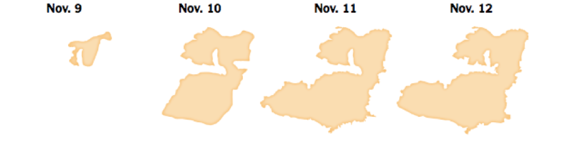

## Emergency Decision Making

The recent fire in Paradise, California brought criticism of local officials’ inadequate evacuation procedure. In response to a previous wildfire scare in town, the mayor of Paradise decided to limit evacuation alerts to only residents who were directly bordering the fire instead of evacuating the whole town. Emergency managers did not have adequate information about the fire’s direction and potential path or the level of danger it posed to town residents. As a result, many residents did not have time to evacuate, causing a major traffic backup and posing an unprecedented amount of danger to fire evacuees. 
City officials make the decisions regarding evacuation calls and procedure. Most cities lack access to advanced modeling technology to understand when fire proximity is at an unsafe distance to residents. New models to evaluate current methods of evacuation have recently been developed to more accurately represent the present danger and paths to safety that are available to residents in immediate wildfire danger. 

##Modeling Wildfire Danger

In California, no modeling system is available to local governments that can track in real-time the area a wildfire is burning and the time residents need to safely evacuate. (Ronchi, 2017). Evacuations are at the discretion of city emergency managers and often are enacted with little information informing them. Figure 1 shows a Geographic Information System (GIS) modelling of the Woolsey Fire over the course of three days, published after the fire had been put out. GIS mapping like this often show the spatial proximity of a fire after the fire has moved or been put out. Real time modeling is unavailable to emergency managers to make decisions about evacuation. Because of this, situations develop where mass evacuation alerts lead to traffic backup that is more dangerous than if residents had sheltered in place. (Li, 2018) . 

 A GIS modeling system called HURREVAC is used by the Federal Emergency Management Agency to manage hurricane evacuation orders for coastal communities (Cova, 2005). This system combines a prior evacuation time estimate with concurrent data on hurricane speed and direction to create a buffer arc for a county. When the edge of a mapped hurricane overlaps with the buffer arc, an evacuation is triggered. A similar modeling system could be used to model fire evacuation, but mapping must be more detailed because of the significantly smaller scale on which wildfires occur. 
An evacuation trigger point is a previously decided physical point that if crossed by wildfire suggests to an emergency manager to call for evacuation. Examples of physical trigger points include roads, rivers, and regional landmarks (Cova, 2005). Recent research suggests a transition from physical evacuation trigger points to GIS modeled trigger points much like the buffer arcs used in the HURREVAC system. This real-time modelling provides emergency managers with a more nuanced understanding of ongoing wildfires and subsequently produce more informed decisions about resident evacuation. 
Open-source software package including FLAMMAP and FARSITE, made available by the USDA Forest Service Fire Sciences, can compute rate, direction, and elliptical patterns of wildfire spread. (Cova, 2005)This resource alone does not provide a realistic model to emergency managers to inform evacuation decisions. To create the most effective model for potential fire evacuation, traffic patterns and housing density should also be taken into account to prevent potential congestion of exit routes. Figure 1 demonstrates use of this factor by mapping how spatial proximity of houses and cars interact with a modeled fire perimeter and a community’s trigger buffer.  

Triggers produced in wildfire evacuation models must exchange data between models of wildfire spread, pedestrian movement, and traffic configuration (Ronchi, 2017) in order to accurately reflect wildfire danger. 

An open-source traffic simulation software called MATSim can be used to model how transportation patterns effect evacuation time (Li, 2018). This software supports activity based traffic simulation which takes time of day into account, predicting whether most people are at work, in transit, or at home. By coupling simulated data from MATSim on resident distribution in a city with data on fire location in FLAMMAP or FARSITE, emergency managers can oversee a safer evacuation process. 

##Technology Looking Forward

A modeling system that integrates both traffic flow and wildfire spread should be made available to local governments across the state of California. With the ever-increasing threat of wildfires to residents living in Wildland Urban Interfaces, CalFire should prioritize the creation of this system. Open-source software is already available to model both traffic flow and wildfire spread, so investment into this collaborative wildfire modeling system would be a relatively low cost with a significant reward. Technology to understand and track wildfire danger has been available for multiple years. CalFire has the responsibility to harness this available technology in a way that promotes more advanced wildfire evacuation procedure among localities across the state. 

##Citations

Bloch, Matthew, et al. “California Fires Map: Tracking the Spread.” The New York Times, 11 Nov. 2018. NYTimes.com, https://www.nytimes.com/interactive/2018/11/11/us/california-fires-tracker.html, https://www.nytimes.com/interactive/2018/11/11/us/california-fires-tracker.html.

Cova, Thomas J., et al. “Setting Wildfire Evacuation Trigger Points Using Fire Spread Modeling and GIS.” Transactions in GIS, vol. 9, no. 4, 2005, pp. 603–617., doi:10.1111/j.1467-9671.2005.00237.x.

Li, Dapeng, Thomas J. Cova, and Philip E. Dennison. "Setting Wildfire Evacuation Triggers by Coupling Fire and Traffic Simulation Models: A Spatiotemporal GIS Approach." Fire Technology (2018): 1-26.

Ronchi, Enrico, et al. "Framework for an integrated simulation system for Wildland-Urban Interface fire evacuation." Proc Int Conf Res Adv Technol Fire Saf. Vol. 2017. 2017.

