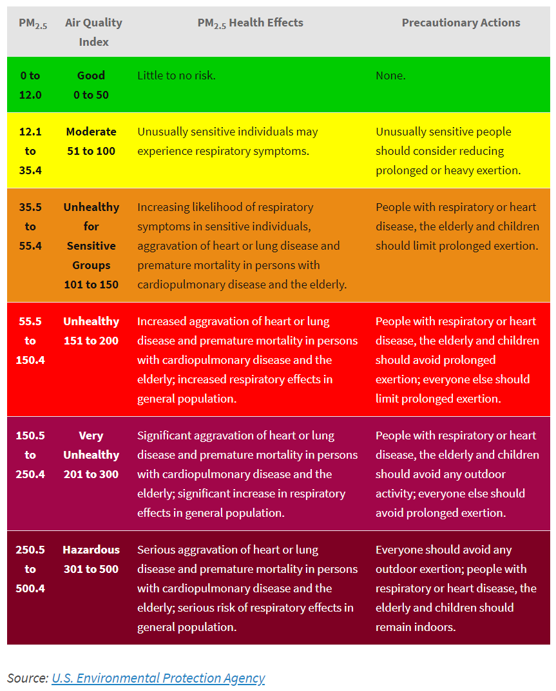
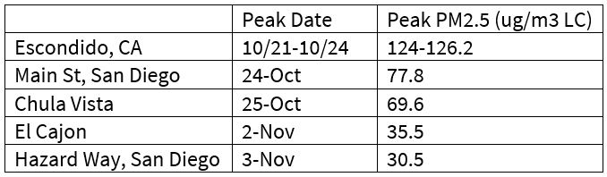

```{r setup, include=FALSE}
knitr::opts_chunk$set(echo = TRUE)
```

PM2.5 is a pollutant regulated by the Clean Air Act (Strand et al. 2012). It causes heart and lung problems with longer term exposure leading to worse symptoms (Strand et al. 2012). PM2.5 is atmospheric particulate matter (PM) with a diameter of less than 2.5 micrometers, about 3% of the diameter of human hair (Miettinen 2018). Wildfires are a major source of PM2.5. In 2017, California ranked third in terms of acres burned (Insurance Information Institute, Inc.  2018). Large California wildfires are not as uncommon as you might think. On July 23th, 2018, the Carr Fire became the state's 6th most destructive fire (Insurance Information Institute, Inc.  2018). Four days later, the Mendocino Complex Fire began and grew to become the state's largest fire, burning over 459,000 acres (Insurance Information Institute, Inc.  2018). Not only do wildfires cause significant property damage and loss of life but also create significant health risk due to PM2.5 exposure that needs to be further studied (Miettinen 2018). 

According to the The American Heart Association: “Exposure to PM <2.5 um in diameter (PM2.5) over a few hours to weeks can trigger cardiovascular disease-related mortality and nonfatal events; longer-term exposure of a few years increases the risk for cardiovascular mortality to an even greater extent than exposures over a few days and reduces life expectancy within more highly exposed segments of the population by several months to a few years” (Brook et al. 2010).

On December 14, 2014, the EPA strengthened air quality standards to reflect a 12μg/m3 primary annual standard which reflects the normal, safe concentration that a person should experience over the course of a year. Levels of PM2.5 are measured against this standard to understand which areas have higher or lower levels than the national standard. For example, the 2007 Southern California wildfires had PM2.5 levels above 35.4μg/m3 for more than a 24 hour period (EPA 2012). These levels above the standard are considered unhealthy.


**24-Hour PM2.5 Standard (μg/m^3^)**
```{r pressure, echo=FALSE, fig.cap=" (Miettinen 2018).", out.width = '45%'}

```


**2007 Southern Californian Wildfires**

The Witch Fire was the second largest wildfire in the 2007 California wildfire season, claiming over 247,000 acres and 1,265 residential buildings (Wikipedia 2018). It lasted from October 21, 2007 to November 13, 2007. It started in Witch Creek Canyon, near Santa Ysabel and spread throughout San Diego County (Wikipedia 2018). The Harris, Witch, McCoy Fire, Coronado Hills Fire, Rice, Poomacha, Ammo (Horno) Fire, and Wilcox Fire also burned in San Diego County during this wildfire period. (Wikipedia 2018). 

To study the effects of PM2.5 in the Witch Fire and surrounding fires, I looked at daily summaries from the “AQS Data Mart which contains ambient air pollution data collected by EPA, state, local, and tribal air pollution control agencies.” The data originally consisted of 5 monitoring stations in San Diego County (EPA 2008). Stations are named by the city where they are located and/or by the EPA's station number. Street names were also provided for the two monitoring stations in the city of San Diego.The pre-fire period was from October 15, 2007 to October 20, 2007. October 21, 2007 to November 13, 2007 was the wildfire period. November 14, 2007 to December 31, 2007 was set as the post-fire period. The 12μg/m^3^ primary annual standard and 35.4μg/m^3^ safety threshold were used primarily to extrapolate health effects with the understanding that longer exposure to PM2.5 could decrease the PM2.5 levels necessary to cause negative health effects.

**Graph of Daily Mean PM2.5 Concentration for San Diego County from October 15-December 31, 2017**
```{r,echo=F}
import=read.csv("ad_viz_plotval_data (1).csv")
strDates <- as.character(import$Date)
#head(strDates)
import$NewDate <- as.Date(strDates, "%m/%d/%Y")
#head(import)
###subset

newdata <- subset(import, AQS_SITE_ID == 60730001, select=c(Daily.Mean.PM2.5.Concentration, NewDate))

newdata2 <- subset(import, AQS_SITE_ID == 60730003, select=c(Daily.Mean.PM2.5.Concentration, NewDate))

newdata3 <- subset(import, AQS_SITE_ID == 60730006, select=c(Daily.Mean.PM2.5.Concentration, NewDate))

newdata4 <- subset(import, AQS_SITE_ID == 60731002, select=c(Daily.Mean.PM2.5.Concentration, NewDate))

newdata5 <- subset(import, AQS_SITE_ID == 60731010, select=c(Daily.Mean.PM2.5.Concentration, NewDate))

datarange <- subset(newdata, NewDate >= "2007-10-15" & NewDate <= "2007-12-31")
#expression(paste("Average Conc of S- on plates ( ", mu, "Moles/cm"^"2"),))

plot(Daily.Mean.PM2.5.Concentration~NewDate, data=datarange, ty='l',  ylim=c(0,130), col = "blue", xlab="Date (days)", ylab=expression(paste("Daily Mean PM2.5 Concentration (", mu, "g/m"^"3")))

abline(h=35.4, col="black") 
abline(h=12.4, col="pink") 
lines(newdata2$NewDate, newdata2$Daily.Mean.PM2.5.Concentration, col = "red")
lines(newdata3$NewDate, newdata3$Daily.Mean.PM2.5.Concentration, col = "green")
lines(newdata4$NewDate, newdata4$Daily.Mean.PM2.5.Concentration, col = "orange")
lines(newdata5$NewDate, newdata5$Daily.Mean.PM2.5.Concentration, col = "brown")


###legend(1, 95, legend=c("Line 1", "Line 2", "Line 3", "Line 4", "Line 5"),
###       col=c("blue", "red", "green", "orange", "brown"), lty=1:2, cex=0.8)

legend(as.Date("2007-11-15"), 110, legend=c("60730001,Chula Vista", "60730003, El Cajon", "60730006, Hazard Way, San Diego", "60731002, Escondido, CA", "60731010, Main St, San Diego, CA", expression(paste("35.4", mu, "g/m"^"3", "LC safety threshold")), expression(paste("35.4", mu, "g/m"^"3", "primary annual standard"))), col=c("blue", "red", "green", "orange", "brown", "black", "pink"), lty=1, cex=0.65)
#import$Date2 <- as.Date( as.character(import$NewDate), "%m/%d/%Y")

```

**Context:** Strong Santa Ana winds pushed the fires west toward the coast forcing over 500,000 people to evacuate. On Monday, October 22, the Santa Ana winds peaked with sustained wind speeds of 90mph (140km/h). 

**Analysis: How does proximity to wildfire affect PM2.5 exposure and health risk?**

Escondido, CA had the highest concentration of PM2.5 after Oct 21 until Oct 24, peaking at 126.2μg/m^3^ on Oct 24 while Main St, San Diego and Chula Vista peaked at 77.8 and 69.62g/m^3^, respectively on Oct 24. 


```{r 1, echo=FALSE, fig.cap="Peak Days of PM2.5 for the 2007 Southern California Wildfires", out.width = '45%'}

```

```{r press, echo=FALSE, fig.cap="PM2.5 on Oct 26/07 *Miles not shown reflect >13mi distance from fire", out.width = '45%'}
knitr::include_graphics("peak1.JPG")
```

```{r 2, echo=FALSE, fig.cap="Map of 2007 California wildfires as of Oct 26, 2007. The Harris, Witch, Rice, Poomacha, Horno, Wilcox, and Rosa Fires are also included. (Ranger Al 2007). Monitoring stations added by Baili Zhong in blue. Map Link: https://www.google.com/maps/d/u/0/viewer?mid=1iamjtnoH46clRmWGmxgovE_mn_TLmMRE&ll=32.772992998925375%2C-117.0564055829168&z=11", out.width = '40%'}
knitr::include_graphics("pic.png")
```

######*Stations are referred to by location and proximity to wildfire as of Oct 26 according to the above map.

The Escondido, CA station had the closest proximity to the Witch Fire perimeter with a distance of about 2.41mi and had the highest PM2.5 levels during most of the wildfire period from Oct 21-Nov 13. As of Oct 26, Chula Vista was 5.01mi from the Harris Fire and had the second highest peak on Oct 25, followed closely by El Cajon which was 4.77mi away from the Harris Fire. The Hazard Way, San Diego station was 9.05mi from the Witch Creek Fire and 12.5mi away from the Harris Fire and had the lowest PM2.5 levels, only reaching a high of 30.6μg/m^3^ during the wildfire period--below the 35.4μg/m^3^ 24-hr safety threshold. Main St, San Diego was 9.29mi away from the Harris Fire but had the third highest peak of 69.6μg/m^3^ on Oct 27. Despite the distance from the fires on Oct 26, the PM2.5 levels were relatively similar on Oct 26 except for Escondido which had the closest proximity to the fire and was the only one above the 24hr safety threshold. Thus, proximity does not necessarily dictate PM 2.5 levels. Factors such as wind and weather conditions also play a major part. 

The Witch Fire perimeter was fully contained by Nov 6. By Nov 11-Nov 12, PM2.5 levels throughout the San Diego County lowered to near 12μg/m^3^ primary annual standard levels, except for El Cajon which still had levels of 35.5μg/m^3^ on Nov 11. 

It is interesting that the PM2.5 levels for all 5 stations started rising after Nov 17 when the fires were extinguished on Nov 13. PM2.5 levels last much longer than the initial wildfire period and could lead to latent health complications. Furthermore, only by Dec 8 did the last monitoring station, Escondido, reach safe levels under 35.4μg/m^3^. Only by Dec 20 did PM2.5 levels decrease to 12.4μg/m^3^ primary annual standard levels. PM2.5 levels do not end with the quenching of wildfires but can fluctuate around unsafe levels for at least a month according to the PM2.5 data collected during the 2007 Southern California wildfires. Closer proximity to wildfires usually leads to higher PM2.5 rates even a month after the fire has been put out but weather conditions also play a huge role. A study by Ikuho et al. 2016 estimates the medical costs of the 2007 Southern California wildfires to be $3.4 million. However, the true cost is much higher as the $3.4 million figure does not consider the cost of mortality, symptoms not reported to hospitals, or the costs of avoiding wildfire smoke. Wildfires cause serious health effects and can lead to higher hospital admissions and social consequences long after and before fire quenching—a topic further explored by the articles by Johnathan Gunasti, Mia Kania, and Mason Asato.

**Limitations:** The EPA data set used in this study only measured PM2.5 and did not include other harmful pollutants such as CO, Pb, NO~2~, Ozone, PM10, and SO~2~.  Furthermore, the data did not extend further than the 2007 year and thus, PM2.5 concentrations may fluctuate longer than the observed period after a major wildfire, increasing health risk.  Wind conditions besides the Santa Ann were not mentioned and could explain the discrepancy between Hazard Way, San Diego and Main St, San Diego PM2.5 levels despite their <0.3mi difference from the wildfire perimeters. Furthermore, the Map of 2007 California wildfires presented only showed the fire perimeters as of Oct 26, 2007. Thus, the effect of wildfire proximity on PM2.5 levels could be further explored with more daily analyses of fire perimeter to monitoring station distance. 

**LITERATURE CITED**

Brook, R. et al. 2010. “Particulate matter air pollution and cardiovascular disease: an update to the scientific statement from the American Heart Association.” Circulation: Journal of the American Heart Association. vol. 121, pp. 2331–2378. 

Kochi, Ikuho. et al. 2016. “Valuing Morbidity Effects of Wildfire Smoke Exposure from the 2007 Southern California Wildfires.” Journal of Forest Economics, vol. 25, 2016, pp. 29–54, doi:10.1016/j.jfe.2016.07.002

Insurance Information Institute, Inc.  2018. “Facts + Statistics: Wildfires.” https://www.iii.org/fact-statistic/facts-statistics-wildfires

Miettinen, Ville. 2018. “What is PM2.5 and Why You Should Care.” https://blissair.com/what-is-pm-2-5.htm

Ranger Al. 2007. “Witch Fire Map Oct 26/07.” http://www.fireupdate.com/2007/2007maps.htm

Strand, T. et al. 2012. “Analyses of Bluesky Gateway PM2.5 Predictions during the 2007 Southern and 2008 Northern California Fires.” Journal of Geophysical Research D: Atmospheres, vol. 117, pp. 1-14, doi:10.1029/2012JD017627

United States Environmental Protection Agency (EPA). 2008. “Outdoor Air Quality Data.” https://www.epa.gov/outdoor-air-quality-data/download-daily-data   

United States Environmental Protection Agency (EPA). 2012. “REVISED AIR QUALITY STANDARDS FOR PARTICLE POLLUTION AND UPDATES TO THE AIR QUALITY INDEX (AQI).” https://www.epa.gov/sites/production/files/201604/documents/2012_aqi_factsheet.pdf

Wikipedia contributors. 2018. "2007 California wildfires." 2018. https://en.wikipedia.org/wiki/2007_California_wildfires  

Wikipedia contributors. 2018. "Witch Fire." 2018. https://en.wikipedia.org/wiki/Witch_Fire


