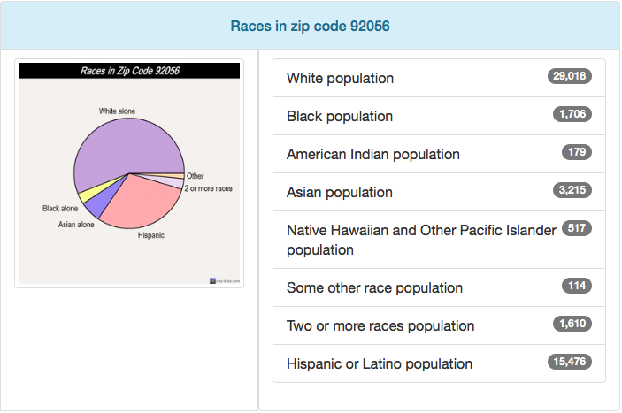

```{r setup, include=FALSE}
knitr::opts_chunk$set(echo = TRUE)
```

## Introduction

Within our group we had many interests from, health impacts to socio economic factors affecting communities and how fire policy has impacted certain communities. After combining all of our interest, we came up with a group question of, “After a forest fire, is there a difference in the number of cardiovascular and pulmonary hospital admissions among the elderly in primarily white and non-white neighborhoods?” Our null hypothesis is that there is no statistical difference in hospital admissions between residents of geographically proximate white and non-white neighborhoods. I chose to analyze socio economic factors that helps explain the difference in hospital admissions between the two communities. Also, I am looking at social identities at the neighborhood level and how they compare to overarching trends. 

## Background of Fire

The fire that we are analyzing data from is the Witch Fire which happened in the San Diego County from October 21st, 2007 through November 13th, 2007. The Witch Fire also known as the Witch Creek Fire and the Witch–Guejito–Poomacha Complex Fire. It was the second largest wildfire of the 2007 California wildfire season. The Witch Fire burned 197,990 acres (801 km2) alone, however, it merged with the Poomacha and McCoy Fires, where it was then called the Witch–Guejito–Poomacha Complex Fire that had a total burn area of 247,800 acres (1,003 km2). The Witch–Poomacha Fire caused at least $1.3 billion (2007 USD) in insured damages alone, becoming the costliest wildfire of 2007. As of 2018, the Witch Fire is the ninth-largest wildfire in modern California history, as well as the fifth-most destructive wildfire on record in California. 

```{r Witch Fire, echo=FALSE, out.width = '100%'}
knitr::include_graphics("Unknown.png")
```


## Tri-City Medical Care

There are two hospital admission data that we are analyzing, the first hospital is Tri-City Medical Care and the second is Scripps Mercy Hospital. When comparing Tri-City Medical Care hospital data admission to socio economic factors, I looked at the 92056 zip code of San Diego County which includes the cities of: Oceanside, Carlsbad and Vista. There is an estimated population of 54,693 residents in this zip code. The land area is 12.4 square miles and there is an average of 4,407 people per square mile. The Average Adjusted Gross Income (AGI) for the 92056 zip code in 2012 was $56,926. The Average Adjusted Gross Income for the state of California was $72,726. In the graphs below, it shows the distribution of Residents’ Ages in the 92056 county. The median resident age is 40.4 years old. When looking at the racial statistics of the community, about 53% of the population is White and 28% is Hispanic or Latino. 

```{r 92056 Race, echo=FALSE, out.width = '100%'}

```

```{r 92056 Age, echo=FALSE, out.width = '100%'}
knitr::include_graphics("za92056.png")
```

## Scripps Mercy Hospital
The second hospital admission data that we analyzed is the Scripps Mercy Hospital. The Scripps Mercy Hospital is part of the 92103 zip code which includes the city of San Diego. The estimated zip code population in 2016 was 34,358 residents. The land area: 3.8 square miles with a population density of 9,123 people per square mile. Average Adjusted Gross Income (AGI) for the 92103 zip code in 2012 was $84,695. The graphs below shows that the median age is 39.5 years old. Racial statistics include: 67% of the population is White and 13% of the population is Hispanic or Latino.

```{r 92103 Race, echo=FALSE, out.width = '100%'}
knitr::include_graphics("92310Race.png")
```

```{r Age, echo=FALSE, out.width = '100%'}
knitr::include_graphics("za92103.png")
```

## Tri-City Medical Care Race Admission Data

The first data that I am going to analyze is the racial statistics of the Tri-City Medical Care hospital admission data from October 15th, 2007 through November 20th, 2007. When looking at the graph there was a spike on October 22nd, 2007, which was the second day after the fire first started. However, after that spike there was a pretty constant hospital admission. The average hospital admission throughout this time period was 180.97 patients.


```{r TCRace, echo=FALSE}
race=read.csv("Daily ED Admits 10-15-2007 to 11-20-2007, Select Facilities .csv")
race$Date = as.Date(race$Admission.Date, format = "%y-%m-%d")
race$Date = format(as.Date(race$Admission.Date), "%m/%d")
colfunc <- colorRampPalette(c("red", "yellow"))
colfunc(10)
race.data = matrix(c(race$White, race$Hispanic), nrow=length(race$White))
barplot(t(race.data), names.arg=race$Date, col=colfunc(2), ylim=c(0, 200), las=1)
legend("top", inset = 0.00, c("White", "Hispanic"),  fill=colfunc(2), horiz=TRUE, cex=1.1, box.lty=0) 
```


## Tri-City Medical Care Age Admission Data

When it came to age statistics, there was pretty consistent data throughout the time period for all ages except there were three days from October 27th through October 29th where hospital data for ages 0 through 18 spiked. 

```{r TCAge, echo=FALSE, fig.width=7,fig.height=6,fig.cap="* = admission data < 11"}
age=read.csv("TC_Age.csv")
age$Date = as.Date(age$Admission.Date, format = "%y-%m-%d")
age$Date = format(as.Date(age$Date), "%m/%d")
colfunc <- colorRampPalette(c("blue", "lightblue"))
colfunc(10)
age.data = matrix(c(age$X0.to.18,age$X19.to.24,age$X25.to.64,age$X65.), nrow=length(age$X0.to.18))
barplot(t(age.data), names.arg=age$Date, col=colfunc(4), ylim=c(0, 250), las=1)
text(15, 100, "*")
text(32,100,"*")
legend("top", inset = 0.00, c("0-18 yrs old", "19-24 yrs old", "25-64 yrs old", "65+ yrs old"),  fill=colfunc(4), horiz=TRUE, cex=1.1, box.lty=0) 
```

## Tri-City Medical Care Respiratory Admission Data

This data set looks at the patients who were treated for respiratory issues. There is a similar trend to the rest of the data where there was a spike in the first couple days of the fire, then a decrease in patients and finally an increase again towards the end of the fire.


```{r TCRes, echo=FALSE, fig.width=7,fig.height=6,fig.cap="* = admission data < 11"}
res=read.csv("TC_Res.csv")
res$Date = as.Date(TCres$Admission.Date, format = "%y-%m-%d")
res$Date = format(as.Date(TCres$Admission.Date), "%m/%d")
colfunc <- colorRampPalette(c("green", "lightgreen"))
colfunc(10)
res.data = matrix(c(TCres$Respiratory), nrow=length(TCres$Respiratory))
barplot(t(res.data), names.arg=res$Date, col=colfunc(4), ylim=c(0, 20), las=1)
text(4.5,5,"*")
text(20,5,"*")
text(24.5,5,"*")
text(39,5,"*")
text(43,5,"*")
text(45,5,"*")
legend("topright", inset = 0.00, c("Respiratory Data"),fill=colfunc(1), horiz=TRUE, cex=1.1, box.lty=0) 
```

## Scripps Mercy Hospital Race Admission Data

When analyzing the racial statistics of the Scripps Mercy Hospital admission data from October 15th, 2007 through November 20th, 2007, there was a similar spike of hospital admission data the second and third day of the fire, October 22nd and October 23rd, 2007. However, after that there was a mild decrease in hospital admission data.This trend was similar the Tri-City Medical Care hospital admission data.


```{r SRace, echo=FALSE, fig.width=7,fig.height=6,fig.cap="* = admission data < 11"}
SRace=read.csv("SRace.csv")
age$Date = as.Date(import$Admission.Date, format = "%y-%m-%d")
age$Date = format(as.Date(import$Admission.Date), "%m/%d")
colfunc <- colorRampPalette(c("purple", "yellow"))
colfunc(10)
SRace = matrix(c(SRace$White,SRace$Hispanic), nrow=length(SRace$White))
barplot(t(SRace), names.arg=age$Date, col=colfunc(2), ylim=c(0, 150), las=1)
legend("top", inset = 0.00, c("White", "Hispanic"),  fill=colfunc(2), horiz=TRUE, cex=1.1, box.lty=0) 
```


## Scripps Mercy Hospital Age Admission Data

When analyzing this there are lots of missing data but that is because when hospital admissiosn are less that 11 patients then it does not record that data for that category/day. However, inferring from this graph, there is a similar trend where there is a spike in the beginning days of the fire then a decrease and then again another spike towards the end of the fire.


```{r SAge, echo=FALSE, fig.width=7,fig.height=6,fig.cap="* = admission data < 11"}
age=read.csv("SAge.csv")
age$Date = as.Date(age$Admission.Date, format = "%y-%m-%d")
age$Date = format(as.Date(age$Date), "%m/%d")
colfunc <- colorRampPalette(c("orange", "blue"))
colfunc(10)
SAge.data = matrix(c(SAge$X0.to.18,SAge$X19.to.24,SAge$X25.to.64,SAge$X65.), nrow = length(SAge$X0.to.18))
barplot(t(SAge.data), names.arg=age$Date, col=colfunc(4), ylim=c(0, 200), las=1)
text(0, 100, "*")
text(1,100,"*")
text(2, 100, "*")
text(3,100,"*")
text(5.5, 100, "*")
text(9,100,"*")
text(11.5, 100, "*")
text(14,100,"*")
text(15, 100, "*")
text(16,100,"*")
text(17, 100, "*")
text(18, 100, "*")
text(20, 100, "*")
text(21, 100, "*")
text(25,100,"*")
text(26,100,"*")
text(27, 100, "*")
text(29.5,100,"*")
text(33, 100, "*")
text(34,100,"*")
text(35, 100, "*")
text(36,100,"*")
text(39, 100, "*")
legend("top", inset = 0.00, c("0-18 yrs old", "19-24 yrs old", "25-64 yrs old", "65+ yrs old"),  fill=colfunc(4), horiz=TRUE, cex=1.1, box.lty=0) 
```


## Scripps Mercy Hospital Respiratory Admission Data

Similar to the graph above, there are quite a few missing days becuase there was less than 11 respiratory patients for that day. However, when analyzing that data that we do have, we can clearly see that the fire caused a significant increase in respiratory patients, then it went down as the fire continued and then increased again at the end of the fire.


```{r SRes, echo=FALSE, fig.width=7,fig.height=6,fig.cap="* = admission data < 11"}
res=read.csv("SRes.csv")
res$Date = as.Date(SRes$Admission.Date, format = "%y-%m-%d")
res$Date = format(as.Date(SRes$Admission.Date), "%m/%d")
colfunc <- colorRampPalette(c("pink", "lightpink"))
colfunc(10)
SRes.data = matrix(c(SRes$Respiratory), nrow = length(SRes$Respiratory))
barplot(t(SRes.data), names.arg=res$Date, col=colfunc(1), xlim=c(0,70),  ylim=c(0, 25), las=1)
legend("topright", inset = 0.00, c("Respiratory Data"),fill=colfunc(1), horiz=TRUE, cex=1.1, box.lty=0) 
```


## Data Analysis

Even though the overall arching trend was a small spike at the beginning of the fire and a constant/minor decrease afterwards, when it came to fire related hospitalization admissions, there was an increase from the fire. When looking at the respiratory hospital admissions data, which is most commonly associated with fire related health impacts, there was a spike at the beginning and end for both hospitals. When taking the averages of respiratory hospital admissions to total hospital admissions, respiratory hospital admissions made up 7.0% of hospital admissions for the Scripps Mercy Hospital but in the Tri-City Medical Care, it made up 8.5% of hospital admissions.

There are endless possibilities that could explain these various trends but one possible explanation for why there was a spike in hospital admission for ages 0 through 18 for the Tri-City Medical Care admission data is that since the evacuation process was still in the early process, people were breathing in smoke and parents admitted their children to the hospital to make sure they were okay. One possible explanation of why the trend decreased was because people were evacuating so they may have left the San Diego County area. When analyzing the data for respiratory admissions, a possible explanation of an increase of respiratory hospital admissions at the end of the fire was that if people did evacuate, they started to come back to their homes and got themselves checked out.

## Conclusion

In conclusion, this data set supports our null hypothesis and states that it did not show any overall trends of hospital admission for racial and age data in the Tri-City Medical Care Hospital and the Scripps Mercy Hospital. However, there was a significant increase in the number of respiratory hospital admissions. From the data we were given, we did not have enough information to conclude if there was an overall trends of respiratory hospital admission for racial and age data. There are many variables and explanations that would require more research such as finding out what amount of the population evacuated, where they evacuated too, the wind patterns of the San Diego County and if the smoke was blown into the cities or into the mountains, and more that would help explain the overall trends of hospital admissions. 
