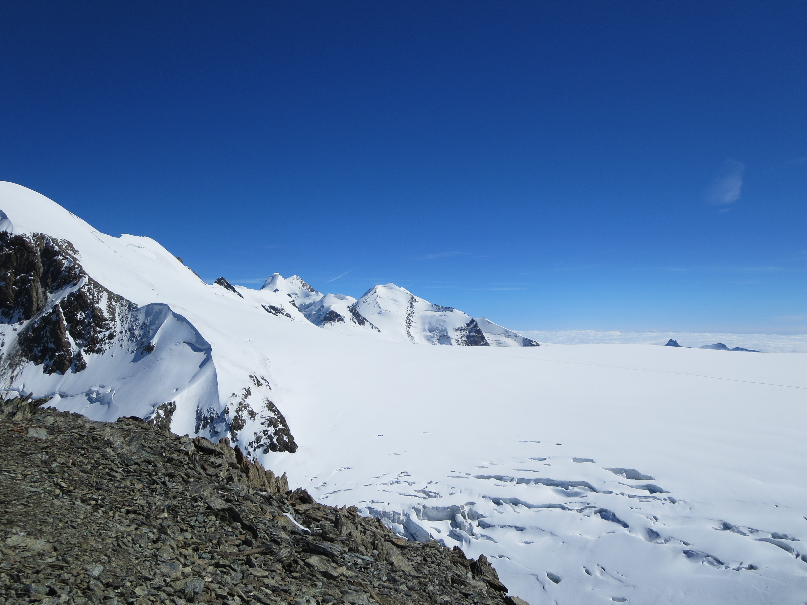

```{r, include=FALSE}
options(tinytex.verbose = TRUE)
```
<style>
body {
    background-color: #FFEDBA;
}

div.a {
  text-align: center;
}

.caption {
    font-size: x-small;
}
</style>

```{r setup, include=FALSE}
knitr::opts_chunk$set(echo = TRUE)
```

<div class="a">
## Climate Change in the Swiss Alps

</div>
The majestic and serene Alps are being gravely impacted by climate change (Fig. 1). Scientists have found temperatures to be increasing in the Alpine region, with the greatest temperature increases in cantons Geneva and Valais: Switzerland’s temperature has increased over twice the global average of 1ºC in the 20th century, with the majority of warming occurring in the 80s-00s (Rebetez and Dobbertin 2004). With increasing temperatures comes decreasing snow cover and increasing glacier reduction. In fact, the Alpine glaciers have lost about 60% of their volume since 1850, the number of annual days of snowfall at 2,000m above sea level has dropped by 20%, while the number of annual days of snowfall below 800m above sea level has dropped by 50% (MeteoSwiss 2018). 

Alpine glaciers and precipitation patterns have hidden impacts of staggering magnitudes: Switzerland, France, Germany, and Italy all rely on the Alps to irrigate four major basins (the Rhine, the Rhone, the Po, and the Inn). In fact, the Alps are known as the “water towers of Europe” for the 150,000,000 people who live in these basins and depend on alpine water (Beniston 2019). Water is collected and stored as snow and ice in glaciers and glacial lakes during the winter and later released with the ice and snowmelt in the hotter months to supply neighboring basins. However, with an increase in temperatures, run-off is expected to increase in the winter and decrease in the summer, creating an imbalance in the supply-and-demand chain along the four major basins (Hill 2012). 

Right in the middle of the Rhône basin valley is the capital of Valais, Sion (Fig. 2). At an elevation of 1,611 feet, Sion is not a ski-resort town but still relies on the tertiary (service) sector to feed its economy. Its main agro-economic activities include cultivation of permanent crops (orchards and vineyards) and livestock production (Fuhrer et al. 2014). Therefore, the city would be gravely economically impacted by projected inconsistent flooding and drought periods as a result of climate change. Already Sion has suffered from climate change: in 2018, Sion saw significantly warmer temperatures compared to the 1960-1991 averages. There were only seventy-three frost days (days in which the average temperature was below 0ºC) compared to the ninety-seven expected, while there were 125 summer days (days in which the average temperature was over 25ºC) compared to an expected norm of fifty-five (MeteoSwiss 2019). I created the first null hypothesis, that there is no significant temperature increase in Sion across all months. I created another null hypothesis that stated there would be no change in snow depth in winter months (November-March). 

```{r picture1, fig.cap="The Matterhorn, Valais Canton (Shinn 2015)", echo=FALSE, out.width = '50%'}
knitr::include_graphics("Images/DSC01785.jpg")
```
```{r picture2, fig.cap="Sion's Location (La Historia con Mapas)", echo=FALSE, out.width = '50%'}
knitr::include_graphics("Images/Screen Shot 2019-12-18 at 2.04.29 PM.png")
```


## Analyzing Sion Temperature Data
</div>
In order to analyze climate trends, I took 1955-2019 temperature, precipitation, and snowdepth data from the NOAA station located in Sion, Switzerland. While the data collection may be unreliable and lead to a warm bias due to the urban heat island effect, compounded by the tendencies of valleys to trap heat, scientists do their best to homogenize the data by comparing data in nearby areas to adjust for error. I created two sets of data for the maximum and minimum temperatures in Sion (TMAX and TMIN, respectively). Each set of data had twelve separate graphs that showed monthly TMAX and TMIN means plotted against years 1955-2019 as well as a best-fit line (Figs. 3 and 4). Figure 5 summarizes the plots of each graph: it provides slope and “R2” values and analyzes the significance for each plot. Note each best fit line has a clear positive (or increasing) slope except for February’s TMIN, suggesting overall increasing temperatures. Results are significant if there is at least one * next to the slope value; this means that the p-value is less than .05 and one can reject the null hypothesis. NS means that there is no significance. 

TMIN significantly increased in April-August as well as October. TMAX increased significantly in March, April, and June-August. Because not all of the best-fit lines were statistically significant, we cannot reject the first H0 (that temperatures are rising in Sion). However, in all of the summer months (June-August), the p-value was less than 0.05–we can conclude that Sion is significantly warming in the summer months and partly reject the null hypothesis. 

```{r picture3, fig.cap="Monthly TMAX mean for January-December, 1955-2019", echo=FALSE, out.width = '75%'}
#knitr::include_graphics("Images/Screen Shot 2019-12-16 at 8.21.46 PM.png")
```

```{r TMAX_plot, fig.cap="Monthly TMAX mean for January-December, 1955-2019", echo=FALSE}
filepath = "/home/CAMPUS/asac2018/Climate_Change_Narratives/student_folders/Shinn/Shinn_Sion_Data_REAL.csv"
filepath = "/home/CAMPUS/mwl04747/github/Climate_Change_Narratives/Data/FA19/Shinn.csv"
climate_data <- read.csv(filepath)
strDates <- as.character(climate_data$DATE)
climate_data$DATES=as.Date(strDates,"%Y-%m-%d")
max(climate_data$TMAX, na.rm=T)
climate_data$TMAX[climate_data$TMAX==-9999] = NA

climate_data$NewDate <- as.Date(strDates, "%Y-%m-%d")
climate_data$Month = format(as.Date(climate_data$NewDate), format="%m")
climate_data$Year = format(climate_data$NewDate, format = "%Y")

MonthlyTMAXMean = aggregate(TMAX ~ Month+Year, climate_data, mean)
MonthlyTMAXMean$YEAR= as.numeric(MonthlyTMAXMean$Year)
MonthlyTMAXMean$Month = as.numeric(MonthlyTMAXMean$Month)

Months= c("January", "February", "March", "April", "May", "June", "July", "August", "September", "October", "November", "December")
par(mfrow=c(3,4), mar=c(5,4,3,2)+0.01)
TMAXresult <- NA
for (i in 1:12){
  plot(TMAX~YEAR,
       data=MonthlyTMAXMean[MonthlyTMAXMean$Month==i,],
       ty='l', las=1, xlim=c(1955,2019), main=Months[i])
  Month.lm <- lm(TMAX~YEAR, data=MonthlyTMAXMean[MonthlyTMAXMean$Month==i,])
  summary(Month.lm)
  abline(coef(Month.lm), col="darkgreen")
  
  TMAXresult <- rbind(TMAXresult,
                      cbind(Months[i], round(coef(Month.lm)[2], 4), 
                            round(summary(Month.lm)$coefficients[2,4],4),
                            round(summary(Month.lm)$r.squared, 3)))
}

```

```{r picture4, fig.cap="Monthly TMIN mean for January-December, 1955-2019", echo=FALSE, out.width ='85%'}
#knitr::include_graphics("/home/CAMPUS/asac2018/Climate_Change_Narratives/student_folders/Shinn/OLD/Screen Shot 2019-12-16 at 8.22.18 PM.png")

climate_data$Month = format(as.Date(climate_data$NewDate), format="%m")
climate_data$Year = format(climate_data$NewDate, format = "%Y")
MonthlyTMINMean = aggregate(TMIN ~ Month+Year, climate_data, mean)
MonthlyTMINMean$YEAR= as.numeric(MonthlyTMINMean$Year)
MonthlyTMINMean$Month = as.numeric(MonthlyTMINMean$Month)

Months= c("January", "February", "March", "April", "May", "June", "July", "August", "September", "October", "November", "December")
par(mfrow=c(3,4), mar=c(5,4,3,2)+0.01)
TMINresult <- NA
for (i in 1:12){
  plot(TMIN~YEAR,
       data=MonthlyTMINMean[MonthlyTMINMean$Month==i,],
       ty='l', las=1, xlim=c(1955,2019), main=Months[i])
  Month.lm <- lm(TMIN~YEAR, data=MonthlyTMINMean[MonthlyTMINMean$Month==i,])
  summary(Month.lm)
  abline(coef(Month.lm), col="red")
  
  TMINresult <- rbind(TMINresult,
                      cbind(Months[i], round(coef(Month.lm)[2], 4), 
                            round(summary(Month.lm)$coefficients[2,4],4),
                            round(summary(Month.lm)$r.squared, 3)))
}
```

```{r picture5, echo=FALSE, fig.cap="Statistical values (slope, R2, significance) for January-December TMIN and TMAX", out.width = '60%'}
knitr::include_graphics("Images/Screen Shot 2019-12-16 at 8.23.08 PM.png")
```

<div class="a">

## Analyzing Sion Precipitation and Snowdepth Data
</div>
To analyze precipitation and snowdepth data, I created graphs for each month of the total monthly precipitation plotted from 1955-2015. I did not use the mean of each month because there are more days that have zero precipitation or snow than not; the presence of zeroes would lower the mean and lead to insignificant results. Surprisingly, I had to accept the null hypotheses that there was a significant change in precipitation. All the graphs I generated in R were insignificant. The only statistically significant graph, as seen in Figure 6, was the precipitation for February 1955-2015, which showed an increase in inches of yearly precipitation (F-statistic=4.434, DF=59,  p-value=0.0395). Moreover, there was no general slope trend: the slopes of months January, February, March, June, August, November and December were all negative while April, May, July, September, and October were all positive. 

As for the snowdepth, there were no significant results for any graph. The closest a graph got to being significant was the total January snowdepth for 1955-2015 (Fig. 7), which had a p-value of .05191 and a downward-trending slope. Across monthly graphs of February, March, April, and December there were negative insignificant slopes. I accepted the second null hypothesis; there is no change in precipitation or snowdepth in winter months in Sion. There was no snow in May through September in Sion, and slight increases in October and November. Despite my insignificant precipitation and snowdepth data, multiple studies have shown that there is both an expected seasonal shift in precipitation, with higher and more intense precipitation in the winter but reduced precipitation in the summer, and an expected decrease in snowdepth overall (Gobiet et al. 2014; Hill 2012; MeteoSwiss 2018). 

```{r picture6, fig.cap="Total February precipitation 1955-2015", echo=FALSE, out.width ='75%'}
knitr::include_graphics("Images/Febprcp.png")

#plot(PRCP~Numeric.date, data=PRCP[PRCP$Month=="02",],
#ty='l', xlim=c(164.9167,169.91677), xlab="Numeric date", ylab="Sum of yearly precipitation (in)", main="Total February precipitation 1955-2015")
#Feb.lm <- lm(PRCP~Numeric.date, data=PRCP[PRCP$Month=="02",])
#summary(Feb.lm)
#abline(coef(Feb.lm), col="red")
```

```{r picture7, fig.cap="Total January snowdepth 1955-2015", echo=FALSE, out.width = '75%'}
#MAYBE HERE YOU CAN INPUT THE CODE LIKE SIDDHARTH DID 
knitr::include_graphics("Images/p-value 0.05191.png")
```

<div class="a">

## Projected Impacts of Climate Change in Switzerland
</div>
#### The impact of warming in the Alps and intensified precipitation on the environment:

Overall, increased warming and intensified precipitation can lead to increased floods and droughts, decreased snowpack, permafrost, and glacial volume, and changes in biodiversity within the Alpine region. Heavy or extended precipitation may cause severe flooding events in Switzerland, which also have the potential to catalyze debris flows. In fact, the predominant issue for Valais is flooding. The volume of water in the Rhône has increased due to increased runoff from glacial melt (Hill 2012). Paradoxically, increasing temperatures can also cause droughts; however, because Valais is the driest canton in Switzerland, they already have strong irrigation infrastructure (Hill 2012). Coupled with the prospect of shrinking glaciers–scientists predict that 20-70% of Swiss glaciers will have disappeared by 2030–the average flow of alpine rivers will increase in the winter and decrease in the summer (Bürki et al. 2003). Moreover, snow cover/depth is expected to drastically decrease below 1500-2000m in elevation. It has been proven that the average level of the snowline rises by about 150m per increase in degree Celsius–given that climate models project an increase of 2-4ºC towards the end of the 21st century, climate scientists predict an upward snowline shift of 300-600m (Gobiet et al. 2014). The retreat of snow and permafrost has the potential to lead to the reduction of slope stability and promote landslides and destabilization of infrastructure in higher-elevated towns and cities in Switzerland (Hill 2012).

#### The impact of warming in the Alps and intensified precipitation on humans: 

Given increased heat and decreased snowdepth, tourism will most likely decrease. Meier (1998) found that annual costs of climate change would be about 2.3-3.2 billion Swiss Francs. In a country where the annual revenue is 44.7 billion, with over 50% generated by tourism, Switzerland cannot afford to spend extra money on mitigating the effects of climate change while battling a decrease in tourism due to no snow, high temperatures, etc (Swiss Tourism Federation 2019). Economic losses due to damage to the agricultural sector (particularly important in Sion) could stem from a lack of water during hot, dry summers (Beniston 2019). Moreover, with increased temperatures and extreme climate-related events come increased vulnerability of settlements to natural hazards. At the moment, heatwaves are the biggest threat for Switzerland. In the summer of 2003, temperatures of above 30ºC caused 1,000 premature deaths in Switzerland; high temperatures can also contribute to the spread of new infectious diseases such as dengue fever (Jorio 2018). Droughts are also of concern to Switzerland, as water demand and electricity demand will rise but the water sources will dwindle with raising temperatures towards the latter half of the 21st century (Beniston 2019).

<div class="a">

## Conclusion
</div>

Scientists over the past century have concluded that Switzerland is suffering from the impacts of climate change in terms of rising temperatures, melting glaciers, and decreased snow cover. Projected results for 2060 include 2-5ºC added to the average winter and summer temperatures and a 400-650m increase in the zero-degree snow line in the winter (MeteoSwiss 2018). However, given my data analysis, Sion appears be suffering only from increasing summer temperatures, with insignificant precipitation and snowdepth change. Perhaps because Sion is not a ski-resort town and is located in a dry valley, coupled with the effects of the urban heat island effect, the tangible results of climate change do not align with greater Swiss climate trends.

In the future, Switzerland needs to implement coping methods to account for heat-related risks and water shortages in grasslands. Across the Alps, people produce artificial snow, plant robust tree species, use gas heating for frost protection, and build small power plants to divert reliance from the larger hydropower dams (Beniston 2019). However, all of these solutions are ‘Bandaid solutions’ that distract from the need for wider policy change. A top-down approach to greenhouse gas emission regulation is imperative to protect the beauty of the Swiss Alps and, in turn, the livelihood of the 8.5 million people who call Switzerland home (Fig. 8). 

```{r picture8, fig.cap="Breithorn, Swiss Alps, Valais Canton (Shinn 2015)", echo=FALSE, out.width = '41%'}

```

## Works Cited
</div>

Beniston M. 2019. The impact of climate change on snow cover and Alpine glaciers: consequences on water resources [Internet]. Geneva, Switzerland: Encyclopédie de l’environnement; [cited 2019 Dec 14]. Available from https://www.encyclopedie-environnement.org/en/water/impact-of-climate-change-on-snow-cover-and-alpine-glaciers-consequences-on-water-resources/

Bürki R, Elsasser H, Abegg B. 2003. Climate Change - Impacts on the Tourism Industry in Mountain Areas. 1st International Conference on Climate Change and Tourism; 9-11 April 2003; Djerba. 

Fuhrer J, Smith P, Gobiet A. 2014. Implications of climate change scenarios for agriculture in alpine regions — A case study in the Swiss Rhone catchment. Sci Total Env. 493:1232-1241. 

Gobiet A, Kotlarski S, Beniston M, Heinrich G, Rajczak J, Stoffel M. 2014. 21st century climate change in the European Alps—A review. Sci Total Env. 493:1138-1151. 

Hill, M. 2012. Characterizing adaptive capacity in water governance arrangements in the context of extreme events. In: Filho WL, editor. Climate change and the sustainable use of water resources. Hamburg, Germany: Springer, Berlin, Heidelberg. p. 339-365. 

Jorio L. 2018. Torrid time predicted for Switzerland by 2060 [Internet]. Bern, Switzerland: Swiss Info; [cited 2019 Dec 15]. Available from https://www.swissinfo.ch/eng/climate-change_torrid-time-predicted-for-switzerland-by-2060/44590274. 

MeteoSwiss. 2018. CH18–Climate Scenarios for Switzerland [Internet]. Zürich, Switzerland: National Centre for Climate Services; [cited 2019 Dec 14]. Available from https://www.meteoswiss.admin.ch/content/dam/meteoswiss/de/Aktuell/doc/Klimabroschuere_EN.pdf.

MeteoSwiss. 2019. Klimareport 2018 [Internet]. Zürich, Switzerland: Bundesamt für meteorologie und klimatologie meteoschweiz; [cited 2019 Dec 15]. Available from https://www.meteoswiss.admin.ch/content/dam/meteoswiss/de/service-und-publikationen/Publikationen/doc/klimareport_2018_de.pdf

Rebetez M, Dobbertin M. 2004. Climate change may already threaten Scots pine stands in the Swiss Alps. Theor Appl Climatol 79:1–9.

Swiss Tourism Federation. 2019. Swiss tourism in figures 2018: Structure and industry data [Internet]. Bern, Switzerland: Swiss Tourism Federation (STF). Available from: https://www.stv-fst.ch/sites/default/files/2019-07/STiZ_2018_EN_Web.pdf.

<div class="a">