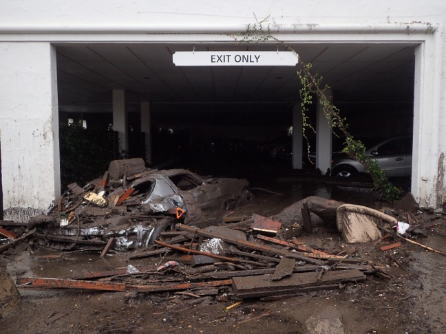

```{r setup, include=FALSE}
knitr::opts_chunk$set(echo = TRUE)
filepath= "../../../Data/SP19/Anderson_Burbank.csv"

```


#Climate Whiplash: Where, Why, and How?

Southern California, thanks to its temperate climate and sunny beaches, has a reputation as one of the most idyllic climates in America. The heart of Southern California, Los Angeles County, is the most populous county in the United States with over 10 million residents (US Census Bureau 2018). However, LA county's warm climate hides a much more sinister environmental concern: the phenomenon known colloquially as “climate whiplash.” Put simply, this term denotes frequent transitions between very wet and very dry weather (Hall et al. 2018). 

But what is the cause of climate whiplash? Several studies have confirmed that the increased variation in precipitation that causes the swings from wet to dry is linked to changes in climate variation (Hall et al. 2018). This means that increases *and* decreases in local temperature are responsible. And what effects will whiplash have on Los Angeles County? Rapid swings from wet to dry have the potential for devastating extreme events. At the end of 2018, for example, the hills of Malibu went from a raging fire to deadly mudslides in just a few weeks, causing massive property damage (Law 2018).  In Los Angeles county, climate whiplash, a product of increased temperature and therefore precipitation variation, is responsible for an increase in extreme weather events.

In this blog, I examine the observed trends of climate whiplash in Southern California. This blog intends to demystify climate whiplash and bring awareness to the causes and potentially dangerous effects. To do so, I analyzed climate data from the National Oceanic and Atmospheric Administration (NOAA) in the statistical program R (CRAN 2019). Using these data, I then researched the effects of the subsequent fires and floods on the community and the unequal effect on lower-income communities. 


# Putting the Data Together

For this analysis, I obtained daily summaries of temperature and precipitation data for Burbank. Then I used R to create graphics and analyse the data. In order to confirm or deny a relationship between the variables (time and temperature/precipitation) I used the null hypothesis or 'p-value' method. If the p-value (calculated in R) is less than .05 then the null hypothesis can be rejected. However, if the p-value is greater than .05, the relationship is still unconfirmed, and the null hypothesis cannot be rejected. 

My climate data came from the National Oceanic and Atmospheric Administration (NOAA), which maintains an extensive climate database compiled from weather stations across the United States. Using their Climate Data Online program, I downloaded daily summaries of precipitation data from the Burbank Valley Pump Plant (Station GHCND:USC00041194). This specific dataset covered all the way from 1939 to the present day, and had a 99% coverage rate, i.e. only 1% of the data was missing.

###Restrictions and Fallacies of the Dataset

My analysis uses only data from one weather station in Burbank. It is possible that trends my chosen station observe do not match the ones seen in the entirety of Los Angeles County, as my analysis assumes. However, thanks to Burbank's central location (as seen in Figure 2) simple generalizations can be made with the understanding that exact numbers will differ slightly depending on the area. Additionally, because the station is located in a parking lot, the data could be inflated with a 'heat island' effect (a small area of trapped heat far warmer than the actual climate). This could artificially inflate temperature data numbers; however, since all of the data are inflated like this, the trends I am analyzing will remain unchanged. 

# What Trends Actually Exist?

```{r include=FALSE}
##Read CSV Data
#filepath= "Anderson_Burbank.csv"
climate_data = read.csv(filepath)
head(climate_data)
str(climate_data)
names(climate_data)

##Fix Dates
strDates <- as.character(climate_data$DATE)
climate_data$NewDate <- as.Date(strDates, "%m/%d/%Y")
```

```{r include=FALSE}
## Define Shit
lm(TMAX~NewDate, data=climate_data)
summary(lm(TMAX~NewDate, data=climate_data))

##Monthly Averages
climate_data$Month = format(as.Date(climate_data$NewDate), format="%m")
climate_data$Year = format(as.Date(climate_data$NewDate), format="%Y")
MonthlyTMAXMean = aggregate(TMAX ~ Month +Year, climate_data, mean)
MonthlyTMAXMean$YEAR = as.numeric(MonthlyTMAXMean$Year)
MonthlyTMAXMean$MONTH = as.numeric(MonthlyTMAXMean$Month)
str(MonthlyTMAXMean)
plot(MonthlyTMAXMean$TMAX, ty='l')

##Plot May
plot(TMAX~YEAR, data=MonthlyTMAXMean[MonthlyTMAXMean$Month=="05",], ty='l', xlim=c(1950, 2020), main="May TMAX(Degrees Celcius) vs. Time(Years)", xlab="Time(Years)", ylab="TMAX(Degrees Celcius)", col.main="black", col.lab="blue")
May.lm <- lm(TMAX~YEAR, data=MonthlyTMAXMean[MonthlyTMAXMean$Month=="05",])
summary(May.lm)
abline(coef(May.lm), col="red")

##TMIN Definitions
plot(TMIN~NewDate, climate_data, ty='l', main="TMIN(Degrees Celcius) vs. Time(Years)", xlab="Time(Years)", ylab="TMIN(Degrees Celcius)", col.main="black", col.lab="blue" )
c <- coef(lm(TMIN~NewDate, climate_data))
abline(c, col="red")
MonthlyTMINMean = aggregate(TMIN ~ Month +Year, climate_data, mean)
MonthlyTMINMean$YEAR = as.numeric(MonthlyTMINMean$Year)
MonthlyTMINMean$MONTH = as.numeric(MonthlyTMINMean$Month)
head(MonthlyTMINMean)

##Precipitation Data (Initial Data)
climate_data = read.csv(filepath)
head(climate_data)
str(climate_data)
names(climate_data)

##Fix Dates
strDates <- as.character(climate_data$DATE)
climate_data$NewDate <- as.Date(strDates, "%m/%d/%Y")

##Precipitaion Data (Get sum, then create monthly plots)
## Define Shit
lm(PRCP~NewDate, data=climate_data)
summary(lm(PRCP~NewDate, data=climate_data))

##Monthly Sums
climate_data$Month = format(as.Date(climate_data$NewDate), format="%m")
climate_data$Year = format(as.Date(climate_data$NewDate), format="%Y")
MonthlyPRCPSum = aggregate(PRCP ~ Month +Year, climate_data, sum)
MonthlyPRCPSum$YEAR = as.numeric(MonthlyPRCPSum$Year)
MonthlyPRCPSum$MONTH = as.numeric(MonthlyPRCPSum$Month)
str(MonthlyPRCPSum)

##P-Values
TMIN.lm <- lm(TMIN ~ YEAR, data = MonthlyTMINMean)
summary(TMIN.lm)
TMAX.lm <- lm(TMAX ~ YEAR, data = MonthlyTMAXMean)
summary(TMAX.lm)
PRCP.lm <- lm(PRCP ~ YEAR, data = MonthlyPRCPSum)
summary(PRCP.lm)
```

###Yearly Precipitation Variance: Accepting the Null Hypothesis

Climate whiplash patterns present themselves in a series rapid shifts (four years or less) between very wet years (100 mm or more) and very dry years (Below 50 mm) (Hall et al. 2018). Because I am testing for an increase in variation rather than an increase in values, the null hypothesis (that there is no relationship between time and precipitation rates) actually supports my argument. To test the null hypothesis, I graphed the monthly precipitation rates in R. While the graph is full of spikes and valleys, there is no clear increase or decrease. With a p-value of 0.755, there is certainly no way we can reject the null hypothesis. This demonstrate the yearly variation in precipitation rates, which is indicative of climate whiplash. 

```{r echo=FALSE}

##Plot Data
plot(PRCP~NewDate, climate_data, ty='l', ylim=c(0, 250), main="Precipitation vs. Years", xlab="Years", ylab="Precipitation (mm)", col.main="black")
c <- coef(lm(PRCP~NewDate, climate_data))
abline(c, col="green")
```

######Figure 3: Average Monthly Rainfall, 1940-Present 

###Precipitation and Temperature in the Fall

With the existence of whiplash demonstrated, I now needed to see if it was correlated to variations in temperature. The graphs show the daily maximum temperatures (Figure 3), daily minimum temperatures (Figure 4) and precipitation totals (Figure 5) over the season of Fall. The data for the Fall months is displayed because Fall is the annual transitional period between the wet and dry season, and has a very volatile climate pattern as the fire season has begun to extend into the rainy season (Hall et al. 2018).

```{r echo=FALSE}
##Fall Season
Months = c("January", "February", "March", "April", "May", "June", "July", "August", "September", "October", "November", "December")
par(mfrow = c(1, 3), mar = c(5, 4, 3, 2) + 0.1, pty="s")
TMAXresult <- NA 
for (i in 10:12) {
  plot(TMAX ~ YEAR, data =  MonthlyTMAXMean[MonthlyTMAXMean$MONTH == i, ], ty = "l", las = 1, xlim = c(1940, 2020), ylim=c(15, 35), xlab="Years", ylab="Temperature (Degrees Celcius)", main = Months[i])
Month.lm <- lm(TMAX ~ YEAR, data = MonthlyTMAXMean[MonthlyTMAXMean$MONTH == i, ])
summary(Month.lm)
abline(coef(Month.lm), col = "red")
TMAXresult <- rbind(TMAXresult, cbind(Months[i], round(coef(Month.lm)[2], 4), round(summary(Month.lm)$coefficients[2, 4], 4), round(summary(Month.lm)$r.squared, 3)))
}
```

######Figure 4: Fall Maximum Daily Temperatures, 1940-Present

```{r echo=FALSE}
##Fall Season
Months = c("January", "February", "March", "April", "May", "June", "July", "August", "September", "October", "November", "December")
par(mfrow = c(1, 3), mar = c(5, 4, 3, 2) + 0.1, pty="s" )
TMINresult <- NA 
for (i in 10:12) {
  plot(TMIN ~ YEAR, data =  MonthlyTMINMean[MonthlyTMINMean$MONTH == i, ], ty = "l", las = 1, xlim = c(1940, 2020), ylim=c(0, 20),xlab="Years", ylab="Temperature (Degrees Celcius)", main = Months[i])
Month.lm <- lm(TMIN ~ YEAR, data = MonthlyTMINMean[MonthlyTMINMean$MONTH == i, ])
summary(Month.lm)
abline(coef(Month.lm), col = "blue")
TMINresult <- rbind(TMINresult, cbind(Months[i], round(coef(Month.lm)[2], 4), round(summary(Month.lm)$coefficients[2, 4], 4), round(summary(Month.lm)$r.squared, 3)))
}
```

######Figure 5: Fall Minimum Daily Temperatures, 1940-Present

Figure 4's graphs increased at about the same rate each month. Figure 5's graphs, however, display unique trends each month. October shows a consistent dramatic increase, November remains stagnant, while December shows a steady decrease. These trends assert that the gap between daily maximum and minimum temperatures is becoming more pronounced. Novembers maximum temperature regression line is very steep; it's minimum, however, is significantly less so. Larger gaps like this mean more dramatic temperature swings, which can influence precipitation patterns (Hall et al. 2018). This creates wild swings between warm, cold, wet, and dry weather. The distinct differences in the temperature variation from month to month contributes to highly varied precipitation rates, therefore supporting the existence of climate whiplash in the LA  County region (Hall et al. 2018). 

```{r echo=FALSE}
#Fall Season
Months = c("January", "February", "March", "April", "May", "June", "July", "August", "September", "October", "November", "December")
 par(mfrow = c(1, 3), mar = c(5, 4, 3, 2) + 0.1, pty="s")
 PRCPresult <- NA 
 for (i in 10:12) {
plot(PRCP ~ YEAR, data =  MonthlyPRCPSum[MonthlyPRCPSum$MONTH == i, ], ty = "l", las = 1, xlim = c(1940, 2020), ylim=c(0, 300), main = Months[i], xlab="Year", ylab="Total Precipitation (mm)", col.main="black" )
Month.lm <- lm(PRCP ~ YEAR, data = MonthlyPRCPSum[MonthlyPRCPSum$MONTH == i, ])
summary(Month.lm)
abline(coef(Month.lm), col = "green")
PRCPresult <- rbind(PRCPresult, cbind(Months[i], round(coef(Month.lm)[2], 4), round(summary(Month.lm)$coefficients[2, 4], 4), round(summary(Month.lm)$r.squared, 3)))
}
```

######Figure 6: Fall Total Monthly Precipitation 1940-Present

Each month has incredible variation in their precipitation totals; however, just like the temperature gap shown above, month to month totals are very different. For example, October has a precipitation spike in the early 2000s, November suffers a distinct valley in the same year. The wet and dry seasons in LA County, according to these data, are constantly changing places, both year to year and month to month. However, the increases and decreases in temperature are or clearly correlated with those in precipitation. That said, just because temperature and precipitation do not increase and decrease together does not mean there is no correlation at all; as said above, the variation in temperature and gaps between maximum and minimum are what create precipitation variation (Hall et al. 2018). While an exact relationship between the two cannot be confirmed from these graphs, the existence of both temperature and precipitation variation is clear to see. Climate whiplash is here to stay. 

#How Does Whiplash Affect LA County?

The presence of climate whiplash is clear, though the cause cannot be conclusively demonstrated. However, climate whiplash still has devastating effects on LA County. The changing precipitation patterns and subsequent dry and wet extremes have potentially severe consequences for LA County, some of which we are already occurring. Fires, floods, and droughts are all very real problems facing the community as climate whiplash stands poised on the horizon. 


###Fire Danger

The increasing and unpredictability of wet and dry weather puts the region at a dangerously high risk for devastating fires (Abatzoglou et al. 2017).  A late start to seasonal precipitation, especially following several years of drought, predisposes the region for fires because it dries out the vegetation (and everything else) in the area, making it far easier for fires to spread quickly (Keeley, Syphard 2018). For example, the Thomas fire in 2017 occurred during one of the longest dry spells on record. Significant precipitation did not begin until January, leaving the region dry and vulnerable to the deadly blaze that burned from December to January (Abatzoglou et al. 2017).

However, not only the dry years indicate a fire threat. Several of the most recent Southern California fires actually occurred following the wettest winters in the last twenty years (Hall et al. 2018). The high contrast between the dry years and the suddenly wet winter causes the landscape to produce more underbrush which quickly dries out as the wet season abruptly ends (Hall et al. 2018). While wilderness management tasks, such as controlled burns and manual clearing of underbrush can help mitigate some fire hazards, as the climate continues its back-and-forth trajectory, both urban and rural areas will become even more at risk.

### Danger Disparities

As fire danger increases thanks to climate whiplash, low-income communities are put at a disproportionately higher risk for property loss  and damage than higher income communities. People living in rural areas are at the highest risk of fire damage; in a 2012 study, scientists found that areas with housing interspersed with wild vegetation had the highest rate of property loss in Southern California (Brennan et al. 2012). Communities like this exist all over Los Angeles County including the livestock cities of Sylmar, Sunland, and La Tuna Canyon. Most are low-income and primarily comprised of non-white populations (US Census Bureau 2010). Fires stemming from climate whiplash will disproportionately affect rural, low-income communities, causing damage and losses that the inhabitants cannot afford to fix or replace. 


### From Floods to Drought

As climate patterns continue on their path of whiplash, short, intense droughts will become more common, interspersed by occasional very wet seasons (Hall et al. 2018). The drought will exacerbate the fire dangers discussed above. Before the wet season of 2017, California experienced one of the most extreme four-year droughts in over a millennium, in conjunction with the highest recorded temperatures in history (Abatzoglou et al. 2017). According to projections, events like these will become even more frequent as variation in precipitation patterns continue to grow (Hall et al. 2018).

What characterizes climate whiplash, however, is the existence of both droughts and floods over a short period of time. The light seasonal precipitation that makes Los Angeles so temperate also enable these rapid shifts (Hall et al. 2018). It is projected that all of California will experience a 100% to 200% total increase in precipitation over the next few decades (Hall et al. 2018). 

While both the flooding and drought are dangerous on their own, it is the dramatic swings between the two sides that are truly devastating. Whiplash also predisposes the region to heavy storms outside of the typical timeframe that contribute a large part of the annual precipitation over a short time period (Hall et al. 2018)  As many parts of California do not have the infrastructure to redirect that amount of water, it quickly oversaturated the soil, the spews outwards creating flash floods and mudslides across the county (Burgin et al. 2017). In 2016, the four-year drought came to close with several months of extremely heavy rainfall. Roads and bridges throughout California were damaged due to flooding and mudslides (Hall et al. 2018). Further impacts on Los Angeles include damage to dams thanks to an increased amount of sediment in the water (Barnard et al. 2018), as well as reduced agriculture production as fields are ruined, or crops simply cannot adapt to the sudden temperature and precipitation changes (Cahill et al. 2007).




#In Conclusion...

Climate whiplash is a very real problem that is occurring right now in Los Angeles County. The data shows the existence of the characterizing variation in precipitation patterns, although variations in temperature cannot be directly linked to this variation, disapproving my hypothesis. To find a more conclusive relationships (or lack therefore of), research should be conducted with more data from several different weather stations, with a focus on specific periods of time to narrow down specifics fluctuations in both variables.

#What Happens Next?

Humans can do little to prevent climate whiplash; however, they have several next steps to mitigate the damage. More decisive policies about the storage of water and use of water will help to conserve water in droughts and contain it in flood time (Hall et al. 2018). Furthermore, raised awareness of fire safety and prevention will help minimize fire risk. The creation of municipal or community evacuation plans would also help to prevent the loss of life and property in fire-prone areas (Carroll et al. 2006). California and Los Angeles country are in difficult adjustment period; however, armed with knowledge of climate trends and disaster preparedness, Los Angeles County will be ready to face this challenge.

#Citations

Abatzoglou JT, Marsh PT, Nauslar NJ. 2017. The 2017 North Bay and Southern California Fires: A Case Study. Fire. 1(1):18.

Barnard PL, Campbell‐Swarzenski P, Collins BD, and Conaway CH, East AE, Ritchie AC, Stevens AW. 2018. A regime shift in sediment export from a coastal watershed during a record wet winter, California: Implications for landscape response to hydroclimatic extremes. Earth Surf Process Landforms. 43: 2562–2577. 

Brennan TJ, Keeley JE, Massada AB, Radeloff VC, Syphard AD. 2012. Housing Arrangement and Location Determine the Likelihood of Housing Loss Due to Wildfire. PLOS ONE. 7(3): e33954.

Burgin AJ, Loecke TD, Riveros-Iregui DA, Ward AS, Thomas SA, Davis CA, St Claire MA. 2017. Weather whiplash in agricultural regions drives deterioration of water quality. Biogeochemistry. 133: 7. 

Cahill KN, Field CB, Lobell DB. 2007. Historical effects of temperature and precipitation on California crop yields. Climatic Change. 81: 187.

Carroll MS, Cohn PJ, Kumagai Y. 2006. Evacuation Behavior during Wildfires: Results of Three Case Studies. Western Journal of Applied Forestry. 21(1):39–48, 

Climate Data Online. 2019. Burbank Valley Pump Plant (Station GHCND:USC00041194). National Oceanic and Atmospheric Administration. Accessed: 2 February 2019.

Hammer RB, Hawbaker TJ, Radeloff VC, Stewart SI. 2007. Defining the Wildland Urban Interface. Journal of Forestry 105:201-207.
 
Hall A, Langenbrunner B, Neelin JD, Swain DL. 2018. Increasing precipitation volatility in twenty-first-century California. Nature Climate Change. 8:427-433.

Keeley JE, Syphard AD. 2018. Historical patterns of wildfire ignition sources in California ecosystems. International Journal of Wildland Fire. (27):781-799.	

Law T. 2018. California Areas Torched By Wildfires Face New Dangers—Flooding and Mudslides. Time Magazine. 192(21):24

US Census Bureau. 2010. United States Census 2010. US Census Bureau. 

US Census Bureau. 2017. The 25 largest counties in the United States in 2017, by population (in millions). Statista. 
