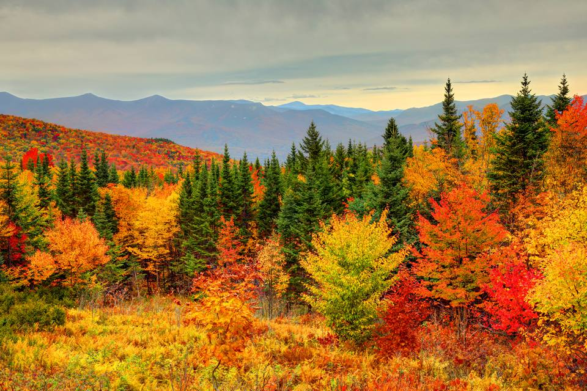
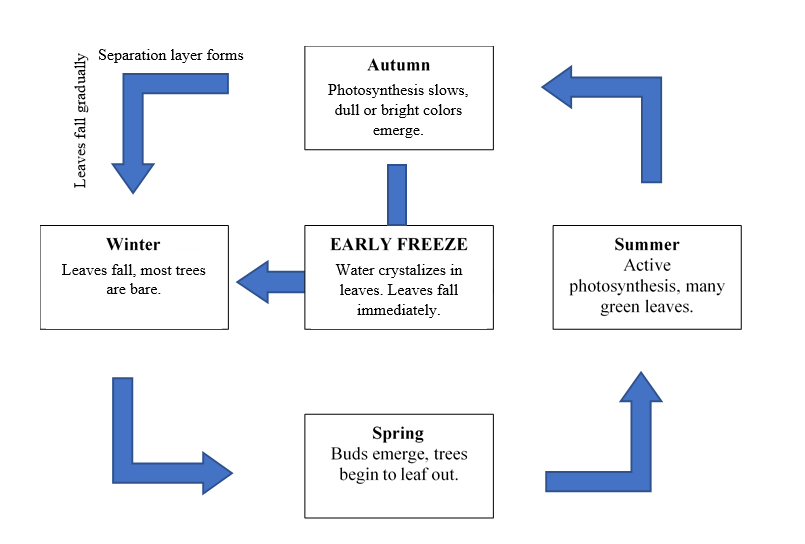
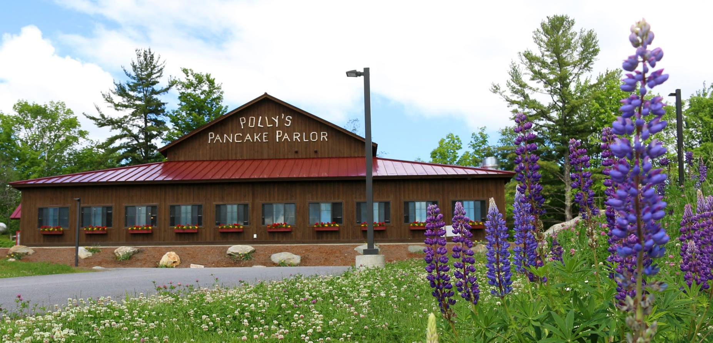
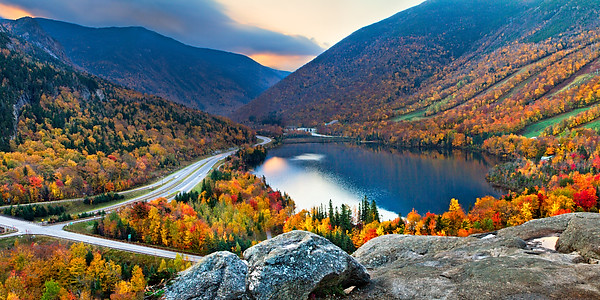
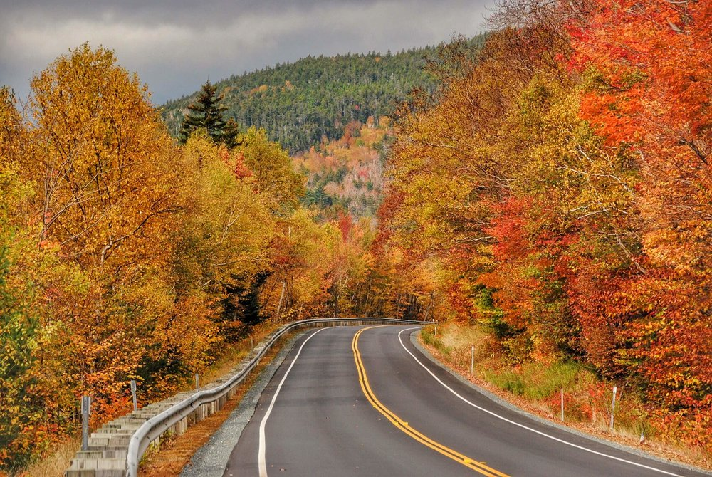

```{r setup, include=FALSE}
knitr::opts_chunk$set(echo = TRUE)
```

&nbsp;


#### How is tourism important to New Hampshire? \ 

New Hampshire is a small, primarily rural state, home to 1.3 million people in the middle of Northern New England. Historically, New Hampshire was an industrial state, with major cities centered around paper or textile mills. However, with the advent of globalization and the loss of most of this business, New Hampshire had to rebrand its economy. Today, the two largest industries in the state are Smart Manufacturing & High Technology (SMHT) and Tourism (New Hampshire Population 2019). The SMHT industry is concentrated in southern New Hampshire, leaving the rest of the state largely dependent on the tourist economy.\ 

Luckily, the state is home to a variety of natural attractions, with mountains, lakes, and seacoast. The most notable feature of New Hampshire tourism is likely the state’s famous fall foliage. Out-of-state “leaf-peepers” pour into the state throughout September and October, hoping to witness the green leaves changing to reds and oranges – and spending nearly three-hundred million dollars in-state in the process, approximately .4% of New Hampshire’s total GDP (all tourist industries comprise roughly 5% of New Hampshire’s total GDP) (BEA 2017; USDES 2008). However, climate change may now pose a significant threat to income generated by fall foliage. My objective is to examine what impact climate change may have on fall foliage by examining how both the length of the foliage season and the maximum and minimum temperatures in September, the center of the foliage season, have changed over time. An understanding of how climate impacts the foliage season may help to shed light on how climate change may impact one of New Hampshire’s most important industries.\ 

Such an understanding is most critically important to New Hampshire’s historically impoverished North Country, where isolation and a small tax base are significant barriers to economic development (The Ultimate…n.d.). Areas of the vulnerable North Country which have been able to rebrand themselves as tourist destinations, most notably Carroll County, are the most economically viable northern regions today. One-fifth of Carroll County’s population is working in the service industry, making tourism an essential lifeline in a region otherwise susceptible to high unemployment and poverty rates. (The Ultimate…n.d.).\ 

<center>

&nbsp;

{width=600px}

</center>

&nbsp;

#### How does leaf phenology impact New Hampshire’s fall foliage? \ 

Many tourism jobs in New Hampshire’s North Country rely on the fall foliage season. The transition from green summer leaves to the reds and oranges of fall occurs through a process connected to plant photosynthesis, which creates the chlorophyll that gives leaves their vibrant green color (Lev-Yadun 2016). Yellow and orange pigments, called carotenes, are also produced, however, carotene pigments are largely masked by the vibrant green color. As days begin to shorten, a signal that winter is arriving, photosynthesis stops, and chlorophyll begins to break down, exposing the colors of the carotenes which are left behind (Lev-Yadun 2016).\ 

Although the onset of fall foliage is triggered largely by changes in daylight, the appearance and duration of such foliage, or “leaf phenology,” is largely dependent on temperatures. The intensity of the red and purple colors which add beauty and depth to a foliaged landscape is determined by the presence of anthocyanin (Chalker-Scott 1999). Anthocyanin is formed by plants to protect themselves from overexposure to the sun as they begin to lose their leaves before winter (Feild et al. 2001). The production of this compound is facilitated by low temperatures above freezing (Chalker-Scott 1999). An early freeze may shorten the lifespan of fall foliage, while an extended warm period may preserve the landscape for longer (Figure 2; Gallinat et al. 2015).\ 

<center>

{width=600px}


</center>

Delayed freezes may lengthen the foliage season, however, without some cooler temperatures, less anthocyanin will be produced, and foliage may begin to appear dull colored and less visually appealing. In considering this context of the impact of temperature on foliage, a question arises: how might changes in temperature impact the foliage economy in states like New Hampshire? And how might such changes impact vulnerable populations dependent on these economies? \  

&nbsp;

#### How might these questions be addressed? \ 

The National Oceanic and Atmospheric Association, or NOAA, maintains a large database of daily temperature records from surface stations across the world, called the Global Historical Climate Network. This information is available for free on NOAA’s website. In order to determine whether a changing climate has an impact on New Hampshire foliage, the climate itself must first be determined to be changing or unchanging. To accomplish this objective, I obtained the temperature records from a station in Concord, New Hampshire (Station ID USW00014745) ranging from April 4, 1939 to January 26, 2019 and analyzed them for trends in maximum and minimum temperatures in September, which has historically been the epicenter of foliage season, using R (CRAN 2019).\ 

The null hypothesis which I was investigating states that there is no relationship between temperature and time. In order to investigate whether these findings could be changing the New Hampshire foliage season, I compared the climate data with a dataset of North Country foliage season lengths since 1975, maintained by the employees of New Hampshire’s historic Polly’s Pancake Parlor. Here, the null hypothesis was that there is no relationship between foliage season length and time. I investigated these null hypotheses using a hypothesis test, rejecting them when the p-values were found to be less than 0.05. My alternative hypothesis is that both fall temperatures and the length of the fall foliage season will increase with time. If this hypothesis holds true, it would indicate that climate change may be impacting New Hampshire's fall foliage.\ 


<center>

&nbsp;

{width=600px}

</center>

&nbsp;

#### What does the data say about the changes in climate trends and foliage season length over time? \ 

The analysis of maximum temperature data in New Hampshire showed strong evidence for a warming trend between 1939 and 2019 (p = 0.03, r^2^ = <0.01), although the linear regression model used captures a small amount of the variation. The minimum temperature data yielded similar results (p= <0.001, r^2^=<0.01), demonstrating strong evidence for a statistically significant warming trend, but with a small amount of variation captured by the model.\ 

<center>

```{r, echo=FALSE}
##Read CSV Data
climate_data <- read.csv("../../../Data/SP19/Budd_Concord.csv")
```

```{r, echo=FALSE}
##Fix Dates
strDates <- as.character(climate_data$DATE)
climate_data$NewDate <- as.Date(strDates, "%m/%d/%Y")
```

```{r, echo=FALSE}
##Define Portions of "NewDate"
climate_data$Month = format(as.Date(climate_data$NewDate), format = "%m")
climate_data$Year = format(as.Date(climate_data$NewDate), format = "%Y")
MonthlyTMAXMean = aggregate(TMAX~Month+Year, climate_data, mean)

MonthlyTMAXMean$Year = as.numeric(MonthlyTMAXMean$Year)
MonthlyTMAXMean$YEAR = as.numeric(MonthlyTMAXMean$Year)
MonthlyTMAXMean$MONTH = as.numeric(MonthlyTMAXMean$Month)
```

```{r, echo=FALSE}
##New Plots
fig.cap=TRUE
par(mfrow=c(1,2))

plot(TMAX~YEAR, data=MonthlyTMAXMean[MonthlyTMAXMean$Month == "09",], xlim = c(1939, 2019), xlab="Years", ylab="Maximum Temp. (°C)", pch=20, las=1, col="black",cex.main=.8, cex.lab=.8)
September.lm <- lm(TMAX ~ YEAR, data = MonthlyTMAXMean[MonthlyTMAXMean$Month=="09",])
abline(coef(September.lm), col = "red")

MonthlyTMINMean = aggregate(TMIN~Month+Year, climate_data, mean)
MonthlyTMINMean$MONTH = as.numeric(MonthlyTMINMean$Month)
MonthlyTMINMean$YEAR = as.numeric(MonthlyTMINMean$Year)
plot(TMIN~YEAR, data=MonthlyTMINMean[MonthlyTMINMean$Month == "09",],xlim = c(1939, 2019), xlab = "Years", ylab = "Minimum Temp. (°C)", pch=20, las=1, col="black", cex.main=.8, cex.lab=.8)
September.lm <- lm(TMIN ~ YEAR, data = MonthlyTMINMean[MonthlyTMINMean$Month=="09",])
abline(coef(September.lm), col = "red")
```

</center>

<center> 

Figure 4: Scatterplot graphs of both mean maximum (left) and mean minimum (right) temperatures for September in °C versus years shows a statistically significant positive slope.

</center>

I chose to analyze the climate data for September due to its historical importance as the center of foliage season. In order to determine whether the warming trend evidenced by the climate data has impacted the fall foliage season, I evaluated trends in foliage season length. The analysis of foliage season length data in New Hampshire yielded strong evidence for season lengthening between 1975 and 2017 (p=<0.001, r^2^=0.54). Here, the linear regression model used captures around half of the data’s variation.\ 

<center>

```{r, echo=FALSE}
##Read Leaf Observation CSV Data
leaf_observations <- read.csv("Leaf-Chart-1-1.csv")
```

```{r, echo=FALSE}
##Plot Leaf Observation Data
plot(Range~Year, leaf_observations, xlab = "Years", ylab = "Foliage Season Length (days)",pch=20, las=1, col="black")
##Add Best Fit Line
c<-coef(lm(Range~Year, leaf_observations))
abline(c, col="red")
```

</center>

<center> 

Figure 5: Scatterplot graph of foliage season length in days versus years shows a statistically significant positive slope.

</center>

&nbsp;


#### What were this study’s limitations? How could further research improve our understanding of this issue?

Though all three graphs strongly evidenced upward trends, the r^2^ values largely indicated that the model used explained low amounts of the variation. This may be contingent on the variable “year,” as it is truly just a proxy for a host of other changes which impact temperature and leaf phenology in more direct and significant ways. Further investigation into more specific phenology processes may help to more fully explain the variation. Additionally, changes in temperature and precipitation which accompany climate change may change the species composition in any given foliaged location, and consequently, foliage season length as well (Tang et al. 2012). Further investigation into tree patterns in Northern New England may help to shed some light on how this plays a role in foliage season length.\ 

####What might this mean for fall tourism in New Hampshire?

With this understanding, these graphs may provide a powerful understanding of how a statistically significant warming trend is impacting New Hampshire’s foliage economy. Clearly, as the temperature and foliage season graphs demonstrate, as temperatures are warming, the foliage season is getting longer and longer. This correlation may be explained by the leaf phenology principle discussed above, where delayed frost may extend the lifespan of foliaged landscapes. In and of itself, this is not a bad thing – in fact, a longer foliage season is good for New Hampshire. As the peak tourism period lengthens, the opportunity for tourists to spend money in-state lengthens as well. At Polly’s Pancake Parlor, the 2018 foliage season actually broke a record, bringing 800 people into the restaurant between 7 AM and 3 PM in a single day (Margolis 2018).\ 

<center>

&nbsp;

{width=600px}

</center>

&nbsp;

However, the warmth associated with an increased foliage season may reduce other tourist activity. Skiing, another huge tourism industry in New Hampshire, is seeing a reduction in snow days, causing resorts and nearby service businesses to worry about their futures (Margolis 2018). Additionally, the long-term sustainability of increased foliage tourism is uncertain, as warmer autumns may lead to less vibrant foliage (Archetti et al. 2013). Some locals worry that this change is already beginning – as reporter David Brooks said, “It does seem like [warmer autumns are] resulting in less splendid splendor” (Biello 2015).\ 

The long-term implications of a “less splendid splendor” are, thus far, unclear. However, duller leaves aren’t the state’s only concern. As early as 2008, New Hampshire’s state government has expressed concerns regarding how climate change may impact the tourist economy. Such concerns include the loss of New Hampshire economy and identity due to increased pest and pathogen pressure, change in forest composition, and specifically, the potential loss of the 3-million-dollar maple syrup industry which disappearance of the maple tree through disease or movement may bring (USDES 2008).\ 

<center>

&nbsp;

{width=600px}

</center>

&nbsp;

#### How might this impact New Hampshire’s vulnerable communities?\ 

The long-term health of currently-successful Northern Country regions such as Carroll County is dependent on the tourist economy. Coos County, located north of the White Mountains, has struggled to bring in a tourist economy for years – and consequently, has faced the greatest economic challenges in the state (The Ultimate…n.d.). Today, approximately 41% of the county’s residents are living in poverty (The Ultimate…n.d.). The difficulties faced by Coos County today may be similar to what more prosperous areas, such as Carroll County, may face without a strong tourist economy. As the New Hampshire tourism industry is not only representative of the very culture and essence of New Hampshire but is also sustaining some of the state’s most vulnerable populations, its loss would prove undeniably tragic for the future of New Hampshire’s most vulnerable areas.\ 

These preliminary results indicate that New Hampshire temperatures are increasing alongside foliage season length. Although New Hampshire’s foliage tourism economy continues to flourish and even improve as warmer temperatures lengthen the foliage season, warming autumns likely mean less anthocyanin, and subsequently less vibrant colors. As the foliage in New Hampshire fades, it may become difficult to draw the same tourist population to the state which has sustained some of its more vulnerable populations for a generation now. Not much can be done to prevent these changes at an individual level, however, policy action may be taken to protect the tourist economy in New Hampshire. Current governor Chris Sununu, a historic opponent to climate change legislation, will be up for reelection in 2020, and local elections happen every year (Evans-Brown and Hession 2013). The individuals who win these elections have far more control over the future of New Hampshire’s tourist economy than any individual constituent. Pay attention and vote as if the future of your state and livelihood depends on it – it probably does.\ 

&nbsp;

<center>

{width=600px}

</center>

&nbsp;

&nbsp;

#### Bibliography\ 

Archetti M, Richardson A, Okeefe J, Delpierre N. 2013. Predicting Climate Change Impacts on the Amount and Duration of Autumn Colors in a New England Forest. PLOS ONE. 8(3): 1-8. \ 

Biello P. 2015. Granite Geek: Why New Hampshire's Foliage Is Not Quite So Splendid This Year. New Hampshire Public Radio. \ 

[BEA] Bureau of Economic Analysis. 2017. SAGDP2N Gross domestic product (GDP) by state. U.S. Department of Commerce. \ 

Chalker-Scott L. 1999. Environmental Significance of Anthocyanins in Plant Stress Responses. Photochemistry and Photobiology. 70(1): 1-9. \ 

Feild T, Lee D, Holbrook N. 2001. Why Leaves Turn Red in Autumn: The Role of Anthocyanins in Senescing Leaves of Red-Osier Dogwood. Plant Physiology. 127(2): 566-574. \ 

Gallinat A, Primack R, Wagner D. 2015. Autumn, the neglected season in climate change research. Trends in Ecology & Evolution. 30(3): 169-176.\ 

Lev-Yadun S. 2016. What Do Red and Yellow Autumn Leaves Signal for Sure? The Botanical Review. 73(4): 279-289.\ 

Margolis J. 2018. 'Leaf peeping' is huge in New England. Will climate change alter tourism? Public Radio International. \ 

New Hampshire Population. 2019. World Population Review. \ 

[CRAN] R Core Team. 2017. R: A language and environment for statistical computing. R Foundation for Statistical Computing. https://www.R-project.org/. \ 

Tang G, Beckage B, Smith B. 2012. The potential transient dynamics of forests in New England under historical and projected future climate change. Climatic Change. 114(2): 357-377.\ 

The Ultimate Guide To The North Country Economy. n.d. National Public Radio.
Evans-Brown S, Hession J. Understanding the Northern Pass Project in New Hampshire. 2013. New Hampshire Magazine. \ 

[USDES] United States, New Hampshire Department of Environmental Services. 2008. Global Climate Change and Its Impact on New Hampshire's Fall Foliage and Maple Sugar Industry. New Hampshire Department of Environmental Services. \ 
