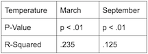
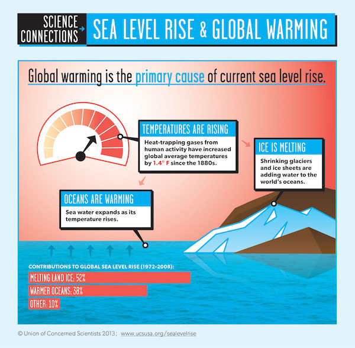

```{r setup, include=FALSE}
knitr::opts_chunk$set(echo = FALSE)


```


####Goals


The goal of this study is to determine if flooding during Hurricane Sandy, in addition to future floods in New York City, are caused by higher percentages of rainfall. Additionally, I hoped to find if New York City has rising temperatures that might show whether global warming impacts the region as well, and is ultimately responsible for the increase in precipitation.


</br>


####Methods

First, I downloaded data from the National Oceanic and Atmospheric Administration (NOAA) an online database. The data was of maximum temperature recordings and precipitation rates in New York City, measured at a station in Central Park from 1935 to 2015. I subsequently analyzed the data using Rstudio, an online open source software. I then measured the two categories of data, using extreme, opposite months, March and September, for significant changes. I drew a line which represents the slope of the average. The slope of the line was based on changes in precipitation by the millimeter, and by celsius for temperature, throughout the timeline. By observing the significance of each, I then determined if there was any correlation.


</br>


####Limitations

Limitations to my research rest in multiple factors, primarily that my data is not expansive. I only compared two data sets, and included few other factors in testing my hypothesis. Furthermore, there is still a great deal of external research which has yet to be conducted, and I therefore cannot incorporate as a result. Additionally, on a personal level, as an environmentalist I am inherently bias to whatever result I get, as I am emotionally involved.

```{r}

filepath = "1606726.csv"
filepath2 = "1628915.csv"
climate_data = read.csv(filepath)
sealevel_data = read.csv(filepath2)
strDates <- as.character(climate_data$DATE)
climate_data$NewDate <- as.Date(strDates, "%Y-%m-%d")
climate_data$Month = format(as.Date(climate_data$NewDate), format = "%m")
climate_data$Year = format(climate_data$NewDate, format="%Y")

MonthlyTMAXMean = aggregate(TMAX ~ Month + Year, climate_data, mean)
MonthlyTMAXMean$YEAR = as.numeric(MonthlyTMAXMean$Year)
MonthlyTMAXMean$MONTH = as.numeric(MonthlyTMAXMean$Month)


Months = c("January", "February", "March", "April", "May", "June",
"July", "August", "September", "October", "November", "December")

TMAXresult <- NA

##setting up monthly rain values

MonthlyPRCPSum = aggregate(PRCP ~ Month + Year, climate_data, sum)
MonthlyPRCPSum$YEAR = as.numeric(MonthlyPRCPSum$Year)
MonthlyPRCPSum$MONTH = as.numeric(MonthlyPRCPSum$Month)

PRCPresult <- NA


```


```{r, fig.height=3, fig.width=10, results='hide'} 


par(mfrow = c(1,2), mar=c(4,4,1,4))
YLAB <- "Temperature (°C)"

plot(TMAX~YEAR, data=MonthlyTMAXMean[MonthlyTMAXMean$MONTH==9,], ty='l', las=1, xlim=c(1940, 2015), main=Months[9], xlab="Year", ylab = YLAB)
Month.lm <- lm(TMAX~YEAR, data=MonthlyTMAXMean[MonthlyTMAXMean$MONTH==9,])
summary(Month.lm)
abline(coef(Month.lm), col="red")
TMAXresult <- rbind(TMAXresult, cbind(Months[9], round(coef(Month.lm)[2], 4), round(summary(Month.lm)$coefficients[2,4],4), round(summary(Month.lm)$r.squared, 3)))


##plotting the rain values

    plot(PRCP~YEAR, data=MonthlyPRCPSum[MonthlyPRCPSum$MONTH==9,], ty='l', las=1, xlim=c(1940, 2015), main=Months[9], xlab="Year", ylab="Precipitation (mm)")
    Month.lm <- lm(PRCP~YEAR, data=MonthlyPRCPSum[MonthlyPRCPSum$MONTH==9,] )
    summary(Month.lm)
    abline(coef(Month.lm), col="blue")
    PRCPresult <- rbind(PRCPresult, cbind(Months[9], round(coef(Month.lm)[2], 4), round(summary(Month.lm)$coefficients[2,4],4), round(summary(Month.lm)$r.squared, 3)))

    
    
```


</br>           

I then compared the month opposite September, March, to test for extremes on either end. Data from this actually proved to be even more drastic in its changes.
  
</br>

```{r, fig.height=3, fig.width=10, results='hide'} 


par(mfrow = c(1,2), mar=c(4,4,1,4))
plot(TMAX~YEAR, data=MonthlyTMAXMean[MonthlyTMAXMean$MONTH==3,], ty='l', las=1, xlim=c(1940, 2015), main=Months[3], xlab="Year", ylab = YLAB)
Month.lm <- lm(TMAX~YEAR, data=MonthlyTMAXMean[MonthlyTMAXMean$MONTH==3,])
summary(Month.lm)
abline(coef(Month.lm), col="red")
TMAXresult <- rbind(TMAXresult, cbind(Months[3], round(coef(Month.lm)[2], 4), round(summary(Month.lm)$coefficients[2,4],4), round(summary(Month.lm)$r.squared, 3)))


 plot(PRCP~YEAR, data=MonthlyPRCPSum[MonthlyPRCPSum$MONTH==3,], ty='l', las=1, xlim=c(1940, 2015), main=Months[3], xlab="Year", ylab="Precipitation (mm)")
    Month.lm <- lm(PRCP~YEAR, data=MonthlyPRCPSum[MonthlyPRCPSum$MONTH==3,] )
    summary(Month.lm)
    abline(coef(Month.lm), col="blue")
    PRCPresult <- rbind(PRCPresult, cbind(Months[3], round(coef(Month.lm)[2], 4), round(summary(Month.lm)$coefficients[2,4],4), round(summary(Month.lm)$r.squared, 3)))


```


</br>

####Results


My data shows a significant trend in warming that affects New York City. The p-value of the slope, a show of significance, is less than .01 in both measured cases. It also has r-squared values of .24 in March and and .1 in September, exemplifying that it is not a coincidence.

The p-value for precipitation change was .27 in March, and .26 in September, showing very little significance, with an r-squared value of .002 in both cases. 

This means there was no indication of increased levels of precipitation, despite flooding. It suggests that precipitation is in no way impacted by temperature increase, nor does it clearly add to flooding conditions and extreme weather. Temperature, however, is definitely on the rise. 


 

</br>


####Other Explanations

If precipitation has nothing to do with flooding, then what does? Deeper research for what causes increased flooding still points to global warming as a cause (NOAA 2017), a trend that corroborates with increased temperatures in NYC. Global warming causes higher temperatures which are responsible for rising sea levels (UCS 2013), the culprit behind an increase in storm surge- the ultimate factor in flooding (Hill et al. 2012). 

 
</br>
It is worthwhile to note the importance of combining different datasets in order to create a more robust understanding of our global changes. Thus, despite getting negative results to my hypothesis, it is clear there is more at play that can be combined with the understanding of rising temperatures, and perhaps more data on percipitation will help this hypothesis in the future.     

</br>




</br>

#### What do the Results Say?
Climate change is responsible for more extreme weather events, such as Hurricane Sandy in the east coast (EPA 2016). Though the null hypothesis, which postulated that increase in precipitation influenced the amount of flooding, was correct, trends found in global warming throughout NYC during extreme months proved through higher temperatures, that climate change was responsible. 


 


</br>


####Social Consequences

Homelessness, water shortages, and an overcrowding in schools were only part of the impacts of Sandy (Faber 2015). Trains and other forms of public transportation also suffered outages and barring people from going to work and school. The effects of Sandy on trains still remain today, construction for repairs closing stations on weekends, even 7 years later. Damages averaged out to above $65,000,000,000 at this point along with destroying 650,000 homes and 300,000 business, a financial burden the city was burdened with taking (NOAA 2013).

</br>

####What Can Be Done?

Hurricane Sandy was the most extreme weather event in recent New York City history. It generated a greater awareness about the negative impacts of global warming, between citizens and government alike (Hill et al. 2013). 

New York City is still investing money into flood protection, with estimates of $11.6 billion for just for downtown manhattan (WNYC 2019). This is because more extreme weather events are expected to take place in New York City (IPCC 2013). Thus, despite such a fortification’s exorbitant price, the government recognizes it as a necessary action.

In January of 2018, the New York City government took action, and sued large oil companies for their role in climate change, as a means to subsidize flood planning. Government officials, along with Mayor De Blasio, that those accountable should compensate. Unfortunately, six months later the suit was dismissed by a federal judge (CNBC 2018).

Scientists and urban planners are collaborating on the matter as well (Washburn 2013). Together the two are responsible for the flood maps, seen above, that were updated for the first time in over twenty years. 


</br>
</br>
________________________________________________________________________________________

####Citations:

</br>

New York City faces increased flood risk due to climate change. Physics Today (2015). doi:10.1063/pt.5.029247

Rosenzweig, B. & Fekete, B. 6. Green Infrastructure Plan: Opportunities for Innovation in Climate-Change Resilience. Smarter New York City 150–180 (2017). doi:10.7312/dalm18374-010

IPCC, 2013: Climate Change 2013: The Physical Science Basis. Contribution of Working Group I to the Fifth Assessment Report of the Intergovernmental Panel on Climate Change [Stocker, T.F., et al.]. Cambridge University Press, Cambridge, United Kingdom and New York, NY, USA, 1535 pp, doi:10.1017/CBO9781107415324.

NYC 2050: Climate Change and the Future of New York | WNYC | New York Public Radio, Podcasts, Live Streaming Radio, News. WNYC Available at: https://www.wnyc.org/story/nyc-2050-climate-change-and-future-new-york/. (Accessed: 2nd March 2019)

Climate Impacts in the Northeast. EPA (2016). Available at: https://19january2017snapshot.epa.gov/climate-impacts/climate-impacts-northeast_.html. (Accessed: 2nd March 2019)  

</br>
