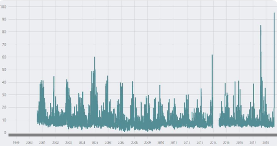

```{r setup, include=FALSE}
knitr::opts_chunk$set(echo = TRUE)
```


## Grey Skies in Seattle

When it’s a nice day in Seattle, you might hear the phrase “The mountain is out,” a.k.a. the sky is clear enough that you can see Mount Rainier behind the cityscape. For a period of time during the last two summers in Seattle, however, the mountain was most certainly not out, but for different reasons than usual. Wildfire smoke has engulfed the city from mid August to early September for the past couple of years. Historically, Seattle has been unaffected by wildfires. Last summer, the air quality during the fires was the worst it had been in Seattle since before the 1980’s, when we had wood burning stoves, higher polluting cars and trucks, and fewer paved roads (Sistek 2018). Below is a graph of air quality records in Seattle beginning in the year 2000. The two highest points on the graph are the air quality records during last two wildfire smoke events in 2017 and 2018. 




With an average of 152 days of rain per year and a close proximity to the Puget Sound, Seattle might be the last place you would think of to be influenced so extremely by wildfires. The wildfires that are influencing air quality in Seattle are actually in four areas surrounding the city: British Columbia from the north, the Olympics to the west, Central and Western Washington to the east, and Northern California from the south. The smoke coming from these areas had a tendency to get trapped in Seattle because of wind patterns and the geography of the region (Sistek 2018).

Various local and worldwide news outlets, such as the Seattle Times, KOMO 4 News, the Washington Post and National Geographic, have taken advantage of the smoky situation to create stories. A couple examples of these headlines read, “Breathing Seattle’s air right now is like smoking 7 cigarettes. Blame wildfires” (Vox 2018), and “Ash falls like snow in Seattle as wildfires rage in Pacific Northwest” (Seattle Times 2018). These headlines paint Seattle in an apocalyptic scene, and many mention a warming climate as the driving force of such sudden change. Attribution science shows that, while warming in the climate may put us at a higher risk for more frequent and more intense wildfires, climate change by itself is not to blame for wildfires. In order to see if the climate is having a multiplying effect on wildfires surrounding Seattle, we first need to understand whether or not there actually is climate change in this region.

The Intergovernmental Panel on Climate Change (IPCC) identified a warming trend of 1.5 degrees in the 20th century in the Pacific Northwest (Mote and Salathe 2010). The top three sources of emissions in Seattle are transportation, residential/commercial/industrial, and electrical (Bush 2019). In 2016, Seattle had an emission rate of 4.3 metric tons of CO2 per capita, which is fairly low compared to other big U.S. cities (Coven et al. 2016). San Francisco, another notoriously green city, had 6.4 metric tons of C02 per capita in 2016 (Goodfried et al. 2018). While Seattle’s greenhouse gas emissions are on the low end, they are still able to contribute to climate change. If there is a warming temperature trend driven by Seattle’s GHG emissions during the summer, then there may be a multiplying effect on nearby wildfires that worsen air quality.


## Methods

To tackle the question of whether Seattle has experienced climate change or not, I utilized climate data from the National Oceanic and Atmospheric Association (NOAA). NOAA has access to a worldwide archive of weather and climate data taken from various stations. The data that I downloaded was collected from the Seattle-Tacoma International Airport, and dates back to January 1st, 1948, and ends February 12th, 2019 (25,959 days). The data went through a Bias Removal Process by NOAA to adjust for biases such as the time of observations or location in an urban heat island. I conducted statistical analysis and created a linear regression model using R (CRAN 2019) for the entire data set of the minimum and maximum temperatures over the past 71 years, as well as for specific monthly data sets. The statistically significant monthly data sets included were July, August, and September. I determined whether or not the data were statistically significant by using the probability value (p-value). If the p-value is less than 0.05, then the data are statistically significant and we are able to reject the null hypothesis that temperature change and time have no relationship.

## Modeling Seattle’s Climate Change

A best-fit line of all the maximum temperatures in the NOAA data set has a positive but not statistically significant trend, so we cannot reject the null hypothesis. On the other hand, the minimum temperatures have a slightly steeper best-fit line ( <0.01/100 years; p< 0.01, r2=0.012). For this data set, we can reject the null hypothesis, and state that there is a slight warming in minimum temperatures over the last 71 years in Seattle. However, different seasons in Seattle have not experienced the same amount of warming. The summer months included below experienced significantly more warming than most other months.


```{r, echo=FALSE, include=FALSE}
## UPLOAD DATA INTO R

filepath = "ella_seattle_data.csv"
climate_data = read.csv(filepath)
head(climate_data)
str(climate_data)

## FIXING DATES

strDates = as.character(climate_data$DATE)
climate_data$NewDate = as.Date(strDates, "%m/%d/%Y")

CYear = sub("/([0-9]+)$", "/19\\1", strDates[1:18993]) # Defined for this dataset! 
CYear = c(CYear, sub("/([0-9]+)$", "/20\\1", strDates[18994:25959]))
head(CYear)

climate_data$NewDate <- as.Date(CYear, "%m/%d/%Y")

str(climate_data)

## Plot Data

plot(TMAX ~ NewDate, climate_data)

## ADD BEST FIT LINE 

lm(TMAX ~ NewDate, climate_data)

plot(lm(TMAX ~ NewDate, climate_data))

## MONTHS

climate_data$Month = format(as.Date(climate_data$NewDate), format = "%m")
climate_data$Year = format(climate_data$NewDate, format="%Y")


Months = c("January", "February", "March", "April",
           "May", "June", "July", "August", "September", "October",
           "November", "December")


## Monthly Max

MonthlyTMAXMean = aggregate(TMAX ~ Month + Year, climate_data, mean)

MonthlyTMAXMean$YEAR = as.numeric(MonthlyTMAXMean$Year)
MonthlyTMAXMean$MONTH = as.numeric(MonthlyTMAXMean$Month)

## Monthly Min

MonthlyTMINMean = aggregate(TMIN ~ Month + Year, climate_data, mean)

MonthlyTMINMean$YEAR = as.numeric(MonthlyTMINMean$Year)
MonthlyTMINMean$MONTH = as.numeric(MonthlyTMINMean$Month)


```


```{r, echo=FALSE, include=FALSE}
## SELECTED MONTHS

## July Max

par(mfrow = c(1,2))
plot(TMAX ~ YEAR, data = MonthlyTMAXMean[MonthlyTMAXMean$MONTH == 7, ], ty = "l", las = 1, xlim = c(1945, 2020),
       main = "July Max")
Month.lm <- lm(TMAX ~ YEAR, data = MonthlyTMAXMean[MonthlyTMAXMean$MONTH ==
                                                       7, ])
  abline(coef(Month.lm), col = "red")

```

```{r, echo=FALSE}
## Min

plot(TMIN ~ YEAR, data = MonthlyTMINMean[MonthlyTMINMean$MONTH ==
                                             7, ], ty = "l", las = 1, xlim = c(1945, 2020),
       main = NULL, ylab = "Minimum Temperatures", xlab = "Year")
  Month.lm <- lm(TMIN ~ YEAR, data = MonthlyTMINMean[MonthlyTMINMean$MONTH ==
                                                       7, ])
  abline(coef(Month.lm), col = "green")
  
```

Figure 3. July Average of Daily Minimum Temperatures (◦C)

The maximum temperatures in July increase at a slope of 0.03 degrees Fahrenheit per year from 1948 to 2019, and the minimum temperatures increase at an even steeper slope of 0.04. The p-value for both the maximum and the minimum temperature trend for July is 0.01, which is statistically significant.


```{r, echo=FALSE}
## August Max

plot(TMAX ~ YEAR, data = MonthlyTMAXMean[MonthlyTMAXMean$MONTH == 8, ], ty = "l", las = 1, xlim = c(1945, 2020),
       main = "August Maximum Temperatures", ylab = "Maximum Temperatures", xlab = "Year")
Month.lm <- lm(TMAX ~ YEAR, data = MonthlyTMAXMean[MonthlyTMAXMean$MONTH ==
                                                       8, ])
  abline(coef(Month.lm), col = "blue")
```

```{r, echo=FALSE, include=FALSE}
## August Min
  
plot(TMIN ~ YEAR, data = MonthlyTMINMean[MonthlyTMINMean$MONTH ==
                                             8, ], ty = "l", las = 1, xlim = c(1945, 2020),
       main = "August Min")
  Month.lm <- lm(TMIN ~ YEAR, data = MonthlyTMINMean[MonthlyTMINMean$MONTH ==
                                                       8, ])
  abline(coef(Month.lm), col = "yellow")
```

Figure 4. August Average of Daily Maximum Temperatures (◦C)

The maximum temperatures in August increase at a slope of 0.04 degrees Celsius (or around 0.07 degrees Fahrenheit) per year from 1948 to 2019, and the minimum temperatures increase at slightly shallower slope of 0.04 degrees Celsius per year (p < 0.001), which is highly significant. Thus, we can reject the null hypothesis.

```{r, echo=FALSE, include=FALSE}
## September Max
  
par(mfrow = c(1,2))
  plot(TMAX ~ YEAR, data = MonthlyTMAXMean[MonthlyTMAXMean$MONTH == 9, ], ty = "l", las = 1, xlim = c(1945, 2020),
       main = "September Max")
Month.lm <- lm(TMAX ~ YEAR, data = MonthlyTMAXMean[MonthlyTMAXMean$MONTH ==
                                                       9, ])
  abline(coef(Month.lm), col = "orange")
```

```{r, echo=FALSE}
## Min
  
  plot(TMIN ~ YEAR, data = MonthlyTMINMean[MonthlyTMINMean$MONTH ==
                                             9, ], ty = "l", las = 1, xlim = c(1945, 2020),
       main = "September Minimum Temperatures", ylab = "Minimum Temperatures", xlab = "Year")
  Month.lm <- lm(TMIN ~ YEAR, data = MonthlyTMINMean[MonthlyTMINMean$MONTH ==
                                                       9, ])
  abline(coef(Month.lm), col = "purple")
```

Figure 5. September Average of Daily Minimum Temperatures (◦C)

The maximum temperatures in September increase at a slope of 0.02 degrees Celsius per year from 1948 to 2019, and the minimum temperatures increase at steeper slope of 0.03 degrees Celsius per year. The p-value for both the maximum and the minimum temperature trend for August is less than 0.02, which is significant. All three of these months show significant warming trends for both their maximum and minimum temperatures. This warming has contributed, and will likely continue to contribute, to a higher wildfire risk in the areas surrounding Seattle that have historically caused poor air quality in the city.

## Impacts on Seattlites

Given that the warming trend in Seattle continues and the skies are blanketed in smoke most summers, the lives of Seattle’s residents will be unjustly affected. On August 20th, 2018, a joint press release alerted citizens of the unhealthy air quality and listed a large range of health problems that wildfire smoke can cause. These included irritated sinuses, asthma attack, and fast heartbeat to name a few. The press release strongly advised everyone to stay indoors with the windows closed and air conditioning and an air filter on, and to refrain from driving.

However, there is a large population of people who do not have the ability to comply with these recommendations. This creates a social justice issue that everyone is accountable for. Around 85% of Seattle’s population do not have air conditioning in their homes, myself included. Many people also have long commutes to work and school, and tolls showed that 60% of bikers still commuted across the Fremont Bridge in the smoke (Fritz and Turnbull 2018).
Further, Seattle’s growing homeless population is at extremely high risk of health implications from the smoke. The city has around 12,000 homeless individuals - the largest population outside of New York and Los Angeles - and over half of them are unsheltered (Mulvihill 2018). This is also a group of people with generally little access to healthcare yet more health issues.

The impact is not only on humans. At the Seattle Aquarium, a sea otter diagnosed with pollution-induced asthma was treated with an inhaler during the latest smoke episode. Although this example might seem whimsical to some, it demonstrates that the region’s wildlife will also take a hit health-wise, and they do not have access to any of the protective measures that we do. 


## Conclusion

My analysis of NOAA’s climate data supports the hypothesis that temperature change and time have a relationship in Seattle. The warming trend is most statistically significant and steep for the month of August, which is also the month in which Seattle’s air quality has been most affected by wildfires. 

Only time will tell whether the trend of wildfires will continue to affect Seattle in future summers, but there is nevertheless a need for more studies assessing the long-term health effects of wildfire smoke. There is also a need for attribution science studies specifically on the wildfires surrounding Seattle and climate change in order to measure the how much a warming climate affects these extreme events.

The bottom line is that climate change is imminent and we should expect changes in the places we call home, whether that is smokey summer skies or ocean acidification in the Puget Sound. If we would like to prevent economic and social impact on our daily lives, as well as the loss of wildlife, we will need to take definitive action.

## Sources

Bush E. 2019. Washington’s greenhouse gas emissions spiked 6 percent in most recent tally. The Seattle Times.

Coven JF et al. 2016. 2016 Seattle Community Greenhouse Gas Emissions Inventory. Seattle Office of Sustainability and Environment. 

Fritz A and Turnbull L. 2018. Wildfire smoke is choking Seattle, obscuring the view and blocking out the sun. The Washington Post.

Goodfriend W et al. 2018. 2016 San Francisco Geographic Greenhouse Gas Emissions Inventory at a Glance. San Francisco Department of Environment, Climate Program.

Irfan U. 2018. Breathing Seattle’s air right now is like smoking 7 cigarettes. Blame wildfires. Vox.

Lam L. 2016. Seattle's Rainy Reputation Is Well-Deserved. The Weather Channel.

Liu JC et al. 2017. Who Among the Elderly Is Most Vulnerable to Exposure to and Health Risks of Fine Particulate Matter From Wildfire Smoke?. American Journal of Epidemiology. Volume 186, Issue 6, pp. 730–735

Mote PW and Salathe EP. 2010. Future climate in the Pacific Northwest. Climatic change, 102(1-2), pp.29-50.

Mulvihill G. 2018. Report: Seattle has nation's largest homeless population outside of New York, Los Angeles. KOMO News.

R Core Team. 2017. R: A language and environment for statistical computing. R
Foundation for Statistical Computing, Vienna, Austria. URL
https://www.R-project.org/.

Sistek S. 2018. Smoky 'unhealthy' air is now worst in Seattle this century. How'd it get so bad?. KOMO News.

Welch C. 2018. Wildfire Smoke Makes Seattle and Portland World's Dirtiest Cities. National Geographic.

Wimberly MC and Liu Z. 2014. Interactions of climate, fire, and management in future forests of the Pacific Northwest. Forest Ecology and Management, 327, pp.270-279.
