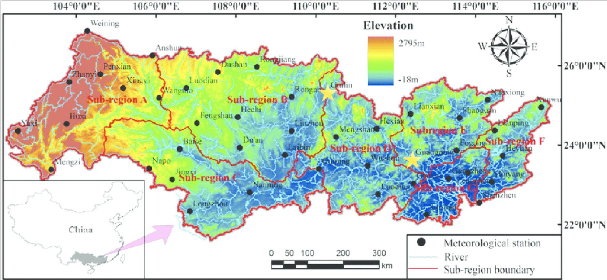
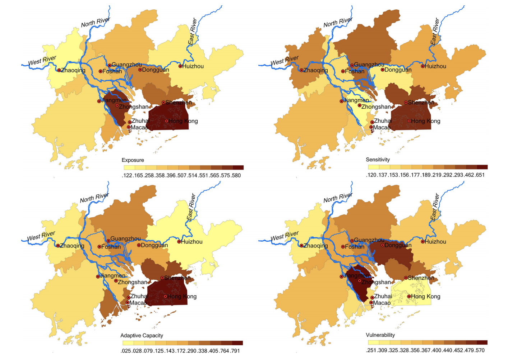
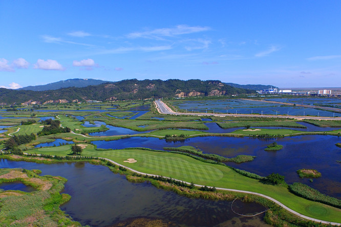

```{r setup, include=FALSE}
knitr::opts_chunk$set(echo = TRUE)
```

<center> 

{width=800px}

</center>

##Introduction 
As China continues to climb up the global ranks with its recent goals for technological advancements and urban development, the natural landscape of the country is put at risk. Specifically in Southeast China, where urban development is centralized around the entire Pearl River Delta, large cities like Guangzhou and many others are at a high risk of flooding. As a result, the urban infrastructure is threatened (Kimmelman 2017). In addition, the entire livelihood of Chinese citizens are threatened with the high frequency of flash floods (Kimmelman 2017). The heavy rainfall and flooding in Southeast China in the summer of 2016 took 36 lives, left 200,000 people without a home, and caused over $1 billion in damages (CS 2016). The question now is: Will climate change escalate extreme weather trends, increase the frequency of these floods, and cost even more lives and more damages?

In this blog, I will explore the origins of the floods in the Pearl River Basin of South China, and what triggers the intensity of the floods. In addition, I describe the impacts of the floods on the economic infrastructure of Southeast China. To address these questions, I tested precipitation data across two different terrains in the Pearl River Basin for any increasing trends over the 60-year period.


&nbsp;

####How are floods and precipitation related?  
Floods occur after heavy and overflowing rainfall on land that is normally dry (NSSL [date unknown]). The most dangerous floods are flash floods, which are unpredictable and can flood an entire region in a short amount of time with high intensity (NSSL [date unknown]). Flash flood impacts are drastic and may result in: displacement of people, public and private property loss, health hazards, food and job insecurities, and much more (Peterson 2001). A densely populated region with high development rates, like Southeastern China, is extremely vulnerable to flash floods due to the lack of infrastructure and resources for adaptation (Kimmelman 2017).

<center>

&nbsp;


{width=500px}

</center>

&nbsp;

##Data Collection  
To conduct this study, I accessed the database on National Oceanic and Atmospheric Administration (NSSL [date unknown]) to collect precipitation data for two weather stations: 

* Guangzhou (Station ID: CHM00059287), the delta region in the eastern part of the basin

* Guilin (Station ID: CHM00057957), which is closest to the northwestern part of the basin 

I used two different sets of data to test if the differences in the geographic terrain of the watershed is correlated with the amounts of precipitation in each region. Because August rainfall can be highly variable during the height of the monsoon season between April and October of each year, I chose to analyze data from August for both stations (H. Zhang et al. 2018).


<center>

&nbsp;

{width=600px}

</center>

&nbsp;

To answer my research questions, I tested the null hypothesis that precipitation (mm) was correlated with time (year). If the p value was less than 0.05, I rejected the null hypothesis.  To further the scope of my study, I accessed multiple peer review journals for the information about specific extreme climate patterns.

I would like to also acknowledge that my data may not be representative of the entire region, since I analyzed the data from only two stations out of many throughout the vast area of the Pearl River Basin. More specifically, the two stations that I chose are more highly populated urban cities, which may result in data that is influenced by [urban heat islands](https://www.nationalgeographic.org/encyclopedia/urban-heat-island/). We must take into account that the data from the past may be altered for different research purposes—not to monitor climate changes, so there may be inconsistencies in the data (Menne et al. 2012). However, quality assurance checks are conducted by NOAA to ensure that their data is accurate (Menne et al. 2012).

 
&nbsp;


##Reading Precipitation Data
&nbsp;

####What are the results?

Overall, rainfall appears to be increasing in both regions (Figure 4). 

For Guangzhou, China, we reject the null hypothesis (p value <0.01), concluding that the precipitation data has a weak relationship to the time of year. Less than 9% of the data is explanatory (adjusted r2 value is 0.086), thus there are other factors that might explain this precipitation pattern and variability.

For Guilin, China, we accept the null hypothesis (p value >0.05), showing no relationship between rainfall and year. Thus, other factors may explain rainfall in this region.

```{r, echo = FALSE, results= 'hide'}
filepath  = "../../../Data/SP19/Wong_Guangzhou.csv"
guangzhou_precdata <- read.csv(filepath)
head(guangzhou_precdata)
str(guangzhou_precdata)
names(guangzhou_precdata)
```

```{r, echo = FALSE, results= 'hide'}
#plotting guangzhou data
#plot(PRCP~DATE, guangzhou_precdata)
min(guangzhou_precdata$PRCP)
strDates <- as.character(guangzhou_precdata$DATE)
guangzhou_precdata$NewDate <- as.Date(strDates, "%Y-%m-%d")

```

```{r, echo = FALSE, results= 'hide'}
#plot(PRCP~NewDate, guangzhou_precdata)
prcp.lm=lm(PRCP~NewDate, data=guangzhou_precdata)
#abline(coef(prcp.lm), col="red")
```

```{r, echo = FALSE, results= 'hide'}
#monthly means for the year
guangzhou_precdata$Month = format(as.Date(guangzhou_precdata$NewDate), format = "%m")
guangzhou_precdata$Year = format(guangzhou_precdata$NewDate, format="%Y")
MonthlyPRCPMean = aggregate(PRCP~Month+Year, guangzhou_precdata, mean)
MonthlyPRCPMean$YEAR = as.numeric(MonthlyPRCPMean$Year)
MonthlyPRCPMean$MONTH = as.numeric(MonthlyPRCPMean$Month)
#plot(MonthlyPRCPMean$PRCP)
```

```{r, echo = FALSE, results= 'hide'}
#mean for August
#plot(PRCP~YEAR, data=MonthlyPRCPMean[MonthlyPRCPMean$Month=="08",], xlim=c(1951,2020))
August.lm <- lm(PRCP~YEAR, data=MonthlyPRCPMean[MonthlyPRCPMean$Month=="08",])
#abline(coef(August.lm), col='red')
summary(August.lm)
```


```{r, echo = FALSE, results= 'hide'}
#importing guilin prcp data
filepath2="../../../Data/SP19/Wong_Guilin.csv"
guilin_precdata <-read.csv(filepath2)
head(guilin_precdata)
str(guilin_precdata)
names(guilin_precdata)
```

```{r, echo = FALSE, results= 'hide'}
#plotting guilin data
#plot(PRCP~DATE, guilin_precdata)
min(guilin_precdata$PRCP)
strDates <- as.character(guilin_precdata$DATE)
guilin_precdata$NewDate <- as.Date(strDates, "%Y-%m-%d")
```
```{r, echo = FALSE, results= 'hide'}
#plot(PRCP~NewDate, guilin_precdata)
prcp2.lm=lm(PRCP~NewDate, data=guilin_precdata)
#abline(coef(prcp.lm), col="red")
```

```{r, echo = FALSE, results= 'hide'}
#monthly means for the year
guilin_precdata$Month = format(as.Date(guilin_precdata$NewDate), format = "%m")
guilin_precdata$Year = format(guilin_precdata$NewDate, format="%Y")
MonthlyPRCP2Mean = aggregate(PRCP~Month+Year, guilin_precdata, mean)
MonthlyPRCP2Mean$YEAR = as.numeric(MonthlyPRCP2Mean$Year)
MonthlyPRCP2Mean$MONTH = as.numeric(MonthlyPRCP2Mean$Month)
#plot(MonthlyPRCP2Mean$PRCP)
```

```{r, echo = FALSE, results= 'hide'}
#mean for August Guilin
#plot(PRCP~YEAR, data=MonthlyPRCP2Mean[MonthlyPRCP2Mean$Month=="08",], xlim=c(1951,2020))
August2.lm <- lm(PRCP~YEAR, data=MonthlyPRCP2Mean[MonthlyPRCP2Mean$Month=="08",])
#abline(coef(August2.lm), col='red')
summary(August2.lm)
```

```{r, echo = FALSE, results= 'hide', fig.align='center', fig.cap= "Figure 4: The graphs displayed above represents the precipitation averages for the month of August from each year between 1951 and 2018 for both Guangzhou and Guilin, China."}
#lining up the two graphs from guangzhou and guilin
par(mfrow = c(1,2))

plot(PRCP~YEAR, data=MonthlyPRCPMean[MonthlyPRCPMean$Month=="08",], xlim=c(1951,2020), 
     main = "Guangzhou, China",
     xlab = "Year",
     ylab = "Precipitation (mm)",
     pch=20, las=1, col='black') 
August.lm <- lm(PRCP~YEAR, data=MonthlyPRCPMean[MonthlyPRCPMean$Month=="08",])
abline(coef(August.lm), col='red')
summary(August.lm)

plot(PRCP~YEAR, data=MonthlyPRCP2Mean[MonthlyPRCP2Mean$Month=="08",], xlim=c(1951,2020),
     main = "Guilin, China",
     xlab = "Year",
     ylab = "",
     pch=20, las=1, col='black')
August2.lm <- lm(PRCP~YEAR, data=MonthlyPRCP2Mean[MonthlyPRCP2Mean$Month=="08",])
abline(coef(August2.lm), col='red')
summary(August2.lm)
```


&nbsp;


##Discussion: An Application of the Data 

&nbsp;

####What brings this immense amount of rainfall to Southern China each year?  \

The annual occurrence of the East Asian Summer Monsoon (EASM) brings about sporadic week-long rainstorms to East Asia, dramatically changing the climate of the entire region (Ding and Chan 2005). The monsoon sweeps across East Asia, cycling between North and South China starting from May and lasting throughout the summer, hitting Southern China in August (Ding and Chan 2005). The effects of the rainfall from EASM may be exacerbated when coupled with the factors listed below:

*1. Seasonality:* One of the main reason that the climate of Southeastern China is so inconsistent is due to the constant changes in seasonality and precipitation patterns. Scientists found that the frequencies of rainy days decreased, but the intensity increased throughout the Pearl River Basin (Q. Zhang et al. 2009). However, the data is insignificant due to its variability and constant changes by the EASM (H. Zhang et al. 2018). 

*2. Storms:* Extreme climate events like [monsoons](https://en.wikipedia.org/wiki/Monsoon) and [typhoons](https://en.wikipedia.org/wiki/Typhoon) are common in East Asia (Loo et al. 2015) and may be exacerbated by climate change (Burke and Stott 2017). These storms are also exacerbated by climate change. Unfortunately, even the intensity and effects of these storms vary seasonally, which leads to greater inconsistencies in the data.

*3. El Niño-Southern Oscillation (ENSO):* [ENSO](https://en.wikipedia.org/wiki/El_Ni%C3%B1o%E2%80%93Southern_Oscillation) is not often cited in the media; however, this crucial series of irregular wind patterns and abnormal sea surface temperature is discovered to have significant effects on the tropical areas of the eastern Pacific Ocean, specifically my research region, Southern China (Niu 2013).

*4. Human activity:* Since the there is much human settlement around the entire river basin, humans have brought in much damage to the natural processes of the region. For example, “Human activities, such as land use, regulation, reservoir, may lead to monotonic change or trends in river discharge, however, we can still detect the climatic driving forces on interannual discharge variations” (Gu et al. 2017, p. 11).

<center> 

&nbsp;

{width=500px}

</center> 

&nbsp;

With so many factors in play, it is unclear what exactly leads to this increase of rainfall in the Pearl River Basin; therefore, it can be concluded that there are many uncertainties surrounding the origins of the floods, which would explain the inconsistencies and uncertainties surrounding this climate data. 


&nbsp;

####Why is this important?
Although we do not know exactly where the extreme flooding comes from around the Pearl River Basin, the effects of the flooding are unprecedented. The cities in the Pearl River Delta are especially susceptible to flooding due to its high population density and lowland region (Yang et al. 2015). Some of the most vulnerable and least adaptable cities are the ones made up of large populations of elderlies and young children, unskilled laborers, small business owners (Yang et al. 2015); therefore, a city’s level of resilience to extreme flooding is highly dependent upon risk identification, policy orientation, infrastructure construction, and socio-economic demographics (Yang et al. 2015). The discrepancies between vulnerabilities of urban cities and more rural regions of the river basin are displayed below (Figure 6).

<center>

&nbsp;

{width=500px}

</center>

&nbsp;

With a high rates of urban development, urban and densely-populated cities—although adaptable over time(Yang et al. 2015—will face large economic setbacks as flash floods continue to ripple through region, requiring more funds for damage control.

&nbsp;

##Conclusion: A call to action

&nbsp;

####What can be done moving forward? 
Many cities around the world are highly adaptable to extreme flooding because of adequate flood-control measures (Yang et al. 2015). All we can do now is to find possible solutions to mitigate as much human risk and flood hazards as possible under the changing climate. Thus, the integration of science and politics is necessary to produce effective preventative measures for the overall well-being of all inhabitants (Pittock and Xu 2011).

However, there would be no government recognition without local activism; therefore, I conclude that one of the most important components to gaining resilience and recognition in times of extreme climate events is activism amongst peoples of the localities and grassroot organizations, like the [All-China Environmental Federation (ACEF)](http://www.acef.com.cn/en/aboutacef/2013/1216/1004.html), to raise awareness for the human rights issues that come with environmental disasters.


<center>

&nbsp;

{width=500px}

</center>

&nbsp;

&nbsp;

###References

Burke C, Stott P. 2017. Impact of Anthropogenic Climate Change on the East Asian Summer Monsoon. J. Clim. 30(14): 5205-5220. 

[CD] China Daily (CN). 2015. Pearl River Delta is world's largest urban area. China.org.cn.

[CS] Climate Signals Beta (US). 2016. China Floods June-July 2016. Climate Signals Beta.

Ding Y, Chan JCL. 2005. The East Asia summer monsoon: An Overview. Meteorol Atmos Phys. 89(1): 117-142. 

Gu X, Zhang Q, Singh VP, Shi P. 2017. Hydrological response to large-scale climate variability across the Pearl River basin, China: Spatiotemporal patterns and sensitivity. Glob Planet Change. 149: 1-13.

Horwitz J. 2016. Here’s how huge amounts of trash from the Pearl River Delta washed up on Hong Kong’s shores. QUARTZ.

Kimmelman M. 2017. In the Pearl River Delta, breakneck development is colliding with the effects of climate change. The New York Times.

Lai C, Chen X, Wang Z, Zhao S, Wu X, Yu H. 2015. Spatial and temporal variations of rainfall erosivity on Pearl River basin during 1960-2012. Nongye Gongcheng Xuebao. 31(8):159-167.

Loo YY, Billa L, Singh A. 2015. Effect of climate change on seasonal monsoon in Asia and its impact on the variability of monsoon rainfall in Southeast Asia. Geosci Front. 6: 817-823.

Menne MJ, Durre I, Vose RS, Gleason BE, Houston TG. 2012. An Overview of the Global Historical Climatogy Network-Daily Database. J. Atmospheric. Ocean. Technol. 29(7): 897-910. 

Niu J. 2013. Precipitation in the Pearl River basin, South China: scaling, regional patterns, and influence of large-scale climate anomalies. Stoch Environ Res Risk Assess. 27: 1253-1268.

[NSSL] The National Severe Storms Laboratory. [date unknown]. Flood Basics. National Oceanic Atmospheric Association.

Pang J. 2017. 3 dead, 2 missing in Macau as Typhoon Hato leaves flooding and destruction in its wake. Hong Kong Free Press.

Pearl River Delta to build national forest city group by 2020. 2016. NewsGD.com.

Peterson MS. 2001. Impacts of Flash Floods. In: Gruntfest E., Handmer J. (eds) Coping With Flash Floods. NATO Science Series. 77(2): 11-12. 

Pittock J, Xu M. 2011. Controlling Yangtze River Floods: A New Approach. World Resources Institute.

Yang L, Scheffran J, Qin H, You Q. 2015. Climate-related flood risks and urban responses in the Pearl River Delta, China. Reg Environ Change. 15:379–391.

Zhang H, Wu C, Chen W, Huang G. 2017. Assessing the Impact of Climate Change on the Waterlogging Risk in Coastal Cities: A Case Study of Guangzhou, South China. J Hydrometeorol. 18(6): 1549-1562.

Zhang H, Giffiths ML, Chiang JCH, Kong W, Wu S, Atwood A, Huang J, Cheng H, Ning Y, Xie S. 2017. East Asian hydroclimate modulated by the position of the westerlies during Termination I. Science. 362(6414): 580-583. 

Zhang Q, Xu C-Y, Becker S, Zhang ZX, Chen YD, Coulibaly M. 2009. Trends and abrupt changes of precipitation maxima in the Pearl River basin, China. Q. J. Royal Meteorol. Soc. 10(2):132–144.


&nbsp;

&nbsp; 