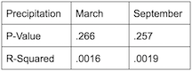
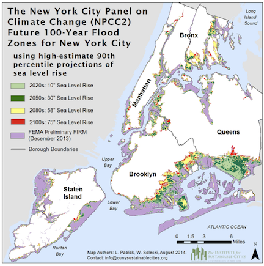

```{r setup, include=FALSE}
knitr::opts_chunk$set(echo = FALSE)


```


###Goals
It was my goal of this study to determine whether rainfall increased with a rise in temperatures. In light of Hurricane Sandy, it is clear weather events are getting more extreme, and as New York City rests on the coast of the Atlantic Ocean, the flooding caused by Hurricane Sandy was just a taste of what might be to come.


In order to complete the assessment, I pursued the following steps

  1) Downloaded and extracted temperature and precipitation data 
  
  2) Assessed a change in temperature by celsius 
  
  3) Assessed a change in precipitation levels by millimeter 
  
  4) Compared the two for correlation 


</br>


```{r}

filepath = "1606726.csv"
filepath2 = "1628915.csv"
climate_data = read.csv(filepath)
sealevel_data = read.csv(filepath2)
strDates <- as.character(climate_data$DATE)
climate_data$NewDate <- as.Date(strDates, "%Y-%m-%d")
climate_data$Month = format(as.Date(climate_data$NewDate), format = "%m")
climate_data$Year = format(climate_data$NewDate, format="%Y")

MonthlyTMAXMean = aggregate(TMAX ~ Month + Year, climate_data, mean)
MonthlyTMAXMean$YEAR = as.numeric(MonthlyTMAXMean$Year)
MonthlyTMAXMean$MONTH = as.numeric(MonthlyTMAXMean$Month)


Months = c("January", "February", "March", "April", "May", "June",
"July", "August", "September", "October", "November", "December")

TMAXresult <- NA

##setting up monthly rain values

MonthlyPRCPSum = aggregate(PRCP ~ Month + Year, climate_data, sum)
MonthlyPRCPSum$YEAR = as.numeric(MonthlyPRCPSum$Year)
MonthlyPRCPSum$MONTH = as.numeric(MonthlyPRCPSum$Month)

PRCPresult <- NA


```


```{r, fig.height=3, fig.width=10, results='hide'} 


par(mfrow = c(1,2), mar=c(4,4,1,4))
YLAB <- "Temperature (°C)"

plot(TMAX~YEAR, data=MonthlyTMAXMean[MonthlyTMAXMean$MONTH==9,], ty='l', las=1, xlim=c(1940, 2015), main=Months[9], xlab="Year", ylab = YLAB)
Month.lm <- lm(TMAX~YEAR, data=MonthlyTMAXMean[MonthlyTMAXMean$MONTH==9,])
summary(Month.lm)
abline(coef(Month.lm), col="red")
TMAXresult <- rbind(TMAXresult, cbind(Months[9], round(coef(Month.lm)[2], 4), round(summary(Month.lm)$coefficients[2,4],4), round(summary(Month.lm)$r.squared, 3)))


##plotting the rain values

    plot(PRCP~YEAR, data=MonthlyPRCPSum[MonthlyPRCPSum$MONTH==9,], ty='l', las=1, xlim=c(1940, 2015), main=Months[9], xlab="Year", ylab="Precipitation (mm)")
    Month.lm <- lm(PRCP~YEAR, data=MonthlyPRCPSum[MonthlyPRCPSum$MONTH==9,] )
    summary(Month.lm)
    abline(coef(Month.lm), col="blue")
    PRCPresult <- rbind(PRCPresult, cbind(Months[9], round(coef(Month.lm)[2], 4), round(summary(Month.lm)$coefficients[2,4],4), round(summary(Month.lm)$r.squared, 3)))

    
    
```


</br>           

*I then compared the month opposite September, March, to test for extremes on either end. Data from this actually proved to be even more drastic in its changes.*  
  
</br>

```{r, fig.height=3, fig.width=10, results='hide'} 


par(mfrow = c(1,2), mar=c(4,4,1,4))
plot(TMAX~YEAR, data=MonthlyTMAXMean[MonthlyTMAXMean$MONTH==3,], ty='l', las=1, xlim=c(1940, 2015), main=Months[3], xlab="Year", ylab = YLAB)
Month.lm <- lm(TMAX~YEAR, data=MonthlyTMAXMean[MonthlyTMAXMean$MONTH==3,])
summary(Month.lm)
abline(coef(Month.lm), col="red")
TMAXresult <- rbind(TMAXresult, cbind(Months[3], round(coef(Month.lm)[2], 4), round(summary(Month.lm)$coefficients[2,4],4), round(summary(Month.lm)$r.squared, 3)))


 plot(PRCP~YEAR, data=MonthlyPRCPSum[MonthlyPRCPSum$MONTH==3,], ty='l', las=1, xlim=c(1940, 2015), main=Months[3], xlab="Year", ylab="Precipitation (mm)")
    Month.lm <- lm(PRCP~YEAR, data=MonthlyPRCPSum[MonthlyPRCPSum$MONTH==3,] )
    summary(Month.lm)
    abline(coef(Month.lm), col="blue")
    PRCPresult <- rbind(PRCPresult, cbind(Months[3], round(coef(Month.lm)[2], 4), round(summary(Month.lm)$coefficients[2,4],4), round(summary(Month.lm)$r.squared, 3)))


```


</br>

####Results


My data shows that, indeed, the temperature in the NYC region is on the rise, which can be linked back to global warming on the whole.
That said, my data also exhibited no meaningful change in percipitation levels, suggesting that increased flooding can be attributed to other factors. 


 

</br>

####Other Explanations
Science has generally agreed that rising sea levels impacted the degree of damage significantly. This can be directly correlated to rising global temperatures.  
</br>
It is worthwhile to note the importance of combining different datasets in order to create a more robust understanding of our global changes. Thus, despite getting negative results to my hypothesis, it is clear there is more at play that can be combined with the understanding of rising temperatures, and perhaps more data on percipitation will help this hypothesis in the future.     

</br>

####What does this mean for the future?  


Hurricane Sandy was a wakeup call for many residents and legislators within the New York metropolitan region. Damages cost billions of dollars, and are still in the process of being undone. Projected reports show that Hurricane Sandy is just the first of many similar events, and within the near future another storm of similar magnitude is meant to hit New York again.
With every storm, housing is destroyed, infrastructure is damaged and the city has difficulty staying open. Train tunnels are still corroding from the saltwater of river flooding in 2012, close to seven years ago, and homes have yet to be rebuilt- that is if they ever will be. 


 


</br>

####What is there to be done?

Time and time again it has been repeated that the only way to avoid the extreme worsening of these events is to limit global warming. If temperatures are set to increase on the extreme upper estimate of 5 degrees celsius, New York will find much of itself permanently underwater by 2050. The map belows show future projections of water levels based on pressure reports in various stations along the rivers. One is the lower end of consequences, with a rise of only 2 degrees. The right depiction, shows a more dire consequence.  

</br>
</br>
________________________________________________________________________________________

####Citations:

</br>

New York City faces increased flood risk due to climate change. Physics Today (2015). doi:10.1063/pt.5.029247

Rosenzweig, B. & Fekete, B. 6. Green Infrastructure Plan: Opportunities for Innovation in Climate-Change Resilience. Smarter New York City 150–180 (2017). doi:10.7312/dalm18374-010

IPCC, 2013: Climate Change 2013: The Physical Science Basis. Contribution of Working Group I to the Fifth Assessment Report of the Intergovernmental Panel on Climate Change [Stocker, T.F., et al.]. Cambridge University Press, Cambridge, United Kingdom and New York, NY, USA, 1535 pp, doi:10.1017/CBO9781107415324.

NYC 2050: Climate Change and the Future of New York | WNYC | New York Public Radio, Podcasts, Live Streaming Radio, News. WNYC Available at: https://www.wnyc.org/story/nyc-2050-climate-change-and-future-new-york/. (Accessed: 2nd March 2019)

Climate Impacts in the Northeast. EPA (2016). Available at: https://19january2017snapshot.epa.gov/climate-impacts/climate-impacts-northeast_.html. (Accessed: 2nd March 2019)  

</br>
