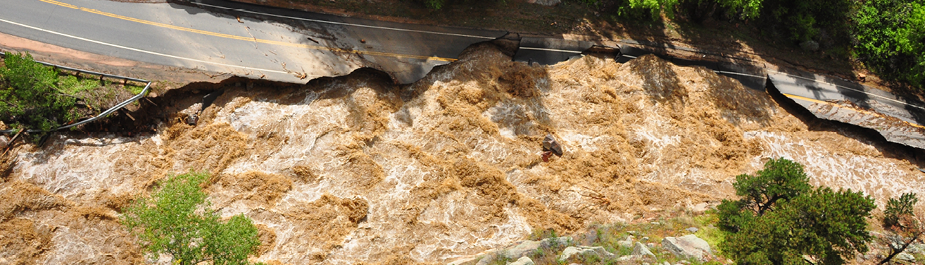
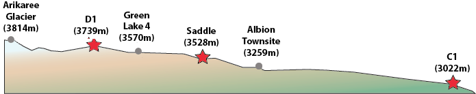

```{r setup, include=FALSE}
knitr::opts_chunk$set(echo = TRUE)
```

```{r read NWT and NOAA data, include=FALSE}
library(readr)
C1_daily_precip <- read_csv("C1_daily_precip.csv")
C1_daily_temp <- read_csv("C1_daily_temp.csv")
D1_daily_temp <- read_csv("D1_daily_temp.csv")
D1_daily_precip <- read_csv("D1_daily_precip.csv")
Saddle_daily_temp <- read_csv("Saddle_daily_temp.csv")
Saddle_daily_precip <- read_csv("Saddle_daily_precip.csv")
NOAA <- read_csv("NOAA_boulder_area_temp_precip.csv")
```

```{r my attempt at changing dates, include=FALSE}
strDates <-as.character(NOAA$DATE)
CYear1 <-as.Date(strDates[1:60719], "%m/%d/%Y") #1/1/1900 onward
CYear2 = as.Date(strDates[60720:62190], "%Y-%m-%d") #1893-10-01 to 1899-12-31
CYear3 = c(CYear1, CYear2) 
CYear3[sample(1:62190, 10)] #sample 10 dates to see if they're all the same format: YYYY-MM-DD
NOAA$NewDate <- CYear3
```

```{r separating NOAA data into three separate data frames for each of the 3 stations, include=FALSE}
Boulder <- NOAA[ which(NOAA$STATION=='USC00050848'),]
Boulder_14_W <- NOAA[ which(NOAA$STATION=='USW00094075'),]
Coal_Creek_Canyon <- NOAA[ which(NOAA$STATION=='USC00051681'),]
```
##Introduction

 

####Background
For decades, climate scientists have warned the public of the effects of historic and present anthropogenic greenhouse gas emissions on global climate patterns. Yet the scientific community continues to struggle to pinpoint with statistical certainty how climate change leads to an increase in regional natural disasters. Along with the politicized nature of climate science in America, the media in the United States has therefore been quick to conflate or dismiss any relationships between short-term weather-induced natural disasters with long-term global climatic patterns. 
  
This jump to conclusions was seen in the devastating September 2013 rainstorm and floods in Colorado. The rainstorm hit Boulder County particularly hard. In the span of one week in September 2013, Boulder received one of the largest sustained precipitation levels in a one-week period since the start of historic records. In an eight-day period from Monday 09 September to Monday 16 September, Boulder received 17.15 inches of rain, just shy of the 20 inches of precipitation the county receives on average annually (Brennan and Aguilar 2013). The county received over 10 inches in just 12 September alone. The ensuing floods killed 4 people in the county, injured dozens and caused the evacuation of nearly 2,000 residents by road and helicopter (ibid.). Overflowing waters in the region's waterways also destroyed 345 homes and damaged 557 homes, and caused over a billion dollars in property and economic damage (ibid., Figures 1 & 2). In the aftermath, FEMA declared the entire county a disaster zone, and public and private reconstruction efforts around the county continued for years.
  
 
  
A year after the floods, local newspaper Daily Camera declared “2013’s flood-triggering rains not caused by climate change” (Brennan 2014). This bold claim was based on a local study modeling the probability of increased precipitation in Northeast Colorado as a result of anthropogenic-induced warming (Hoerling et al. 2014). However, even the article noted other scientists’ criticism of the paper’s suspect methodology. For example, Hoerling et al. (2014) developed a model to predict the likelihood of five-day flood event in just the month of September, presumably to measure and compare models that could determine specifically how likely the September 2013 floods. Though this model could analyze September flood events, the authors fail to mention how their model can account for the change in flood probability throughout the whole year or other months of the year. The study also focuses on two thirty-year periods, the years 1871-1900 and 1984-2013, presumably to model before and after worldwide anthropogenic emissions increased exponentially in the 20th century. The authors do not explain why they decided to pick two thirty-year periods specifically. Therefore, looking at one month in two 30-year periods prevents the model used in Hoerling et al. (2014) from making general conclusions on how climate change has affected the overall likelihood of floods across Northeast Colorado in the past century.
  
Unsurprisingly, a multitude of other local and national researchers on the September 2013 Boulder floods have disputed this initial study. In a field known as attribution science, climatologists and meteorologists attempt to pinpoint direct causal relationships between global and regional climate change with the probability of specific extreme weather events like the Boulder floods. What researchers focused on was the fact that much of the humid air causing the floods came from the convergence of two concurrent hurricanes on Mexico's east and west coasts. In mid-September 2013, Hurricane Manuel on the Pacific and Hurricane Ingrid on the Gulf of Mexico killed hundreds along the Mexican coast. At the same time, the sea surface temperature around Mexico were the highest globally and likely increased from anthropogenic warming (Trenberth *et al.* 2015). As the two storms' combined warm monsoonal air met up and headed north into the United States, huge amounts of moisture built up above the Southwest (*ibid.*). Meteorologists at the time also noted a front of cold, dry air had stalled along the Front Range Urban Corridor (Brennan and Aguilar, 2013), Northeast Colorado's relatively flat and heavily populated area just east of the Rocky Mountains. This combination of exceptionally warm, humid air and cold, dry air created the conditions for what the *Daily Camera* called a "1000-year rain and 100-year flood" (Brennan and Aguilar 2013, Brennan 2014). Years later, *Daily Camera* also followed up on the initial study with new studies claiming the opposite of Hoerling *et al.* (2013). The model in Hoerling *et al.* (2013) did not take into account the abnormal conditions south of Colorado causing the hurricanes that led to massive rainstorms. One later attribution study created models combining global climate change with local trends, taking the hurricanes' abnormally warm conditions into account (Pall *et al.*, 2017). Their results showed anthropogenic climate change had increase rainfall up to 30% in the 2013 storms compared to regional climate models with anthropogenic variables removed (Pall *et al.* 2017, Brennan 2017). 

Though the overwhelming majority of scientists agree on anthropogenic climate change, the attribution of climate change to any single extreme weather event continues to incite scientific debate. Using the 2013 Boulder floods as a case study, I wanted to test whether larger regional climate change in Colorado and climate change around the world could be obscured by highly variable, short-term conditions like daily temperatures and precipitation in the Boulder area.

##Methodology

For this study, I chose six sites based on their location within the Boulder Creek watershed (Table 1, Figure 3). I looked at three climate stations around Boulder obtained from the National Oceanic and Atmospheric Administration's online database of daily summaries from the Global Historical Climate Network (NOAA GHCN). One is located in the city of Boulder, and two are located in the Rocky Mountains just west of Boulder (Figure 3). I also look at three climate stations from the site of the Niwot Ridge Long Term Ecological Research program (NWT LTER), up in the Rocky Mountains to the west of Boulder and close to the headwaters of the Boulder Creek watershed (Table 1, Figures 3 and 4).
  
  
_**Table 1:** Climate stations analyzed for daily maximum temperatures and daily precipitation_

Climate Station | Latitude    | Longitude     | Altitude (m) | Agency/Program
--------------- | ----------- | ------------- | ------------ | ---------------
1. [D-1](http://niwot.colorado.edu/data/climate/d1-meteorological-data)             | 40.059793   | -105.6165   | 3739 | NWT LTER
2. [Saddle](http://niwot.colorado.edu/data/climate/saddle-meteorological-data)      | 40.0547 | -105.5892 | 3528 | NWT LTER
3. [C-1](http://niwot.colorado.edu/data/climate/c1-meteorological-data)             | 40.03616   | -105.5440   | 3022 | NWT LTER
4. [USW00094075 - Boulder 14 W](https://www.ncdc.noaa.gov/cdo-web/datasets/GHCND/stations/GHCND:USW00094075/detail) | 40.0354 | -105.5409 | 2995.6 | NOAA GHCN
5. [USC00051681 - Coal Creek Canyon](https://www.ncdc.noaa.gov/cdo-web/datasets/GHCND/stations/GHCND:USC00051681/detail) | 39.8958 | -105.3847 | 2728 | NOAA GHCN
6. [USC00050848 - Boulder](https://www.ncdc.noaa.gov/cdo-web/datasets/GHCND/stations/GHCND:USC00050848/detail) | 39.9919 | -105.2667 | 1671.5 | NOAA GHCN
  
  

  
  

  
  
I hypothesized the six climate stations increase in daily max temperatures over time, and increase in daily precipitation over time. As a result, I test whether the null (that daily max temperature and/or precipitation will not increase) can be rejected. On the statistical software R, I used a linear regression model for the daily max temperature and precipitation of each site to test whether the historical data has an increase or decrease, and whether such results are statistically significant.  
  
  
##Results  
Two of the three NWT stations and two of the three NOAA climate stations had statistically significant increases in daily maximum temperature over time (Table 2). One station, D-1, had a statistically significant decrease in daily maximum temperature over time.
  
_**Table 2:** Linear regression of daily maximum temperatures_

Climate Station | change in daily TMAX | Adjusted R-squared | p-value | Statistical significance?
--------------- | ----------- | ------------- | ------------ | ---------------
1. D-1               | -3.69e-05 | 0.000630   | 7.08e-05 | yes
2. Saddle            | +1.25e-04 | 0.00248  | 1.15e-08 | yes
3. C-1               | +9.23e-05 | 0.00438   | < 2e-16 | yes
4. Boulder 14 W      | +2.39e-04 | 0.00146 | 0.00247 | yes
5. Coal Creek Canyon | +3.65e-05 | 0.000109 | 0.124 | no
6. Boulder           | +4.74e-05 | 0.00366 | < 2e-16 | yes
  
  
Only one of the six stations, Saddle, had a statistically significant increase in daily precipitation over time (Table 3). One station, C-1, had a statistically significant decrease in precipitation over time. 
  
_**Table 3:** Linear regression of daily precipitation_

Climate Station | change in daily PRCP | Adjusted R-squared | p-value | Statistical significance?
--------------- | ----------- | ------------- | ------------ | ---------------
1. D-1               | +2.243e-05 | 0.000262  | 0.0164 | no
2. Saddle            | +2.57e-04 | 0.00725  | <2e-16 | yes
3. C-1               | -8.744e-05 | 0.00954   | <2e-16 | yes
4. Boulder 14 W      | +8.30e-05 | 0.000492 | 0.0531 | no
5. Coal Creek Canyon | +5.15e-06 | -6.66e-05 | 0.688 | no
6. Boulder           | +1.62e-06 | -5.28e-06 | 0.379 | no

  
As a reference, I provide the linear regression graphs for daily maximum temperature over time (Figure 5) and daily precipitation over time (Figure 6) I created for D-1 station below. The height of the 2013 floods is clearly visible as the tallest spike on the right side of Figure 6. I purposely omit the graphs of the other stations to prevent cluttering up the results section.
  
```{r D1 daily TMAX & PRCP graphs, echo=FALSE}
plot(airtemp_max~date, D1_daily_temp, main="Figure 5. Daily Max Temp at D-1 Station", ty='l') & abline(lm(airtemp_max ~ date, data=D1_daily_temp), col="red")
plot(pppt_tot~date, main="Figure 6. Daily Precipitation at D-1 Station", D1_daily_precip, ty='l') & abline(lm(pppt_tot ~ date, data=D1_daily_precip), col="red")
```


##Discussion
The adjusted R-squared is relatively small for all sites' temperature and precipitation linear regression, with all of them below 0.01. For example, D-1's increasing linear model for temperature is statistically significant but shows a high amount of variation or "noise" (Figure 5), as reflected in the adjusted R-squared value of 0.000630 (Table 2). Although this study cannot conclude that temperature and precipitation are correlated or are increasing in the Boulder Creek watershed, it does highlight how wide variations in local, short-term weather data can obscure studies showing larger global trends of warming climate and increased precipitation. Daily weather does not take into account changes in seasons over years and decades. A future study should create monthly and seasonal means to better analyze climatic trends over time.
  
I ran into a couple limitations when creating this study. The time range of available data from GHCN on NOAA's website vary widely. For example, daily summaries from Boulder (USC00050848) began October 1893, whereas daily summaries from Coal Creek Canyon (USC00051681) began July 1984. Because of such huge variances in time records, I cannot draw concrete direct comparisons between the daily data of each station. the In the Niwot Ridge LTER data, "various circumstances" required the data compilers to estimate daily summaries for missing values stretching many consecutive days in each station's daily summaries. Researchers should focus on maintaining accurate data to avoid estimating daily summaries. In the future monthly summaries may be more appropriate in looking at seasonal fluctuations of temperature and precipitation over time.
  
Future studies could model predicted future water flow of the streams converging downstream into urbanized areas. For example, Yochum and Moore (2013) estimated peak water flow in 15 streams affected by the 2013 Boulder floods instead of focusing on long-term precipitation or air temperature data. Local geographic conditions also greatly affect the likelihood of flooding and should be accounted for. Multiple streams running down the Front Range mountain valleys converge into Boulder Creek, heading east into the city of Boulder and concentrating flooding along areas closest to the waterways. Features of urbanization, such as impervious surfaces, waterway channelling, and damming, will have an impact on which areas will be predisposed to flood events. 
  
##Conclusion
Looking at daily temperature and precipitation changes in the Boulder Creek watershed limited the scope and applicability of my study. However, by doing so I show how the range of data within a local area can vary considerably, despite close proximity. This narrow focus on daily weather can obscure the larger trends of regional climate over long periods of time. Arguments in the climate debate that rely exclusively on daily weather conditions should be taken with high caution due to its inability to accurately reflect larger trends.

The unusual September 2013 rainstorm across Colorado created once-in-a-lifetime floods across the highly populated foothills of Boulder County. Some people may try to claim that such specific extreme events can be explained away with weather variability. However, with global anthropogenic climate change scientists warn such unusual regional events may become increasingly common. Attribution science will continue to play a prominent role in attempting to find relationships between long-term climate change models with short-term extreme weather events. Establishing a relationship between global precipitation patterns and the future likelihood of floods like the one afflicting Colorado in September 2013 will help us predict and prepare for potential future disasters.

##References
* 2013 Flood Maps. (n.d.). Retrieved from https://bouldercolorado.gov/flood/flood-maps
* Boulder Area Sustainability Information Network: Watershed. (2013, December 18). Retrieved February 25, 2019, from http://bcn.boulder.co.us/basin/watershed/
Boulder Creek Watershed. (n.d.).
* Brennan, C. (2014, September 29). Boulder researcher: 2013’s flood-triggering rains not caused by climate change [News]. Retrieved February 25, 2019, from http://www.dailycamera.com/news/boulder-flood/ci_26626817/boulder-researcher-2013s-flood-triggering-rains-not-caused
* Brennan, C. (2015, June 22). Boulder scientist ties severity of Colorado’s 2013 flood to climate change [News]. Retrieved February 18, 2019, from http://www.dailycamera.com/news/boulder-flood/ci_28360775/boulder-scientist-ties-severity-colorados-2013-flood-climate
* Brennan, C. (2017, July 31). Study promotes link between climate change, intensity of Boulder rains in 2013 flood [News]. Retrieved February 25, 2019, from http://www.dailycamera.com/boulder-county-news/ci_31177629/study-promotes-link-between-climate-change-intensity-boulder
* Brennan, C., & Aguilar, J. (2013, September 22). Eight days, 1,000-year rain, 100-year flood [News]. Retrieved February 18, 2019, from http://www.dailycamera.com/news/boulder-flood/ci_24148258/boulder-county-colorado-flood-2013-survival-100-rain-100-year-flood
* Hoerling, M., Wolter, K., Perlwitz, J., Quan, X., Eischeid, J., Wang, H., … Dole, R. (2014). Northeast Colorado Extreme Rains Interpreted in a Climate Change Context, 15–18.
*http://coflood2013.colostate.edu/meteo.html. (n.d.).
* Nash, L. L., & Gleick, P. H. (1991). Sensitivity of streamflow in the Colorado Basin to climatic changes. Journal of Hydrology, 125(3), 221–241. https://doi.org/10.1016/0022-1694(91)90030-L
* Niwot Ridge Long Term Ecological Reseasrch. (n.d.). [Academic]. Retrieved from http://niwot.colorado.edu/data
* Niwot Ridge LTER. (n.d.). [Academic]. Retrieved from http://niwot.colorado.edu/location
* Pall, P., Patricola, C. M., Wehner, M. F., Stone, D. A., Paciorek, C. J., & Collins, W. D. (2017). Diagnosing conditional anthropogenic contributions to heavy Colorado rainfall in September 2013. Weather and Climate Extremes, 17, 1–6. https://doi.org/10.1016/j.wace.2017.03.004
Trenberth, K. E., Fasullo, J. T., & Shepherd, T. G. (2015). Attribution of climate extreme events. Nature Climate Change, 5(8), 725–730. https://doi.org/10.1038/nclimate2657
* USGS Links for HUC 10190005 - St. Vrain. (n.d.). Retrieved February 25, 2019, from https://water.usgs.gov/lookup/getwatershed?10190005/www/cgi-bin/lookup/getwatershed
* Williams, M. W., Losleben, M. V., & Hamann, H. B. (2002). Alpine areas in the Colorado front range as monitors of climate change and ecosystem response. Geographical Review; New York, 92(2), 180–191.
* Yochum, S. E., & Moore, D. S. (2013). Colorado Front Range Flood of 2013: Peak Flow Estimates at Selected Mountain Stream Locations (Technical Report). Colorado: USDA NRCS. Retrieved from https://www.researchgate.net/publication/267213172_Colorado_Front_Range_Flood_of_2013_Peak_Flow_Estimates_at_Selected_Mountain_Stream_Locations
