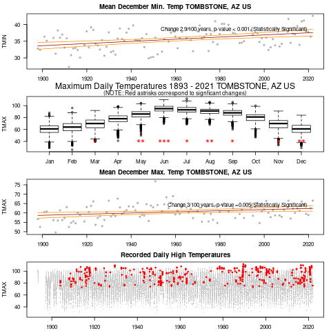

Updated: `r Sys.time()`

```{r setup, include=FALSE}
library(tufte)
library(ggplot2)
library(gganimate)
theme_set(theme_bw())
# invalidate cache when the tufte version changes
knitr::opts_chunk$set(tidy = FALSE, cache.extra = packageVersion('tufte'))
options(htmltools.dir.version = FALSE)
```
# Introduction

## Weather Records and Climate Trends

Human activities are driving climate change. And the impacts are being felt throughout the world --- and in spite of or because of climate activists are organizing around the issue. 

```{r maunaloa, echo=FALSE}
address <- "ftp://aftp.cmdl.noaa.gov/products/trends/co2/co2_mm_mlo.txt"
download.file(address, "maunaloa", quiet = F, mode = "w", cacheOK = T)
maunaloa <- read.table("maunaloa", skip=70)
names(maunaloa) <- c("year", "month", "decimal.date", "average", "interpolated", "trend", "days")
maunaloa$average[maunaloa$average==-99.99] <- NA
maunaloa <- data.frame(year=maunaloa$year, month=maunaloa$month, decimal.date=maunaloa$decimal.date, average=maunaloa$average)
```

```{r fig-margin, fig.margin = TRUE, fig.cap = "Observed CO~2~ concentrations (black) have been steadily increasing since we have begun measuring them in the 1950s, with a best fit line (red). Note that the slope or the rate of change is also increasing.", fig.width=3.5, fig.height=3.5, cache=TRUE, echo=FALSE}
par(las=1)
plot(maunaloa$decimal.date, maunaloa$average, type="l", ylab=expression(CO[2]*~ "(ppm)"), xlab="Year", 
main="Carbon Dioxide Concentration \n Mauna Loa, HI" )
#abline(coef(lm(average~year, data=maunaloa)), col="red", lwd=2)
muanaloa.loess = loess(average~year, data=maunaloa, span = 0.75, degree = 2, parametric = FALSE, 
  drop.square = FALSE, normalize = TRUE)
maunaloa$loess <- predict(muanaloa.loess)
lines(loess~decimal.date, data=maunaloa, lwd=1.4, col="red")
```

# Fifty States Project

We ofen hear about the globe's rising temperatures without learning much about how weather records in our own region might be contriubuting to these climate change patterns. 

In most cases, a station in a state supports the overall global pattern, but in some we see patterns that are ambiguous or even contractory.  

```{r, echo=FALSE, results='hide'}
file = "Weather_Station_Records_and_Climate_Change.pdf"

sourcePath <- "../../Social_Media"
destinationPath <- "States"
#dataFiles <- dir(rawPath, "*.csv", ignore.case = TRUE, all.files = TRUE)

file.copy(file.path(sourcePath, file), destinationPath, overwrite = TRUE)

dbase = read.csv("dbase.csv")

```


## Approach

For this project, I downloaded the longest and most complete record for each state and developed a standard set of analysis procedures and share them below. 

I have also been working to create short videos that will be shared on various forms of social media. 

For additional description of the project methods and R code, see ([Weather Station Records and Communicating
Climate Change](https://github.com/marclos/Climate_Change_Narratives/raw/master/docs/Social_Media/States/Weather_Station_Records_and_Climate_Change.pdf))
 

# Basics in Analyzing Data

## Correlation and Causation

## Statistical Considerations

## Animated CO2 Records

Sometimes it's a bit easier to see how these patterns develop over time and relative to what we think of as "pre-industrial" concentrations, which forms a base-line. 

```{r, prepare_img, eval=FALSE, echo=FALSE, message=FALSE, warning=FALSE, results='hide'}
library(magick)

img <- image_graph(600, 340, res = 96)
for(i in min(maunaloa$decimal.date):max(maunaloa$decimal.date)){
par(las=1)
plot(average~decimal.date, data=maunaloa[maunaloa$decimal.date<=i,], type="l", ylab=expression(CO[2]*~ "(ppm)"), xlab="Year", ylim=c(280, max(maunaloa[maunaloa$decimal.date<=i,4])), 
main="Carbon Dioxide Concentration \n Mauna Loa, HI" )
abline(h=280, col="gray50", lty=2); text(1970, 285,  "Pre-Industrial Estimate", col="gray20")
muanaloa.loess = loess(average~decimal.date, data=maunaloa, span = 0.75, degree = 2, parametric = FALSE, drop.square = FALSE, normalize = TRUE)
maunaloa$loess <- predict(muanaloa.loess)
lines(loess~decimal.date, data=maunaloa, lwd=1.4, col="red")
}
dev.off()

#CO2_animation <- 
```

Although an animated figured can serve to show changes, it can also be distracting or hard to follow. For example, below I have a pretty straight forward image demonstrating the CO2 changes in Mauna Loa. I think this works pretty well, but I suspect not everyone would agree.

```{r, co2animation, fig.margin = FALSE, fig.cap = "Observed CO~2~ concentrations (black) have been steadily increasing since we have begun measuring them in late 1950s, with a loess line (red). Note that the slope or the rate of change is also increasing.", fig.width=8, fig.height=5, cache=TRUE, echo=FALSE, warning=FALSE, message=FALSE}
image_animate(img, fps = 2, loop=5, optimize = TRUE)

#print(CO2_animation)
```


# States by Region

## New England

### Delaware


## Mid-West and Prairie States

### Kansas

([Kansas 2022](States/Kansas.html))


### Wisconson

([Wisconson 2022](States/Wisconson.html))

## The South

### Alabama

([Alabama 2022](States/Alabama.html))

```{r, echo=FALSE, out.width="100%", fig.align = "center", fig.cap="Full Temerature Record"}
files = subset(dbase, subset=(State=="Alabama"))
knitr::include_graphics(paste0("png/", files$panel4.png))

```
<!--  -->

### Texas

([Texas 2022](States/Texas.html))


## Inter-Mountain West

### Utah

([Utah 2022](States/Utah.html))

## West Coast

## Alaska and Hawaii

### Alaska

([Alaska 2022](States/Alaska.html))
<!--  -->

### Arizona

([Arizona 2022](States/Arizona.html)) is perplexing -- the station with one of the longest records had a cooling trend. How can we explain this?

<!--  -->


## Parallel issues in Europe and Asia


