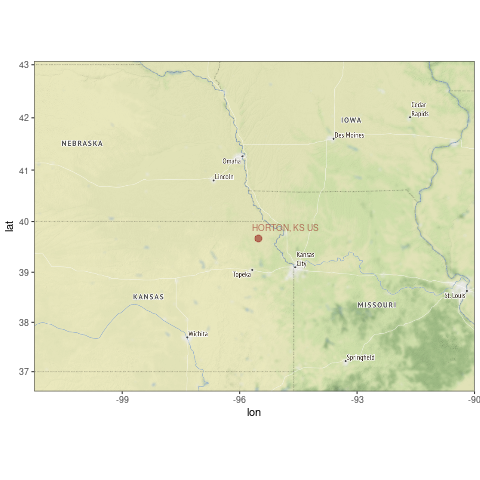
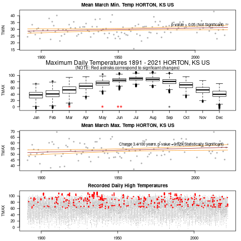

```{r setup, include=FALSE}
knitr::opts_chunk$set(echo = FALSE)
```

## Data Source and Procedures

Open Source Software & Publicly Available Data

- GSOM (Monthly Average Data -- not corrected for biases)
- Analysis and Graphics R/Rstudio
- Selected Station with longest and fewest missing data
- Determined which month had strongest signal
- Evaluate Temp Trend for record

Results
========================================================

```{r, echo=FALSE, out.width='70%'}
   
```

Results
========================================================

```{r, echo=FALSE, out.width='70%'}
   
```

## Slide with Bullets

- Bullet 1
- Bullet 2
- Bullet 3

## Slide with R Output

```{r cars, echo = TRUE}
summary(cars)
```

## Slide with Plot

```{r pressure}
plot(pressure)
```

