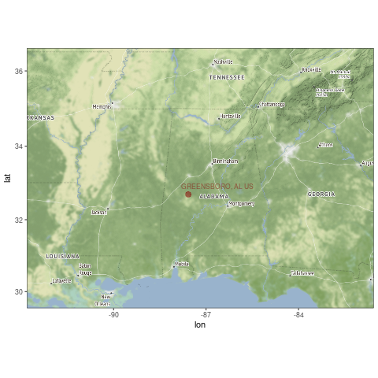
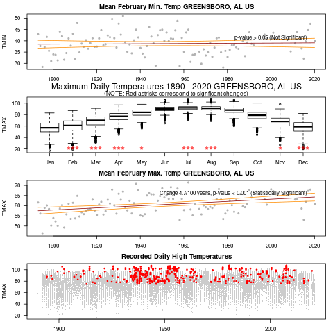

```{r setup, include=FALSE}
knitr::opts_chunk$set(echo = FALSE)
# https://marclos.github.io/Climate_Change_Narratives/Social_Media/
```

```{r, child=c('Intro.Rmd')}
```


## Results

```{r, echo=FALSE, out.width='70%'}
   
```

## Results

```{r, echo=FALSE, out.width='60%'}
   
```

## Conclusion

### Impacts

- Significant warming in March and June
- ~3 degrees/100 years
- If trend continues...
    - Increase Heat-related public health impacts
    - Increase in A/C costs
    - Earlier planting of crops (increase yields?)
    - Hotter summer Temps (lower yields?)
    
(https://19january2017snapshot.epa.gov/sites/production/files/2016-09/documents/climate-change-al.pdf)

## State Adaptation / Mitigation Plans


(Source: Georgetown Climate Center) !(https://www.georgetownclimate.org/adaptation/state-information/alabama/overview.html)

```{r, child=c('NextSteps.Rmd')}
```


