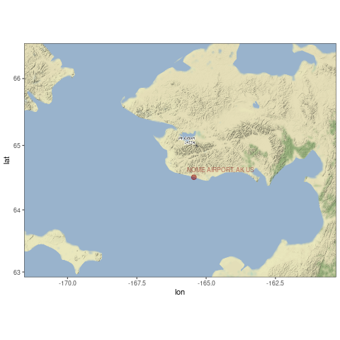
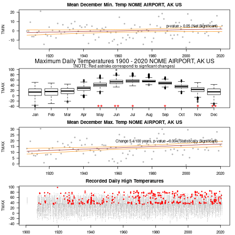

```{r setup, include=FALSE}
knitr::opts_chunk$set(echo = FALSE)
# https://marclos.github.io/Climate_Change_Narratives/Social_Media/
```

```{r, child=c('Intro.Rmd')}
```

## Results

```{r, echo=FALSE, out.width='70%'}
   
```

## Results

!(https://marclos.github.io/Climate_Change_Narratives/Social_Media/gif/Alaska.gif)
```{r, echo=FALSE, out.width='60%'}
   
```

## Conclusion

### Impacts
- Glaciers and Sea Ice
- Permafrost, Infrastructure, and Energy Production
- Fisheries and Wildlife
- Forests and Tundra
- Alaska Native Communities
- Health and Vulnerable People
    
!(https://19january2017snapshot.epa.gov/sites/production/files/2016-09/documents/climate-change-ak.pdf)

## State Adaptation / Mitigation Plans

- On September 14, 2007, Governor Sarah Palin established the Alaska Climate Change Sub-Cabinet in order to advise the Office of the Governor in preparing and implementing a climate change strategy for the state (Administrative Order No. 238).
- An Adaptation Advisory Group was responsible for developing recommendations to address impacts of climate change in Alaska, and submitted its recommendations to the Sub-Cabinet on January 27, 2010. 
- The final 2010 plan, Alaska’s Climate Change Strategy: Addressing Impacts in Alaska (Strategy), recommends a variety of steps to address the current and anticipated impacts of climate change

(Source: Georgetown Climate Center) https://www.georgetownclimate.org/adaptation/state-information/arizona/overview.html


