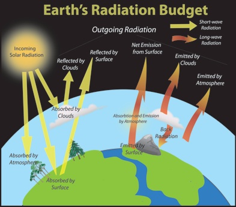

```{r setup, include=FALSE}
library(tufte)
# invalidate cache when the tufte version changes
knitr::opts_chunk$set(tidy = FALSE, cache.extra = packageVersion('tufte'))
options(htmltools.dir.version = FALSE)
```
# The On-going Political Debate

In early March 2017, the recently confirmed administrator of the US Environmental Protection Agency, Scott Pruitt reaffirmed his disbelief that carbon dioxide is a major contributor to climate change. Citing the challenge of "measuring with precision human activity on the climate" and "tremendous disagreement", Pruitt's comment is unsurprising. Nevertheless, we wonder, 'what are the implications of Pruitt's views for Americans?' And what might Americans do to protect themselves?

## Climate and Radiative Forcing

Climate is defined as the average weather condition. But climate is dynamic; climate can also change with time. Climate change can occur for a myriad of interacing reasons. Thus, the science of climate change is complex. And yet, we understand what can drive climate change and even how sensitive climate is to the composition of the atmosphere.

`r margin_note("Earth's energy balance is composed of the sum of the inputs and outputs. Scientists have a pretty good idea about how much heat is trapped by greeenhouse gases.")`

The Earth's temperature is defined by the amount of energy entering and exiting the atmosphere. Some of this energy or radiation is reflected by the Earth's atmosphere, some is absorbed by the atmosphere, and some reaches the Earth's surface, where it might also be absorbed or reflected. A portion of reflected energy is trapped by greenhouse gases and keeps our planet warmer than it would be if these gases were not present. In fact, without these gases, Earth would be significantly cooler, i.e. frozen! 

## Carbon Dioxide as a Major Greenhouse Gas

Although a host of gases can trap heat, carbon dioxide or CO~2~ is particularly important. CO~2~ concentrations are relatively large compared to most greenhouse gases and have increased due land use changes and the combustion of fossil fuels. We even know how much of the CO~2~ in the atmosphere has come from burning of fossil fuels.

```{r maunaloa, echo=FALSE}
address <- "ftp://aftp.cmdl.noaa.gov/products/trends/co2/co2_mm_mlo.txt"
download.file(address, "maunaloa", quiet = F, mode = "w", cacheOK = T)

maunaloa <- read.table("maunaloa", skip=70)
names(maunaloa) <- c("year", "month", "decimal.date", "average", "interpolated", "trend", "days")
maunaloa$average[maunaloa$average==-99.99] <- NA
maunaloa <- data.frame(year=maunaloa$year, month=maunaloa$month, decimal.date=maunaloa$decimal.date, average=maunaloa$average)
#head(maunaloa)
#str(maunaloa)
#write.csv(maunaloa, file = "H:\\My Documents\\My Webs\\Mauna_Loa.csv", eol = "\n", row.names = F)
```

Although political debate about the causes of climate change exists as EPA Pruitt correctly points out, the scientific debate is limited to subtle areas of uncertainty -- for example, at what ocean temperature might methane hydrates from the ocean be released into the atmosphere? Or how quickly will high latitude tundra become a major CO~2~ source? Or when will melting ice shelves significantly contribute to sea level rise?

In contrast to the red herring nature of political debates about the role of greenhouse gases on climate change, we know how they influence the planet's climate from multiple sources of evidence [@pachauri2015ipcc]. Furthermore, as a major greenhouse gas, CO<sub>2</sub> concentrations are increasing as a result of our use of fossil fuels and already influences the planet's climate.

## Increasing Carbon Dioxide Concentrations

Atmospheric CO<sub>2</sub> concentrations are measured in a continuous fashion from several locations around the world. The longest record is measured on the volcano Mauna Loa, Hawaii. Using these data, we can estimate how CO~2~ concentrations have changed.

```{r fig-margin, fig.margin = TRUE, fig.cap = "Observed CO~2~ concentrations (black) have been steadily increasing since we have begun measuring them in the 1950s, with a best fit line (red). Note that the slope or the rate of change is also increasing.", fig.width=3.5, fig.height=3.5, cache=TRUE, echo=FALSE}
par(las=1)
plot(maunaloa$decimal.date, maunaloa$average, type="l", ylab=expression(CO[2]*~ "(ppm)"), xlab="Year", 
main="Carbon Dioxide Concentration \n Mauna Loa, HI" )
abline(coef(lm(average~year, data=maunaloa)), col="red", lwd=2)
```

One way to assess a trend or make predictions is to model the data as we have done in the figure to the right. Although the fitted line follows the trend, significant variation exists the data. Some of this intraannual variation is due the seasonality of CO<sub>2</sub> uptake and release by plants. 

Scientists use models to explore patterns or develop predictions. Since a straight line doesn't fit the data very well, we might explore alternative models. For example, we can specify a model that includes seasonal variation and a changing rate of change (using a polynomial equation). 

```{r polynomial, echo=FALSE, results='hide'}
new.lm <- lm(average~poly(decimal.date,2) + cos(2*pi*month/12) + sin(2*pi*month/12), data=maunaloa, na.action = na.exclude)

summary(new.lm)
extra.dates = c(max(maunaloa$decimal.date) + seq(1/12, by=1/12, length.out=20))
extra.months = rep(seq(1, 12, length.out=12),3) 
predicted.intervals <- predict(new.lm, data.frame(decimal.date=c(maunaloa$decimal.date, extra.dates), month=c(maunaloa$month, extra.months[2:21])), 
  interval='confidence', level=0.99)

```  

By incorporating more parameters (polynomial and a sin/cos function), we can create a curved line that better fits the data. However, we lose the simplicity of estimating concentration changes as a single, simple rate.

```{r fig-margin2, fig.margin = FALSE, fig.cap = "Observed CO~2~ concentrations (black) and modelled with a polynomial equation (purple): $CO_2 = date + (date)^2 + \\\\ cos(2\\pi*month/12) + \\\\ sin(2\\pi*month/12) + \\epsilon.$", cache=TRUE, echo=FALSE}
par(las=1)
plot(maunaloa$decimal.date, maunaloa$average, type="l", lwd=2, col="grey40", ylab=expression(CO[2]*~ "(ppm)"), xlab="Year", 
main="Carbon Dioxide Concentration \n Mauna Loa, HI" )
lines(c(maunaloa$decimal.date, extra.dates),as.numeric(predicted.intervals[,1]),col='blueviolet',lwd=1)
```

## Climate Science and Potential Regional Impacts

Based on recent surveys, many American's don't believe climate change will personally affect them. In the figure below, residents in specific southwest counties are more likely to acknowledge that climate change will affect them personally. In some areas few recognize how regional impacts of climate change will affect them personally.

`r margin_note("Most people acknowledge someone in the US will be harmed by climate change, but fewer recognize the potential for personal harm. Source: Howe, Peter D., Matto Mildenberger, Jennifer R. Marlon, and Anthony Leiserowitz (2015). “Geographic variation in opinions on climate change at state and local scales in the USA.” Nature Climate Change, doi:10.1038/nclimate2583")`

We decided to evalaute the potential for regional impacts and document the evidence of potential changes. We spent six weeks learning how scientists evaluate the earth's climate systems. For example, we learned some skills used to determine if the Earth's temperature has changed, while appreciating sources of uncertainty. 

Each student selected a region that has a weather station with a relatively long record (i.e. more than 100 years if possible). After downloading on-line climate data (temperature, precipitation, etc) for a specific station, we used a few open source software tools to process [@R-base], analyze, and communicate the data [@R-rmarkdown]. To keep it simple, we all evaluated temperature records for an individual location in the USA and determined if there was a trend.

Once completing the analysis of a station, we reviewed the scientific literature to evaluate the implications of climate change relevent to the region in question. 

Finally, we combined this information into a series of blogs that might be used to help understand local and regional climate change implications. Please reading the blogs that you find of interest.

## 2017 Blogs

[Lodi California by Marisa Weinstock](Weinstock_Blog.html)

[Oklahoma by Claudia Chandra](Claudia_s_Blog_Post.html)

[O'ahu, Hawai'i by Kelli Kokame](Kokame_Blog.html)

[Alvin, Texas by Mireya Valencia](Valencia_Blog1.html)

[Monroe County, Florida by Viraj Singh](Singh_Blog.html)

[Barrow, Alaska by Katie Graham](Graham_Blog.html)

[Ojai, California by Olivia Whitener](Whitener_Blog.html)

[Denver, Colorado by Thea Piccone](Piccone_Blog.html)

[New Orleans, Louisiana by Khalil Johnson](Johnson_Blog.html)

# Conclusions

Temperature trends vary dramatically accross the country. Most areas were warming, but the signal might only be found for a specific monthly means or with minimum temperatures. High latitudes, i.e. Alaska, was changing more dramatically than any place in the conterminous US. However, nearly every region has been experiencing climate change that we believe every person in the US will be personally and directly affected by climate change. Of course, we will also be indirectly affected -- when Floridians become environmental refugees, the impact of their move will be impacted by everyone in the nation, not unlike the impact of Oklahomans moving to the west after the dust bowl. The real question that Amercians should ask, is if their federal government is working to mitigate these impacts and protect its citizens and tax payers? If Scott Pruitt is emblematic, then we have to answer 'no'. 

But what action can we take if the US EPA is not protecting its citizens?  One approach is to decide if Pruitt the 'boogie man' or a reasonable politician protecting a constinuency. Assuming the latter, then writing our representative or senator about your concerns about the potential harm that climate change might have to you personally is an extremely important action. If Pruitt is the alternative, we suggest the action is the same! Write your congressman to complain! The risks are both direct and indirect to Americans and as tax payers, we should be able to expect our government to protect us from climate change with a reasonable effort.