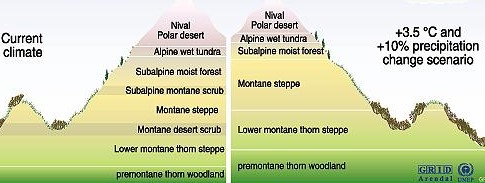
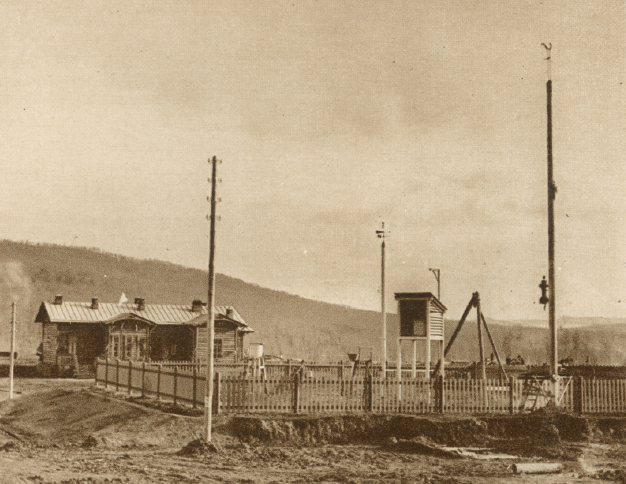

Updated: `r Sys.time()`

```{r setup, include=FALSE}
library(tufte)
# invalidate cache when the tufte version changes
knitr::opts_chunk$set(tidy = FALSE, cache.extra = packageVersion('tufte'))
options(htmltools.dir.version = FALSE)
```
# Introdution

## Weather Records and Climate Trends

```{r echo=FALSE, fig.margin = TRUE, out.width='100%', fig.cap='The ecological communities on mountains can vary with elevation, but these communinities are extremely vulnerable to climange change. As temperatures increase, populations .'}

```

Establishing and maintaining consistently designed weather stations requires institutional capacity. In many cases, the weather stations are a symbol of and component of modernity. 

However, as Bruno Latour has noted the process to modernize is both uneven and inconsistent [@latour2012we; @pachauri2015ipcc]. And as we look to use weather stations, which had been estalished answer specific local questions, e.g. when will there be enough water to plant rice or warm enough to sow corn. But as we try to evaluate how the ``average weather" or climate might be changing we learn about how complex it is to use these weather stations. 

```{r echo=FALSE, fig.margin = TRUE, out.width='100%', fig.cap='This weather station was established in 1881 as part of the construcion of the trans-Siberia railroad . The meteorological station was built by the passenger terminal at the Amazar Station'}

```
For example, starting in 1881 a station in China has been recording daily temperatures, but it is not clear 1) where the station is, 2) who has been in charge of it, 3) what technology there were using to make their measurements [Massari (2019)](F2019/Massari/Massari0.html).

Meanwhile weather stations in remote locations, such as Glacier National Park have been moved so often, that developing a long-term trend might seem impossible [Foster (2019)](F2019/Foster/Foster0.html).

# Climate Change in High Elevation Locations

## Alpine Environments

Zurich, a city in northern Switzerland, is a unique masterpiece of the world. Situated next to a gorgeous lake with magnificent swiss alps in view, Zurich is home to a substantial number of environmental lovers, groups, and institutions. 

Using climate data from the National Ocean and Atmospheric Administration (NOAA), [Tomz (2019)](F2019/Tomz/Tomz1.html) documents how daily and monthly climate and precipitation trends over the past century and found [waiting for text from Emily]. Meanwhile, [Shinn (2019)](F2019/Shinn/Shinn2.html) found that Sion (Switzerland) appears be suffering only from increasing summer temperatures, with insignificant precipitation and snowdepth change. 

[Saravia (2019)](F2019/Saravia/Saravia0.html) was interested in the alpine impacts, expecially with respect to the skiing season and found a dramatic deline in snow cover late spring. 

Denver changes is known to have highly variable weather. Thus, [Bidell (2019)](F2019/Bidell/Bidell1.html) evaluated if there has been an increase in variability. Granted that the question is rather complicated, the results suggest more analysis is necessary to make a conclusive statement. 

# Urban Environments

## Getting and Processing Data

As it turns out obtaining and processing the data from NOAA is far from trivial. To make the process more transparent, [Hsu (2019)](F2019/Hsu0.html) documented the steps taken to determine if trends exist in San Francisco. In this example, we can see the messy process of learning to analyze these data.

## Impacts and Coastal Zone Impacts

Nevertheless, as [Hsu (2019)](F2019/Hsu0.html) has demonstrated, the impacts of climate change in San Francisco might be ``felt'' as in terms of sea level rise and not as temperature per se. 

## SST

[Weed (2019)](F2019/Weed/Weed0.html)


## Perceptions and Records

In the climate change debate, as in many conflicts, we find that our beliefs, ideals and political affliations play a distinct role in our perceptions. This blog explores how belief for or against climate change filters public perception in different regions. For example, [Whitman_Sandmeyer (2019)](F2019/Whitman_Sandmeyer/Whitman_Sandmeyer1.html) found that the signal for climate change in Kentucky to be challening to determine. This, of course, ``maps'' onto the region in particularly interesting ways in terms of politics and climate impacts.  

On the westcoast, the State of California has experienced record setting fires, but the relative role of climate on these is subject to debate. [Mc Williams (2019)](F2019/McWilliams/McWilliams0.html) describes how complicated it is to determine the potential role of climate change on the size and severity of fires. 

## Global Anarchy and Fair Reciprocity

The concept of climate justice has taken on a wide range of ethical frameworks which have been applied to diverse set of political and social scales. Within the nation-state governance anarchy, scholars have attempted to create moral imperatives to address climate impacts on countries that have not contributed to or enjoyed the economic rewards of greenhouse gases emissions. Using the 'fair reciprocity'  [Bekkers (2019)](F2019/Bekkers/Bekkers2.html) argues that the Netherlands should provide assistance to the Marshall Islands as the islands face potentially devastating impacts of sea level rise. 


## Incomplete Blogs

- Seattle [Piette (2019)](F2019/Piette/Piette1.html)
- Chicago [Grant (2019)](F2019/Grant/Grant0.html)
- Venezuela [Chaichang Azterbaum (2019)](F2019/Chaichang_Azterbaum/Chaichang_Azterbaum.html)
# Conclusion


# Previous EA30 Projects

[Attribution Science (Spring 2019)](S2019/index_2019S.html)

[Climate Change and Fires -- Is this a red herring or the alarm alarmists have been warning about? (Fall 2918)](F2018/index_2018F.html)

[Why Climate Change Will Affect You Personally? (Fall 2017)](F2017/index_2017F.html)

[Climate Change and Logical Fallacies Spring 2016)](S2017/index_2017S.html)
