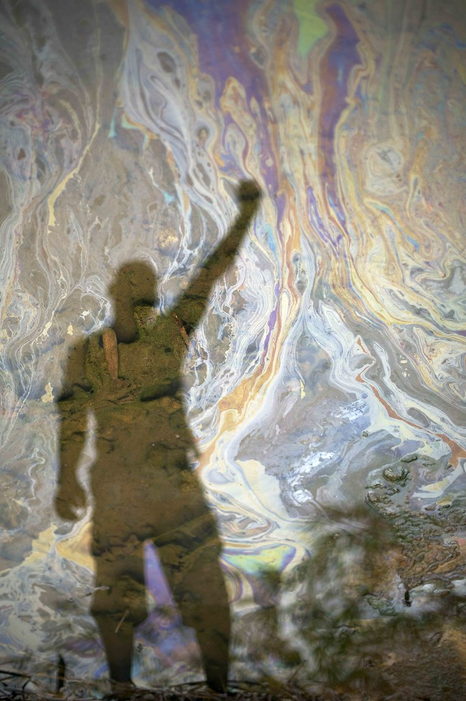
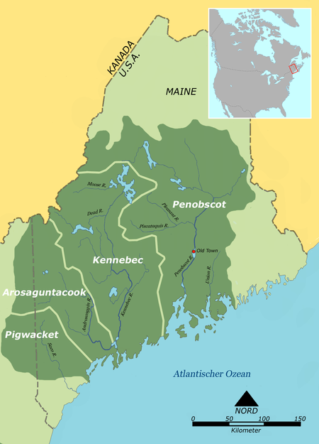

Updated: `r Sys.time()`

```{r setup, include=FALSE}
library(tufte)
# invalidate cache when the tufte version changes
knitr::opts_chunk$set(tidy = FALSE, cache.extra = packageVersion('tufte'))
options(htmltools.dir.version = FALSE)
```
# Introduction

## Weather Records and Climate Trends

```{r echo=FALSE, fig.margin = TRUE, out.width='100%', fig.cap='Tribute photo for Ken Saro Wiwa anniversary. Reflection in polluted river of local activist who follows in Ken"s footsteps, Kegbara- dere community Luka Tomac/Friends of the Earth International. Taken 5 November 2015. Some rights reserved. creativecommons license 2.0'}

```

<<<<<<< HEAD
However, as Bruno Latour has noted the process to modernize is both uneven and inconsistent [@latour2012we; @pachauri2015ipcc]. And as we look to use weather stations, which had been established answer specific local questions, e.g. when will there be enough water to plant rice or warm enough to sow corn. But as we try to evaluate how the ``average weather" or climate might be changing we learn about how complex it is to use these weather stations. 
=======
These activists include a diverse set of players --- many of whom be obscure. Others are well known and use media to draw attention to their views. 

But our question this year, is how do activitists use weather records and climate science as a whole to support their arguments?  Some may emphasize the uncertainty, others may rely on well trusted sources. Each use various sources of information to push for specific policy goals. As a class we summarized climate change patterns for various regions around the world while describing how various activists engage in policy or politics. 

## Basics of Climate Science

Climate change science is complex -- but some relatively simple conclusions can be made: 1) humans are adding more CO~2~ to the atmosphere than the Earth can assimilate; 2) CO~2~ acts as a greenhouse gas and can regulate the Earth's temperature; 3) the anthropogenic sources of greenhouse gases trap heat in the Earth's atmosphere; 4) the trapped heat is warming the Earth and having documented impacts on the Earth's surface. 

What are these regional impacts? How are regional stakeholders dealing with these impacts?

As we document below every region in the US and beyond respond differently to the planet's warming. As as such, actvitists will  the issues of climate change from different perspectives--- and play an important role in defining climate change narratives.

## Activitism 

```{r echo=FALSE, fig.margin = TRUE, out.width='100%', fig.cap='Tribute photo for Ken Saro Wiwa anniversary. Reflection in polluted river of local activist who follows in Ken"s footsteps, Kegbaradere community Luka Tomac/Friends of the Earth International. Taken 5 November 2015. Some rights reserved. creativecommons license 2.0'}
knitr::include_graphics('F2020/Images/KenSara-Wiwa.jpg')
```

Ken Saro-Wiwa was a Nigirian activitists, devoting most of his time to human rights and environmental causes, particularly in Ogoniland. He was one of the earliest members of the Movement for the Survival of the Ogoni People (MOSOP), which advocated for the rights of the Ogoni people. He was particularly critical of the Royal Dutch Shell Company for its impact on Ogoni lands. In 1995, he was sentance to death, based on false charges, which provoked international outrage and the immediate suspension of Nigeria from the Commonwealth of Nations, as well as the calling back of many foreign diplomats for consultation. Saro-Wiwa remains an important symbol of resistance to the impacts of the fossil fuel demand.

# Projects for 2020

## Fire and Air Quailty 

Refuting the president's false claims regarding climate change and California wildfires as an example, [Plancarte (2020)](F2020/Plancarte.html) encourages climate activists in the San Diego region to identify and actively combat climate change skeptics claims with research-backed evidence.

Hook...For example, [LeBlanc (2020)](F2020/LeBlanc.html)...

Inter-Mountain Region

Between the Sierra/Cascade ranges and the Rocky Mountains, is the Great Basin. Climate change is expected to have important implications. Utah as a mix of urban (Salt Lake City) and wilderness landscapes that make the impact of climate change ???. [Duggleby (2020)](F2020/Duggleby.html) 

Meanwhile [Williams (2020)](F2020/Williams.html) argues that Salt Lake City's climate is approach that of Las Vegas.

## Economic Impacts on Agriculture

How will climate change affect prosperous agricultural regions in the country? [Rubin (2020)](F2020/Rubin.html) explores the the ecological and economical threats of anthropogenic climate change to the mitten state, while [Manning (2020)](F2020/Manning.html) evaluates climate change in a small town in Idaho. 

## Hydrology and Farming Impacts

Climate change will not only change temperatures, but also rainfall patterns. In rural communities, which are often rely on agriculture, changes in rainfall and streamflow can have imporant impact on relative properity of the community. For example, After observing frequent and severe flooding of the Des Plaines River near her home in Libertyville, Illinois, [Burns (2020)](F2020/Burns.html) analyzed peak annual flow rates of the river over sixty years to determine if the rivershed has become more overwhelmed after heavy rain.  

## The South

[Swiere (2020)](F2020/Swiere.html) documents the impact on climate in Texas and why we should care... :-)

## New England

```{r echo=FALSE, fig.margin = TRUE, out.width='100%', fig.cap='The Androscoggin were an Abenaki people of what are now the U.S. states of Maine and New Hampshire.'}

```

[Hoffsten (2020)](F2020/Hoffsten.html) explores the impact of climate change on Maine's environment and social and economic infrastructure and advocates for the orientation of Indigenous narratives within climate conversations.

## Urban Heat, Health, Environmental Justice

Cities are generally warmer than rural areas -- but can we separate climate change from warming associated with heat? [McGrath (2020)](F2020/McGrath.html) asks if Chicago getting hotter? How will this interact with the fact that it is an Urban Heat Island? What can we do? [McGrath (2020)](F2020/McGrath.html) analyzed temperature trends in Chicago and investigate how these trends work towards proving a pattern of warming resulting from anthropogenic effects on the planet. In addition, she examined how the Urban Heat Island effect is unevenly distributed across Chicago, how it can worsen effects of climate change, and how activists can address both environmental inequality and mitigation of warming.

Similarly, residents of Los Angeles have been experiences warming that includes a strong signal for climate change [(Marsh 2020)](F2020/Marsh.html).

Climate change has specific and differential impacts on health outcomes and in many case, fall disporportionately on vulnerable populations. For example, [Greene (2020)](F2020/Greene.html) describes how high tempertures in Washington D.C. are exhasberated with low tree cover in predominantly black and low-income neighborhood; Thus, these reidents face greater heat-related health problems.

In contrast, [Tahbaz (2020)](F2020/Tahbaz.html) evaluates the non-intuitive impact of snow events in NYC and it's social justice implications. 

## Tropical Areas in the USA

Tropical areas in the US have also experienced climate change. For example, [Waring (2020)](F2020/Waring.html) explores the various effects of global warming as well as Native Hawaiian climate change activists and environmental injustice issues. [Meilenger (2020)](F2020/Meilenger.html) describes the changes in Orlando Florida...

## Parallel issues in Europe and Asia

Europeans have also reason to pay attention, [Bisaga (2020)](F2020/Bisaga.html) documents potential climate impacts in Poland.

Southeast Asia has also been experiences climate change. [Nguyen (2020)](F2020/Nguyen.html) describes the issues associated in Vietnam. 

[McGrath (2020)](F2020/McGrath.html)

>>>>>>> 0a67d10... update front page


# Previous EA30 Projects

[Climate Records, Alpine Environments, and Coastal Impacts (Fall 2019)](F2019/index_2019F.html)

[Attribution Science (Spring 2019)](S2019/index_2019S.html)

[Climate Change and Fires -- Is this a red herring or the alarm alarmists have been warning about? (Fall 2918)](F2018/index_2018F.html)

[Why Climate Change Will Affect You Personally? (Fall 2017)](F2017/index_2017F.html)

[Climate Change and Logical Fallacies Spring 2016)](S2017/index_2017S.html)
