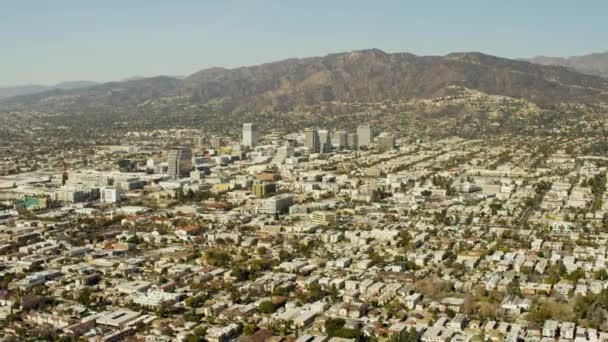
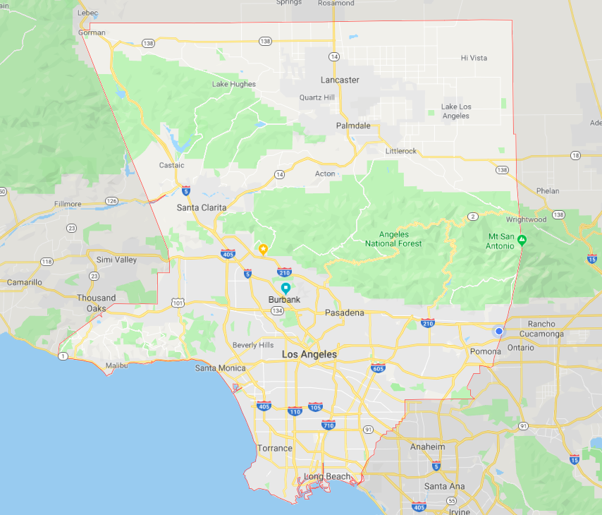
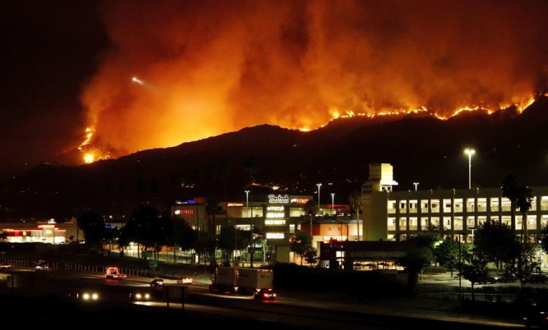
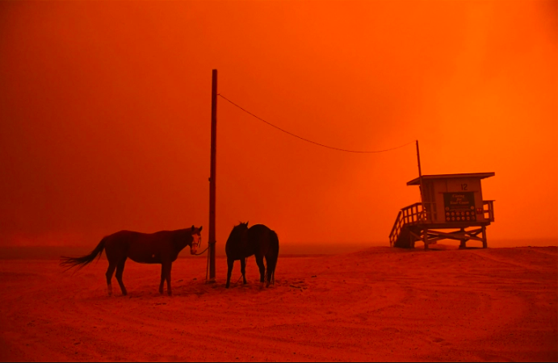

```{r setup, include=FALSE}
knitr::opts_chunk$set(echo = TRUE)
```




# Introduction

Southern California, thanks to its temperate climate and sunny beaches, has a reputation as one of the most idyllic climates in America. The heart of Southern California, Los Angeles county,is the most populous county in the United States with over 10 million residents.^9^ However, LA county's warm climate hides a much more sinister environmental concern: the phenomenon known colloquially as “climate whiplash.” Put simply, this term denotes frequent transitions from very wet to very dry weather.^8^ This phenomenon is becoming more prevalent worldwide, but is easily identifiable in Southern California: at the end of 2018, for example, the hills of Burbank went from a raging fire to deadly mudslides in just a few weeks, causing massive property damage^6^ and prolonged evacuations of both people and livestock.^1^ Observed climate and precipitation trends support the hypothesis that temperature and therefore precipitation are not only increasing, but becoming more varied over time. This blog examines the observed trends of climate whiplash in Southern California. Using both scientific studies and raw climate data from the National Oceanic and Atmospheric Administration (NOAA), I will analyze evidence to support the existence of the above hypothesis in the Los Angeles County Region. From this data, I will then discuss the effects of this whiplash on the community itself; including flooding, fires, and water supply contamination. The effects of climate whiplash are still being unraveled from those attributed solely to global warming; this blog intends to demystify some of these misguided conclusions and bring awareness to the Los Angeles’ new reality of climate whiplash. 



# Methods

For this analysis, I obtained daily summaries of temperature and precipitation data for Burbank. Then, using the program R-Studio, I graphed the data in order to assess trends and relationships between time, temperature, and precipitation, as well obtain additional statistical information about the the data. In order to assess a relationship between two variables, in this case time and temperature as well as time and precipitation, it is necessary to use the null hypothesis method. In this case, the null hypothesis would state that there is no direct relationship between time and temperature/precipitation, and is codified in the data as the ‘p-value.’ If the p-value (calculated in R-Studio) is less than .05, then the null hypothesis may be rejected; this means that there is without question a relationship between the two variables. However, if the p-value is greater than .05, there is still possibility that the relationship does not exist. 

###The Data

My climate data came from National Oceanic and Atmospheric Administration (NOAA), which keeps an extensive climate database compriled from weather stations across the United States. Using their Climate Data Online program, I was able to download daily summaries of maximum and minimum temperatures as well as precipitation data from my station of choice: the Burbank Valley Pump Plant (Station GHCND:USC00041194). This specific dataset covered all the way from 1939 to the present day, and had a 99% coverage rate, meaning that only 1% of data was left unaccounted for in the form of a gap or lapse in the data. 

###Drawbacks

There are certain restrictions to only using one dataset and location for my analysis. Because I am using just one location and then applying trends I see there to the entirety of LA county, there is the potential for misgeneralizations to be made to locations in which the data I have does not apply. However, a singular dataset simplified the analysis process, and, since this particular set has a very long and consistent set of results, I can use it to reliably track trends without the fear of missing data or gaps skewing the results. Furthemore, thanks to Burbank's central location, it is a reasonable assumption that trends collected here will be similar enough to trends observed throughtout the county that basic generalizations can be made (with the understanding that exact temperatures/preciptation totals will be slightly different depending on the city.)

# Data

```{r include=FALSE}
##Read CSV Data
filepath= "/home/CAMPUS/ttab2018/Climate_Change_Narratives/student_folders/Anderson/tonianderson_burbank_realdata.csv"
climate_data = read.csv(filepath)
head(climate_data)
str(climate_data)
names(climate_data)

##Fix Dates
strDates <- as.character(climate_data$DATE)
climate_data$NewDate <- as.Date(strDates, "%m/%d/%Y")
```

```{r include=FALSE}
## Define Shit
lm(TMAX~NewDate, data=climate_data)
summary(lm(TMAX~NewDate, data=climate_data))

##Monthly Averages
climate_data$Month = format(as.Date(climate_data$NewDate), format="%m")
climate_data$Year = format(as.Date(climate_data$NewDate), format="%Y")
MonthlyTMAXMean = aggregate(TMAX ~ Month +Year, climate_data, mean)
MonthlyTMAXMean$YEAR = as.numeric(MonthlyTMAXMean$Year)
MonthlyTMAXMean$MONTH = as.numeric(MonthlyTMAXMean$Month)
str(MonthlyTMAXMean)
plot(MonthlyTMAXMean$TMAX, ty='l')

##Plot May
plot(TMAX~YEAR, data=MonthlyTMAXMean[MonthlyTMAXMean$Month=="05",], ty='l', xlim=c(1950, 2020), main="May TMAX(Degrees Celcius) vs. Time(Years)", xlab="Time(Years)", ylab="TMAX(Degrees Celcius)", col.main="black", col.lab="blue")
May.lm <- lm(TMAX~YEAR, data=MonthlyTMAXMean[MonthlyTMAXMean$Month=="05",])
summary(May.lm)
abline(coef(May.lm), col="red")

##TMIN Definitions
plot(TMIN~NewDate, climate_data, ty='l', main="TMIN(Degrees Celcius) vs. Time(Years)", xlab="Time(Years)", ylab="TMIN(Degrees Celcius)", col.main="black", col.lab="blue" )
c <- coef(lm(TMIN~NewDate, climate_data))
abline(c, col="red")
MonthlyTMINMean = aggregate(TMIN ~ Month +Year, climate_data, mean)
MonthlyTMINMean$YEAR = as.numeric(MonthlyTMINMean$Year)
MonthlyTMINMean$MONTH = as.numeric(MonthlyTMINMean$Month)
head(MonthlyTMINMean)

##Precipitation Data (Initial Data)
filepath= "/home/CAMPUS/ttab2018/Climate_Change_Narratives/student_folders/Anderson/tonianderson_burbank_realdata.csv"
climate_data = read.csv(filepath)
head(climate_data)
str(climate_data)
names(climate_data)

##Fix Dates
strDates <- as.character(climate_data$DATE)
climate_data$NewDate <- as.Date(strDates, "%m/%d/%Y")

##Precipitaion Data (Get sum, then create monthly plots)
## Define Shit
lm(PRCP~NewDate, data=climate_data)
summary(lm(PRCP~NewDate, data=climate_data))

##Monthly Sums
climate_data$Month = format(as.Date(climate_data$NewDate), format="%m")
climate_data$Year = format(as.Date(climate_data$NewDate), format="%Y")
MonthlyPRCPSum = aggregate(PRCP ~ Month +Year, climate_data, sum)
MonthlyPRCPSum$YEAR = as.numeric(MonthlyPRCPSum$Year)
MonthlyPRCPSum$MONTH = as.numeric(MonthlyPRCPSum$Month)
str(MonthlyPRCPSum)

##P-Values
TMIN.lm <- lm(TMIN ~ YEAR, data = MonthlyTMINMean)
summary(TMIN.lm)
TMAX.lm <- lm(TMAX ~ YEAR, data = MonthlyTMAXMean)
summary(TMAX.lm)
PRCP.lm <- lm(PRCP ~ YEAR, data = MonthlyPRCPSum)
summary(PRCP.lm)
```

###Maximum Temperature Monthly Averages 

```{r echo=FALSE}
plot(TMAX~NewDate, climate_data, ty='l', main="TMAX(Degrees Celcius) vs. Time(Years)", xlab="Time(Years)", ylab="TMAX(Degrees Celcius)", col.main="black", col.lab="red" )
c <- coef(lm(TMAX~NewDate, climate_data))
abline(c, col="red")

```

This graph shows Burbank’s average monthly maximum temperatures from 1940 until today, representing the entirety of the data set. With a p-value of 0.015, it is safe to reject the null hypothesis, establishing a concrete relationship between time and temperature. Furthemore, with a postive slope of 4.77 x 10^-5^, this graph asserts that this relationship is positive, or increasing over time. Though the slope itself may seem small, it is very significant because in a graph with such varied data, even a small net increase has big impacts on future variation patterns.^8^ In climate data especially, where even half a degree can cause major environmetnal impacts, even relatively small trends have big consequences.^4^


###Minimum Temperature Monthly Averages 

```{r echo=FALSE}
##TMIN
plot(TMIN~NewDate, climate_data, ty='l', main="TMIN(Degrees Celcius) vs. Time(Years)", xlab="Time(Years)", ylab="TMIN(Degrees Celcius)", col.main="black", col.lab="blue" )
c <- coef(lm(TMIN~NewDate, climate_data))
abline(c, col="blue")

```

This graph also shows monthly average temperature, but this time, it is showcasing the minimums. Once again we can reject the null hypothesis with a p-value of 0.001. The slope is 4.62 x 10^-5^; again a relatively small slope, but one with important implications. While TMIN is still increasing, it is doing so far less rapidly than TMAX, leading to an icreasing gap between the daily TMAX and TMIN. This is the first indication of climate whiplash; as gaps become more pronounced and varied over time, there will be a large effect on precipitation consistency, therefore kickstarting whiplash climate patterns.^6^

###Precipitation Monthly Sums 

```{r echo=FALSE}

##Plot Data
plot(PRCP~NewDate, climate_data, ty='l', ylim=c(0, 300), main="Precipitation vs. Time(Years)", xlab="Time(Years)", ylab="Precipitation (Milimeters)", col.main="black", col.lab="green" )
c <- coef(lm(PRCP~NewDate, climate_data))
abline(c, col="green")
```

Now this graph is where things get interesting. What is important to note here is high variation in total precipitation. With a p-value of 0.755, there is certainly no way we can reject the null hypothesis. As shown in the graph, there is no clear increase or decrease over time; rather there is a series of sharp spikes and large dips. This is indicative of Southern California’s penchant for droughts and unreliability of rain.^2^ Historically, much of California’s precipitation occurs in short, intense bursts during the stormy season.^8^ However as temperature begins to vary more, these storms can become more intense and less frequent, contributing to the rapid shifts from wet to dry that characterize climate whiplash.

###Maximum and Minimum Temperature Fall Data (Average)

```{r echo=FALSE, fig.height=2.5}
##Fall Season
Months = c("January", "February", "March", "April", "May", "June", "July", "August", "September", "October", "November", "December")
par(mfrow = c(1, 3), mar = c(5, 4, 3, 2) + 0.1 )
TMAXresult <- NA 
for (i in 10:12) {
  plot(TMAX ~ YEAR, data =  MonthlyTMAXMean[MonthlyTMAXMean$MONTH == i, ], ty = "l", las = 1, xlim = c(1940, 2020), ylim=c(0, 35), xlab="Time (Years)", ylab="TMAX (Degrees Celcius)", col.lab="red", main = Months[i])
Month.lm <- lm(TMAX ~ YEAR, data = MonthlyTMAXMean[MonthlyTMAXMean$MONTH == i, ])
summary(Month.lm)
abline(coef(Month.lm), col = "red")
TMAXresult <- rbind(TMAXresult, cbind(Months[i], round(coef(Month.lm)[2], 4), round(summary(Month.lm)$coefficients[2, 4], 4), round(summary(Month.lm)$r.squared, 3)))
}
```

```{r echo=FALSE, fig.height=2.5}
##Fall Season
Months = c("January", "February", "March", "April", "May", "June", "July", "August", "September", "October", "November", "December")
par(mfrow = c(1, 3), mar = c(5, 4, 3, 2) + 0.1 )
TMINresult <- NA 
for (i in 10:12) {
  plot(TMIN ~ YEAR, data =  MonthlyTMINMean[MonthlyTMINMean$MONTH == i, ], ty = "l", las = 1, xlim = c(1940, 2020), ylim=c(0, 35),xlab="Time (Years)", ylab="TMIN (Degrees Celcius)", col.lab="blue", main = Months[i])
Month.lm <- lm(TMIN ~ YEAR, data = MonthlyTMINMean[MonthlyTMINMean$MONTH == i, ])
summary(Month.lm)
abline(coef(Month.lm), col = "blue")
TMINresult <- rbind(TMINresult, cbind(Months[i], round(coef(Month.lm)[2], 4), round(summary(Month.lm)$coefficients[2, 4], 4), round(summary(Month.lm)$r.squared, 3)))
}
```

Looking at the data more closely, the trends become even more apparent. The fall season, shown through the three months of October, November and December, all have a relatively consistent increase in daily average temperature over time. The fall season is particularly significant for climate whiplash because it is the annual transitional period between the wet and dry season, and, over time, has amassed a very volatile climate patterns as the fire season extends into the traditionally short and intense rainy season.^8^

However, in comparison, the trends for the minimum temperature have unique distinct and unique trends for each month during this season. October shows a consistent dramatic increase, November remains stagnant, while December actually shows a decrease over time. These trends prove the correlation seen in the yearly tables; the gap between maximum and minimum temperatures is becoming more pronounced, contributing to wild swings between warm, cold, wet, and dry weather.^8^ However, what is important to note here is the distinct difference in the trends month to month. These differences prove that there are more significant increases and decreases in overall temperature.  This variation is indicative of highly varied precipitation rates, therefore supporting the existence of climate whiplash in the LA  county region.^8^

###Precipitation Fall Season Data (Sum)

```{r echo=FALSE, fig.height=2.5}
#Fall Season
Months = c("January", "February", "March", "April", "May", "June", "July", "August", "September", "October", "November", "December")
 par(mfrow = c(1, 3), mar = c(5, 4, 3, 2) + 0.1 )
 PRCPresult <- NA 
 for (i in 10:12) {
plot(PRCP ~ YEAR, data =  MonthlyPRCPSum[MonthlyPRCPSum$MONTH == i, ], ty = "l", las = 1, xlim = c(1940, 2020), ylim=c(0, 300), main = Months[i], xlab="Year", ylab="Total Precipitation (Milimeters)", col.main="black", col.lab="green" )
Month.lm <- lm(PRCP ~ YEAR, data = MonthlyPRCPSum[MonthlyPRCPSum$MONTH == i, ])
summary(Month.lm)
abline(coef(Month.lm), col = "green")
PRCPresult <- rbind(PRCPresult, cbind(Months[i], round(coef(Month.lm)[2], 4), round(summary(Month.lm)$coefficients[2, 4], 4), round(summary(Month.lm)$r.squared, 3)))
}
```

The data becomes even more striking when coupled with the total monthly precipitation data of the fall season. While October is increasing precipitation and temperature, November is significantly decreasing after a series of giant spikes in the mid 1900s. December’s trend line remains stagnant, however, the plotted data points showcases a huge variation in precipitation year to year, with significant valleys and spikes all over the graph. Each month has incredible variation in their precipitation totals; however, what stands out to me is that precipitation spikes are not consistent month to month. For example, October’s precipitation spike in the early 2000s is followed by a distinct drop in November’s precipitation. This shows that the wet and dry seasons in LA County are constantly changing places, both year to year and month to month. This is the trademark sign of climate whiplash; and according to the graphs, this discord in rain schedule is only becoming more pronounced as the maximum and minimum temperatures change around it. Historically, this has been demonstrated through a series of multi-year droughts interrupted by very wet seasons.^8^  If these trends continue, the possibility for dangerous flooding, fires, and other disasters increases exponentially.^6^

#Discussion

The presence of climate whiplash is clear, based on temperature and precipitation data. However, the changing precipitation patterns and subsequent dry and wet extremes have potentially severe consequences for LA County, some of which we are already beginning to experience. Fires, floods, droughts, and water contamination are all very real problems facing the community as climate whiplash stands poised on the horizon.



###Fire Danger

Perhaps the most famous result of periodic droughts is the ongoing threat of fires, thanks to their awesome destructive power, and reputation as a major air pollutant. The increasing variation in climate and unpredictability of wet and dry weather puts the region even more at risk.^6^  A late start to seasonal precipitation, especially following several years of drought, predisposes the region for fires because it dries out the vegetation (and everything else) in the area, making it far easier burn. Lightning strike fires are increasing in prevalence, not because there are more storms, but because the dry landscapes are far more likely to burn when presented the opportunity.^3^  The deadly Thomas fire in 2017 is a prime example, having occurred during one of the longest dry spells on record in the last 60 years (246 days). The wetting precipitation did not begin truly begin until january, leaving the region dry and vulnerable to the deadly blaze.^6^

However, it is not just the dry years that indicate a fire threat. Several of the most recent Southern California fires actually occurred following the wettest modern winters.^8^ The high contrast between the dry years and the suddenly wet winter causes the landscape produce more underbrush and grasses.^8^  If moisture content is not upheld throughout the year (which is nearly impossible thanks to climate whiplash), there is even more fuel for future burns.^8^ While wilderness management tasks, such as controlled burns and manual clearing of underbrush can help mitigate some fire hazards, as the climate continues its back-and-forth trajectory, both urban and rural areas will become even more at risk.

As fires become more prevalent in urban areas, however, the danger and stress of evacuations comes with them. Evacuation orders are often given on short notice, forcing people to leave behind much of what own to the mercy of the flames, or risk being swept up themselves.^1^ Very few municipalities have set evacuation plans in place, resulting in confusion, traffic jams, and even more danger for residents.^1^ Livestock evacuations complicate matters more, as many small facilities are tucked away on back roads that are nearly impossible to access in a fire situation. Local boarding facilities and fairgrounds fill up quickly, forcing some people to bring livestock with them to shelters, or find an open space anywhere and hope they stay safe.^1^ During the Malibu fires of 2018, many evacuees fled to the beach, tying horses, alpacas, and every other animal to lifeguard boxes and changing tents. As the effects of climate whiplash continue to grow in California, fires will become more common; and the danger right along with them.



###Drought to Floods

As climate patterns continue on their trail of whiplash, California’s old friend, the drought, is here to stay. California has continually been in a state in or near drought for my entire lifetime; however, as precipitation rates continue the variations already present in the above data, short, intense droughts will become more common, interspersed by occasional very wet seasons.^8^ The drought, in addition to making life difficult for residents, will exacerbate the fire dangers discussed above. Before the wet season of 2017, California experienced one of the most extreme four year droughts in over a millennium, in conjunction with the highest recorded temperatures in history. This combination was responsible for high rates of tree mortality across the thanks to evapotranspiration draining tree canopy water.^6^ According to projections, events like these will become even more frequent as variation in precipitation patterns continue to grow.^8^

What characterizes climate whiplash, however, is not the presence of just drought and flood, but rather the existence of both in one region over a short period of time. The factors that allow the Los Angeles climate to be so temperate are the same ones that enable these rapid swings between drought and floods, especially during the fall season.^8^ The Los Angeles example of the Woosley fire in Malibu turning quickly into the Malibu floods and mudslides is a classic retelling of what will soon become the norm in Los Angeles, and likely all of California.^8^ A study conducted at the University of California, Los Angeles in 2018 discovered strong evidence for heavy increases in seasonal precipitation, projecting that all of California, municipal centers like Los Angeles in particular, would experience a 100% to 200% total increase by the end of the twenty-first century. ^8^

However, California’s worst floods and its wettest winters are not always simultaneous. Regional flooding, such as the mudslides in Malibu, are linked more closely to severe and longer lasting storms, potentially outside of the typical rainy season^8^, that contribute a large part of the annual precipitation over a short time period. As many parts of California do not have the infrastructure to redirect that amount of water, it quickly oversaturated the soil, the spews outwards creating flash floods and mudslides across the county.


While both the flooding and drought are dangerous on their own, it is the dramatic swings between the two sides that are truly devastating. The UCLA study describes a serious whiplash event in 2016, when a four year drought came to close with several months of extremely heavy rainfall. Roads and bridges throughout California were damaged due to flooding and mudslides. A few months later, the cumulative runoff from this precipitation was a major factor in the failure of the Oroville Dam’s primary spillway. This crisis was utterly unexpected, and forced a quarter of a million people to evacuate the area.^8^ 

Further impacts on Los Angeles include damage to dams thanks to an increased amount of sediment in the water (Courtesy of the many floods and mudslides)^2^, as well as reduced agriculture production as fields are ruined, or crops simply cannot adapt to the sudden temperature and precipitation changes.^4^ There is also the potential for water contamination from increased runoff. A study in Iowa found that whiplash-induced flooding was a source of increased nitrate pollution from fertilizer-carrying farm runoff . Because the nitrates made their way into the drinking water supply, the local government is forced to operate a nitrate removal facility at the cost of $7000 per day.^5^ This is more than likely to happen with Los Angeles farming facilities^4^; not to mention runoff from industrial areas that could have far more severe pollutants making their way into the water supply. The humans themselves may have problems adapting to these new changes, as the rapid changes from flood to drought disturb the careful balance between flood control and water storage that is already set off kilter by the beginning of climate whiplash patterns.

#Conclusion

Climate whiplash is a very real problem that is occuring right now in Los Angeles County. The data shows the characteristic all-over-the-place variations in temperature and precipitation, while numerous other studies, most prominently Swain at UCLA, have confirmed it through other means. The future ramifications of climate whiplash are concerning; the constant pendulum swing between severe drought and extreme flooding leaves the door open for natural disasters and health hazards across the county. There is little that humans can do themselves to stop the climate whiplash itself from happening; however, there are several steps to take in order to mitigate the damage this whiplash will cause. Setting more decisive policies about the storage of water and use of water, both to regulate it in a drought and have a place to send it in flood time, would help to keep the political balance between drought and flood^8^. At the same time, current infrastructure needs to be reinforced to prevent emergencies such as the Oroville Dam Spillway collapse.^8^ Furthemore, as LA county exists in a perptual state of high fire danger, raising awareness about urban fire safety as well as the creation of municipal evacuation plans, either through a local government or neighborhood organization is a necessary endeavor.^1^ Organized evacuation plans would help to diffuse panic and keep emergency evacuations smooth, tight operations; imperative factors in a life-or-death evacuation scenario. Finally, taking steps to regulate precipitation runoff, both rural and municipal, to prevent contamination would save taxpayer money and maintain a healthy, clean water supply.^2,5^ It is an undeniable truth that California and Los Angeles country are in for a rough ride as we adjust to the new normal of climate whiplash. However, armed with knowledge of climate trends, disaster preparedness, and strong infrastructure, Los Angeles County will be ready to tackle this challenge head on.


#Citations

1. Cohn PJ, Carroll MS, Kumagai Y. 2006. Evacuation Behavior during Wildfires: Results of Three Case Studies. Western Journal of Applied Forestry. 21(1):39–48, 

2. East AE, Stevens AW, Ritchie AC, Barnard PL, Campbell‐Swarzenski P, Collins BD, and Conaway CH. 2018. A regime shift in sediment export from a coastal watershed during a record wet winter, California: Implications for landscape response to hydroclimatic extremes. Earth Surf Process Landforms. 43: 2562–2577. 

3. Keeley JE, Syphard AD. 2018. Historical patterns of wildfire ignition sources in California ecosystems. International Journal of Wildland Fire. (27):781-799.	

4. Lobell DB, Cahill KN, Field CB. 2007. Historical effects of temperature and precipitation on California crop yields. Climatic Change. 81: 187. 

5. Loecke TD, Burgin AJ, Riveros-Iregui DA, Ward AS, Thomas SA, Davis CA, St Claire MA. 2017. Weather whiplash in agricultural regions drives deterioration of water quality. Biogeochemistry. 133: 7. 

6. Nauslar NJ, Abatzoglou JT, Marsh PT. 2017. The 2017 North Bay and Southern California Fires: A Case Study. Fire. 1(1):18.

7. Stewart, S.I., V.C. Radeloff, R.B. Hammer, and T.J. Hawbaker. 2007. Defining the Wildland Urban Interface. Journal of Forestry 105:201-207.
 
8. Swain DL, Langenbrunner B, Neelin JD, Hall A. 2018. Increasing precipitation volatility in twenty-first-century California. Nature Climate Change. 8:427-433.

9. US Census Bureau. 2017. The 25 largest counties in the United States in 2017, by population (in millions). Statista. 
