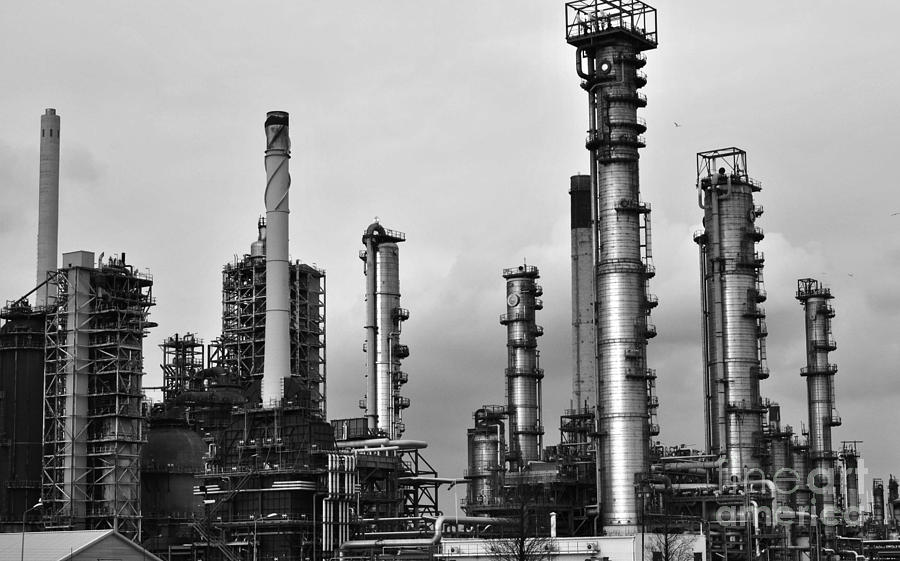
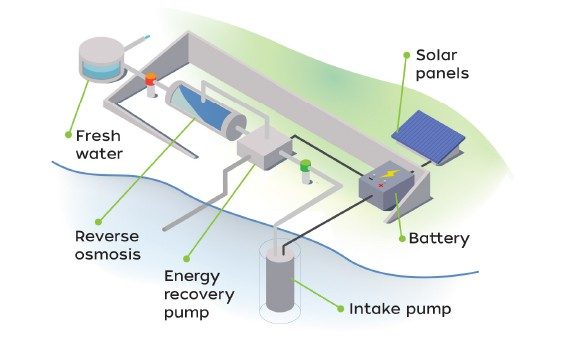

```{r setup, include=FALSE}
knitr::opts_chunk$set(echo = FALSE)
```

# The Netherlands and Marshall Islands - Two Countries Facing Rising Sea Levels


Over the past decades, the Netherlands has been praised as being the leaders of water management and flood prevention. The government has invested billions of euros into the management of waterways, the construction of dams, and into research aiming to push the boundaries of current water technology. These extensive efforts are not in order to prove themselves in the face of a competitive international environment, but rather out of necessity to protect the nation from the urgent threats that climate change poses. With more than 26% of the Netherlands being located under sea level and half of the land being flood-prone (Wernick, 2017), the Netherlands has a long history attempting to control the flow of water into the country. However, nature cannot be controlled, with the devestating floods of 1953 being a painful reminder of this. The disaster occured when a combination of high tides and powerful winds broke sea dykes in the South of the country, killing 1,836 (DutchNews, 2018 . Overtime, new technology was made with the approach of working with natural processes rather than attempting to stop them. This approach has proven to be successful, and the Netherlands now boasts a flood prevention system “to the point that the chance of failure in any given year is one in 10,000” (Wernick, 2017).

8,000 miles from the Netherlands lies Marshall Islands, a low lying island in the continent of Oceania, who's government has recently declared a national emergency over climate change (Green, 2019). A rise in sea levels, along with more extreme weather patterns, has left the future of the country uncertain, with experts predicting the country to be uninhabitable by 2050 (Greshko, 2018). Floods are increasingly more common and severe, which contribute to serious water shortage due to sea water infiltrating fresh water supplies. Droughts are also on the rise, negatively affecting the production of food supplies such as breadfruit, bananas, and taro. Dr. Hilda Heine, president of Marshall islands, blames the "failure of the international community to adequatley respond to the global climate crisis of its own making." These human-caused threats to the existence of this island, are a violation to the rights of the youth of the Marshall island to a climate safe future. 


The Netherlands and Marshall Islands are two of the most flood-prone countries in the world, and climate change is threatening them both. However, the Netherlands is a developed country, and has the resources - economically and technologically - to protect its nation from the most severe problems. Marshall Islands on the other hand, are suffering from climate challenges that they currently do not have the capacity to deal with. 

The aim of this blog is to demonstrate how the ‘fair reciprocity’ principle can be applied to climate justice and why developing nations should share the burden developing nations carry as a consequence of climate change. The Netherlands and Marshall Islands will be used here as a case study to support my argument. 

## What is 'Fair Reciprocity'?


Fair Reciprocity is a fairness principle that asserts "that each generation, as a matter of fairness, should manage the burdens associated with past industrialisation even if the benefits they inherited were created unintentionally, received involuntarily
and operated as necessary conditions of later generations coming into
existence." (Page, 2008)

However, Page points out that the understanding of reciprocity here is different from its conventional understanding in the sense that rather than reciprocating directly to the party who has sacrificed something for our benefit, we "provide benefits to certain third parties when the original benefactors are beyond our reach." (Page, 2008). In climate change situations, where it is often difficult to pinpoint responsibility on a single party, this principle takes on an approach that is concerned with how a country’s wealth arose, and is focused on the effects of climate change rather than the causes. This principle holds the developing countries - the beneficiaries of industrialization - responsible for sharing the burden with developing countries - who are facing the greatest burden of climate change as a consequence of industrialization, and have not benefited from it in the same way.

Therefore, the Netherlands, who has - intentionally or not - benefited from industrialization, should share the climate burden of Marshall Islands, because green house gasses emitted as a consequence of this industrialization has contributed to the environmental disasters which Marshall Islands and developing nations are disproportionately impacted by. The economic benefits of this industrialization is largely the reason why the Netherlands has the resources to protect itself from the serious threats of climate change - through expensive and technologically advanced methods.

## Temperature and Precipitation Trends

Before I can explain my argument in more depth, I would like to demonstrate - rather than simply assume - that climate change is effecting these countries. 

Using data from NOAA, I created temperature trends and precipitation trends and did statistical analysis of the data to research wether climate change was actually happening. For the Netherlands, we have climate data between 1901-2019 from the climate station De Bilt, Utrecht. I chose this particular location because it is where the Royal Netherlands Metereological Institute (KNMI) is located, and often referred to the "Weather Capital" of the Netherlands (KMNI, 2019). Therefore, the Dutch weather forecast and average climate for the nation mostly comes from this particular station.

For the Marshall Islands the only available data runs between 1945-2019. Additionally, the data has been collected from different climate stations in the nation, as there is no ongoing record from one station Therefore, small differences in the data can be accounted for, as different climate stations can be impacted by external factors effecting data, even within such a small country. 

My hypothesis states that, for both countries, there has been a significant change in temperature and precipitation over the last century. I used statistical analysis to calculate the significance of the data. If the data shows to be statistically significant, I rejected my null hypothesis, and I concluded that there has been climate change within that specific data set.

### Temperature Trends

For the temperature trends, I used the hottest and the coldest month as a base to test my hypothesis. For both countries, January is generally the coldest month and August is generally the warmest month.


```{r,results='hide'}
#read.csv("/home/CAMPUS/pmba2017/Pauline_DeBilt_Data.csv")
climate_data<-(read.csv("/home/CAMPUS/pmba2017/Pauline_DeBilt_Data.csv"))
```

```{r, results='hide'}
str(climate_data)

```

```{r}
strDates <- as.character(climate_data$DATE)
climate_data$NewDate <- as.Date(strDates, "%Y-%m-%d")
```

```{r, results='hide'}

read.csv("/home/CAMPUS/pmba2017/Climate_Change_Narratives/student_folders/Bekkers/1966721.csv")
climate_data2<-(read.csv("/home/CAMPUS/pmba2017/Climate_Change_Narratives/student_folders/Bekkers/1966721.csv"))
```

```{r, results='hide'}
str(climate_data2)
strDates2 <- as.character(climate_data2$DATE)
climate_data2$NewDate <- as.Date(strDates2, "%Y-%m-%d")
```

```{r, results='hide'}
lm(TMAX~NewDate, data=climate_data2)
```

```{r}
climate_data2$Month = format(as.Date(climate_data2$NewDate), format = "%m")
climate_data2$Year = format(climate_data2$NewDate, format="%Y")
```

```{r, results='hide'}
lm(TMAX~NewDate, data=climate_data)
```


```{r, results='hide'}
climate_data$Month = format(as.Date(climate_data$NewDate), format = "%m")
```

```{r, results='hide'}
climate_data$Year = format(climate_data$NewDate, format="%Y")
```


```{r, results='hide'}
MonthlyTMAXMean = aggregate(TMAX ~ Month + Year, climate_data, mean)
str(MonthlyTMAXMean)
MonthlyTMAXMean$Year=as.numeric(MonthlyTMAXMean$Year)
MonthlyTMINMean<-aggregate(TMIN ~ Month + Year, climate_data, mean)
YearMin<-(MonthlyTMINMean$Year)
MonthlyTMINMean$Year=as.numeric(MonthlyTMINMean$Year)
MonthlyTMINMean<-aggregate(TMIN ~ Month + Year, climate_data, mean)
YearMin<-(MonthlyTMINMean$Year)
MonthlyTMINMean$Year=as.numeric(MonthlyTMINMean$Year)
MonthlyPRCPMean = aggregate( PRCP~ Month + Year, climate_data, sum)
str(MonthlyPRCPMean)
MonthlyPRCPMean$Year=as.numeric(MonthlyPRCPMean$Year)
climate_data2$Month = format(as.Date(climate_data2$NewDate), format = "%m")
climate_data2$Year = format(climate_data2$NewDate, format="%Y")
MonthlyTMAXMean2 = aggregate(TMAX ~ Month + Year, climate_data2, mean)
str(MonthlyTMAXMean2)
MonthlyTMAXMean2$Year=as.numeric(MonthlyTMAXMean2$Year)
MonthlyTMINMean2<-aggregate(TMIN ~ Month + Year, climate_data2, mean)
YearMin2<-(MonthlyTMINMean2$Year)
MonthlyTMINMean2$Year=as.numeric(MonthlyTMINMean2$Year)
MonthlyPRCPMean2 = aggregate( PRCP~ Month + Year, climate_data2, sum)
str(MonthlyPRCPMean2)
MonthlyPRCPMean2$Year=as.numeric(MonthlyPRCPMean2$Year)


```


```{r}
par(mfrow=c(2,2), cex.main=0.65, cex.lab=0.65, cex.axis=0.5)
plot(TMAX~Year,data=MonthlyTMAXMean[MonthlyTMAXMean$Month=="01",],
     ty="l", xlim=c(1910,2020), main="Maximum Temperatures in January in the Netherlands", xlab="Year", ylab="Maximum Temperatures (°)", col="grey")
bestfitJan<-lm(TMAX~Year,data=MonthlyTMAXMean[MonthlyTMAXMean$Month=="01",])
abline(bestfitJan, col="red")

plot(TMAX~Year,data=MonthlyTMAXMean2[MonthlyTMAXMean2$Month=="01",],
     ty="l", xlim=c(1945,2020), main="Maximum Temperatures in January in the Marshall Islands", xlab="Year", ylab="Maximum Temperatures (°)", col="grey")
bestfitJan2<-lm(TMAX~Year,data=MonthlyTMAXMean2[MonthlyTMAXMean2$Month=="01",])
abline(bestfitJan2, col="red")
plot(TMIN~Year,data=MonthlyTMINMean[MonthlyTMINMean$Month=="01",],
     ty="l", xlim=c(1910,2020), main="Minimum Temperatures in January in the Netherlands", xlab="Year", ylab= "Minimum Temperatures (°)", col="grey")
BestfitminJan<-lm(TMIN~Year,data=MonthlyTMINMean[MonthlyTMINMean$Month=="01",])
abline(BestfitminJan, col="blue")
plot(TMIN~Year,data=MonthlyTMINMean2[MonthlyTMINMean2$Month=="01",],
     ty="l", xlim=c(1945,2020), main="Minimum Temperatures in January in Marshall Islands", xlab="Year", ylab= "Minimum Temperatures (°)", col="grey")
BestfitminJan2<-lm(TMIN~Year,data=MonthlyTMINMean2[MonthlyTMINMean2$Month=="01",])
abline(BestfitminJan2, col="blue")


```


Plots showing the Maximum and Minimum temperatures in January the Netherlands (1901-2019) and Marshall Islands (1945-2019).


We can see an overall significant upwards trend in the temperatures in January of both countries. The minimum temperature in January in the Marshall Islands is the only data type that does not show a significant trend.  


```{r}
par(mfrow=c(2,2), cex.main=0.65, cex.lab=0.65, cex.axis=0.5)
plot(TMAX~Year,data=MonthlyTMAXMean[MonthlyTMAXMean$Month=="08",],
     ty="l", xlim=c(1910,2020), main="Maximum Temperatures in August in the Netherlands", xlab="Year", ylab="Maximum Temperatures (°)", col="grey")
BestfitmaxAug<-lm(TMAX~Year,data=MonthlyTMAXMean[MonthlyTMAXMean$Month=="08",])
abline(BestfitmaxAug, col="red")

plot(TMIN~Year,data=MonthlyTMINMean[MonthlyTMINMean$Month=="08",],
     ty="l", xlim=c(1910,2020), main="Minimum Temperatures in August in the Netherlands", xlab="Year", ylab="Minimum Temperatures (°)", col="grey")
BestfitminAug<-lm(TMIN~Year,data=MonthlyTMINMean[MonthlyTMINMean$Month=="08",],)
abline(BestfitminAug, col="blue")

plot(TMAX~Year,data=MonthlyTMAXMean2[MonthlyTMAXMean2$Month=="08",],
     ty="l", xlim=c(1940,2020), main="Maximum Temperatures in August in Marshall Islands", xlab="Year", ylab="Maximum Temperatures (°)", col="grey")
BestfitmaxAug2<-lm(TMAX~Year,data=MonthlyTMAXMean2[MonthlyTMAXMean2$Month=="08",])
abline(BestfitmaxAug2, col="red")
plot(TMIN~Year,data=MonthlyTMINMean2[MonthlyTMINMean2$Month=="08",],
     ty="l", xlim=c(1940,2020), main="Minimum Temperatures in August in Marshall Islands", xlab="Year", ylab="Minimum Temperatures (°)", col="grey")
BestfitminAug2<-lm(TMIN~Year,data=MonthlyTMINMean2[MonthlyTMINMean2$Month=="08",],)

abline(BestfitminAug2, col="blue")

```

Plots showing the Maximum and Minimum temperatures in August the Netherlands (1901-2019) and Marshall Islands (1945-2019).


Also in August, we can see an overall upwards trend in temperatures, with - once again - the minimum temperature in Marshall Islands being the only insignificant p-value.

Whilst the changes in temperature per year seem like very small values, over a century this can make a huge difference, and even several degrees of change can cause serious damage to ecosystems. 


### Precipitation Trends
For Precipitation Trends, I used the wettest and driest months in the year to test for any significant changes in total rainfall in the two islands. For the Netherlands, generally the wettest month is November and the driest is may, and for Marshall Islands the wettest month is October and the driest is February.

```{r out.height="50%"}
par(mfrow=c(2,2), cex.main=0.65, cex.lab=0.65, cex.axis=0.5)
plot(PRCP~Year,data=MonthlyPRCPMean[MonthlyPRCPMean$Month=="11",],
     ty="l", xlim=c(1910,2020), main="Precipitation in November in the Netherlands", xlab="Year", ylab="Precipitation (mm)", col="grey")
BestfitPRCPdec<-lm(PRCP~Year,data=MonthlyPRCPMean[MonthlyPRCPMean$Month=="11",])
abline(BestfitPRCPdec, col="blue")
plot(PRCP~Year,data=MonthlyPRCPMean[MonthlyPRCPMean$Month=="05",],
     ty="l", xlim=c(1910,2020), main="Precipitation in May in the Netherlands", xlab="Year", ylab="Precipitation (mm)", col="grey")
BestfitPRCPmay<-lm(PRCP~Year,data=MonthlyPRCPMean[MonthlyPRCPMean$Month=="05",])
abline(BestfitPRCPmay, col="blue")
plot(PRCP~Year,data=MonthlyPRCPMean2[MonthlyPRCPMean2$Month=="10",],
     ty="l", xlim=c(1945,2020), main="Precipitation in October in Marshall Islands", xlab="Year", ylab="Precipitation (mm)", col="grey")
BestfitPRCPoct<-lm(PRCP~Year,data=MonthlyPRCPMean2[MonthlyPRCPMean2$Month=="10",])
abline(BestfitPRCPoct, col="blue")
plot(PRCP~Year,data=MonthlyPRCPMean2[MonthlyPRCPMean2$Month=="02",],
     ty="l", xlim=c(1945,2020), main="Precipitation in February in Marshall Islands", xlab="Year", ylab="Precipitation (mm)", col="grey")
BestfitPRCPfeb<-lm(PRCP~Year,data=MonthlyPRCPMean2[MonthlyPRCPMean2$Month=="02",])
abline(BestfitPRCPfeb, col="blue")

```


Plots showing precipitation in the driest and wettest months in the Netherlands and Marshall Islands.


Only the precipitation trends for Marshall Islands seem significant for both the wettest and the driest month, suggesting that there is an overall increase of precipitation in this country. The Netherlands, however, shows no significant trend. 

For both the countries, the precipitation is very variable per year, and the plots shows years where there has been little to no precipitation (the larger dips in the plots) and where there has been a lot more precipitation than usual (the larger peaks in the plots). This aligns with the recent events portrayed on the media, as both countries have been experiencing both droughts periods and flood periods.

### Summary of Weather Trends

As we can see from the trend graphics and the statistical analysis, there are several significant changes going on in the climate of both these countries. However, these changes are not the exact same for each country. Although climate change is a global phenomena, different locations are impacted in different ways and to different extents. For example, simply because the Netherlands does not show a significant increase in precipitation, the data shows the climate change is impacting the nation in another way - an increase in overall temperatures.

So why is this information important for my argument on why the Netherlands should share the burdens that Marshall Islands is carrying as a consequence of climate change? Well, what this shows is that the environmental challenges that these countries are dealing with are not entirely seperate, and are - to some extent - a consequence of climate change. 
 


And whilst it is very difficult to measure to what extent this climate change is anthropogenic - caused by human activity - there is plenty of research that support the idea that greenhouse gasses released by these activies are changing the climate in unpresidented ways. As Jeffery Bennett simply puts it in his book 'A Global Warming Primer', there are three simple facts to support the idea that climate change can be human caused:

  "1. Fact: Carbon dioxide is a greenhouse gas, by which we mean a gas that traps heat and makes a planet warmer than it would be otherwise.
  
  2. Fact: Human activity, especially the use of fossil fuel — by which we mean coal, oil, and gas, all of which release carbon dioxide when burned — is adding significantly more of this heat-trapping gas to Earth’s atmosphere.
  
  3. Inevitable Conclusion: We should expect the rising carbon dioxide concentration to warm our planet, with the warming becoming more severe as we add more carbon dioxide." (Bennett, 2016)

## The Netherlands - Beneficiary of Past Greenhouse Emissions

So how can the 'Fair Reciprocity Principle' apply directly to the situation of the Netherlands and Marshall Islands? It is important to note here that I'm not placing entire blame or responsibility for the situation in Marshall Islands on the Netherlands - nor am I saying that the developed countries intentionally caused climate change or were always aware of the possible impacts of their activities on global warming. Rather, I am aknowledging that the Netherlands, as with most developed countries, have benefited from the same industrialization which has contributed to the climate crisis in Marshall Islands and other developing nations.

1) The Netherlands has benifited greatly from industrialization, particularly in the energy and agriculture sectors:

Energy Sector: In the past, the sale of natural gas was a significant part of the nations economy, until the last few years, when it was discovered that the extraction of natural gas lead to earthquakes. The petrochemical industry also contributes significantly to the Dutch economy, with the Netherlands hosting major operations of 19 of the 25 top chemical companies in the world in 8 major Chemical-Industrial clusters (Invest in Holland, 2019). The industry sector in the Netherlands accounts for 17.9% of the country's total GDP (Index mundi, 2017).

Agriculture sector: The Netherlands is the second largest exporter of agriculture-products, after the USA. The agriculture sector accounts for 10% of the nations economy and employment (Government of the Netherlands,2019), and this percentage was far higher in the past, before most stringent environmental regulations were implemented.

These sectors have contributed significantly to the economy of the Netherlands, supplying the nation with the necessary financial resources to develop technology that protects it from major environmental threats - including those related to climate change - like the flood prevention system it now boast.





2) Whilst the Netherlands is taking action to reduce its GHG emissions, the industries it has benefited from have emitted, and continue to emit, significant levels of GHG, and therefore they have contributed to anthropogenic climate change. 

For the energy sector, natural gas and petroleum are both fossil fuels that release high levels of GHG gases. Whilst natural gas is considered the 'cleanest' fossil fuel, as it releases less GHG than petroleum and coal, it still accounts for a substantial portion of anthropogenic carbon emissions. In 2004, worldwide, natural gas produced about 5.3 billion tons of CO2, while coal produced 10.6 billion and and oil produced 10.2 billion tons (Bernstein, Pachauri, Reisinger, 2007). The industrial processes that both these fossil fuels go through, including extraction, refining, transportation etc. are carbon intensive. The energy sector accounted for 84.42% of the total GHG emissions in the Netherlands in 2012 (UNCCS, 2012).

The Dutch agricultrual industry "is characterized by relatively intensive land use," and especially indirect energy use such as the "production of inputs and storage, processing and transport of outputs" (Jules, 2014) are major sources of GHG emissions in the nation. The agriculture sector accounted for 8.30% of the total GHG emissions in the Netherlands in 2012 (UNCCS, 2012).

3) The Marshall Islands has not benefited from industrialization in the same way the Netherlands has, and this is partly the reason it is still a developing nation. As a developing country, it does not have the resources to deal with the climate threats that the nation is facing as a consequence of climate change. These consequences, as mentioned before, include flooding, droughts, and water shortage that could make the country inhabitable by 2050. Therefore, since the Netherlands has benefited from the industries that have contributed to anthropogenic climate change, according to the fair reciprocity principle, the Netherlands should share the burden of climate change with the Marshall Islands.


## How can the Netherlands share the burden of the Marshall Islands?
 
The main reason the Netherlands could, and should, be an important player in helping the Marshall Islands fight the current climate crisis it is facing, is because it is the global leader in water management. The majority of the environmental issues the Marshall Islands is facing are related to flooding and fresh water scarcity, and the Netherlands can use the technology the country has developed to help the Marshall Islands. Here are some ways in which the Netherlands can help:

1) Financially: The Netherlands has a GDP per capita of $52,368, which is 4.57 times the global average. The Marshall Islands, on the other hand, has a GDP per capita of 3,925, which is only 0.342 times the global average (IMF, 2019). The Netherlands can provide financial support for the Marshall Islands, in order that they can afford expensive water management technologies.

2) Offer water management technologies: The Netherlands, as a developed country, has had the privilege of researching and developing innovative technology for water management. A lot of this technology can be used to help mitigate the threats the Marshall Islands is currently facing. Two examples of how the Netherlands currently assisting Small Island Developing States (SIDS):
Blue Innovation Institute for SIDS - A global think tank which the Dutch government is in partnership with that promotes "coastal climate resilience through natural capital, coral restoration and marine protected areas" (UN, 2018) in small islands. The Marshall Islands is currently not involved in this program. 




From water scarcity to abundance on SIDS using solar desalination - Lead by Elemental Water Makers, a Dutch company that has developed technology for sustainable water desalination, this partnership aims to provide clean drinking water from sea water for countries who are suffering from water scarcity. Whilst the process of water desalination usually releases high levels of GHG, this technology uses solar energy and is therefore far more sustainable. The partnership description outlines a successful example of the program on the island of Great Camanoe, where "the solution generates 12500 liters of clean water from seawater per day, using only the power from the sun. It has survived the impact of the hurricane of Irma in 2017 and has produced over 10 million liters from the sea and sun" (UN, 2018)

Ofcourse, seeing as the Marshall Island's climate crisis is so severe, technology would have to focus on the most immediate threats first - protecting it from rising sea levels and reducing water scarcity. The technology needs to implemented fast and be extremely efficient for them to be successful in helping the Marshall Islands. Additionally, the Marshall Islands' unique typography would require these technologies to be specially tailored to the country, which requires additional research and finance.

3) Education - The Netherlands offers some of the top universities for water management and environmental research including Wageningen University and Research Centre and TU Delft. As a longer term solution, the Netherlands could provide subsidies and financial aid for students from the Marshall Islands to enroll in water management and climate studies, so that they can become leaders for water management and climate change solutions in the Marshall Islands.

## Conclusion

Even as the climate issues developing nations are facing are growing increasingly more urgent, the international community - particularly developed countries - are taking little to no action to help. Developed countries, including the Netherlands, are failing to meet targets of green house gas reductions, contributing to rising sea levels and temperature increases, among many other consequences. Developing countries, especially low lying island nations, are the ones carrying the greatest burden of this failure. Now more than ever collaboration within the international community is necessary, and those who have the resources and who have benefited from harmful industrialization in the past need to take on responsibility to help developing countries in crisis. Instead of speaking of direct blame, which is nearly impossible to pinpoint in climate issues, the principle fair recoprocity encourages developed countries to recognize where their wealth came from, and to reciprocate in ways that can support developing countries. We need a more moral and ethical approach within our climate justice framework, and therefore fairness principles should be a central topic of discussion within future climate debates.

## Literature Cited

Agriculture and Horticulture. 2019. Government of the Netherlands. https://www.government.nl/topics/agriculture/agriculture-and-horticulture

Bernstein L, Pachauri R, Reisinger A. 2007. Climate Change 2007 Synthesis Report. 1st ed. Intergovernmental Panel on Climate Change.

Blue Innovation Institute for SIDS. 2018. United Nations. https://oceanconference.un.org/commitments/?id=18301

Bennett J. 2016. A global warming primer. 1st ed. Big Kid science.

Chemical Leaders Choose Holland. 2019. Invest In Holland. https://investinholland.com/industries/chemicals/

From water scarcity to abundance on SIDS using solar desalination. 2018. United Nations. https://sustainabledevelopment.un.org/partnership/?p=26431

Green M. 2019. Marshall Islands declares national climate crisis. TheHill. https://thehill.com/policy/energy-environment/465422-marshall-islands-declares-national-climate-crisis

Greshko M. 2018. Within Decades, Floods May Render Many Islands Uninhabitable. https://www.nationalgeographic.com/news/2018/04/marshall-islands-climate-change-floods-waves-environment-science-spd/

KNMI - Weer - Waarnemingen. 2019. Knmi.nl. https://www.knmi.nl/nederland-nu/weer/waarnemingen

Page E. 2008. Distributing the burdens of climate change. Environmental Politics 17:556-575. 

Netherlands GDP - composition by sector. 2019. index mundi. https://www.indexmundi.com/netherlands/gdp_composition_by_sector.html

Report for Selected Countries and Subjects. 2019. International Monetary Fund. 

Summary of GHG Emissions for the Netherlands. 2012. United Nations Climate Change Secretariat. https://unfccc.int/files/ghg_emissions_data/application/pdf/nld_ghg_profile.pdf

The Netherlands remembers the devastating floods of 1953. 2018. DutchNews.nl. https://www.dutchnews.nl/news/2018/02/the-netherlands-remembers-the-devastating-floods-of-1953/

Wernick A. 2017. The Netherlands, always vulnerable to floods, has a new approach to water management. Public Radio International.  https://www.pri.org/stories/2017-07-16/netherlands-always-vulnerable-floods-has-new-approach-water-management

