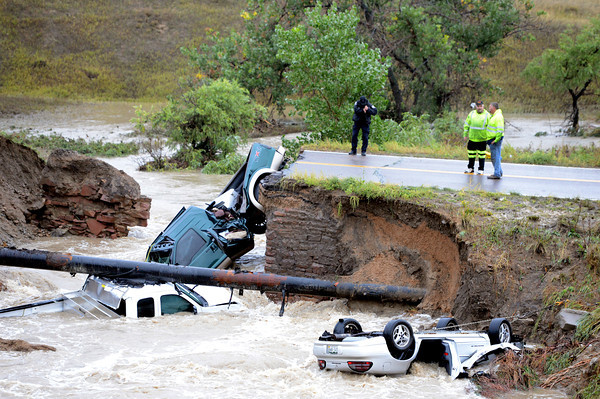

```{r setup, include=FALSE}
knitr::opts_chunk$set(echo = TRUE)
```

```{r read NWT and NOAA data, include=FALSE}
library(readr)
C1_daily_precip <- read_csv("~/Climate_Change_Narratives/student_folders/Lai/C1_daily_precip.csv")
C1_daily_temp <- read_csv("~/Climate_Change_Narratives/student_folders/Lai/C1_daily_temp.csv")
D1_daily_temp <- read_csv("~/Climate_Change_Narratives/student_folders/Lai/D1_daily_temp.csv")
D1_daily_precip <- read_csv("~/Climate_Change_Narratives/student_folders/Lai/D1_daily_precip.csv")
Saddle_daily_temp <- read_csv("~/Climate_Change_Narratives/student_folders/Lai/Saddle_daily_temp.csv")
Saddle_daily_precip <- read_csv("~/Climate_Change_Narratives/student_folders/Lai/Saddle_daily_precip.csv")
NOAA <- read_csv("~/Climate_Change_Narratives/student_folders/Lai/NOAA_boulder_area_temp_precip.csv")
```

```{r my attempt at changing dates, include=FALSE}
strDates <-as.character(NOAA$DATE)
CYear1 <-as.Date(strDates[1:60719], "%m/%d/%Y") #1/1/1900 onward
CYear2 = as.Date(strDates[60720:62190], "%Y-%m-%d") #1893-10-01 to 1899-12-31
CYear3 = c(CYear1, CYear2) 
CYear3[sample(1:62190, 10)] #sample 10 dates to see if they're all the same format: YYYY-MM-DD
NOAA$NewDate <- CYear3
```

```{r separating NOAA data into three separate data frames for each of the 3 stations, include=FALSE}
Boulder <- NOAA[ which(NOAA$STATION=='USC00050848'),]
Boulder_14_W <- NOAA[ which(NOAA$STATION=='USW00094075'),]
Coal_Creek_Canyon <- NOAA[ which(NOAA$STATION=='USC00051681'),]
```
###Were the 2013 Boulder Floods Exacerbated by Climate Change-Induced Increased Precipitation?
  
  
 
  
  
For decades, climate scientists have warned the public of the effects of historic and present anthropogenic greenhouse gas emissions on global climate patterns. Yet the scientific community continues to struggle to pinpoint with statistical certainty how climate change leads to an increase in regional natural disasters. Along with the politicized nature of climate science in America, the media in the United States has been quick to conflate or dismiss potential relationships between short-term weather-induced natural disasters with long-term global climatic patterns. The devastating September 2013 rainstorm and floods in Colorado became a prime example of such premature conclusions. 
  
In one week in the middle of September 2013, news of heavy rain and flooding along the Front Range Corridor of Colorado dominated national headlines. The rainstorm hit the Rocky Mountain foothills of Boulder County particularly hard: in one week the area received one of the largest continuous volume of precipitation since meteorological records began. From the 9th to the 16th of September, Boulder received 17.15 inches of rain, accounting for 86% of the rain that would normally be distrubted over a year. (Brennan and Aguilar 2013; CCC 2013). Three days after the deluge began, the county received over 10 inches in just one day, the highest in recorded history (Brennan and Aguilar 2013; CCC 2013). Ensuing floods killed 4 people in the county, injured dozens and caused the evacuation of nearly 2,000 residents by road and helicopter (Brennan and Aguilar 2013). Overflowing waters in the region's waterways destroyed 345 homes and damaged 557 homes, and caused over a billion dollars in property and economic damage (Brennan and Aguilar 2013; Figures 1 & 2). In the aftermath, FEMA declared the entire county a disaster zone, and public and private reconstruction efforts around the county continued for years.
  
  
 
  
  
A year after the floods, local newspaper Daily Camera declared “2013’s flood-triggering rains not caused by climate change” (Brennan 2014). This bold claim was based on a local study modeling the probability of increased precipitation in Northeast Colorado as a result of anthropogenic-induced warming (Hoerling et al. 2014). The study developed a model to predict the likelihood of five-day flood event in the month of September. The authors fail to mention how their model can account for the change in flood probability throughout the whole year or other months of the year. The study also focuses on two thirty-year periods, the years 1871-1900 and 1984-2013, presumably to model before and after worldwide anthropogenic emissions increased exponentially in the 20th century. The authors do not explain why they selected these two thirty-year periods.
  
Because of these issues, other local researchers on the September 2013 Boulder floods have disputed this initial study. In a field known as attribution science, climatologists and meteorologists attempt to pinpoint direct causal relationships between global and regional climate change with the probability of specific extreme weather events like the Boulder floods. What attribution science researchers focused on was the fact that much of the humid air causing the floods came from two concurrent hurricanes on Mexico's east and west coasts. In mid-September 2013, sea surface temperature around Mexico were the highest globally and likely exacerbated by anthropogenic climate change, fueling huge amounts of evaporation and condensation (Trenberth *et al.* 2015). This caused Hurricane Manuel on the Pacific and Hurricane Ingrid on the Gulf of Mexico to kill hundreds along the two Mexican coasts. Fast-moving humid air from the two hurricanes then moved north and clashed with a dry cold front above Colorado, creating the conditions for what the *Daily Camera* called a "1000-year rain and 100-year flood" (Brennan and Aguilar 2013; Brennan 2014). One later study concluded anthropogenic-induced sea surface warming had increased the historic rainfall up to 30% in 2013 when compared to regional climate models with anthropogenic variables removed (Pall *et al.* 2017; Brennan 2017). As seen in the 2013 Boulder floods, the attribution of climate change to any single extreme weather event continues to incite immense scientific discussion.
  
  
####What are the aims and objectives of this study?
  
  
Using the 2013 Boulder floods as a case study, I wanted to test whether larger regional climate change in Colorado and climate change around the world could be measured by short-term conditions like daily temperatures and precipitation in the Boulder area. Because daily precipitation is highly variable, I use the daily summaries to create monthly averages for September instead. I hypothesized the six climate stations increase in daily max temperatures over time, and increase in monthly average precipitation over time. To test the plausibility of this alternative hypothesis, I test whether the null hypothesis (that daily max temperature and/or precipitation will not increase) can be rejected. 
  
  
###Methodology change to something more engaging?

For this study, I chose six sites based on their location within the Boulder Creek watershed (Table 1; Figure 3; "Boulder Area" 2013; USGS [date unknown]). I reviewed daily max temperature and precipitation summaries from three climate stations obtained from the National Oceanic and Atmospheric Administration's online database of daily summaries from the Global Historical Climate Network (NOAA GHCN). I also reviewed three climate stations from the site of the Niwot Ridge Long Term Ecological Research program (NWT LTER) close to the headwaters of the Boulder Creek watershed (Table 1, Figures 3 and 4).
  
  
_**Table 1:** Climate stations analyzed for daily maximum temperatures and daily precipitation_

Climate Station | Altitude (m) | Agency/Program
--------------- | ------------ | ---------------
1. [D-1](http://niwot.colorado.edu/data/climate/d1-meteorological-data)                | 3739 | NWT LTER
2. [Saddle](http://niwot.colorado.edu/data/climate/saddle-meteorological-data)         | 3528 | NWT LTER
3. [C-1](http://niwot.colorado.edu/data/climate/c1-meteorological-data)                | 3022 | NWT LTER
4. [USW00094075 - Boulder 14 W](https://www.ncdc.noaa.gov/cdo-web/datasets/GHCND/stations/GHCND:USW00094075/detail) | 2996 | NOAA GHCN
5. [USC00051681 - Coal Creek Canyon](https://www.ncdc.noaa.gov/cdo-web/datasets/GHCND/stations/GHCND:USC00051681/detail) | 2728 | NOAA GHCN
6. [USC00050848 - Boulder](https://www.ncdc.noaa.gov/cdo-web/datasets/GHCND/stations/GHCND:USC00050848/detail) | 1672 | NOAA GHCN
  
  

  
  

  
On the statistical software R, I used a linear regression model for the daily max temperature and precipitation of each site to test whether the historical data has an increase or decrease, how much of the variability in the data can be explained by the model, and whether such results are statistically significant.  
  
  
####Is Daily Max Temperature and Monthly Precipitation Correlated?   
Two of the three NWT stations, Saddle and C-1, and two of the three NOAA climate stations, Boulder 14 W and Boulder, had statistically significant increases in daily maximum temperature over time (Table 2). One station, D-1, had a statistically significant decrease in daily maximum temperature over time. In contrast, daily max temperatures at D-1 Canyon decreased -1.35°C per 100 years (adjusted R^2=0.001, p-value=<0.001).
  
  
_**Table 2:** Linear regression model of daily maximum temperatures_

Climate Station | change in max temperature per 100 years (°C) | Adjusted R-squared | p-value | Statistical significance?
--------------- | ----------- | ------------- | ------------ | ---------------
1. D-1               | -1.35 | 0.001   | <0.001 | yes
2. Saddle            | +4.56 | 0.002    | <0.001 | yes
3. C-1               | +3.37 | 0.004   | < 0.001 | yes
4. Boulder 14 W      | +8.72 | 0.001 | 0.002 | yes
5. Coal Creek Canyon | +1.33 | 0.0001 | 0.124 | no
6. Boulder           | +1.73 | 0.004 | < 0.001 | yes
  
  
Two of the six stations, D-1 and Saddle, had a statistically significant increase in daily precipitation over time (Table 3). One station, C-1, had a statistically significant decrease in precipitation over time. D-1, Boulder 14 W, Coal Creek Canyon, and Boulder, had a non-significant increase over time.
  
  
_**Table 3:** Linear regression model of daily precipitation_
    ####table to-do: need to multiply by 100 to get per 100 yrs! double-check formatting + sigfigs, rough calc
  
Climate Station | precipitation change per 100 years (mm) | Adjusted R-squared | p-value | Statistical significance?
--------------- | ----------- | ------------- | ------------ | ---------------
1. D-1               | +0.07644 | -0.01806 | 0.0164 | no
2. Saddle            | +0.5643 |-0.01317  | 0.476 | no
3. C-1               | -0.07338 |  -0.01433 | 0.758 | no
4. Boulder 14 W      | 1.155 | -0.06123 | 0.719 | no
5. Coal Creek Canyon | +0.3374 | -0.02327 | 0.637 | no
6. Boulder           | +0.2008 | 0.01176 | 0.123 | no
  
  
(i know the sigfigs are wrong in this table, just putting it up so i can fix up on my plane ride)
  
  
Only Saddle shows a statistically significant increase in daily temperature and precipitation over time, thereby rejecting the null hypothesis for that station. D-1 has a statistically significant changes for both as well, but for temperature it is decreasing. I provide the monthly sum precipitation graph I created for Boulder station below (Figure 5), showing the sums of daily precipitation each September from the start of records to the present and the corresponding linear regression model. The height of the 2013 floods is clearly visible as the tallest spike on the right side of Figure 5. I purposely omit the graphs of the other stations to prevent cluttering up the results section.


```{r D1 daily TMAX & PRCP graphs, echo=FALSE}
Boulder$Month = format(as.Date(Boulder$NewDate), format = "%m") 
Boulder$Year = format(Boulder$NewDate, format="%Y")
Boulder_MonthlyPRCPsum = aggregate(PRCP ~ Month + Year, Boulder, sum)
Boulder_MonthlyPRCPsum$YEAR = as.numeric(Boulder_MonthlyPRCPsum$Year)
Boulder_MonthlyPRCPsum$MONTH = as.numeric(Boulder_MonthlyPRCPsum$Month)
##plot
plot(PRCP~YEAR, data=Boulder_MonthlyPRCPsum[Boulder_MonthlyPRCPsum$Month=="09",], xlim=c(1890, 2020), main="Figure 5. September Monthly Precipitation at Boulder Station", xlab = "Date (Year)", ylab = "Sum of September Daily Precipitation (mm)", ty='l', las=1) 
Boulder_PRCP.lm <- lm(PRCP~YEAR, data=Boulder_MonthlyPRCPsum[Boulder_MonthlyPRCPsum$Month=="09",]) 
abline(coef(Boulder_PRCP.lm), col="red")
```
  
  
I found the six stations' varying results intriguing, since I chose all six based on their geographic proximity and location around the Boulder watershed. Rather than the expected consistent trend among all stations, each station's daily temperatures and precipitation seemed to trend in different directions. The adjusted R-squared for all sites' daily temperature and precipitation are below 0.01, meaning even the statistically significant linear models explained less than 1% of the variability in the data. For example, D-1 has a statistically significant linear model for precipitation, but much of the variation in the data appears as "noise" (Figure 6) as reflected in the very low adjusted R-squared value of 0.000262 (Table 3).
  
  
##Discussion
One noteworthy comparison is between the C-1 weather station data from Niwot Ridge LTER and Boulder 14 W data from NOAA and GHCN. As the two stations are within 100 meters of each other (Figure 3), I find it surprising that C-1 has a statistically significant decrease in daily precipitation, yet Boulder 14 W has a close to significant increase (Table 3). Although this study cannot conclude that daily temperature and precipitation are correlated or are increasing in the Boulder Creek watershed, my results highlight how wide variations in local, short-term collection of weather data can obscure larger global trends of warming climate and increased precipitation. Daily weather does not full encapsulate changes in seasons over years and decades. A future study should create monthly and seasonal means to better analyze climatic trends over time.
  
I ran into a couple limitations when creating this study. The time range of available data from GHCN on NOAA's website vary widely. For example, daily summaries from Boulder (USC00050848) began October 1893, whereas daily summaries from Coal Creek Canyon (USC00051681) began July 1984. In the Niwot Ridge LTER data, "various circumstances" required the data compilers to estimate daily summaries for missing values stretching many consecutive days in each station's daily summaries. Researchers should focus on maintaining accurate data to avoid estimating daily summaries. In the future monthly summaries may be more appropriate in looking at seasonal fluctuations of temperature and precipitation over time.
  
create a model of past data w surrounding sites
proxy data (ie tree rings, geomorphology/plain dynamics)
  
Another way of addressing these issues could be modeling predicted future water flow of streams converging downstream into urbanized areas. For example, Yochum and Moore (2013) estimated peak water flow in 15 streams affected by the 2013 Boulder floods instead of focusing on long-term precipitation or air temperature data. Local geographic conditions also greatly affect the likelihood of flooding and should be accounted for. Multiple streams running down the Front Range mountain valleys converge into Boulder Creek, heading east into the city of Boulder and concentrating flooding along areas closest to the waterways. Features of urbanization, such as impervious surfaces, waterway channelling, and damming, will have an impact on which areas will be predisposed to flood events. In addition, variations in how global climate trends affect communities and at the local and regional level should neither be ignored nor dismissed. In Gustafson, Joehl, & Hartman (2018), the International Union for the Conservation of Nature and USAID conducted community workshops in a village in the Lower Mekong Basin to incorporate locals' experiences of expected climate change in the region. They found villagers felt more vulnerable to short-term changes such as unreliable seasonal rainfall and drought affecting their agricultural livelihoods, rather than the researchers' initial focus on long-term, multi-year temperature increase and shifting precipitation. Given our current trajectory for anthropogenic climate change, we must incorporate community voices into attribution science so we can best adapt for increasing "natural" disasters in the future.
  
  
###Attributing Extreme Weather Events in the Future
Looking at daily temperature and precipitation changes in the Boulder Creek watershed limited the scope and applicability of my study. However, by doing so I show how the range of data within a local area can vary considerably, despite close proximity. This narrow focus on daily weather can obscure the larger trends of regional climate over long periods of time. Arguments in the climate debate that rely exclusively on daily weather conditions should be taken with high caution due to its inability to accurately reflect larger trends. At the same time, local accounts of how long-term climate change affect short-term conditions in weather should be taken into account rather than dismissed.
  
The unusual September 2013 rainstorm across Colorado created once-in-a-lifetime floods across the highly populated foothills of Boulder County. Some people may try to claim that such specific extreme events can be explained away with weather variability. However, with global anthropogenic climate change scientists warn such unusual regional events may become increasingly common. Attribution science will continue to play a prominent role in attempting to find relationships between long-term climate change models with short-term extreme weather events. Establishing a relationship between global precipitation patterns and the future likelihood of floods like the one afflicting Colorado in September 2013 will help us predict and prepare for potential future disasters.
  
  
##References
  
2013 Flood maps. [Internet]. c2013. Boulder, CO: City of Boulder, Colorado; [cited 2019 Feb 18]. Available from https://bouldercolorado.gov/flood/flood-maps
  
Brennan C. [Internet]. 2014 Sep 29. Boulder researcher: 2013’s flood-triggering rains not caused by climate change.  Boulder, CO: Daily Camera; [cited 2019 Feb 24]. Available from http://www.dailycamera.com/news/boulder-flood/ci_26626817/boulder-researcher-2013s-flood-triggering-rains-not-caused
  
Brennan C. [Internet]. 2015 Jun 22. Boulder scientist ties severity of Colorado’s 2013 flood to climate change. Boulder, CO: Daily Camera; [cited 2019 Feb 24] Available from http://www.dailycamera.com/news/boulder-flood/ci_28360775/boulder-scientist-ties-severity-colorados-2013-flood-climate
  
Brennan C. [Internet]. 2017 Jul 31. Study promotes link between climate change, intensity of Boulder rains in 2013 flood. Boulder, CO: Daily Camera; [updated 2017 Jul 31; cited 2019 Feb 24]. Available from http://www.dailycamera.com/boulder-county-news/ci_31177629/study-promotes-link-between-climate-change-intensity-boulder
  
Brennan C. and Aguilar J. [Internet]. 2013 Sep 21. Eight days, 1,000-year rain, 100-year flood. Boulder, CO: Daily Camera; [updated 2013 Sep 22; cited 2019 Feb 18]. Available from http://www.dailycamera.com/news/boulder-flood/ci_24148258/boulder-county-colorado-flood-2013-survival-100-rain-100-year-flood
  
[CCC] Colorado Climate Center. [Internet]. 2013. Colorado flood 2013. Fort Collins, CO: Colorado State University; [cited 2019 Feb 18]. Available from http://coflood2013.colostate.edu/index.html
  
Hersher R. [Internet]. 2019 Mar 5. How federal disaster money favors the rich. NPR; [cited 2019 Mar 15]. Available from https://www.npr.org/2019/03/05/688786177/how-federal-disaster-money-favors-the-rich
  
Hoerling M, Wolter K, Perlwitz J, Quan X, Eischeid J, Wang H, Schubert S, Diaz H, Dole R. [Internet]. 2014. Northeast Colorado extreme rains interpreted in a climate change context. Explaining extreme events of 2013 from a climate perspective; B Am Meterol Soc. [cited 2019 Feb 25]; 95(9): S15-S18. 
  
Gustafson S, Cadena AJ, Hartman P. [Internet]. 2018. Adaptation planning in the Lower Mekong Basin: merging scientific data with local perspective to improve community resilience to climate change.  Clim Dev; [cited 2019 Feb 17]; 10(2): 152–166. 
  
Nash LL, & Gleick PH. 1991. Sensitivity of streamflow in the Colorado Basin to climatic changes. J Hydrol [Internet]. [cited 2019 Feb 24]; 125(3): 221–241.
  
[NOAA GCHN] National Oceanic and Atmospheric Administration - Global Historical Climatology Network. [Internet]. [date unknown]. Global Historical Climatology Network (GHCN). USA: NOAA; [updated 2019 Feb 26; cited 2019 Feb 26]. Available from https://www.ncdc.noaa.gov/data-access/land-based-station-data/land-based-datasets/global-historical-climatology-network-ghcn 
  
[NWT LTER] Niwot Ridge Long Term Ecological Research. [Internet]. [date unknown]. Boulder, CO: University of Colorado. [cited 2019 Feb 18]. Available from http://niwot.colorado.edu/
  
Pall P, Patricola CM, Wehner MF, Stone, DA, Paciorek CJ, Collins WD. 2017 Sep. Diagnosing conditional anthropogenic contributions to heavy Colorado rainfall in September 2013. Weather Clim Extr [Internet]. [cited 2019 Feb 25]; 17: 1–6.
  
Trenberth KE, Fasullo JT, Shepherd TG. 2015. Attribution of climate extreme events. Nat Clim Change [Internet]. [cited 2019 Feb 18]; 5(8): 725–730.
  
Watershed. [Internet]. 2013. Boulder, CO: Boulder Area Sustainability Information Network; [updated 2013 Dec 18; cited 2019 Feb 24]. Available from http://bcn.boulder.co.us/basin/watershed/
  
[USGS] US Geological Survey. [Internet]. 2017. USGS water resources links for HUC 10190005 - St. Vrain. US Geological Survey; [updated 2017 Dec 30; cited February 25, 2019]. Available from https://water.usgs.gov/lookup/getwatershed?10190005/www/cgi-bin/lookup/getwatershed
  
Yochum SE and Moore DS. [Internet]. Colorado front range flood of 2013: Peak flow estimates at selected mountain stream locations.  Final technical report 2013 Dec 13. Colorado: USDA NRCS; [cited 2019 Feb 26]. 38 p.