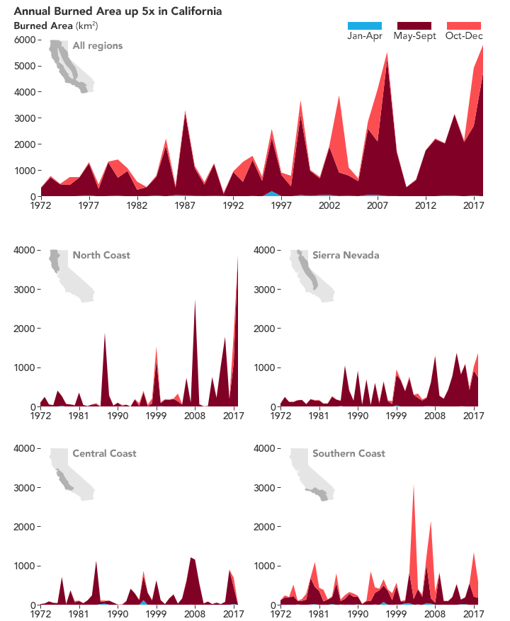

```{r setup, results="hide", include=FALSE}
knitr::opts_chunk$set(echo = TRUE)
library('plyr')
library('rnoaa')

# Climate Data

#file.choose()
read.csv("/home/CAMPUS/kmto2015/Climate_Change_Narratives/student_folders/McWilliams/NOAA Climate Data.csv")
climate_data <- read.csv("/home/CAMPUS/kmto2015/Climate_Change_Narratives/student_folders/McWilliams/NOAA Climate Data.csv")

str(climate_data)
climate_data$TMAX[climate_data$TMAX==-9999] = NA 
climate_data$TMIN[climate_data$TMIN==-9999] = NA

min(climate_data$TMAX, na.rm = T)

# Date Formatting
strDates <-as.character(climate_data$DATE)

climate_data$NewDate <- as.Date(strDates, "%m/%d/%Y")
head(climate_data)

climate_data$Month = format(as.Date(climate_data$NewDate), format = "%m") 
climate_data$Year = format(climate_data$NewDate, format="%Y")

# MINIMUM TEMP ANALYSIS

MonthlyTMINMean = aggregate(TMIN ~ Month + Year, climate_data, mean)
MonthlyTMINMean$YEAR = as.numeric(MonthlyTMINMean$Year)
MonthlyTMINMean$MONTH = as.numeric(MonthlyTMINMean$Month)

str(MonthlyTMINMean)
plot(MonthlyTMINMean$TMIN, ty='l')

```

# Intro

Introduction
        Wildfires are important for the diversity and resiliency of California's ecosystems (Von Schaumburg, 2014). However, in recent decades, California has seen fires of unprecedented severity and frequency, garnering national attention (Abatzoglou and Williams, 2016). Between 1972 and 2018, the annual burned land-area in California increased by a magnitude of five times (Williams et al., 2019). The worst 10 wildfires in the State's history have occurred since 1991 (Serna et al., 2019). The costs of fighting these fires, in addition to the property damage and health effects caused by fires, is becoming increasingly difficult to cover (Delfino et al., 2009). California's climate, vegetation, and urban landscapes are highly diverse, meaning that the influences on fire activity are complex and vary spatially (LaDochy et al., 2007).This makes mitigation and anticipation more challenging. Jin et al. argue that a more in-depth understanding of how meteorology and fire is needed to improve predictions of how fire will change in the future and to anticipate management needs (Jin et al. 2014). 
California’s worst fires occur in the Fall in coastal shrublands, when strong winds from offshore sweep downhill from a high-pressure area [Figures 1 & 2] (Jin et al., 2014). The Southern region is a microcosm for this effect with the San Antonio coastal range situated between the continental interior high desert of Southern Utah and the valley of San Bernardino County. These “downslope” winds are termed Santa Ana winds (Serna et al., 2019). 
        This paper seeks to explore how large-scale anthropogenic impacts on the climate may influence fire events in Southern California, by analyzing temperature and precipitation data. “A thorough and nuanced understanding of how, when, and where anthropogenic climate change has or has not affected wildfire in California over the past several decades is critical to guide sustainable societal decisions ranging from where to develop housing to how limited resources can be optimized for landscape management” (Jin et al., 2014).
        


## Heat, Dought, Wildfires: How does this domino-effect work?

Climate has a significant effect on California’s seasonal wildfires. During the summer, when fires are most frequent in California, large burns result from the cumulative effects of a dry atmosphere and lack of rain (Jin et al., 2014, Westerling, 2011, Williams et al., 2019). It is a generally accepted theory that increasingly hotter and drier autumns are contributing to worse wildfire seasons. 
Though most research looks to forested regions that have plenty of vegetative mass to burn, a recent study by Jin et al. found that dry conditions also influence summer wildfires in non-forested regions of California. For example, sage scrub ecosystems in Southern California are dense with vegetation to fuel a fire. (Jin et al., 2014). 
        As previously mentioned, the most devastating fires in Southern California occur in the Fall when Santa Ana winds from the northeast barrel down into the Los Angeles basin [Figure 2]. As the warm air descends, the winds heat up and drive out humidity. The strong, offshore Santa Anas exacerbate the fire risk in dry, pre-rain regions and blow sparks to spread fire (Serna et al., 2019, Jin et al., 2014). 


If this trend is part of a regional climate pattern, what evidence shows that the fires are getting worse, and why are they getting worse? According to a study by Williams et al., warm-season days have warmed by an average of 1.4 °C from 1970 to present. This is part of a larger warming trend over the past century that contributes to a “atmospheric vapor pressure deficit” (Williams et al., 2019). This trend is consistent with the increased carbon emissions caused by humans. 


## Fires in the Anthropocene Era 

Greenhouse gas emissions by humans and subsequent climate changes directly impact fire activity in North America, particularly in the forests of the Sierra Nevada and North Coast (Williams et al., 2019). These long-term trends in climate have great impacts on factors such as location, frequency, extent, and severity of wildfires (Westerling, 2011). Changes in climate are linked with 55% of observed increases in fuel aridity from 1979 to 2015 across western US forests (Abatzoglou and Williams, 2016).
Other compounding factors include the human-facilitated invasion of non-native plant species. A growing expanse of Southern California’s shrublands are being permanently replaced by invasive grasses, which do not have the same fire resistant qualities as native flora (Von Schaumburg 2014, Serna et al., 2019). In addition, State and local fire-fighting strategy tends to prioritize suppression of all fires, despite the fact that most Californian’s have a sophisticated understanding of the ecological benefits of fire, especially those living in fire-prone areas (jin et al., 2014, McCaffery and Olsen, 2012). 
An undergrad thesis by D.M. Von Schaumburg points out that an increase in fire frequency in valleys and foothills parallels population growth and development in Southern California, likely due to the aforementioned factors. My case study seeks to answer the question, what role do trends in temperature and precipitation have in increased wildfires in Southern California?
        
# Obtaining Climate Data on Southern California (Methodology)

## A California Case Study
The City of Claremont is located at the foot of the San Antonio mountains in Southern California. The Meditterranean climate is characterized by mildly cool, rainy winters and hot, dry summers. Autumn brings Santa Ana winds over the San Antonio mountains and across an expanse that includes Claremont. I chose to examine temperature and precipitation data from Claremont as an indicator of temperature for the land area below Baldy. My goal was to see if increasing temperatures in Claremont, due to Santa Ana winds, were correlated with increased fires around the region. I accessed the database on National Oceanic and Atmospheric Administration (NSSL [date unknown]) to collect temperature and precipitation data in Claremont. I chose the month of October because Autumn is the most high-risk time of year for fires after a long deficit of rain during the summer months. 


```{r, echo=FALSE, fig.cap="\\label{fig:figs}Minimum Temperature Average for October 1950-2019"}
plot(TMIN~YEAR, data=MonthlyTMINMean[MonthlyTMINMean$Month=="10",], ty='l', xlim=c(1950, 2020)) 
May.lm <- lm(TMIN~YEAR, data=MonthlyTMINMean[MonthlyTMINMean$Month=="10",]) 
abline(coef(May.lm), col="red")
```


```{r, echo=FALSE, fig.cap="\\label{fig:figs}Average October Precipitation 1950-1980"}
MonthlyPRCP = aggregate(PRCP ~ Month + Year, climate_data, mean)
MonthlyPRCP$YEAR = as.numeric(MonthlyPRCP$Year)
MonthlyPRCP$MONTH = as.numeric(MonthlyPRCP$Month)

plot(PRCP~YEAR, data=MonthlyPRCP[MonthlyPRCP$Month=="12",], ty='l', xlim=c(1950, 2020))

Oct.lm <- lm(PRCP~YEAR, data=MonthlyPRCP[MonthlyPRCP$Month=="01",]) 
abline(coef(Oct.lm), col="red")
```

# Results

The temperature data shows a drastically increasing average temperature for the month of October in Claremont over the past 70 years. This heat is most likely due to Santa Ana winds 

The precipitation data shows a decrease in average rainfall for the month of October in Claremont from 1950 to 1980. There was no data from this weather station after 1980, however, the recent extended drought that began in 2012 and lasted for several years, demonstrates a continued trend in decreasing precipitation (Diffenbaugh et al., 2015).

# Discussion 
 
The results of this case study analysis make an apt case for the role of anthropogenic climate change, as well as the associated changes in temperature and precipitation, for an increase in wildfire frequency and severity. This claim does not attempt to brush aside other anthropogenic contributions to wildfire such as electrical grids, miscellaneous ignition sources, and decades of not allowing wildfires to burn brush. Rather, this study aims to emphasize the impacts of larger-scale anthropogenic climate changes on a select region. It is clear that climate change, causing warmer atmospheric temperatures and aridity, are exacerbating the existing risks associated with fall Santa Ana winds in Southern California.
The implications of this are serious for humans and the natural environment. For example, wildfires alter the character of the ecosystems that support them, making burned areas even more susceptible to wildfires in the future, especially with the added stressors of drought as well (Westerling 2011, Serna et al., 2019).
The other cyclical issue that we have run into is concerning the costs of human health implications, property damage, and firefighting/fireproofing. The worse these impacts are, the greater our resolve is to prevent wildfires altogether, although this is not ecologically responsible. Citing the increased risk to communities and properties by catastrophic fires, California's legislature passed Assembly Bill 1054 in 2019, which included provisions to boost safety measures, provide damage compensation to homeowners, create a wildfire fund to prevemptively raise money for damages, and reduce the likelihood of utility liability getting passed on to rate-payers (AB 1054). The bill acknowledges the nature of anthropogenic climate change and its contribution to wildfires, but does not outline any plans for ecological resilience.

# Conclusion and Call to Action

The situation of increasing wildfire danger in Southern California is just a small-scale case study of what is occuring across the state and world as a result of anthropogenic climate change. The results of this analysis on trends in Claremont, California support the theory that increasing temperatures and decreased precipitation are exacerbating fire-prone conditions. These trends are only expected to become more extreme as the effects of greenhouse gases contribute to further climate changes. Moreover, wildfires will also become more frequent and dangerous. It is important that strategies to respond to, and prepare for, wildfires are ecologically informed and are beneficial in the long-term. In the age of the anthropocene, when heat and drought become the new normal, our best chance at self-preseration is to understand the processes that affect mankind and the built and natural environment.

# Sources

Abatzoglou J, Williams A. (2016). Impact of anthropogenic climate change on wildfire across western US forests. Proceedings of the National Academy of Sciences. 113 (42): 11770-11775.


Assembly Bill 1054. (2019). Chapter 79. California Legislature. Retrieved at: http://leginfo.legislature.ca.gov/faces/billNavClient.xhtml?bill_id=201920200AB1054


Daily Summaries Station Details. 2019. NOAA National Centers for Environmental Information: State of the Climate. [cited 2019 Mar 11]. Available from: https://www.ncdc.noaa.gov/cdo-web/datasets/GHCND/stations/GHCND:USW00024157/detail


Davies I, Haugo R, Robertson J, Levin P. 2018. The unequal vulnerability of communities of color to wildfire. Proceedings of the National Academy of Sciences. 1-15.

Delfino, R.J., Brummel, S., Wu, J. 2009. The relationship of respiratory and cardiovascular hospital admissions to the southern California wildfires of 2003. Occupational and Environmental Medicine. vol 66:189-197.

Diffenbaugh, N., Swain, D., & Touma, D. (2015). Anthropogenic warming has increased drought risk in california. Proceedings of the National Academy of Sciences of the United States of America, 112(13), 3931-3936.

Jin, Y., Randerson, J., Faivre, N., Capps, S., Hall, A., & Goulden, M. (2014). Contrasting controls on wildland fires in southern california during periods with and without santa ana winds: Controls on southern california fires. Journal of Geophysical Research: Biogeosciences, 119(3), 432-450. doi:10.1002/2013JG002541

LaDochy, S., Medina, R., & Patzert, W. (2007). Recent california climate variability: Spatial and temporal patterns in temperature trends. Climate Research, 33(2), 159-169.

McCaffrey, S., Olsen, C., & United States. Forest Service. Northern Research Station. (2012). Research perspectives on the public and fire management : A synthesis of current social science on eight essential questions (General technical report nrs, 104). Newtown Square, PA: United States Department of Agriculture, Forest Service, Northern Research Station.

Serna, J., Lin II, R., Peltz, J. F. (2019). How do wildfires start and spread? Los Angeles Times. 

Von Schaumburg, D. M. (2014). "A Study of Post-Fire Recovery in Invaded Coastal Sage Scrub at the Bernard Field Station." Scripps Senior Theses. 338.
https://scholarship.claremont.edu/scripps_theses/338 

Westerling, A., Bryant, B., Preisler, H., Holmes, T., Hidalgo, H., & Shrestha, S. (2011). Climate change and growth scenarios for california wildfire. Climatic Change, 109, 445-463.

Williams, A.P., Abatzoglou, J.T., Gershunov, A., Guzman-Morales, J., Bishop, D.A., Balch, J.K., & Lettenmaier, D.P. (2019). Observed impacts of anthropogenic climate change on wildfire in California. Earth's Future, 7, 892-910. <https://doi.org/10.1029/2019EF001210>
