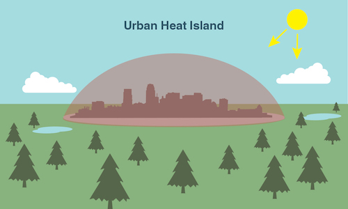
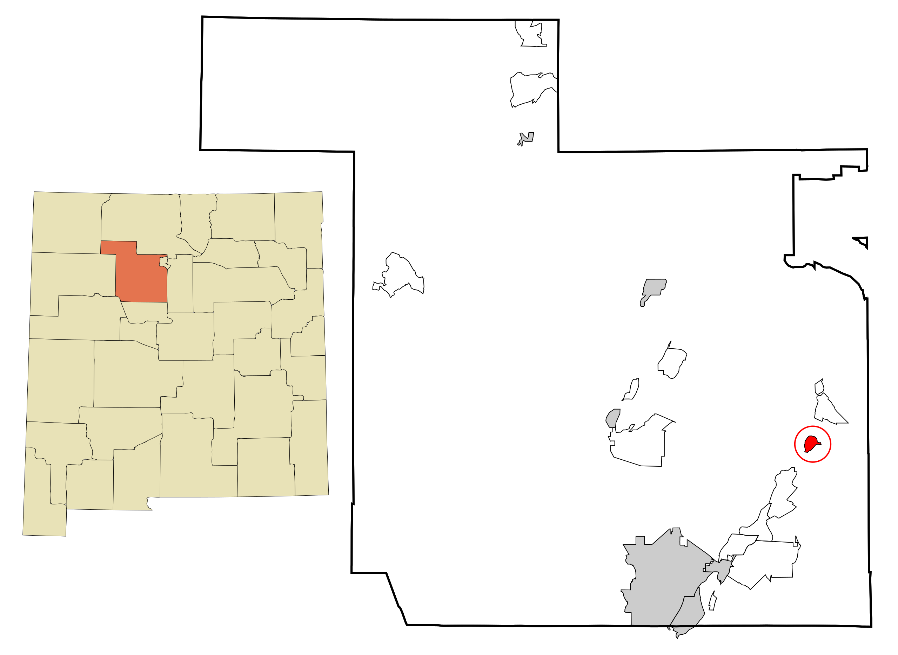

<style>
body {
    background-color: #FFEDBA;
}

div.a {
  text-align: center;
}

.caption {
    font-size: x-small;
}
</style>

```{r setup, include=FALSE}
knitr::opts_chunk$set(echo = TRUE)
```

<div class="a">
## Drought in New Mexico
```{r picture1, fig.cap="Figure 1.0: Spatial pattern of drought conditions in New Mexico (Heim 2018)", echo=FALSE, out.width = '41%'}
knitr::include_graphics("NM.png")
```
</div>

In late June 2018, an intense drought across the Southwest approached its peak and lead to numerous water scarcity issues throughout New Mexico. During this period, the USDA Drought Monitor classified around 70% of the state as consistently experiencing ‘at least severe drought’ (Figure 1.0). As time progressed, this unusually severe drought primarily harmed already vulnerable New Mexican populations, with long-term consequences continuing into 2019.  With regards to agriculture, exceedingly dry conditions forced farmers to secure alternative sources of water for irrigation. In the city of Albuquerque, the drought also stirred uncertainty around the reliability of urban water supplies (Hayden 2018), increasing precarity amongst low-income households.

Clearly, extreme events like the recent drought in the Southwest have pressing and important implications for the city of Albuquerque and the state of New Mexico. Understanding how such events occur and what factors amplify/facilitate them will be of crucial importance in planning and preparing against the negative impacts of severe drought. Hence, in the context of New Mexico's ongoing drought, we ought to ask exactly what climatic and environmental mechanisms facilitated and amplified the observed extreme weather behavior.

To begin, I hypothesized that rising temperatures during the summer intensified the severity of drought in New Mexico. After retrieving weather data from NOAA temperature records (Daily Summaries Station Details 2019), I decided to strictly look at climatic trends within the city of Albuquerque to reduce the scope of my analysis. The station at Albuquerque International Airport provided all the raw data analyzed and presented in the section below.

<div class="a">
## Analyzing Albuquerque Data
</div>
In order to analyze temperature trends, I initially created 12 sets of data (January, February, March, etc.), each looking at the monthly averages of Albuquerque minimum temperatures (Min Temp). I then plotted the data from 1931 to 2019 and then added a best fit line for each plot (Figure 2.0):

<div class="a">
```{r minabq_plot, fig.cap="Figure 2.0: Monthly averages of Albuquerque minimum temperatures", echo=FALSE}
climate_data=read.csv("siddharth_abq_data.csv")
strDates=as.character(climate_data$DATE)
climate_data$DATES=as.Date(strDates,"%Y-%m-%d")

climate_data$Month = format(as.Date(climate_data$DATES), format = "%m")
climate_data$Year = format(climate_data$DATES, format="%Y")

MonthlyTMINMean = aggregate(TMIN ~ Month + Year, climate_data, mean)
MonthlyTMINMean$YEAR = as.numeric(MonthlyTMINMean$Year)
MonthlyTMINMean$MONTH = as.numeric(MonthlyTMINMean$Month)

Months = c("January", "February", "March", "April",
"May", "June", "July", "August", "September", "October",
"November", "December")


par(mfrow = c(3, 4), mar = c(4, 3, 2, 1)+0.75)
TMINresult=NA
for (i in 1:12) {
plot(TMIN ~ YEAR, data = MonthlyTMINMean[MonthlyTMINMean$MONTH==i,], ty = "p", pch=20, las = 1, main = Months[i], ylab="",xlab="")
Month.lm=lm(TMIN ~ YEAR, data = MonthlyTMINMean[MonthlyTMINMean$MONTH==i,])
abline(coef(Month.lm), col = "red",lwd=3)
TMINresult=rbind(TMINresult, cbind(Months[i], round(coef(Month.lm)[2], 4), round(summary(Month.lm)$coefficients[2,4], 4), round(summary(Month.lm)$r.squared,3)))
mtext("Min Temp (°C)", side=2, outer=TRUE, line=-1.5)
mtext("Year", side=3, outer=TRUE, line=-37.25)
}
```
</div> 

Note each best fit line has a clear positive (or increasing) slope. To determine whether these positive trends are statistically significant (i.e. fit the data well), statisticians look at a measure known as the 'p-value.' This p-value tells statisticians whether or not they should reject the ‘null hypothesis,’ which posits that our trends are not statistically significant. A p-value less than 0.05 indicates that we should reject the null hypothesis, whereas a p-value of greater than 0.05 fails to reject the null hypothesis.

In all of the above graphs for Albuquerque minimum temperatures, each best fit line had p-values less than 0.05, i.e. we reject the null hypothesis that our trend lines are not statistically significant. In other words, since our positive trend lines fit the data well, we have strong evidence that Albuquerque minimum temperatures have been increasing since 1931 *for each month* (not only during the summer as I had initially hypothesized).

<div class="a">
## How Can We Trust The Data?
</div> 

Many climate change skeptics forward the argument that measurements from places like Albuquerque International Airport are unreliable due to a phenomenon called the 'urban heat island effect.' To an extent, the skeptics are not wrong in that urban areas tend to produce more heat than surrounding rural or unpopulated regions. However, scientists account for this disparity by removing the effect through a process known as 'homogenization.' Simply put, homogenization compares data from urban stations to surrounding stations in order to make appropriate adjustments for proper climate measurement.

<div class="a">
```{r picture2, echo=FALSE, fig.cap="Figure 3.0: Illustration of Urban Heat Island Effect (What is an Urban Heat Island?)", out.width = '48%'}

```
</div> 

Unfortunately, some climate skeptics still accuse the homogenization process itself of containing an additional 'warm' bias. However, thorough studies on the reliability of the U.S. Surface Temperature Record indicate that such adjustments are both appropriate and necessary (Menne et al. 2010). Not only would the urban heat island be in full effect without them, Menne et al. also suggest any potential 'warm' biases within daily minimum temperatures are negligibly small. In light of these studies, along with the increasing trends observed in our above data analysis, there should be no doubt that Albuquerque is indeed warming.

<div class="a">
## What Does Warming Have To Do With Drought?

**There are two primary mechanisms by which rising temperatures in Albuquerque could potentially amplify/facilitate severe drought:**
</div> 

**1) Mountain snowpack-** Discharge in the Rio Grande river, a crucial source for New Mexico's water supply, directly relates to snowpack in the Jemez Mountains (UCS 2016). Importantly, even though temperatures in the Jemez Mountains will be lower than those measured at Albuquerque due to higher altitudes, the *trend* of those temperatures will be similar to the trends we observed in the Albuquerque data. In other words, we should expect the mountains to be warming. Warmer winter temperatures in the mountains will cause more precipitation in the form of rain rather than snow, decreasing the total amount of snowfall. In addition, warmer spring temperatures will melt snowpack earlier, ultimately extending the duration and intensity of summer drought.  

<div class="a">
```{r picture3, echo=FALSE, fig.cap="Fig 4.0: Snowpack in Northern New Mexico (Moore 2019)", out.width = '42.5%'}
knitr::include_graphics("Snowpack.png")
```
</div> 

**2) Evapotranspiration-** Evapotranspiration is the combined effect of evaporation (when liquid turns to vapor) and transpiration (when plants release vapor through the stomata on their leaves). Regions with warming trends similar to Albuquerque will convert more liquid water into gas and encourage plants to open up their stomata, increasing evapotranspiration. Since increasing evapotranspiration decreases the amount of water available for allocation by transferring vapor into the atmosphere, we can expect the severity of drought conditions to intensify across New Mexico.

As a brief side note, transpiration in New Mexico is slightly mitigated by the presence of drought-resilient plants in the desert. However, the overall trend of diminishing water resources ends up staying about the same.


<div class="a">
```{r picture4, echo=FALSE, fig.cap="Figure 4.1: Illustration of Evapotranspiration (Toews 2007)", out.width = '21.75%'}
knitr::include_graphics("evapo.png")
```

## What Does This Mean For New Mexicans?
</div> 

As the Third National Climate Assessment states, warmer temperatures in the New Mexico "pose challenges for an already parched region that is expected to get hotter and...significantly drier" (Walsh et al. 2014). Specifically, these increasingly dry conditions will have major consequences for both farmers and the agricultural industry. Since drought reduces water allocations for crop irrigation, farmers become more dependent on pumping groundwater from wells. As these wells deepen over time, their water starts to contain higher amounts of salt, damaging crop production and threatening the livelihood of farmers throughout the state (Frisvold et al. 2013).

<div class="a">
```{r picture5, echo=FALSE, fig.cap="Figure 5.0: Location of Kewa Pueblo between Albuquerque and Santa Fe (Arkyan 2007)", out.width = '50%'}

```
</div> 

In addition, droughts also exacerbate existing social inequalities through a whole host of environmental justice issues. For example, one study in California indicates that domestic water supply shortages and rising water costs affect low-income families and people of color the most (Feinstein et al. 2017). Decreasing the affordability of water during shortages increases the precarity of poorer households' living conditions at a time when they already have little to no disposable income. Indigenous people in New Mexico will also be disproportionately impacted by intensifying drought. In 2014, drought forced the people of the Kewa tribe to cease traditional farming practices in order to adapt to changing climate conditions (Jung 2014). As the duration and severity of drought increases with warming in New Mexico, more Indigenous people will have to fight to maintain their traditions and way of life.

<div class="a">
## Conclusion
</div>

Strong warming trends in regions like Albuquerque are likely exacerbating drought in New Mexico. Higher temperatures in the Jemez Mountains decrease snowpack during winters and lead to earlier snowmelt in the spring. Along with increasing evapotranspiration, these factors cause longer and drier periods of drought during the summer. As these droughts become more and more severe, their impacts will disproportionately affect greater numbers of farmers, low-income families, people of color, and Indigenous tribes. Preparing against rising temperatures will be crucial to mitigating the severity of drought in New Mexico. Despite the impressive upward trends observed in the weather data from Albuquerque International Airport, the statistical analysis in this blog was fairly limited in spatial scope. Moving into the future, a more thorough investigation using weather data from stations all over the state of New Mexico should be conducted. Such an investigation will not only help paint a clearer picture of statewide climatic trends, but also provide more comprehensive information on the effect of rising temperatures on New Mexico's water supply.

<div class="a">
## Bibliography
</div>

Heim R. 2018. Map Archive. United States Drought Monitor: New Mexico. [cited 2019 Feb 24]. Available from: https://droughtmonitor.unl.edu/Maps/MapArchive.aspx

Daily Summaries Station Details. 2019. NOAA National Centers for Environmental Information: State of the Climate. [cited 2019 Feb 05]. Available from: https://www.ncdc.noaa.gov/cdo-web/datasets/GHCND/stations/GHCND:USW00023050/detail

Hayden M. 2018. No end in sight for drought. Albuquerque Journal. [cited 2019 March 03]. Available from: https://www.abqjournal.com/1190697/no-end-in-sight-for-states-drought-conditions.html

Menne M, Williams C, Palecki M. 2010. On the reliability of the U.S. surface temperature record. Journal of Geophysical Research. 115: 1-9.

[UCS] Union of Concerned Scientists (US). 2016. Confronting Climate Change in New Mexico. Cambridge, MA: Union of Concerned Scientists. [cited 2019 Feb 17]. Available from: https://www.ucsusa.org/sites/default/files/attach/2016/04/Climate-Change-New-Mexico-fact-sheet.pdf

What is an Urban Heat Island?. [date unknown]. NASA Climate Kids. [cited 2019 Feb 24]. Available from: https://climatekids.nasa.gov/heat-islands/

Moore E. 2019. Snow covers Truchas Peak in northern New Mexico on Jan. 4. Albuquerque Journal. [cited 2019 March 03]. Available from: https://www.abqjournal.com/1267515/storms-boost-snowpack-in-northern-new-mexico.html/em010419e

Toews M. 2007. Surface water cycle. Wikimedia Commons. [cited 2019 March 04]. Available from: https://commons.wikimedia.org/wiki/File:Surface_water_cycle.svg

Walsh J, Wuebbles D, Hayhoe K, Kossin J, Kunkel K, Stephens G, Thorne P, Vose R, Wehner M, Willis J, Anderson D, Doney S, Feely R, Hennon P, Kharin V, Knutson T, Landerer F, Lenton T, Kennedy J, Somerville R. 2014. Ch. 2: Our changing climate. Climate change impacts in the United States: The Third National Climate Assessment. Washington, DC: U.S. Global Change Research Program, 19–67.

Arkyan. 2007. Sandoval County and Kewa Pueblo Highlighted. Wikimedia Commons. [cited 2019 March 05]. Available from: https://commons.wikimedia.org/wiki/File:Sandoval_County_New_Mexico_Incorporated_and_Unincorporated_areas_Santo_Domingo_Pueblo_Highlighted.svg

Frisvold G, Jackson L, Pritchett J, Ritten J. 2013. Agriculture and Ranching. Assessment of climate change in the Southwest United States: A report prepared for the National Climate Assessment. Washington, DC: Island Press, 218-239.

Feinstein L, Phurisamban R, Ford A, Tyler C, Crawford A. 2017. Drought and Equity in California. Oakland, California: Pacific Institute, 1-9. 

Jung C. 2014. Drought forces some Native Americans to choose which tradition to save. Al Jazeera. [cited 2019 February 22]. Available from: http://america.aljazeera.com/articles/2014/3/20/drought-forces-someinindiancountrytochoosewhichtraditiontosave.html