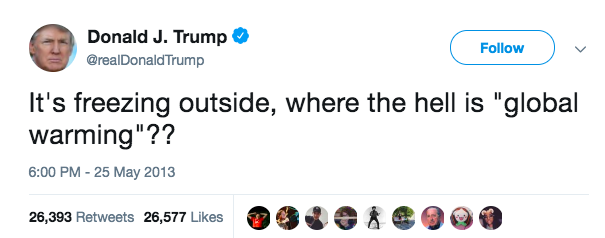

```{r setup, include=FALSE}
knitr::opts_chunk$set(echo = TRUE)
```

  According to a survey done by National Surveys on Energy and Environment in 2018, 60% of Americans believe that global warming is happening, and that “humans are at least partially responsible for the rising temperatures.” It was also found that only 35% of Republicans believe that climate change is partially a result of human actions, while 50% of Republicans do not believe climate change at all. (http://closup.umich.edu/files/ieep-nsee-2018-spring-climate-belief.pdf) I chose to include this information because my area of interest,  Alabama, is a red state, meaning most people in the state align with Republican ideas.   
Several politicians who are also climate skeptics hail from the south which is quite ironic considering the south is predicted to bear the brunt of climate change impacts. According to the Brookings Institute, Alabama will suffer the fifth highest economic loss, behind only Florida, Mississippi, Louisiana and Arkansas, all of which are red states. Aside from economic loss, the south will most likely see an increase in mortality, loss of coastal lands and homes, and decreased agricultural production. (Map 1)
In this blog I will be testing the null hypothesis: The climate is not changing in Alabama. If I am able to reject this hypothesis, that means that the climate is changing, and Alabamians should in fact be concerned about climate change. I will first analyze climate and precipitation trends in cities in North and South Alabama, and then provide some detailed information on the impacts of these trends, including sea level rise, economic damage, and flooding. 

##Roots of Skepticism in the South
How could climate change skeptics still exist despite the copious amounts of data pointing to climate change and the 95% of scientists who have confirmed it is happening? Well there are a few “logical” explanations for this skepticism. Many skeptics deny “global warming,” justifying their position with the record breaking winters we’ve been experiencing. For this reason I would like to avoid using the phrase global warming, and instead use climate change. In his book A Global Warming Primer, Jeffrey Bennett provides a detailed explanation of how global warming actually works. He states that, “global warming really means an increase in energy in the atmosphere and oceans,” which then increases the chances of “hurricanes, thunderstorms, and other extreme weather events.” This also includes severe winter weather. 
	With this newfound knowledge, we can quickly point out the logical fallacy present in the following tweets from President Trump. 
	
	
In fact, understanding that global warming causes extreme weather events, President Trump’s tweets support the fact that the climate is changing drastically in all parts of the world. However, many southerners have chosen to stick with the idea that global warming strictly means warmer temperatures, which are not as prevalent in the southern states. 
After acquiring Alabama NOAA temperature records from over a 60 year period, I used the program R to graph the climate trends in two cities: Mobile and Huntsville. The graphs show the average temperature trend in the hottest month, July, over a 60 year time period. 

```{r cars}
summary(cars)
```

