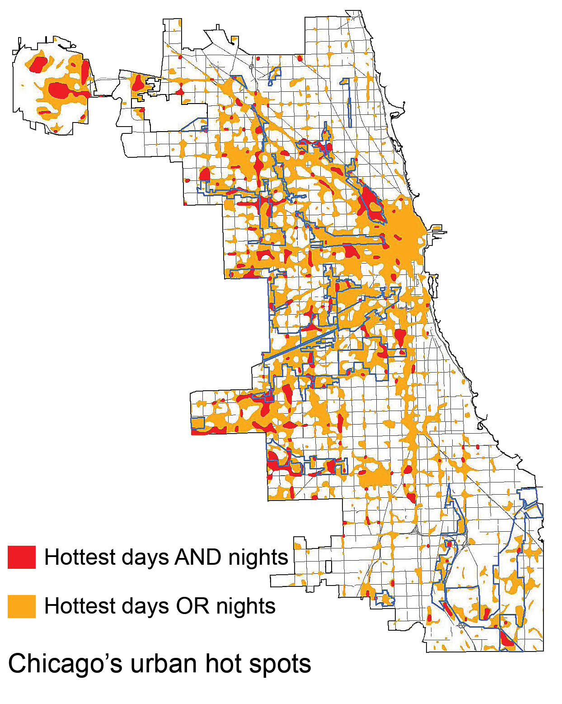

```{r, echo=FALSE}
knitr::opts_chunk$set(echo=FALSE)
```


```{r, echo=FALSE}
knitr::include_graphics("Image1.jpg")
```
![Image Source: Phillips, Dustin]

<div class="a">
##Introduction
</div>
The term “urban heat island” describes a metropolitan area that is significantly warmer than its surrounding rural areas due to human activities. These urban heat islands become especially vulnerable (Stone and Norman 2016) during heat waves due to the discrepancy in their short-term cooling and warming rates. Consequently, residents living in urban areas experience a higher possibility of heat-related mortality (Coseo and Larsen 2014) than residents of the surrounding rural areas. In the context of global warming and urban population growth, mitigating the UHI effect has become one of the most pressing issues in urban planning and urban climatology (Stewart 2011). 

Makes sense in theory, right? In reality, however, the UHI effect is an extremely complicated system if we try to explain the mechanisms behind it. Scientists are still at the beginning of fully understanding the local climates in urban areas. Although previous studies have identified some of the most prominent factors that could cause the UHI effect (Coseo and Larsen 2014), such as building heights and configuration, proximity to traffic infrastructure and land cover variables, they admit the potential impact of other factors and the difficulty of evaluation, especially when local climate respond to those factors differently within less than a hundred mile of distance. 

In this blog, I evaluate these nuances while focusing on specific neighborhoods of Chicagoland area. It is a historically urbanized area and at least three weather stations in different locations have recorded extensive climate data over several decades. I analyze and compare the temperature trends for all three locations to put local climate in the context of the regional one. I also test the correlation between local temperature trend and two different land use factors, distance to urban center and coverage of green infrastructure using regression analysis, both mentioned but not fully explained by Coseo and Larsen’s research. Based on the combined effect of climate change and UHI effect,I hypothesize an increasing trend of air temperature over time in all three stations. Meanwhile, the extent of increase in temperature are positively correlated to each station’s distance to downtown and coverage of green infrastructure nearby, including all green area such as parks, gardens and green roofs. 

The objective of this blog is not only to explore the correlation between land use factors and temperature change in neighborhood-scale microclimates to showcase the effect of UHI, but also to draw attention to the inherent complexity of urban climatology studies and its socio-economic implications. Additionally, I hope to provide my insights for future research projects and policy decisions on the topic of mitigating UHI effects for urban communities, which will be further explained in the discussion section. 


Figure 1 below shows areas that experience either highest daytime or nighttime air temperature in yellow, and where the two overlaps(shown in red) is most affected by the UHI effect. 
<div class="a">
```{r, echo=FALSE}

```
![Figure.1. Urban Heat Islands seem to occur within the city center where the highest concentration of high buildings and industrial area are. Image Source: U.S. Global Change Research Program]


<div class="a">
##Analyzing Weather Data: is there a heating trend?
</div>
I obtained the raw data, including daily precipitation rate, maximum and minimum temperature, from three National Oceanic and Atmospheric Administration (NOAA) weather stations located in Chicagoland area: Barrington (1962-2019), Park forest (1952-2019) and Midway airport (1928-2019). Each set contains 20,000 to 30,000 days of weather data. However, not all datasets are complete. For example, a gap exists between 1990 and 2000 in Barrington station, which equals 3650 days of data. Therefore, direct comparison in the temperature trend in Barrington with the other two locations during this period cannot be evaluated, which includes a heat wave in summer 1995. 

The locations of the three weather stations in relation to downtown Chicago are shown below in figure 2. Midway Airport is within the urbanized area and is the closest to downtown, Park Forest is just outside of downtown in the south, and Barrington is the furthest to the north west, with a much higher vegetation coverage than the other two locations.

<div class="a">
```{r, echo=FALSE}
knitr::include_graphics("Image4.png")
```
![Figure.2. Three Weather Stations in Barrington, Park Forest, and Midway Airport, IL]

</div>
#MOVE AND REPHRASE THIS
The graph above shows the daily minimum temperature(TMIN°C) of Barrington station for the past 60 years. As previously mentioend, there is a gap signifying missing data from 1990 to 2000. There is a slight upward trend with a slope of less than 0.001, but it has statistically significant increase since the p-value of this model is less than 0.001. Adjusted R-squared value is a low 0.002, which means data points are highly scattered and the best fit line does not explain the variability. This means I can reject the null hypothesis and state that there has been an increase trend in Barrington's temperature over time. The temperature varies highly throughout the years, which is natural considering seasonal changes. Let's look at our next station, Park Forest, a neighbourhood that is 28mi/45.58km from downtown Chicago.  
<br>

TALK ABOUT FIGURES BELOW

<div class="a">
#TRY PUT FIGURES IN A ROW
```{r echo=FALSE, results='hide' }
par(mfrow=c(1,3))
#PREPARING TMIN DATA FOR BARRINGTON
climate_data<-read.csv( "/home/CAMPUS/syaa2016/Climate_Change_Narratives/student_folders/Yi/claireyi_climatedata_chicago.csv")
strDates <- as.character(climate_data$DATE)
climate_data$Year <- as.Date(strDates, "%m/%d/%Y")

lm(TMIN ~ Year, data=climate_data)
climate_data$Month = format(as.Date(climate_data$Year), format = "%m")
climate_data$Year = format(climate_data$Year, format="%Y")
MonthlyTMINMean = aggregate(TMIN ~ Month + Year, climate_data, mean)
AnnualTMINMean = aggregate(TMIN ~ Year, climate_data, mean)
AnnualTMINMean$YEAR = as.numeric(AnnualTMINMean$Year)
MonthlyTMINMean$YEAR = as.numeric(MonthlyTMINMean$Year)
MonthlyTMINMean$MONTH = as.numeric(MonthlyTMINMean$Month)
Months = c("January", "February", "March", "April",
"May", "June", "July", "August", "September", "October",
"November", "December")
par(mfrow = c(4, 3), mar = c(5, 4, 3, 2) + 0.1)
TMINresult <- NA

par(mfrow=c(1,1))

for (i in 1:12) {
Month.lm <- lm(TMIN ~ YEAR, data = MonthlyTMINMean[MonthlyTMINMean$MONTH ==
i, ])
TMINresult <- rbind(TMINresult, cbind(Months[i],
round(coef(Month.lm)[2], 4), round(summary(Month.lm)$coefficients[2,
4], 4), round(summary(Month.lm)$r.squared,
3)))
}
#PLOT BARRINGTON DATA
plot(TMIN ~ YEAR, data = AnnualTMINMean[AnnualTMINMean$YEAR<2020,], ty = "l", las = 1, xlim = c(1960, 2019), ylab = "Barrington Minimum Temperature (°C)", xlab= "Year")
abline(lm(TMIN~YEAR,AnnualTMINMean[AnnualTMINMean$YEAR<2020,]),col="black")
Annual.lm <- lm(TMIN~YEAR,AnnualTMINMean[AnnualTMINMean$YEAR<2020,])

#PARK FOREST
climate_data1<-read.csv("/home/CAMPUS/syaa2016/Climate_Change_Narratives/student_folders/Yi/ParkForest_climatedata_claireyi.csv")
strDates <- as.character(climate_data1$DATE)
climate_data1$Year <- as.Date(strDates, "%m/%d/%Y")

lm(TMIN ~ Year, data=climate_data1)
climate_data1$Month = format(as.Date(climate_data1$Year), format = "%m")
climate_data1$Year = format(climate_data1$Year, format="%Y")
MonthlyTMINMean = aggregate(TMIN ~ Month + Year, climate_data1, mean)
AnnualTMINMean = aggregate(TMIN ~ Year, climate_data1, mean)
AnnualTMINMean$YEAR = as.numeric(AnnualTMINMean$Year)
MonthlyTMINMean$YEAR = as.numeric(MonthlyTMINMean$Year)
MonthlyTMINMean$MONTH = as.numeric(MonthlyTMINMean$Month)
Months = c("January", "February", "March", "April",
"May", "June", "July", "August", "September", "October",
"November", "December")
par(mfrow = c(4, 3), mar = c(5, 4, 3, 2) + 0.1)
TMIN1result <- NA

par(mfrow=c(1,1))

for (i in 1:12) {
Month.lm <- lm(TMIN ~ YEAR, data = MonthlyTMINMean[MonthlyTMINMean$MONTH ==
i, ])
TMINresult <- rbind(TMINresult, cbind(Months[i],
round(coef(Month.lm)[2], 4), round(summary(Month.lm)$coefficients[2,
4], 4), round(summary(Month.lm)$r.squared,
3)))
}

plot(TMIN ~ YEAR, data = AnnualTMINMean[AnnualTMINMean$YEAR<2020,], ty = "l", las = 1, xlim = c(1960, 2019), ylab = "Park Forest Minimum Temperature (°C)", xlab= "Year")
abline(lm(TMIN~YEAR,AnnualTMINMean[AnnualTMINMean$YEAR<2020,]),col="black")
Annual.lm <- lm(TMIN~YEAR,AnnualTMINMean[AnnualTMINMean$YEAR<2020,])

#PREPARING TMIN DATA FOR MIDWAY
climate_data2<-read.csv("/home/CAMPUS/syaa2016/Climate_Change_Narratives/student_folders/Yi/climatedata_cliareyi_midway.csv")
strDates <- as.character(climate_data2$DATE)
climate_data2$Year <- as.Date(strDates, "%d/%m/%Y")

lm(TMIN ~ Year, data=climate_data2)
climate_data2$Month = format(as.Date(climate_data2$Year), format = "%m")
climate_data2$Year = format(climate_data2$Year, format="%Y")
MonthlyTMINMean = aggregate(TMIN ~ Month + Year, climate_data2, mean)
AnnualTMINMean = aggregate(TMIN ~ Year, climate_data2, mean)
AnnualTMINMean$YEAR = as.numeric(AnnualTMINMean$Year)
MonthlyTMINMean$YEAR = as.numeric(MonthlyTMINMean$Year)
MonthlyTMINMean$MONTH = as.numeric(MonthlyTMINMean$Month)
Months = c("January", "February", "March", "April",
"May", "June", "July", "August", "September", "October",
"November", "December")
par(mfrow = c(4, 3), mar = c(5, 4, 3, 2) + 0.1)
TMINresult <- NA

par(mfrow=c(1,1))

for (i in 1:12) {
Month.lm <- lm(TMIN ~ YEAR, data = MonthlyTMINMean[MonthlyTMINMean$MONTH ==
i, ])
TMINresult <- rbind(TMINresult, cbind(Months[i],
round(coef(Month.lm)[2], 4), round(summary(Month.lm)$coefficients[2,
4], 4), round(summary(Month.lm)$r.squared,
3)))
}

plot(TMIN ~ YEAR, data = AnnualTMINMean[AnnualTMINMean$YEAR<2020,], ty = "l", las = 1, xlim = c(1960, 2019), ylab = "Midway Airport Minimum Temperature (°C)", xlab= "Year")
abline(lm(TMIN~YEAR,AnnualTMINMean[AnnualTMINMean$YEAR<2020,]),col="black")
Annual.lm <- lm(TMIN~YEAR,AnnualTMINMean[AnnualTMINMean$YEAR<2020,])

```
<center>  Figure.3. Average Minimum Air Temperature from 1960 to 2020 in Barrington, Park Forest and Midway Airport </center> 
</div>

<div class="a">
##Is There a Correlation between UHI and Landuse Factors?
</div>
As mentioned in the introduction, Coseo and Larsen's study did not fully explain the effect of UHI in relation to the neighborhood’s proximity to different land use and infrastructure types as the hypothesis set out to achieve. In this blog, I attempt to analyze two sets of correlations that fell into such discrepancy: correlation between distance to urban center and coverage of green infrastructure nearby and UHI effect. 

I hope to exemplify a long term minimum temperature trend in relation to each factor. This may be transferable as a reference for urban planners and policy makers since their work mostly concerns a larger time frame. Additionally, each “neighborhood” in this research is defined by geological area instead of administrative boundaries to reduce uncertainties in municipal size. I marked a circumference of 2 km (~10 city blocks) radius around each station to determine a “neighborhood” using Google Earth.

As the overall temperature warms up throughout the past few decades, the UHI effect seems to be the most significant during summer months and amplifies heat waves if they occur, according to Stone's studies (Stone 2012). The graphs below show the daily minimum temperature change every year in July for the past 60 years. Later in this section, I will also try to capture the level of UHI effect by graphing the temperature difference between nighttime and daytime from years between 1999 and 2019 when heat waves occured.
##NOTE TO SELF: PUT SUMMER MONTHS FIGURES IN A ROW; ONLY SHOW RECENT YEARS

<div class="a">
```{r julybarrington_plot, echo=FALSE, results='hide'}
climate_data<-read.csv( "/home/CAMPUS/syaa2016/Climate_Change_Narratives/student_folders/Yi/claireyi_climatedata_chicago.csv")
strDates <- as.character(climate_data$DATE)
climate_data$NewDate <- as.Date(strDates, "%m/%d/%Y")
climate_data$Month = format(as.Date(climate_data$NewDate), format = "%m")
climate_data$Year = format(climate_data$NewDate, format="%Y")
MonthlyTMINMean = aggregate(TMIN ~ Month + Year, climate_data, mean)
MonthlyTMINMean$YEAR = as.numeric(MonthlyTMINMean$Year)
MonthlyTMINMean$MONTH = as.numeric(MonthlyTMINMean$Month)
str(MonthlyTMINMean)
#plot(MonthlyTMINMean$TMIN, ty='l')
plot(TMIN~YEAR, data=MonthlyTMINMean[MonthlyTMINMean$Month=="07",],ty='p', xlim=c(1960, 2020))
July.lm <- lm(TMIN~YEAR, data=MonthlyTMINMean[MonthlyTMINMean$Month=="07",])
summary(July.lm)
abline(coef(July.lm), col="black")
```
<center>  Figure.6. July Minimum Daily Temperature in Barrington, IL, 1960-2019 </center> 


<div class="a">
```{r julyparkforest_plot, echo=FALSE, results='hide'}
climate_data1<-read.csv("/home/CAMPUS/syaa2016/Climate_Change_Narratives/student_folders/Yi/ParkForest_climatedata_claireyi.csv")
strDates <- as.character(climate_data1$DATE)
climate_data1$NewDate1 <- as.Date(strDates, "%m/%d/%Y")
climate_data1$Month = format(as.Date(climate_data1$NewDate1), format = "%m")
climate_data1$Year = format(climate_data1$NewDate1, format="%Y")
MonthlyTMINMean = aggregate(TMIN ~ Month + Year, climate_data1, mean)
MonthlyTMINMean$YEAR = as.numeric(MonthlyTMINMean$Year)
MonthlyTMINMean$MONTH = as.numeric(MonthlyTMINMean$Month)
str(MonthlyTMINMean)
#plot(MonthlyTMINMean$TMIN, ty='l')
plot(TMIN~YEAR, data=MonthlyTMINMean[MonthlyTMINMean$Month=="07",],ty='p', xlim=c(1960, 2020))
July.lm <- lm(TMIN~YEAR, data=MonthlyTMINMean[MonthlyTMINMean$Month=="07",])
summary(July.lm)
abline(coef(July.lm), col="black")
```
<center>  Figure.7. July Minimum Daily Temperature in Park Forest, IL, 1960-2019] </center> 


<div class="a">
```{r julymidway_plot, echo=FALSE, results='hide'}
climate_data2<-read.csv("/home/CAMPUS/syaa2016/Climate_Change_Narratives/student_folders/Yi/climatedata_cliareyi_midway.csv")
strDates <- as.character(climate_data2$DATE)
climate_data2$NewDate2 <- as.Date(strDates, "%m/%d/%Y")
climate_data2$Month = format(as.Date(climate_data2$NewDate2), format = "%m")
climate_data2$Year = format(climate_data2$NewDate2, format="%Y")
MonthlyTMINMean = aggregate(TMIN ~ Month + Year, climate_data2, mean)
MonthlyTMINMean$YEAR = as.numeric(MonthlyTMINMean$Year)
MonthlyTMINMean$MONTH = as.numeric(MonthlyTMINMean$Month)
str(MonthlyTMINMean)
#plot(MonthlyTMINMean$TMIN, ty='l')
plot(TMIN~YEAR, data=MonthlyTMINMean[MonthlyTMINMean$Month=="07",],ty='p', xlim=c(1960, 2020))
July.lm <- lm(TMIN~YEAR, data=MonthlyTMINMean[MonthlyTMINMean$Month=="07",])
summary(July.lm)
abline(coef(July.lm), col="black")
```
<center>  Figure.8. July Minimum Daily Temperature in Midway Airport, IL, 1960-2019] </center> 
</div>
<br>
P-values for each of the three models is less than 0.01, confirming a warming trend in month of July for all locations over the past 60 years. The Midway airport trend shows a peculiarity: although it is a clear increase overall, there seem to be a sudden decrease since 2015. Further research is required to rationalize this sudden change. 

Now let's explore the correlation between the increasing temperature and the two previously mentioned factor: proximity to urban center and number of green infrastructure.


<div class="a">
##Is There a Correlation between Proximity to Urban Center and UHI effect? {#css_id}
</div>

| Weather Station | Promximity to City Center (km)  | Increase in minimum temperature in July | P Value | 
|------:|:-----|---------|:------:|
| Barrington|51.4| 0.02 | 0.015|
| Park Forest | 45.6 | 0.017 | 0.023 |
| Midway Airport | 20.8 | 0.043 | <0.001 |

![Table.1. Analysis of Minimum Daily Temperature Increase from 1960 to 2020 in relation to Distance between Weather Station and City Center]


<div class="a">
##Is There a Correlation between Number of Green Infrastructure and UHI effect? {#css_id}
</div>

| Weather Station | Coverage of Green Infrastructure[^1]  | Increase in minimum temperature in July | P Value | 
|------:|:-----|---------|:------:|
|Barrington|98%| 0.02 | 0.015|
| Park Forest | 30% | 0.017 | 0.023 |
| Midway Airport | 13% | 0.043 | 	<0.001 |

![Table.2. Analysis of Minimum Daily Temperature Increase from 1960 to 2020 in relation to Number of Green Infrastructur in Neighborhood]
[^1]: Estimates made based on data from Center for Neighborhood Technology, http://greenmapping.cnt.org/maps.php.

Although it is hard to tell to what extent each factor is influencing the temperature trend, we can accept the hypothesis that the temperature increase of the neighborhoods are positively correlated to their distance from downtown and coverage of green infrastructure nearby by associating the tables with previous plots.

I realize that the tables above do not grant the rigor or the quantity of information that is sufficient to make any definitive conclusion. I would like to acknowledge the complicated nature of climate science and urban studies in this context. There is not only a potential, but also necessity for future studies to unpack the dynamic among all factors that play a role in UHI effect. 


<div class="a">
```{r, echo=FALSE}
knitr::include_graphics("Image3.jpg")
```
![Image Source:dailymail.co.uk]


<div class="a">
##So What Happens Next?
</div>
As mentioned in the introduction, there has been an increasing awareness on Urban Heat Island(UHI) effect across all sectors, especially after the 1995 heat wave. It was a series of above 100 °F days in July, 1995, which led to 739 heat-related mortalities (Naughton et al. 2002), most of which occurred among the elderly (Klinenberg 2002), low-income communities. Although research has not been conducted to test a correlation between neighborhood income level and UHI impact in Chicago, similar studies (Enerette et al. 2007) was done in Phoenix, Arizona, and showed that every $10,000 increase in neighborhood annual median household income associates with 32.5 °F decrease in the surface temperature. It is worth noting, however, there is no direct impact from neighbourhood income level to air temperature; the correlation (Coseo and Larsen 2014) was observed because of the increased vegetation cover and higher maintenance associated with wealthier neighborhoods. This suggests that the impact of UHI and heat waves could be immediately reduced via urban planning and other administrative measures such as increase public green infrastructure. 

However, the urban climate is no less, if not more, complicated than the natural one. Increase in green infrastructure does seem to be an effective strategy, but it also comes with other environmental drawbacks. Sharma et al. from University of Notre Dame conducted a study (Sharma et al. 2016) on green roofs as an UHI mitigation strategy using computer simulation as well as Weather Research and Forecasting model. Results showed that although green/cool roof does offset urban-induced warming--daytime peak roof surface temperature reduced linearly from 0.75 °C to 3.25 °C as green roof fraction increased from 25% to 100%--it interrupts vertical wind which leads to decrease in air quality. Additionally, the demand for water, maintenance, and increase in local humidity can make the implementation practically difficult. Overall, such green infrastructure can effectively mitigate the Urban Heat Island effect, but should be implemented in smaller patches rather than in large, continuous area to avoid problems mentioned above. There is still a lot of potential for future studies to explore other strategies in response to the UHI in the content (Meehl and Tebaldi 2004) of longer and more frequent heat waves in the future. 

<div class="a">
##Bibliography
</div>
Coseo P, Larsen L. 2014. How factors of land use/land cover, building configuration, and adjacent heat sources and sinks explain Urban Heat Islands in Chicago. Landscape and Urban Planning 125 (2014):117–129.

Jenerette GD, Harlan SL, Brazel A, Jones N, Larsen L, Stefanov WL. 2007. Regional relationships between surface temperature, vegetation, and human settlement in a rapidly urbanizing ecosystem. Landscape Ecology 22(3):353–365.

Klinenberg E. 2002. Heat Wave: a social autopsy of disaster in chicago. University of Chicago Press(2015):120-324. 	

Naughton MP, Henderson A, Mirabelli MC, Kaiser R, Wilhelm JL, Kieszak SM, Rubin CH, McGeehin MA. 2002. Heat-related mortality during a 1999 heat wave in Chicago. AJPM 56(3):221-227.

R Core Team. 2017. R: A language and environment for statistical computing. R Foundation for Statistical Computing, Vienna, Austria. URL https://www. R-project.org/.

Sharma A, Conry P, Fernando HJS, Hamlet AF, Hellmann JJ, Chen F. 2016. Green and cool roofs to mitigate urban heat island effects in the Chicago metropolitan area: evaluation with a regional climate model. Environ. Res. Lett. 11 (2016):64-104.

Stone B, Norman JM. 2006. Land use planning and surface heat island formation: A parcel-based radiation flux approach. Atmospheric Environment, 40(2006):3561–3573.


